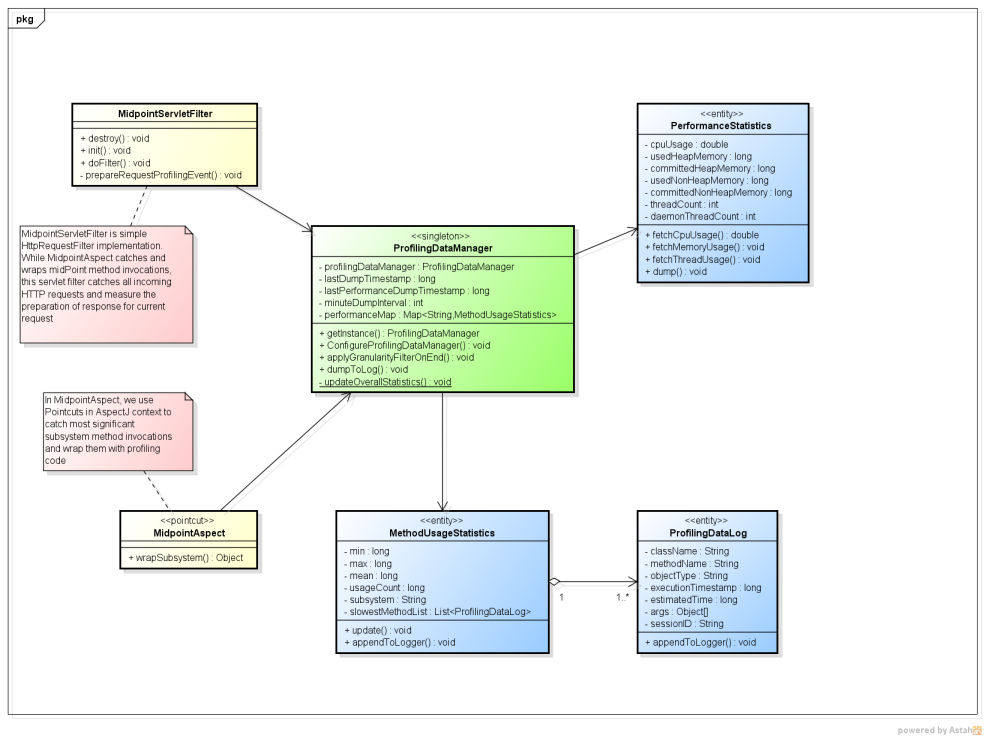
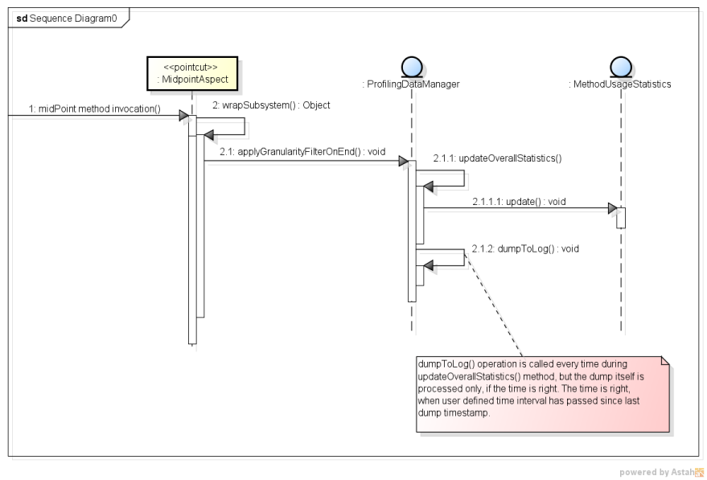
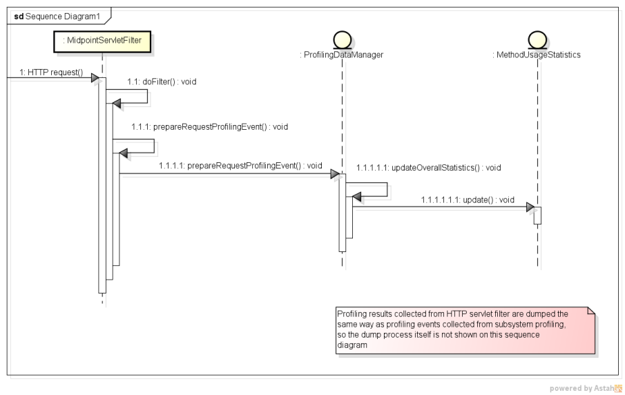

= Profiling Concepts
:page-wiki-name: Profiling Concepts
:page-wiki-metadata-create-user: erik
:page-wiki-metadata-create-date: 2013-08-29T15:32:25.674+02:00
:page-wiki-metadata-modify-user: vix
:page-wiki-metadata-modify-date: 2016-09-26T22:09:11.525+02:00

[WARNING]
.In Progress
====
This feature is still wiki:Current+Iteration[under development]. In this page, we provide information about already implemented profiling features and features yet to be implemented in next release (3.0).

Feel free to provide any ideas to enhance profiling module.

====

:page-toc: top

link:https://evolveum.com/midpoint[MidPoint] provides integrated profiling module.
Using this module, system administrators and developers are able to analyse performance aspects of midPoint during execution time (e.g., in customer or test environment) in human readable form.
This data has significant importance in identifying performance issues and are very helpful to developers in the process of fixing these issues.
One could say, that thanks to this feature, midPoint is self-aware of it's own performance.

In the future, this feature can be also used to identify performance problems related to  target systems (resources).

This page is goes a little bit further than just explaining how to configure midPoint profiling mechanism.
If you are interested in configuration only (using GUI), please refer to wiki:Administration+Interface#AdministrationInterface-ProfilingConfiguration[Profiling guide]

== Basic Usage

By default, midPoint profiling module is turned off.
You can simply activate it by altering System Configuration in debug pages (Wizard and GUI will be provided in near future).
Add following XML code just after `<logging>` element and before `<cleanup>` element (or edit if it already exists).

[source,html/xml]
----
<profilingConfiguration>
    <enabled>true</enabled> 
</profilingConfiguration>
----

As of midPoint 3.4, it is also necessary to enable profiling Spring interceptor (aspect), because it is disabled by default.

It is done by including the following into config.xml file:

[source]
----
<configuration>
    <midpoint>
        <profilingEnabled>true</profilingEnabled>
        ...
    </midpoint>
</configuration>
----

== Features - Implemented

=== Request Filter

Using request filter, midPoint administrator can simply monitor response times of every incoming request.
To start request filter, simply insert following line of code in `<profilingConfiguration>` element in your System Configuration object.

[source,html/xml]
----
<profilingConfiguration>
	<enabled>true</enabled>
	...
    <requestFilter>true</requestFilter>
	... 
</profilingConfiguration>
----

Data collected by request filter are saved in idm-profiling.log file in your logging directory.
In near future, administrators would be able to analyse this data using simple GUI.

=== Subsystem Profiling

Subsystem profiling is used to capture method calls execution.
User is able to select which subsystems he wants to monitor (model, repository, etc.
read wiki:Architecture+and+Design[more]). It is very simple to choose monitored subsystems.
Simply alter System Configuration object:

[source,html/xml]
----
<profilingConfiguration>
	<enabled>true</enabled>
	...
 
	<dumpInterval>30</dumpInterval>
	<performanceStatistics>true</performanceStatistics>
	<model>true</model>
	<repository>true</repository>
	<provisioning>true</provisioning>
	<ucf>true</ucf>
	<resourceObjectChangeListener>true</resourceObjectChangeListener>
	<taskManager>true</taskManager>
	<workflow>true</workflow>
</profilingConfiguration>
----

Configuration above tells profiling to monitor every subsystem.
We believe that using above example, user will be able to set subsystem profiling based on his own desires.

`*dumpInteval*`- subSystem profiling dumps profiling data once in a while.
This dump interval can be altered using `<dumpInterval>` attribute.
Dumped information can be seen in idm-profile.log in your tomcat home/logs directory.
Value in this attribute is set in minutes.
Default value is 30 minutes.
That means, that every 30 minutes, processed profiling information about basic interface methods are dumped into log file with list of 5 slowet runs of each performed method.

*`performanceStatistics`*- once every 10 minutes, basic statistics about CPU usage, heap and non-heap memory and thread activity are printed into idm-profile.log, 

=== General Profiling Overhead

TODO

== Development documentation

On sequence diagrams below, we can see how exactly aspect based profiling works.
On the second sequence diagram, we can see capture process for incoming HTTP requests using HTTP servlet filter.

== Features - On the way

* Database query monitor

== Ideas

If you have any ideas and suggestions regarding midPoint profiling model, please contact us and we will consider adding them into our product.

== External links

* What is link:https://evolveum.com/midpoint/[midPoint Open Source Identity & Access Management]

* link:https://evolveum.com/[Evolveum] - Team of IAM professionals who developed midPoint