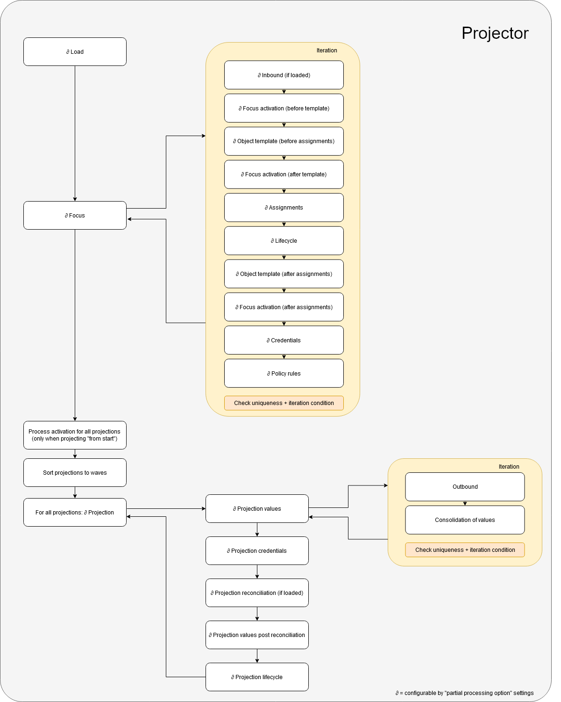
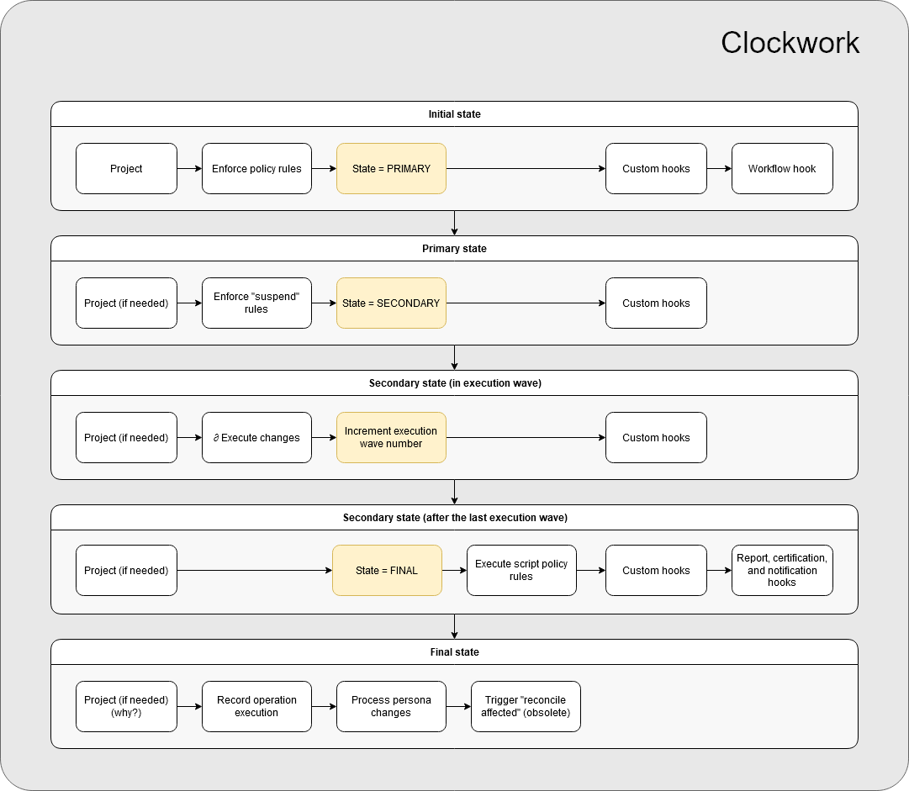

= Projector and clockwork internals
:page-wiki-name: Projector and clockwork internals

[WARNING]
====
This is a work in progress (and probably will stay such for a long time).

====

How midPoint does work internally?

Answering this question is maybe quite hard.
In the meantime please enjoy the following diagrams aimed at providing an overview of two key components: _Projector_ and _Clockwork_.

(link:https://github.com/Evolveum/midpoint-design/blob/master/pictures/Projector%20and%20Clockwork.drawio[source])

