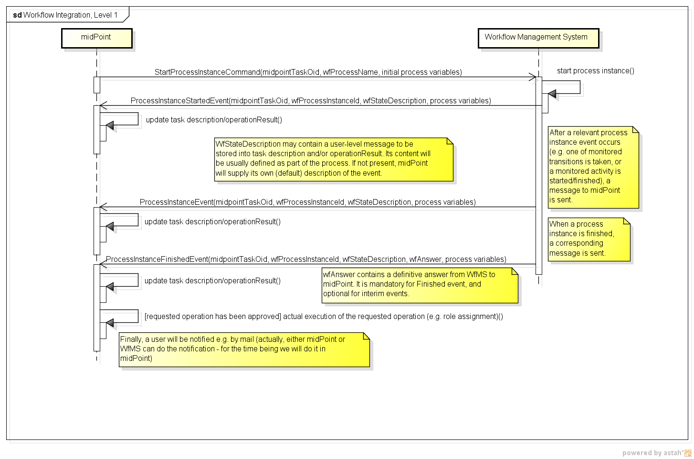

= (Idea of) Communication with Remote Workflow Management System
:page-wiki-name: (Idea of) Communication with Remote Workflow Management System

A communication between link:https://evolveum.com/midpoint[midPoint] and a workflow management system (WfMS) has been designed as loosely-coupled, asynchronous one.

The communication would be carried out by exchanging messages.
As a transport, almost any mechanism would be used, e.g. in-JVM channel, HTTP, SOAP, or a messaging broker (JMS).
Within preliminary implementation, link:http://camel.apache.org/[Apache Camel] was used, so the change of transport was done by simply changing the configuration.

Simplified schema of the interaction is the following:

(click to enlarge)

However, current implementation is limited to using embedded activiti workflow engine.
This simplifies a lot of things, namely integration of approvals and displaying of status directly into midPoint GUI.

Current implementation is sketched wiki:Workflow+Interactions[here].

In the future, we may return to the original design and implement cooperation with remote WfMS, not limited to activiti.

