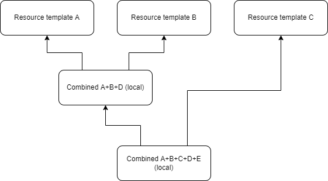

= Object Type Inheritance and Resource Templates

== Deriving from Templates

[%autowidth]
[%header]
|===
| Item | Strategy | Note
| `name` | Required |
| `connectorRef` | Standard |
| `connectorConfiguration` | Standard (at the level of configuration items) |
| `additionalConnector` | Maybe merged, and those with the same name are replaced? What about removal of parent configurations? | *TODO*
| `schema`/`definition` | Probably ignored when inheriting |
| `schema`/`generationConstraints` | Add only / Standard |
| `schemaHandling` | See following section |
| configured `capabilities` | Merged; the ones with the same element name processed in standard way (at the level of direct children) |
| `scripts` | ? | *TODO*
| `projectionPolicy` | Standard | (There are just 2 primitive values.)
| `consistency` | Standard (except for `connectorErrorCriticality`) | Just simple values.
| `connectorErrorCriticality` | ? | *TODO*
| `caching` | Standard |
| `synchronization` | Forbidden in resource templates |
| `business` | Standard |
|===

== Merging Strategies

[%autowidth]
[%header]
|===
| Strategy | Description
| Required | The item is required in each non-abstract resource.
| Standard | Explicitly specified single-valued items are overridden.
Explicitly specified values of multivalued items are added to the parent-provided
ones. (There may be an extra list of properties that are completely overridden from parents.)
| Add only | Child should only add values to the one(s) provided by the parent(s).
| Atomic | Child value(s) completely override parents' one(s).
|===

== Object Type Inheritance

[%autowidth]
[%header]
|===
| Item | Strategy | Note
| `kind` | Required | This is an identifier
| `intent` | Required | This is an identifier
| `displayName` | Standard |
| `description` | Standard |
| `documentation` | Standard |
| `abstract` | Ignored when inheriting |
| `parent` | Ignored when inheriting |
| `default` | ? | *TODO*
| `defaultForKind` | ? | *TODO*
| `defaultForObjectClass` | ? | *TODO*
| `objectClass` | Standard | The child should override the object class only towards more specific classes,
to maintain type compatibility.
| `auxiliaryObjectClass` | Add only | Similar to the above, the child should only add auxiliary object classes.
| `auxiliaryObjectClassMapping` | Add only |
| `multiplicity` | Add only |
| `objectsSetDelineation` | Standard | The nature of inheritance should be preserved.
| `baseContext` | Ignored in parents (as it is deprecated) |
| `searchHierarchyScope` | Ignored in parents (as it is deprecated) |
| `focusType` | Standard | Is it OK to redefine this from non-abstract parent?
| `provenance` | ? | *TODO*
| `attribute` | See below |
| `association` | See below |
| `dependency` | ? | *TODO*
| `volatility` | Standard | This is a simple value.
| `iteration` | Standard | *TODO*
| `protected` | Add only | *TODO*
| `activation` | See below (those are mappings) |
| `credentials` | Standard (except for mappings) + see below (for mappings) |
| `securityPolicyRef` | Standard |
| `lifecycle` | See below (mappings) |
| `configuredCapabilities` | Merged, just like resource-level capabilities |
| `projection` | Standard |
| `mappingsEvaluation` | Standard (atomic at the level of `defaultEvaluationPhases`) |
| `correlation` | Standard (at the level of items? With the possibility to refer to parent correlators) | *TODO*
| `synchronization` | Standard (overriding the reactions?) | *TODO*
|===

== Merging Attribute Definitions

Attributes with unique names are simply added. Attribute definitions with existing names are merged
using the following strategies:

[%autowidth]
[%header]
|===
| Item | Strategy | Note
| `exclusiveStrong` | Standard |
| `modificationPriority` | Standard |
| `readReplaceMode` | Standard |
| `secondaryIdentifier` | Standard |
| `volatilityTrigger` | Standard |
| `displayNameAttribute` | Standard |
| `fetchStrategy` | Standard |
| `storageStrategy` | Standard |
| `outbound` | Atomic |
| `inbound` | Atomic? Add only? | *TODO*
|===

== Merging Association Definitions

The same as above, with the following special items:

[%autowidth]
[%header]
|===
| Item | Strategy | Note
| `auxiliaryObjectClass` | ? |
| `kind` | ? |
| `intent` | ? | (multivalued)
| `direction` | ? |
| `associationAttribute` | ? |
| `valueAttribute` | ? |
| `shortcutAssociationAttribute` | ? |
| `shortcutValueAttribute` | ? |
| `explicitReferentialIntegrity` | ? |
|===

Maybe all of these should be Atomic.

== Other Mappings (activation, credentials)

Add-only? Replace?

