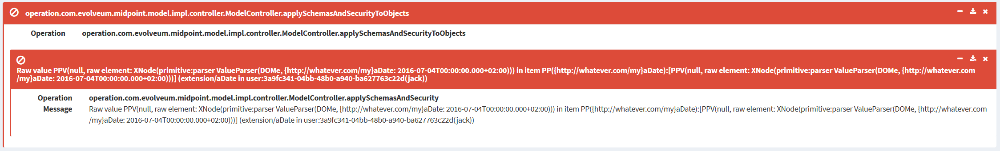
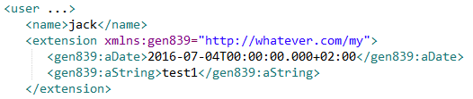

= Schema migration and raw values
:page-wiki-name: Schema migration and raw values

Generally speaking, each value in midPoint should have a definition.
For items defined within the static schema, this is not a big problem.
This schema is backward compatible, so each item, once defined, stays in the schema at least until new major midPoint release.

However, there are dynamic schemas, for example objects' extensions, resource objects' attributes, resource configuration items and so on.
Under normal conditions, each item referencing such schemas has a definition available.
However, as these schemas may change, some values without a definition might be occasionally present.
The question is: how to treat them.

== Object extension schemas

Let's have a look at object extension schemas first.
These are strictly under user control, so item definitions in them may be deleted, renamed, or re-typed at any time.

Imagine we have an extension schema like this:

[source,xml]
----
<xsd:schema elementFormDefault="qualified"
            targetNamespace="http://whatever.com/my"
            xmlns:tns="http://whatever.com/my"
            xmlns:a="http://prism.evolveum.com/xml/ns/public/annotation-3"
            xmlns:c="http://midpoint.evolveum.com/xml/ns/public/common/common-3"
            xmlns:xsd="http://www.w3.org/2001/XMLSchema">

    <xsd:complexType name="UserExtensionType">
        <xsd:annotation>
            <xsd:appinfo>
                <a:extension ref="c:UserType"/>
            </xsd:appinfo>
        </xsd:annotation>
        <xsd:sequence>
            <xsd:element name="aDate" type="xsd:dateTime" minOccurs="0" maxOccurs="1">
                <xsd:annotation>
                    <xsd:appinfo>
                        <a:displayName>A date</a:displayName>
                        <a:displayOrder>100</a:displayOrder>
                    </xsd:appinfo>
                </xsd:annotation>
            </xsd:element>
            <xsd:element name="aString" type="xsd:string" minOccurs="0" maxOccurs="1">
                <xsd:annotation>
                    <xsd:appinfo>
                        <a:displayName>A string</a:displayName>
                        <a:displayOrder>110</a:displayOrder>
                    </xsd:appinfo>
                </xsd:annotation>
            </xsd:element>
        </xsd:sequence>
    </xsd:complexType>
</xsd:schema>

----

A user object then can have the following content:

[source]
----
<user xmlns="http://midpoint.evolveum.com/xml/ns/public/common/common-3"
      xmlns:q="http://prism.evolveum.com/xml/ns/public/query-3"
      xmlns:c="http://midpoint.evolveum.com/xml/ns/public/common/common-3"
      xmlns:t="http://prism.evolveum.com/xml/ns/public/types-3"
      xmlns:icfs="http://midpoint.evolveum.com/xml/ns/public/connector/icf-1/resource-schema-3"
      xmlns:ri="http://midpoint.evolveum.com/xml/ns/public/resource/instance-3"
      oid="3a9fc341-04bb-48b0-a940-ba627763c22d"
      version="0">
   <name>jack</name>
   <extension xmlns:gen302="http://whatever.com/my">
      <gen302:aDate>2016-07-04T00:00:00.000+02:00</gen302:aDate>
      <gen302:aString>test1</gen302:aString>
   </extension>
</user>
----

What if we change the schema by renaming "aString" to "aStringNew", and by changing the type of "aDate" to "xsd:int" ?

Or, what if we delete the extension schema altogether?

We first describe the current (midPoint 3.4.x) behavior, and then discuss how it should be changed in midPoint 3.5.

== Current behavior

=== Deleting (or renaming) an extension item

When extension item is deleted or renamed, midPoint issues a warning and just ignores the value.

As an example, we renamed "aString" to "aStringNew" in the schema.

Result in the log:

[source]
----
2016-07-04 16:19:31,577 [] [http-apr-8080-exec-5] WARN (com.evolveum.midpoint.prism.parser.XNodeProcessor): Item {http://whatever.com/my}aString has no definition (schema present, in container PCD:{.../common/common-3}extension {http://whatever.com/my}UserExtensionType[0,1],dyn,RAM,runtime)while parsing (
  {http://whatever.com/my}aDate => 
    parser null
  {http://whatever.com/my}aString => 
    parser ValueParser(DOMe, {http://whatever.com/my}aString: test1)
)
----

The interpretation:

[source,xml]
----
<user ...>
   <name>jack</name>
   <extension xmlns:gen302="http://whatever.com/my">
      <gen302:aDate>2016-07-04T00:00:00.000+02:00</gen302:aDate>
   </extension>
----

(Note that "aString" value is not there any more.)

=== Changing extension item type

As a next step, we changed the type of "aDate" to "xsd:int" in the schema.

The result is very similar to the above case: a warning is issued and the value is ignored:

[source]
----
2016-07-04 16:19:31,577 [] [http-apr-8080-exec-5] WARN (com.evolveum.midpoint.prism.parser.DomParser): Value of '2016-07-04T00:00:00.000+02:00' couldn't be parsed as '{http://www.w3.org/2001/XMLSchema}int' -- interpreting as null because of COMPAT mode set
java.lang.NumberFormatException: For input string: "2016-07-04T00:00:00.000+02:00"
    at java.lang.NumberFormatException.forInputString(NumberFormatException.java:65) ~[na:1.8.0_74]
    at java.lang.Integer.parseInt(Integer.java:580) ~[na:1.8.0_74]
    at java.lang.Integer.valueOf(Integer.java:766) ~[na:1.8.0_74]
    ...
----

The interpretation:

[source,xml]
----
<user ...>
   <name>jack</name>
   <extension/>
----

(In this case, the "aDate" item disappeared as well.)

Note that on a subsequent change of the user object the "broken" items will be simply removed, leaving no trace of them.

=== Deleting the schema altogether

Here the behavior is slightly different.
Current implementation reacts to an unknown namespace by marking the value as "raw".
Under default settings (namely, the consistency checks enabled), this prevents doing anything reasonable with that object.
It is not even possible to open it via "List users" menu:

However, as of v3.5devel-31-g0bdb40f bug:MID-3249[], it is possible to open such object via "Repository objects" and manually fix it, typically by removing now-invalid extension items:

== Desired behavior

Here is a proposal of the desired solution properties:

. MidPoint should behave consistently for all cases:

.. unknown item name for legal namespace,

.. unknown item namespace,

.. unparseable item value e.g. for xsd:int, xsd:dateTime, or the like,

. If possible, the behavior should be consistent when parsing prism structures (i.e. wrong item within a prism container) with parsing non-prism structures (i.e. wrong attribute within a bean).
Here might be a problem how to store non-compliant values, because the structure of beans is fixed in compile time.
But general approach to handling these should be as unified as possible.

. Non-compliant values should *not* be silently removed.
Their removal should be done either explicitly by editing via "repository object" page, or by running a special task (perhaps the Reindex task, with a setting like "remove non-schema-compliant values").

This is to be implemented in midPoint 3.5, as part of prism cleanup effort: bug:MID-2258[].

== Other aspects

We have to think a little bit about other similar situations, like migrating a connector that causes changing the structure of the "attributes" section in repository shadows or the structure of "configuration" section of the resource.

Also, there are situations, when the type of a value is unspecified, e.g. the content of <value> element in:

[source,xml]
----
<objectTemplate ...>
  <mapping>
    <expression>
      <value>
        <targetRef oid="00000000-0000-0000-0000-000000000008" type="c:RoleType"/>
      </value>
    </expression>
    <target>
      <c:path>assignment</c:path>
    </target>
  </mapping>
</objectTemplate>
----

Currently we accept any value in the <value> element (because the whole mapping is treated like prism property, not like a container).
Any structural problems are reported only when the mapping is to be applied.

If we change this behavior to require xsi:type element on each value, we would be able to report syntax errors soon (while importing the object), but bringing extra work to the user.

So, this is to be discussed yet.

