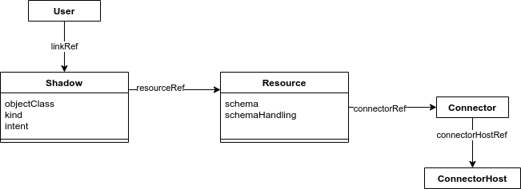
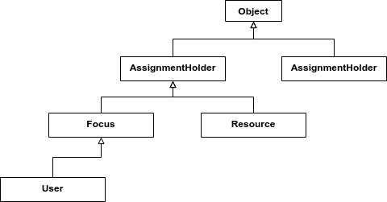
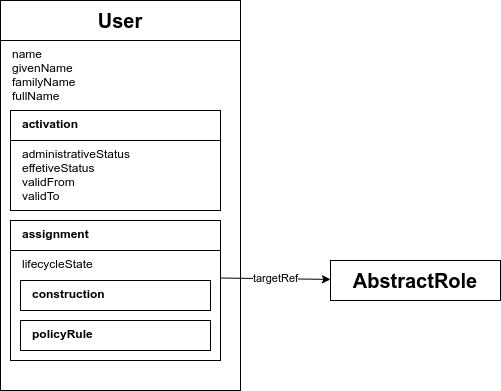

= SchemaDoc NG Design Notes

== "Relation" Diagram Example

This also shows some internal structure (selected properties).

== Type Hierarchy Example

Shows hierarchy of object types

== Object Internal Structure

Also shows some relations.

== TODO

* Schema annotations for including/excluding elements in a diagram.

* Schema for definition of a diagram (e.g. label, styles, etc.)

* How to show complex structure of complex types?
E.g. policy rules, where we have complex types, supertypes, etc.

