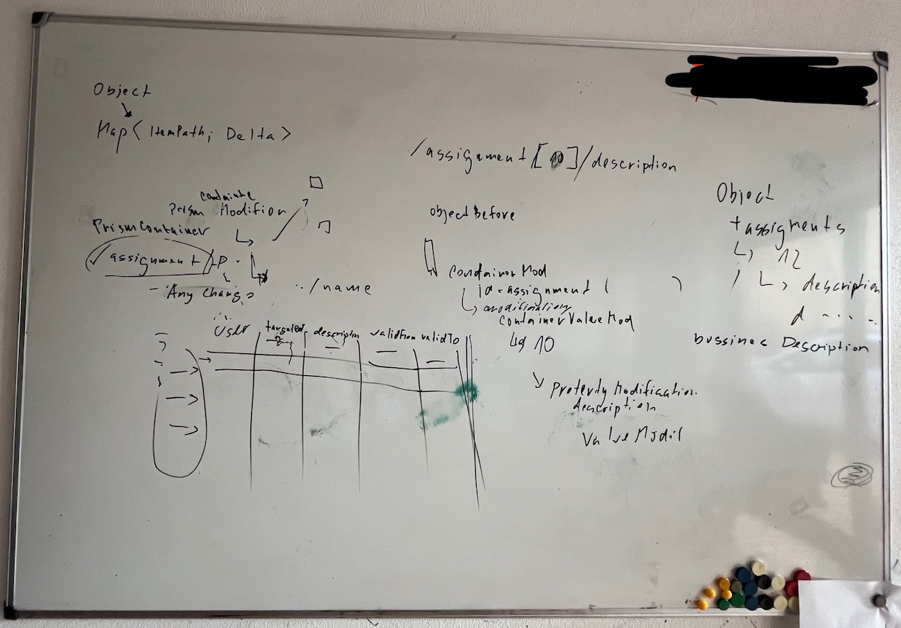

= Simulations - Delta visualization
:page-since: 4.7
:page-toc: top

== Introduction

Following document summarizes how object deltas are being visualized currently, what are main use cases.
Second reason for delta visualization discussion is their use within simulation reports.`

There are multiple cases that uses object delta visualizations.
All differ in terms of how many objects being visualized, e.g. one user vs. many users.
They also differ in options that are available for visualization, for example:

* Preview changes in GUI - visualization of possibly multiple object deltas for one user (GUI/HTML representation with javascript, etc.)
* Reports - visualization of multiple object deltas for many users. Options for visualization may be limited based on target format (CSV, HTML, DB table)
* Notifications - visualization of multiple deltas for single user, Options may also be limited based on target format (plain email, to file, etc).

Attempt to improve visualizations of delta object in different use cases should also indirectly show path on how ti improve implementation to visualize other complex prism and non-prism values (containers, etc).

== Current state

Main Midpoint features that uses visualization of object deltas:

* GUI (preview changes, uses visualization API)
* Reports (text formatter)
* Notifications (text formatter)
* Audit (text formatter)

Code that handles delta visualization in one form or another is currently located in these places:

* Visualization API (model-api, previously Scene DTOs)
* Text formatter (ValudeDisplayUtil)

== Design ideas

* implement some wrapper for object delta to simplify expressions that are getting values from container delta, mainly from complex values
* it should be very simple to obtain value from item delta (be it property, container or reference delta)
** no qnames, item paths, prism magic if possible
* introduce concept of "virtual rows" that are created from single object selected from query result
** e.g. to create multiple sub-rows describing multiple deltas in report for one audit event with multiple object deltas

== Related issues

* bug:MID-8296[]
