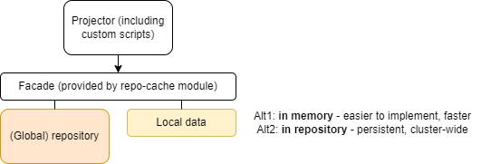

= Simulations - Design Decisions and Questions
:page-since: 4.7
:page-toc: top

See also the xref:/midpoint/devel/design/simulations/requirements/[requirements].

[#_storing_simulation_results]
== Storing Simulation Results

The requirements for reporting are xref:requirements.adoc#_reporting_on_the_results[here].

=== Where to Store the Simulation Results?

Maybe we should allow storing the simulation results in a physically separate database, just like we do for the audit.
(There is an "OLTP vs OLAP" dichotomy here.)

The following combinations probably make sense:

. repository, audit, simulations all in one database,
. repository in one database, audit + simulations in another,
. repository, audit, simulations in separate databases.

(It seems that the audit and simulations have much in common.
We expect that eventually the audit may evolve towards the mechanisms we now design for simulations.
Maybe even the audit will have some xref:/midpoint/devel/design/simulations/tagging/[tags], although different from simulation tags mentioned in <<Tagging>>.)

Implementation issue: If it should be PostgreSQL, it is better _not_ to use `repo-sqlbase` but sqale instead.
We should then implement the "separate database" option somehow.

=== How to Capture and Query State and Changes

The current idea is to store delta(s), original, and new state (`@before` vs `@after` in queries) of any object changed.
The disadvantage of storing pure deltas is maybe their fragmentation - one operation can be split into several deltas.
(This could be solved by aggregation of deltas in a single operation to a single delta.)

Anyway, separating "before" and "after" state allows writing queries like these:

.Change of effective status to "disabled"
----
@type = FocusType
AND @before/activation/effectiveStatus != @after/activation/effectiveStatus
AND @after/activation/effectiveStatus = disabled
----

.Change in primary identifier value
----
@type = ShadowType
AND @before/primaryIdentifierValue != @after/primaryIdentifierValue
----

==== Queries We Currently Cannot Implement Directly

===== Complex Queries
Let us assume the question: What users were accidentally demoted?
I.e. they have an assignment of type `org:manager` to org `X`, and such an assignment is not there afterwards.
Either it is of type `org:default` or does not exist at all.

Some partial attempts:

.Demoting within the same assignment
----
. type UserType
AND assignment matches (
  @before/targetRef/relation = manager
  AND @before/targetRef/relation != @after/targetRef/relation
)
----

.Demoting by deleting the assignment
----
. type UserType
AND assignment matches (
  @before/targetRef/relation = manager
  AND @after not exists
)
----

But we cannot specify that "there exists (another) assignment to X".
Maybe we can try `roleMembershipRef`.
Or maybe this is a case when custom reporting/tagging is needed.

===== Queries on Unchanged Data
NOTE: Let us use the term "unchanged" to denote objects that were processed by the simulation task (if there is any) but no changes were predicted for them. (Because, of course, no objects should be literally _changed_ by the simulation.)

The question of "what are the expected active users after the simulation" cannot be answered from the deltas (or new state of changed objects) alone.
The result set should contain also the objects that were not changed by the simulation - either processed by the respective task (if any), or even not processed by it at all.

We can provide a limited answer to such a question if we use <<Tagging>>:
we can at least deal with the objects processed by the simulation task.

=== Tagging

It looks like we could use the _tags_ to implement queries that are impossible or hard to execute: either because the condition is too complex, or because they deal with unchanged objects.
(See xref:requirements.adoc#_pre_processing_of_the_data[the relevant section in Requirements doc].)

The idea is:

. When a simulation is run, a set of tags is attached to objects being processed: either only to changed ones, or even to those processed but unchanged.
* one such generic tag may be "this object was processed", another "this object was changed", or even maybe "this object was processed but unchanged";
* there may be some pre-defined tags like "the user is active afterwards";
* finally, an administrator may define his own set of tags, bound to search filters or even generic expressions.
. These tags are _not_ stored within the object (e.g. increasing its version, and so on).
Instead, they are stored separately, with a link to the data about the simulation run.

NOTE: See xref:/midpoint/devel/design/simulations/tagging/[related ideas] (outside the Simulations feature scope).

==== Querying with Tags

When asking for users that were (potentially) not updated by the simulation, we get a cross-database query.

For example:

_Show me all active users do you expect after this simulation, sorted according to the name._

How will we evaluate it?

. The first query goes to the simulation DB and returns new + changed objects that are active after the change, sorted according to the name.
(Being active can be determined e.g. by the tag.
But also by `activation/effectiveState` value.)
. The second query goes to the production DB where it looks for users being active (by `activation/effectiveState` or by looking at the tag) and unchanged at the same time.
(The latter will be known by looking for the specific tag.)

The results of the queries are then combined.
The limitation is that the basic ordering (new and/or changed first, unchanged afterwards) cannot be changed.
It may be refined by adding secondary sorting criteria, assuming that they are supported by the particular databases.

Queries like this should accept additional filter clauses, entered by users.

==== Other Ideas
Will we store also the version of the object that we have seen during the simulation?
In order to tell the user that it has been changed since then?

=== Concrete Design of the Tables

How will we store the "before" and "after" state?
Will we use the decomposition like we do in the regular (production) data, e.g. `focus` -> `assignment`, etc?
Or, will we go with JSON?

=== Misc Issues

* Axiom needs the schema to correctly parse the queries.
We should perhaps store the relevant resource schemas along with the simulation data.

==== Reporting on Correlation

To know the situation, we may reference any of the following:

* shadow/synchronizationSituation
* shadow/correlation/situation

To know the owner:

* focus/linkRef
* shadow/correlation/resultingOwner
* shadow/correlation/ownerOptions (for disputed?)

== Configuring the Result Data Stored

*Design question*

Where we should declare what data do we want to be stored during the simulation? In the task? In resource configuration? In object template for focus object attributes/mappings?

*Design idea*

We may consider using thresholds here.
Besides the traditional use (i.e., stopping the computation after defined number of errors or other events), we may want to use the thresholds to define what to watch for during the task execution.
For example, we may define a rule that watches for the modification of `activationStatus`, `employeeNumber`, and `emailAddress` properties.
The policy action would not be to stop execution when the constraint is satisfied, but to "record" (or "count", or something like this) these situations.
Then, after the task is over, midPoint would store the numbers (and/or percentages) of the changes regarding `activationStatus`, `employeeNumber`, and `emailAddress` properties to the repository.
They can be then shown on the dashboard or analyzed for the long term, as the data trends (when multiple task runs are considered).

This can be used during simulations, but also for regular runs.

== Setting the Mode

=== Question: Should We Use Lifecycle State?

Will we use `lifecycleState` (enriched with e.g. `testing` state, and more elaborate deprecation states)?
Or, should we use something other, like `developmentState`?

The advantage of using lifecycle state is that it seems to be matching our intention quite well.
For example, when modifying _roles_, the lifecycle state is exactly what we need:
When an inducement (or the role itself) is "proposed", it means that we are gradually preparing it to be put into the production.

What is maybe unclear is the value of such a state on a user assignment, or user itself.

To be discussed with Martin.

There is a special value of approving only changes in the lifecycle state of individual configuration items (in contrast to approving arbitrary changes in these items):
Approving only LC state changes is much easier to present to the user.

=== Question: What About Shadows?

For shadows, we use `proposed` lifecycle state to avoid concurrency issues.
This seems to be in conflict with the intended use of marking production/non-production shadows.

This is to be researched further.

== Simulation-Local Data

In order to provide semi-transient data for the simulation (including initial configuration change set) the following architecture could be employed:

The local data may reside in memory or in repository.
In the latter case, it would allow clusterwide operation of the simulation tasks.

The simulation will not be perfect.
One obstacle is paging and sorting.
Another is evaluation of repo-bound filters like `targetRef/@/something = value`.
We just have to hope these things are not used in the backend scripts.
This would need to be specified as a known limitation.

As for the repo-based implementation, maybe all what is needed is the column for the local data set identification.
(We considered this design a couple of years ago.)
The combination of local and global data is still a problem, though:
we are not sure how to determine the "newest" versions of the objects, to implement paging and ordering, and so on.

[NOTE]
====
We will skip this (most probably) for 4.7.
(Although it is generally not good to postpone things like this, we probably do not have enough time to do it now.)

Partial issues can be solved also in the application logic, simply by avoiding the repository updates.
The repo cache may then implement safety checks that make sure that repo data will not be updated (except for selected operational data items like timestamps).
====

[TIP]
====
We should check if PostgreSQL does provide "copy on write" functionality for the application.
(It must have something like that internally.)
If it does, we would be able to cheaply obtain an updatable copy of midPoint repository that we could use as the local storage.
====

== Other Comments

* Up to now, midPoint was designed around the "direct execution" model.
Simulations and preview of changes were only hacked upon it.
Now is the time to change this, and make simulated operations the first-class citizens in the midPoint execution.

WARNING: Whatever we create now will be alive for maybe four years!
(In 4.8 there will be no time for radical changes.
And the next LTS is three years after 4.8.)
