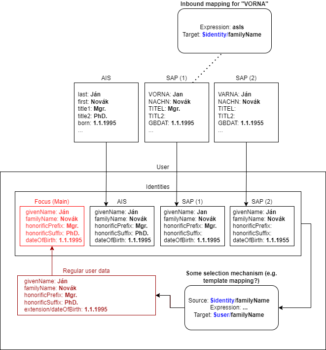

= Smart Correlation in midPoint 4.6 and Beyond
:toc:

== Introduction

The "smart correlation" is a mechanism to correlate identity data to existing focus objects in the
repository. Typical use is e.g. the _resource objects correlation_ during the synchronization
process, where (previously unknown) accounts on a resource are synchronized to midPoint.
Another typical use will be the correlation during manual or automated registration of new users,
including self-registration.

In midPoint 4.4 and before, the only way of correlation was the use of correlation filters,
with strict binary output: either a matching object was found, or there was no match.

In midPoint 4.5, we introduced manual correlation for situations where there is a candidate match
(or more candidate matches) that need to be resolved by the human operator. Moreover, multiple
correlation mechanisms have been created: a custom script, call to an external ID Match API service,
or simplified, item-based correlation.

The goal for midPoint 4.6 and beyond is to provide a configurable correlation mechanism that
can work with approximate matching. For short, it is called _smart correlation_.

== High-Level Requirements

. The correlation mechanism must support _approximate matching_. In other words, it is not
sufficient to match a given data item (e.g., surname) only based on pure equality, probably
after some normalization. The solution must support formulating correlation rules using
metrics like, e.g., Levenshtein distance, Jaro distance, Jaro-Winkler distance, or phonetics
based matching (Soundex, Metaphone, etc.).

. The correlation mechanism must support multiple _variants_ of identity data.
For example, a woman may have a different name before and after marriage. Or, data about a person
coming from the student information system may be a little different from data about the same
person coming from the human resources system. We may want to keep both variants of the data
when considering that person during the correlation of newly-arrived identity data.
The treatment of identity data (e.g., whether to keep "older" variants or not) should be
configurable and probably manageable by a human operator on a case-by-case basis.

. The correlation mechanism should be _adaptive_. It should take human decisions into account
in its future executions.

=== Limitations for 4.6

- Requirement #3 (adaptivity) will not be implemented.

- Requirement #2 (multiple variants) will be implemented in limited way: Only a single variant
per data source (e.g. focus object or a given resource) will be maintained. Moreover, the variant
data will be maintained automatically, that is, manual corrections will not be supported.

== Some Design Decisions

=== Correlation Rules

In 4.6, the correlation mechanism will be based on _rules_, technically called _correlators_.
A rule can state that "if the family name, date of birth, and the national-wide ID all match,
then the identity is the same". Another rule can state that "if (only) the national-wide ID matches,
then the identity is the same with the confidence level of 0.7" (whatever the number means).

Rules reference _correlation items_. A correlation item is a prism item (currently, it must be
a property) of the correlated focus object, e.g., a user.

==== An Example

Let us consider the following _correlation items_.

.Sample correlation items
[%header]
[%autowidth]
|===
| Item name | Description | Item path
| `givenName` | Given name | `givenName`
| `familyName` | Family name | `familyName`
| `dateOfBirth` | Date of birth | `extension/dateOfBirth`
| `nationalId` | National-wide identifier (like social security number) | `extension/nationalId`
|===

We can use them to formulate e.g. the following rules:

.Sample set of correlation rules
[%header]
[%autowidth]
|===
| Rule# | Situation | Resulting confidence
| 1
| `familyName`, `dateOfBirth`, and `nationalId` exactly match
| Sure identity match
| 2
| `nationalId` exactly matches
| 0.8
| 3
| `givenName`, `familyName`, `dateOfBirth` exactly match
| 0.7
| 4
| `dateOfBirth` and first 5 characters of `familyName` matches
| 0.5
| 5
| `familyName` matches with Levenshtein distance (`LD`) between 1 and 4
| 0.5 - `LD`/10
|===

Rule #4 is just an example of using a custom normalization of a correlation item,
namely, taking the first five characters of it.

Rule #5 is an example of dynamically-computed confidence - in this case, based
on the specific value of the Levenshtein distance between identity data in question
and the candidate identity whose match is being considered.

=== Implementation Options

There are two basic implementation options.

==== Option 1: Using Existing Data (Rejected)

All correlation-related queries are issued against existing data, typically in the `m_user` table.
No extra database tables need to be created.

The main disadvantage of this approach is that we are limited to a single variant of the data:
the current ones stored in the focus object (e.g., a user). The reason is that although it is
possible to use other variants of the data, there is currently no suitable place where the
variants could be stored. For example, their storage in assignments is more a hack than
a serious solution, because assignments are not meant to do this. Their storage in shadow objects,
as an alternative that has been considered as well, is limited to a specific use, namely
to resource objects correlation, and would not fit registration or self-registration scenarios.
This means the following:

. The configuration needed to access variants of data in custom places is too complex. Moreover,
the maintenance of data variants in custom places requires a lot of coding. Both these factors
can be seen in experimental examples in midPoint 4.5.

. Maintaining historic variants of the data, i.e., those that have been overwritten already
(either in the repository object or in resource objects), requires even more custom coding.

==== Option 2: Using Separate Correlation Data Container (Accepted)

Here we put all correlation-related data into a special _identities container_ that may look
like this:

.Identities container sample
[source, xml]
----
<user>
    <!-- ... other data ... -->
    <identities>
        <identity id="1">
            <source xsi:type="FocusCorrelationDataSourceType"/>
            <items>
                <original>
                    <givenName>Alice</givenName>
                    <familyName>Green</familyName>
                    <dateOfBirth>1997-01-01</dateOfBirth>
                    <nationalId>9751013333</dateOfBirth>
                </original>
                <normalized>
                    <givenName>alice</givenName>
                    <familyName>green</familyName>
                    <familyName.5>green</familyName>
                    <dateOfBirth>1997-01-01</dateOfBirth>
                    <nationalId>9751013333</dateOfBirth>
                </normalized>
            </items>
        </identity>
        <identity id="2">
            <source xsi:type="ProjectionCorrelationDataSourceType">
                <shadowRef oid="43fb79a3-d22d-480d-aa85-e04aa4749d46"/>
                <resourceRef oid="858d8c22-b737-4024-a039-aa3f45ebef7e"/>
                <kind>account</kind>
                <intent>default</intent>
                <tag>10704444</tag>
            </source>
            <items>
                <original>
                    <givenName>Alice</givenName>
                    <familyName>Johnson</familyName>
                    <dateOfBirth>1997-01-01</dateOfBirth>
                    <nationalId>9751013333</dateOfBirth>
                </original>
                <normalized>
                    <givenName>alice</givenName>
                    <familyName>johnson</familyName>
                    <familyName.5>johns</familyName.5>
                    <dateOfBirth>1997-01-01</dateOfBirth>
                    <nationalId>9751013333</dateOfBirth>
                </normalized>
            </items>
        </identity>
    </identities>
</user>
----

We need to have both original version of the data and the normalized one. The former is needed,
for example, to show correlation options in the GUI. The latter is needed for the actual matching.

_Couldn't the repository do the normalization itself?_

It could. But, we want to keep things simple, and responsibilities clearly divided.
The repository does not need to know about the normalization/matching rules. All it needs
is the schema. The current decision was to provide the definitions along with the data,
i.e. exactly like the `attributes` container in `ShadowType` objects is implemented.

_Will the data be stored in object JSON representation?_

No. We want to conserve the space. Data will be stored in separate tables, because `identity`
item is multivalued. Each `identity` row will contain a small "full-object" column (containing
everything except `items`) and two JSONB columns: one for `original` and one for `normalized`
version of the data.footnote:[We have considered custom tables for the data, which would be
created by the deployment engineer. But we have rejected the idea as too complex.]

==== Querying the Identity Data

There are two options when doing this:

.Matching whole records
[source,axiom]
----
identities/identity matches (
    items/normalized/givenName =[levenshtein(0,3)] 'alice'
    and items/normalized/familyName.5 =[levenshtein(0,1)] 'johns'
    and items/normalized/dateOfBirth = '1997-01-01'
)
----

.Matching individual items
[source,axiom]
----
identities/identity/items/normalized/givenName =[levenshtein(0,3)] 'alice'
and identities/identity/items/normalized/familyName.5 =[levenshtein(0,1)] 'johns'
and identities/identity/items/normalized/dateOfBirth = '1997-01-01'
----

It is to be decided which query style should be used. The repository should support both.

==== Updating the Identity Data

The data on identities - could be updated via improved inbound mappings.

In the future, we may also consider adding historic identity records there. Or, some other ones,
e.g. related to the registration or self-registration processes (not connectable to a particular
resource). Management of some of these data could be also manual. Some kinds of changes could
be handled at the level of individual items' values, recording also the value metadata. There
are countless possibilities here.

=== The Suggested Way Forward for 4.6

. Enhance Query API so that it will support selected approximate search features. As a minimum,
Levenshtein edit distance will be supported. The exact form is to be decided, e.g., if the support
will be based on a new clause, a new matching rule, or a newly-added "equal" clause option.
That way or another, we need to specify Levenshtein distance bound or bounds, and - eventually -
an option to return the measured distance as part of the result set. (Otherwise, if we would like
to reflect the distance in the metric, we would need to compute it ourselves.)
- Requirements specification (i.e. what are the required options): *Tadek*, *Pavol*
- Implementation: *Tony*

. Implement the new Query API features in the native repository.
- By: *Tony*

. Implement the `identities` container in the native repository.
- By: *Rišo*

. Implement the functionality to update the `identities` container.
- By: *Pavol* with the help of *Tadek*

. Update the correlation configuration language (see xref:configuration.adoc[separate document]).
- By: *Pavol* with the help of *Tadek*

. Update the correlators to support uncertainty, confidence levels, and variants
- By: *Pavol* with the help of *Tadek*

. Update the GUI to show certainty levels (and other modifications as needed)
- By: *?*

. Prepare tests and documentation
- By: *Tadek* and *Pavol*
