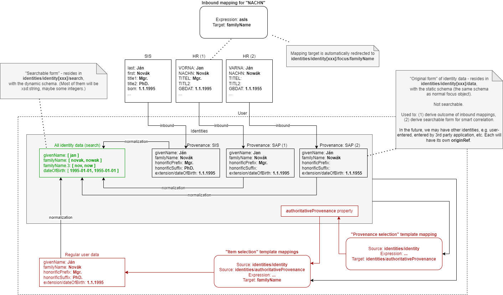

= Smart Correlation in midPoint 4.6 and Beyond
:toc:

NOTE: This is a historic design document. It was transformed into a xref:/midpoint/reference/correlation/[feature description].

== Introduction

The "smart correlation" is a mechanism to correlate identity data to existing focus objects in the
repository. Typical use is e.g. the _resource objects correlation_ during the synchronization
process, where (previously unknown) accounts on a resource are synchronized to midPoint.
Another typical use will be the correlation during manual or automated registration of new users,
including self-registration.

In midPoint 4.4 and before, the only way of correlation was the use of correlation filters,
with strictly binary output: either a matching object was found, or there was no match.

In midPoint 4.5, we introduced manual correlation for situations where there is a candidate match
(or more candidate matches) that need to be resolved by the human operator. Moreover, multiple
correlation mechanisms have been created: a custom script, call to an external ID Match API service,
or simplified, item-based correlation.

The goal for midPoint 4.6 and beyond is to provide a configurable correlation mechanism that
can work with approximate matching. For short, it is called _smart correlation_.

== High-Level Requirements

. The correlation mechanism must support _approximate matching_. In other words, it is not
sufficient to match a given data item (e.g., surname) only based on pure equality, probably
after some normalization. The solution must support formulating correlation rules using
metrics like, e.g., Levenshtein distance, Jaro distance, Jaro-Winkler distance, or phonetics
based matching (Soundex, Metaphone, etc.).

. The correlation mechanism must support multiple _variants_ of identity data.
For example, a woman may have a different name before and after marriage. Or, data about a person
coming from the student information system may be a little different from data about the same
person coming from the human resources system. We may want to keep both variants of the data
when considering that person during the correlation of newly-arrived identity data.
The treatment of identity data (e.g., whether to keep "older" variants or not) should be
configurable and probably manageable by a human operator on a case-by-case basis.

. The correlation mechanism should be _adaptive_. It should take human decisions into account
in its future executions.

=== Limitations for 4.6

- Requirement #3 (adaptivity) will not be implemented.

- Requirement #2 (multiple variants) will be implemented in limited way: Only a single variant
per data source (e.g. focus object or a given resource) will be maintained. Moreover, the variant
data will be maintained automatically, that is, manual corrections will not be supported.

== Some Design Decisions

=== Correlation Rules

In 4.6, the correlation mechanism will be based on _rules_, technically called _correlators_.
A rule can state that "if the family name, date of birth, and the national-wide ID all match,
then the identity is the same". Another rule can state that "if (only) the national-wide ID matches,
then the identity is the same with the confidence level of 0.7" (whatever the number means).

Rules reference _correlation items_. A correlation item is a prism item (currently, it must be
a property) of the correlated focus object, e.g., a user.

==== An Example

Let us consider the following _correlation items_.

.Sample correlation items
[%header]
[%autowidth]
|===
| Item name | Description | Item path
| `givenName` | Given name | `givenName`
| `familyName` | Family name | `familyName`
| `dateOfBirth` | Date of birth | `extension/dateOfBirth`
| `nationalId` | National-wide identifier (like social security number) | `extension/nationalId`
|===

We can use them to formulate e.g. the following rules:

.Sample set of correlation rules
[%header]
[%autowidth]
|===
| Rule# | Situation | Resulting confidence
| 1
| `familyName`, `dateOfBirth`, and `nationalId` exactly match
| Sure identity match
| 2
| `nationalId` exactly matches
| 0.8
| 3
| `givenName`, `familyName`, `dateOfBirth` exactly match
| 0.7
| 4
| `dateOfBirth` and the first 5 characters of `familyName` match
| 0.5
| 5
| `familyName` matches with Levenshtein distance (`LD`) between 1 and 4
| 0.5 - `LD`/10
|===

Rule #4 is just an example of using a custom normalization of a correlation item,
namely, taking the first five characters of it.

Rule #5 is an example of dynamically-computed confidence - in this case, based
on the specific value of the Levenshtein distance between identity data in question
and the candidate identity whose match is being considered.

=== Data Storage

The correlation can involve _multiple sources of identity data_. For example, the information
of a person can come from the Student information system, the Human resources system, or even from
both at once. Some of these systems can use the
xref:/midpoint/reference/resources/multiaccounts/[multi-accounts feature], allowing multiple
accounts for the same person. All this means that:

. we need to be able to correlate against multiple versions of identity data,
. we need to have a mechanism how to select the "right" identity data from all those versions.

These two questions are partially independent, but they have much in common. We try to devise
the data storage that will serve both purposes.

The data structure looks like this:

.Identities container sample (reordered for clarity)
[source, xml]
----
<user>
    <!-- ... other data ... -->
    <givenName>Alice</givenName>
    <familyName>Green</givenName>
    <extension>
        <dateOfBirth>1997-01-01</dateOfBirth>
        <nationalId>9751013333</dateOfBirth>
    </extension>

    <identities>
        <identity id="1">
            <provenance>
                <resourceRef oid="858d8c22-b737-4024-a039-aa3f45ebef7e"/> <!-- HR -->
                <kind>account</kind>
                <intent>default</intent>
                <tag>10704444</tag>
                <shadowRef oid="43fb79a3-d22d-480d-aa85-e04aa4749d46"/>
            </provenance>
            <data>
                <givenName>Alice</givenName>
                <familyName>Johnson</givenName>
                <extension>
                    <dateOfBirth>1997-01-01</dateOfBirth>
                    <nationalId>9751013333</dateOfBirth>
                </extension>
            </data>
        </identity>
        <identity id="2">
            <provenance>
                <resourceRef oid="858d8c22-b737-4024-a039-aa3f45ebef7e"/> <!-- HR -->
                <kind>account</kind>
                <intent>default</intent>
                <tag>10705555</tag>
                <shadowRef oid="11cdb8e7-a21f-450e-b55c-adbcec54f047"/>
            </provenance>
            <data>
                <givenName>Alice</givenName>
                <familyName>Green</givenName>
                <extension>
                    <dateOfBirth>1997-01-01</dateOfBirth>
                    <nationalId>9751013333</dateOfBirth>
                </extension>
            </data>
        </identity>
        <identity id="3">
            <provenance>
                <originRef oid="00000000-0000-0000-0000-000000000610" type="ServiceType"/> <!-- All current identities -->
            </provenance>
            <search>
                <givenName>alice</givenName>
                <familyName>green</familyName>
                <familyName>johnson</familyName>
                <familyName.5>green</familyName>
                <familyName.5>johns</familyName>
                <dateOfBirth>1997-01-01</dateOfBirth>
                <nationalId>9751013333</dateOfBirth>
            </search>
        </identity>
    </identities>
</user>
----

There is a new container called `identities` that contains everything related to multiple versions of identity data
as well as to searching for identity data (typically when doing the correlation).

Each variant (called `identity`) contains the following:

[%header]
[%autowidth]
|===
| Item | Meaning
| `provenance` | The source of the data.
| `data` | Original version of the data, suitable for further processing. They are structured in the same way
as in the original object (e.g., user). They are not searchable.
| `search` | Searchable version of the data. These items are stored in the flat structure, as a set of (potentially
multivalued) properties. The values are usually normalized by defined means (like using
xref:/midpoint/reference/schema/polystring-normalization/[configured `PolyString` normalization]).
|===

For space and performance reasons, the searchable version of the identity data may be merged into
a single `identity` container value (the one with ID of `3` in the above sample). But, if needed,
we may allow storing searchable version of each identity in the respective `identity` value.

The `provenance` item denotes how the data were derived. Currently, it may have the following items:

[%header]
[%autowidth]
|===
| Item | Meaning
| `originRef` | An abstract, high-level representation of data source. It represents something that
the users will understand, such as _human resource data_, _marketing data broker_ or _self-service
user data entry_ (in the future). There are some well-known origins described below.
| `resourceRef` | The resource on which the object providing the identity resides. (If applicable.)
| `kind` | Kind of resource object providing the identity. (If applicable.)
| `intent` | Intent of resource object providing the identity. (If applicable.)
| `tag` | Tag of shadow of the resource object providing the identity. (If applicable.)
| `shadowRef` | The shadow of the resource object that provides the identity. (If applicable.)
Mainly for diagnostic purposes.
|===

Well-known origin values are:

[%header]
[%autowidth]
|===
| OID | Name | Meaning
| `00000000-0000-0000-0000-000000000610` | All current identities | Data gathered from all known identities
(i.e., current focus data plus data from all identities in `identities/identity` container). Typically, it is
used to mark the store of `search` data.
|===

In the future we may use the origin to mark identities containing historic data as well. Such identities would
be updated in "add only" mode, i.e. new values would be added to them, without deleting anything. In the further
future, value metadata could be added to mark the validity ranges of such data. (But for searching, this is not
required.) Note that if we'd like to store original historical data (i.e., in the `data` container), some changes
to prism would be needed to allow e.g. alternative multivalued definitions of `givenName`, `familyName` and similar
properties. But, implementing historic data in `search` container is trivial.

NOTE: Current implementation state is such that instead of `provenance` we use `source`. The "All current identities"
origin does not exist yet; we use `null` source for this purpose.

==== Repository Storage

We decided to store the `search` data as `JSONB` column. All the other data in `identities/identity`
are stored as standard prism JSON-encoded data ("fullObject") in a separate DB table. They are not
loaded by default.

All of this applies to the new (native) repository. In the old (generic) repo, the data are stored
just like any other focus data, i.e. in the "fullObject" column, and are not indexed in any way.
Hence, the multi-inbounds will work for generic repo, but the searching (including smart correlation)
will not.

=== Updating Identity Data

==== Original Data Coming by Inbound Mappings

The identity data related to resources with inbound mappings (i.e. coming from SIS and HR resources in the figure
below) are updated right by those mappings. Before mapping evaluation, the target path of each of such mapping
is transparently rewritten, e.g., from `familyName` to `identities/identity/_id_/data/familyName`, where `_id_`
is determined by searching for identity value corresponding to the particular provenance data (e.g. "HR (1)").

==== Search Data

Search data (the green box in the figure) are updated automatically on each focus update - in the
_change execution_ step of the clockwork processing.

(Note that the normalization itself is carried out by `model-impl` module, not the repository.)

==== Main Focus Data

As it was said above, inbound mappings for identity data no longer update the focus data directly.
All their effects are redirected to the appropriate identity value.

Therefore, we need a mechanism that would take identity values and feed the respective data to
"main" focus data. For example, something that would take all the identity information, and derive
the value of `$focus/familyName` property.

The most natural is to use object template mappings for this. In fact, you can write any template
mapping that would take `identities/identity` as a source (plus any other sources, as needed),
and `familyName` as a target, and provide appropriate logic to fill the target.

However, to avoid the need of writing a lot of technical stuff, midPoint provides the following
specialized features:

. Identity selection mapping: There are situations when you can designate a single identity
as "authoritative" for the whole focus object. For example, there may be a rule stating that
"if there is a SIS record, take it as authoritative". Such rules can be embodied into so-called
_identity selection mapping_, that - by default - takes `identities/identity` as the source,
and the resulting values stores into `identities/authoritativeProvenance`.

. Item selection mappings: By default, there is a system-generated template mapping that provides
the value or values of the respective identity item to be stored into the focus object. It uses
pre-computed `identities/authoritativeProvenance` property and`MidpointFunctions.selectIdentityItemValues(...)`
method to derive the value(s).

These mappings (and the authoritative user data generated by them) are shown in red color in the above
picture.

NOTE: The default behavior is to take all values from all inbound data. This is the same behavior
that was present before midPoint 4.6. (It will obviously fail for single-valued target items
with multiple values derived from inbounds.) The only difference is that previously we took only
values of _currently loaded_ resource objects, whereas now we will take values from _all_
resource objects. This should bring more determinism into the processing.

==== Beyond 4.6

===== Other Kinds of Provenance

As said above, there is a place for other kinds of provenance of identity data: user entry,
REST service, and so on, exactly as was conceived as part of
xref:/midpoint/projects/midprivacy/phases/01-data-provenance-prototype/[Phase 1 (Data provenance prototype)]
of the midPrivacy project.

These data would be stored in the `identities/identity` container, with the appropriate provenance information.
They would be updated (presumably) by redirecting primary deltas from, e.g., `familyName`
to `identities/identity/_id_/familyName`, transparently, at the start of the clockwork processing.
No other changes are expected.

===== Historical Data

Historical data may be updated transparently along with the search data, during the _change execution_
step of the clockwork processing.

===== Manual Update

Some data may be updated also manually. For example, we may want to remove some wrong data that were
present in the history, but we don't want to match them in the future searches. Or, we may want to
add some data variations for future correlation that are not present in any data source.

=== Querying Identity Data

There are two options when doing this:

.Matching whole records
[source,axiom]
----
identities/identity matches (
    search/givenName =[levenshtein(0,3)] 'alice'
    and search/familyName.5 =[levenshtein(0,1)] 'johns'
    and search/dateOfBirth = '1997-01-01'
)
----

.Matching individual items
[source,axiom]
----
identities/identity/search/givenName =[levenshtein(0,3)] 'alice'
and identities/identity/search/familyName.5 =[levenshtein(0,1)] 'johns'
and identities/identity/search/dateOfBirth = '1997-01-01'
----

It is to be decided which query style should be used. The repository should support both.

(If there is only a single `search` container value per focus object, these forms are equivalent.)

== Rejected/Alternative Design Options

=== User Identities As Separate Objects

What if we created separate user (focus) objects, instead of storing them
in `identities/identity/data` containers?

Pros (some of):

. Their data would be directly searchable.
. The structure of "main" user object would be simpler.

Cons (some of):

. The number of user objects would grow `N` times, where `N` is the average number of identities.
. We would need a mechanism to filter-out those "auxiliary" objects from the list of all "main" ones.
. The inbound processing would be perhaps more complex. (But this is a generalization - from a single
to multiple objects - that we need to do some day.)

To be discussed.

=== Normalization Done By Repository

The normalization, i.e., creation of the search data, is carried out by `model-impl`.

An alternative would be to have the repository do it. But, we want to keep things simple.
The repository does not need to know about the normalization/matching rules. All it needs
is the schema. The current decision was to provide the definitions along with the data,
i.e. exactly like the `attributes` container in `ShadowType` objects is implemented.
(By the way, the normalization of attribute values is done in `provisioning-impl`.)

=== Alternative Ways of Storing the Data

We need to decide whether to provide single or potentially multiple `search` container values
for one focus. The current implementation (stemming from older design) is to provide multiple ones.
It is more general, allowing e.g. keeping historical data some day.

The exact storage of identity "full object" is also to be decided.

Currently, we don't serialize the full object along with the "main" focus full object data,
to conserve space and processing time.

=== Avoiding Identity Container At All

In this case, no special `identities` container would be created. All correlation-related queries
would be issued against existing data, typically in the `m_user` table. No extra database tables
nor other structures would be created.

The main disadvantage of this approach is that we are limited to a single variant of the data:
the current ones stored in the focus object (e.g., a user). The reason is that although it is
possible to use other variants of the data, there is currently no suitable place where the
variants could be stored. For example, their storage in assignments is more a hack than
a serious solution, because assignments are not meant to do this. Their storage in shadow objects,
as an alternative that has been considered as well, is limited to a specific use, namely
to resource objects correlation, and would not fit registration or self-registration scenarios.
This means the following:

. The configuration needed to access variants of data in custom places is too complex. Moreover,
the maintenance of data variants in custom places requires a lot of coding. Both these factors
can be seen in experimental examples in midPoint 4.5.

. Maintaining historic variants of the data, i.e., those that have been overwritten already
(either in the repository object or in resource objects), requires even more custom coding.

Also, normalization for the user of efficient searching would be problematic.

== The Suggested Way Forward for 4.6 (Partly Obsolete Now)

. Enhance Query API so that it will support selected approximate search features. As a minimum,
Levenshtein edit distance will be supported. The exact form is to be decided, e.g., if the support
will be based on a new clause, a new matching rule, or a newly-added "equal" clause option.
That way or another, we need to specify Levenshtein distance bound or bounds, and - eventually -
an option to return the measured distance as part of the result set. (Otherwise, if we would like
to reflect the distance in the metric, we would need to compute it ourselves.)
- Requirements specification (i.e. what are the required options): *Tadek*, *Pavol*
- Implementation: *Tony*

. Implement the new Query API features in the native repository.
- By: *Tony*

. Implement the `identities` container in the native repository.
- By: *Rišo*

. Implement the functionality to update the `identities` container.
- By: *Pavol* with the help of *Tadek*

. Update the correlation configuration language (see xref:configuration.adoc[separate document]).
- By: *Pavol* with the help of *Tadek*

. Update the correlators to support uncertainty, confidence levels, and variants
- By: *Pavol* with the help of *Tadek*

. Update the GUI to show certainty levels (and other modifications as needed)
- By: *?*

. Prepare tests and documentation
- By: *Tadek* and *Pavol*
