= Tuning midPoint on Oracle
:page-wiki-name: Tuning midPoint on Oracle
:page-wiki-metadata-create-user: mederly
:page-wiki-metadata-create-date: 2019-05-31T09:00:44.031+02:00
:page-wiki-metadata-modify-user: mederly
:page-wiki-metadata-modify-date: 2019-06-03T18:58:49.283+02:00

:page-toc: top

== Overview

This is a kind of "thinking aloud", or recording my experiments with the performance of bulk imports on Oracle database.

Currently it consists of running link:https://github.com/Evolveum/midpoint/blob/72dac29451e0171c29d635af1ee20cb167991e8f/testing/story/src/test/java/com/evolveum/midpoint/testing/story/perf/TestImport.java[TestImport] against MySQL as a source of 50,000 accounts and Oracle as a repository.

With a help of people at University of Western Ontario we came to a conclusion that the issue lies in the performance of search operations.
In particular, how the planner prepares query plans; based on statistics that might be very inaccurate - e.g. thinking that a table is empty while it already has let's say 100K records.

== Run 1: Statistics cleared and locked down (Fri May 31 10:03:30 CEST 2019)

=== Setup

The first attempt recorded here is to clear statistics and lock them down:

[source]
----
BEGIN
    FOR cur IN (SELECT
                    table_name
                FROM user_tables WHERE LOWER(table_name) LIKE 'm\_%' ESCAPE '\') LOOP
        BEGIN
            DBMS_STATS.DELETE_TABLE_STATS('SYSTEM', cur.table_name);
        END;
    END LOOP;
END;

BEGIN
    FOR cur IN (SELECT
                    table_name
                FROM user_tables WHERE LOWER(table_name) LIKE 'm\_%' ESCAPE '\') LOOP
        BEGIN
            DBMS_STATS.LOCK_TABLE_STATS('SYSTEM', cur.table_name);
        END;
    END LOOP;
END;

select table_name, num_rows, blocks from user_tables where table_name LIKE 'M\_%' ESCAPE '\' ;
----

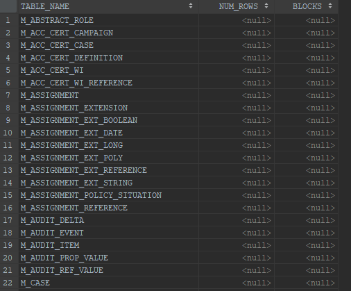

=== Performance

The performance of import is like this (showing objects per minute; the processing was aborted before 50,000 accounts were imported):

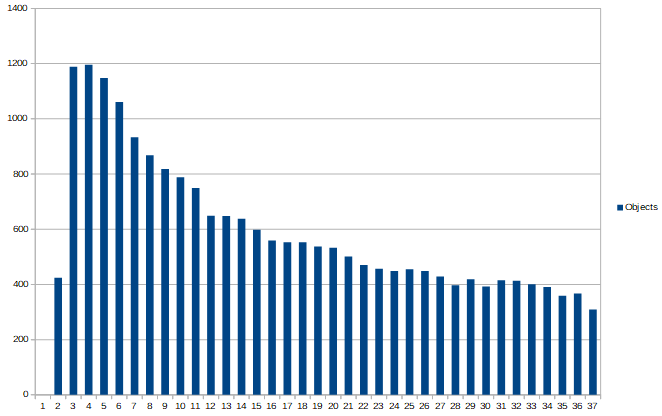

=== Slow queries

Slowest queries according to the profiling logs (absolute counts are not relevant; they depend on how long the profiling run):

[%autowidth]
|===
| Category | SQL ID | Count 

| search-shadow-attr-OC-resource-not-dead.after-oid-null
| gf8u4pq1dzmrz
| 3209

| search-shadow-attr-OC-resource.no-paging
| 8z9agnh1nyhk7
| 1595

| search-shadow-attr-resource.no-paging
| bk2ms7acr0wmy
| 1235

|===

Relevant SQL queries:

.search-shadow-attr-OC-resource-not-dead.after-oid-null (gf8u4pq1dzmrz)
[source,sql]
----
SELECT rshadow0_.oid AS col_0_0_, rshadow0_1_.fullObject AS col_1_0_, rshadow0_1_.stringsCount AS col_2_0_,
    rshadow0_1_.longsCount AS col_3_0_, rshadow0_1_.datesCount AS col_4_0_, rshadow0_1_.referencesCount AS col_5_0_,
    rshadow0_1_.polysCount AS col_6_0_, rshadow0_1_.booleansCount AS col_7_0_
FROM m_shadow rshadow0_
         INNER JOIN m_object rshadow0_1_ ON rshadow0_.oid = rshadow0_1_.oid
         LEFT OUTER JOIN m_object_ext_string strings1_
ON rshadow0_.oid = strings1_.owner_oid AND (strings1_.ownerType = :1 AND strings1_.item_id = :2)
WHERE strings1_.stringValue = :3 AND rshadow0_.objectClass=:4 AND rshadow0_.resourceRef_targetOid=:5 AND (rshadow0_.resourceRef_relation IN (:6, :7, :8 )) AND (rshadow0_.dead=:9 OR rshadow0_.dead IS NULL)
ORDER BY NLSSORT(rshadow0_.oid, 'NLS_SORT=BINARY_AI') ASC FETCH FIRST :10 ROWS ONLY
----

 +

.search-shadow-attr-OC-resource.no-paging (8z9agnh1nyhk7)
[source,sql]
----
SELECT rshadow0_.oid AS col_0_0_, rshadow0_1_.fullObject AS col_1_0_, rshadow0_1_.stringsCount AS col_2_0_,
    rshadow0_1_.longsCount AS col_3_0_, rshadow0_1_.datesCount AS col_4_0_, rshadow0_1_.referencesCount AS col_5_0_,
    rshadow0_1_.polysCount AS col_6_0_, rshadow0_1_.booleansCount AS col_7_0_
FROM m_shadow rshadow0_
         INNER JOIN m_object rshadow0_1_ ON rshadow0_.oid = rshadow0_1_.oid
         LEFT OUTER JOIN m_object_ext_string strings1_
ON rshadow0_.oid = strings1_.owner_oid AND (strings1_.ownerType = :1 AND strings1_.item_id = :2)
WHERE strings1_.stringValue = :3 AND rshadow0_.objectClass=:4 AND rshadow0_.resourceRef_targetOid=:5 AND (rshadow0_.resourceRef_relation IN (:6, :7, :8 ))
----

 +

.search-shadow-attr-resource.no-paging (bk2ms7acr0wmy)
[source,sql]
----
SELECT rshadow0_.oid AS col_0_0_, rshadow0_1_.fullObject AS col_1_0_, rshadow0_1_.stringsCount AS col_2_0_,
    rshadow0_1_.longsCount AS col_3_0_, rshadow0_1_.datesCount AS col_4_0_, rshadow0_1_.referencesCount AS col_5_0_,
    rshadow0_1_.polysCount AS col_6_0_, rshadow0_1_.booleansCount AS col_7_0_
FROM m_shadow rshadow0_
         INNER JOIN m_object rshadow0_1_ ON rshadow0_.oid = rshadow0_1_.oid
         LEFT OUTER JOIN m_object_ext_string strings1_
ON rshadow0_.oid = strings1_.owner_oid AND (strings1_.ownerType = :1 AND strings1_.item_id = :2)
WHERE strings1_.stringValue = :3 AND rshadow0_.resourceRef_targetOid=:4 AND (rshadow0_.resourceRef_relation IN (:5, :6, :7 ))

----

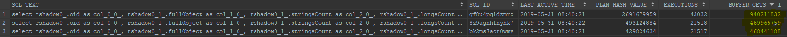

Query plans used (there is only one for each query):

.Plan for gf8u4pq1dzmrz
[source]
----
SQL_ID  gf8u4pq1dzmrz, child number 0
-------------------------------------
select rshadow0_.oid as col_0_0_, rshadow0_1_.fullObject as col_1_0_, 
rshadow0_1_.stringsCount as col_2_0_, rshadow0_1_.longsCount as 
col_3_0_, rshadow0_1_.datesCount as col_4_0_, 
rshadow0_1_.referencesCount as col_5_0_, rshadow0_1_.polysCount as 
col_6_0_, rshadow0_1_.booleansCount as col_7_0_ from m_shadow rshadow0_ 
inner join m_object rshadow0_1_ on rshadow0_.oid=rshadow0_1_.oid left 
outer join m_object_ext_string strings1_ on 
rshadow0_.oid=strings1_.owner_oid and (strings1_.ownerType=:1  and 
strings1_.item_id=:2 ) where strings1_.stringValue=:3  and 
rshadow0_.objectClass=:4  and rshadow0_.resourceRef_targetOid=:5  and 
(rshadow0_.resourceRef_relation in (:6  , :7  , :8 )) and 
(rshadow0_.dead=:9  or rshadow0_.dead is null) order by 
NLSSORT(rshadow0_.oid, 'NLS_SORT=BINARY_AI') asc fetch first :10  rows 
only
 
Plan hash value: 2691679959
 
----------------------------------------------------------------------------------------------------------------
| Id  | Operation                                 | Name               | Rows  | Bytes | Cost (%CPU)| Time     |
----------------------------------------------------------------------------------------------------------------
|   0 | SELECT STATEMENT                          |                    |       |       |     4 (100)|          |
|   1 |  SORT ORDER BY                            |                    |     1 |  2750 |     4  (50)| 00:00:01 |
|*  2 |   VIEW                                    |                    |     1 |  2750 |     3  (34)| 00:00:01 |
|*  3 |    WINDOW SORT PUSHED RANK                |                    |     1 |  3559 |     3  (34)| 00:00:01 |
|   4 |     NESTED LOOPS                          |                    |     1 |  3559 |     2   (0)| 00:00:01 |
|   5 |      NESTED LOOPS                         |                    |     1 |  3559 |     2   (0)| 00:00:01 |
|   6 |       NESTED LOOPS                        |                    |     1 |  1405 |     1   (0)| 00:00:01 |
|*  7 |        TABLE ACCESS BY INDEX ROWID BATCHED| M_SHADOW           |    13 | 10309 |     1   (0)| 00:00:01 |
|*  8 |         INDEX RANGE SCAN                  | ISHADOWOBJECTCLASS |     1 |       |     1   (0)| 00:00:01 |
|*  9 |        INDEX UNIQUE SCAN                  | SYS_C0015845       |     1 |   612 |     0   (0)|          |
|* 10 |       INDEX UNIQUE SCAN                   | SYS_C0015815       |     1 |       |     0   (0)|          |
|  11 |      TABLE ACCESS BY INDEX ROWID          | M_OBJECT           |     1 |  2154 |     1   (0)| 00:00:01 |
----------------------------------------------------------------------------------------------------------------
 
Query Block Name / Object Alias (identified by operation id):
-------------------------------------------------------------
 
   1 - SEL$4       
   2 - SEL$B4E2589B / from$_subquery$_006@SEL$4
   3 - SEL$B4E2589B
   7 - SEL$B4E2589B / RSHADOW0_@SEL$1
   8 - SEL$B4E2589B / RSHADOW0_@SEL$1
   9 - SEL$B4E2589B / STRINGS1_@SEL$2
  10 - SEL$B4E2589B / RSHADOW0_1_@SEL$1
  11 - SEL$B4E2589B / RSHADOW0_1_@SEL$1
 
Predicate Information (identified by operation id):
---------------------------------------------------
 
   2 - filter("from$_subquery$_006"."rowlimit_$$_rownumber"<=:10)
   3 - filter(ROW_NUMBER() OVER ( ORDER BY NLSSORT("RSHADOW0_"."OID",'nls_sort=''BINARY_AI'''))<=:10)
   7 - filter(("RSHADOW0_"."RESOURCEREF_TARGETOID"=:5 AND 
              INTERNAL_FUNCTION("RSHADOW0_"."RESOURCEREF_RELATION") AND ("RSHADOW0_"."DEAD" IS NULL OR 
              "RSHADOW0_"."DEAD"=:9)))
   8 - access("RSHADOW0_"."OBJECTCLASS"=:4)
   9 - access("RSHADOW0_"."OID"="STRINGS1_"."OWNER_OID" AND "STRINGS1_"."OWNERTYPE"=:1 AND 
              "STRINGS1_"."ITEM_ID"=:2 AND "STRINGS1_"."STRINGVALUE"=:3)
  10 - access("RSHADOW0_"."OID"="RSHADOW0_1_"."OID")
 
Column Projection Information (identified by operation id):
-----------------------------------------------------------
 
   1 - (#keys=1) "from$_subquery$_006"."rowlimit_$_0"[RAW,1162], 
       "from$_subquery$_006"."COL_0_0_"[VARCHAR2,144], "from$_subquery$_006"."COL_1_0_"[LOB,4000], 
       "from$_subquery$_006"."COL_2_0_"[NUMBER,22], "from$_subquery$_006"."COL_3_0_"[NUMBER,22], 
       "from$_subquery$_006"."COL_4_0_"[NUMBER,22], "from$_subquery$_006"."COL_5_0_"[NUMBER,22], 
       "from$_subquery$_006"."COL_6_0_"[NUMBER,22], "from$_subquery$_006"."COL_7_0_"[NUMBER,22]
   2 - "from$_subquery$_006"."COL_0_0_"[VARCHAR2,144], "from$_subquery$_006"."COL_1_0_"[LOB,4000], 
       "from$_subquery$_006"."COL_2_0_"[NUMBER,22], "from$_subquery$_006"."COL_3_0_"[NUMBER,22], 
       "from$_subquery$_006"."COL_4_0_"[NUMBER,22], "from$_subquery$_006"."COL_5_0_"[NUMBER,22], 
       "from$_subquery$_006"."COL_6_0_"[NUMBER,22], "from$_subquery$_006"."COL_7_0_"[NUMBER,22], 
       "from$_subquery$_006"."rowlimit_$_0"[RAW,1162], "from$_subquery$_006"."rowlimit_$$_rownumber"[NUMBER,22]
   3 - (#keys=1) NLSSORT("RSHADOW0_"."OID",'nls_sort=''BINARY_AI''')[1162], 
       "RSHADOW0_".ROWID[ROWID,10], "RSHADOW0_"."DEAD"[NUMBER,22], "RSHADOW0_"."OBJECTCLASS"[VARCHAR2,628], 
       "RSHADOW0_"."RESOURCEREF_RELATION"[VARCHAR2,628], "RSHADOW0_"."RESOURCEREF_TARGETOID"[VARCHAR2,144], 
       "RSHADOW0_"."OID"[VARCHAR2,144], "STRINGS1_".ROWID[ROWID,10], "STRINGS1_"."ITEM_ID"[NUMBER,22], 
       "STRINGS1_"."OWNER_OID"[VARCHAR2,144], "STRINGS1_"."OWNERTYPE"[NUMBER,22], 
       "STRINGS1_"."STRINGVALUE"[VARCHAR2,1020], "RSHADOW0_1_".ROWID[ROWID,10], 
       "RSHADOW0_1_"."OID"[VARCHAR2,144], "RSHADOW0_1_"."BOOLEANSCOUNT"[NUMBER,22], 
       "RSHADOW0_1_"."DATESCOUNT"[NUMBER,22], "RSHADOW0_1_"."FULLOBJECT"[LOB,4000], 
       "RSHADOW0_1_"."LONGSCOUNT"[NUMBER,22], "RSHADOW0_1_"."POLYSCOUNT"[NUMBER,22], 
       "RSHADOW0_1_"."REFERENCESCOUNT"[NUMBER,22], "RSHADOW0_1_"."STRINGSCOUNT"[NUMBER,22], ROW_NUMBER() OVER 
       ( ORDER BY NLSSORT("RSHADOW0_"."OID",'nls_sort=''BINARY_AI'''))[22]
   4 - "RSHADOW0_".ROWID[ROWID,10], "RSHADOW0_"."DEAD"[NUMBER,22], 
       "RSHADOW0_"."OBJECTCLASS"[VARCHAR2,628], "RSHADOW0_"."RESOURCEREF_RELATION"[VARCHAR2,628], 
       "RSHADOW0_"."RESOURCEREF_TARGETOID"[VARCHAR2,144], "RSHADOW0_"."OID"[VARCHAR2,144], 
       "STRINGS1_".ROWID[ROWID,10], "STRINGS1_"."ITEM_ID"[NUMBER,22], "STRINGS1_"."OWNER_OID"[VARCHAR2,144], 
       "STRINGS1_"."OWNERTYPE"[NUMBER,22], "STRINGS1_"."STRINGVALUE"[VARCHAR2,1020], 
       "RSHADOW0_1_".ROWID[ROWID,10], "RSHADOW0_1_"."OID"[VARCHAR2,144], 
       "RSHADOW0_1_"."BOOLEANSCOUNT"[NUMBER,22], "RSHADOW0_1_"."DATESCOUNT"[NUMBER,22], 
       "RSHADOW0_1_"."FULLOBJECT"[LOB,4000], "RSHADOW0_1_"."LONGSCOUNT"[NUMBER,22], 
       "RSHADOW0_1_"."POLYSCOUNT"[NUMBER,22], "RSHADOW0_1_"."REFERENCESCOUNT"[NUMBER,22], 
       "RSHADOW0_1_"."STRINGSCOUNT"[NUMBER,22]
   5 - "RSHADOW0_".ROWID[ROWID,10], "RSHADOW0_"."DEAD"[NUMBER,22], 
       "RSHADOW0_"."OBJECTCLASS"[VARCHAR2,628], "RSHADOW0_"."RESOURCEREF_RELATION"[VARCHAR2,628], 
       "RSHADOW0_"."RESOURCEREF_TARGETOID"[VARCHAR2,144], "RSHADOW0_"."OID"[VARCHAR2,144], 
       "STRINGS1_".ROWID[ROWID,10], "STRINGS1_"."ITEM_ID"[NUMBER,22], "STRINGS1_"."OWNER_OID"[VARCHAR2,144], 
       "STRINGS1_"."OWNERTYPE"[NUMBER,22], "STRINGS1_"."STRINGVALUE"[VARCHAR2,1020], 
       "RSHADOW0_1_".ROWID[ROWID,10], "RSHADOW0_1_"."OID"[VARCHAR2,144]
   6 - "RSHADOW0_".ROWID[ROWID,10], "RSHADOW0_"."DEAD"[NUMBER,22], 
       "RSHADOW0_"."OBJECTCLASS"[VARCHAR2,628], "RSHADOW0_"."RESOURCEREF_RELATION"[VARCHAR2,628], 
       "RSHADOW0_"."RESOURCEREF_TARGETOID"[VARCHAR2,144], "RSHADOW0_"."OID"[VARCHAR2,144], 
       "STRINGS1_".ROWID[ROWID,10], "STRINGS1_"."ITEM_ID"[NUMBER,22], "STRINGS1_"."OWNER_OID"[VARCHAR2,144], 
       "STRINGS1_"."OWNERTYPE"[NUMBER,22], "STRINGS1_"."STRINGVALUE"[VARCHAR2,1020]
   7 - "RSHADOW0_".ROWID[ROWID,10], "RSHADOW0_"."DEAD"[NUMBER,22], 
       "RSHADOW0_"."OBJECTCLASS"[VARCHAR2,628], "RSHADOW0_"."RESOURCEREF_RELATION"[VARCHAR2,628], 
       "RSHADOW0_"."RESOURCEREF_TARGETOID"[VARCHAR2,144], "RSHADOW0_"."OID"[VARCHAR2,144]
   8 - "RSHADOW0_".ROWID[ROWID,10], "RSHADOW0_"."OBJECTCLASS"[VARCHAR2,628]
   9 - "STRINGS1_".ROWID[ROWID,10], "STRINGS1_"."ITEM_ID"[NUMBER,22], 
       "STRINGS1_"."OWNER_OID"[VARCHAR2,144], "STRINGS1_"."OWNERTYPE"[NUMBER,22], 
       "STRINGS1_"."STRINGVALUE"[VARCHAR2,1020]
  10 - "RSHADOW0_1_".ROWID[ROWID,10], "RSHADOW0_1_"."OID"[VARCHAR2,144]
  11 - "RSHADOW0_1_".ROWID[ROWID,10], "RSHADOW0_1_"."BOOLEANSCOUNT"[NUMBER,22], 
       "RSHADOW0_1_"."DATESCOUNT"[NUMBER,22], "RSHADOW0_1_"."FULLOBJECT"[LOB,4000], 
       "RSHADOW0_1_"."LONGSCOUNT"[NUMBER,22], "RSHADOW0_1_"."POLYSCOUNT"[NUMBER,22], 
       "RSHADOW0_1_"."REFERENCESCOUNT"[NUMBER,22], "RSHADOW0_1_"."STRINGSCOUNT"[NUMBER,22]
 
Note
-----
   - dynamic statistics used: dynamic sampling (level=2)
----

 +

.Plan for 8z9agnh1nyhk7
[source]
----
SQL_ID  8z9agnh1nyhk7, child number 0
-------------------------------------
select rshadow0_.oid as col_0_0_, rshadow0_1_.fullObject as col_1_0_, 
rshadow0_1_.stringsCount as col_2_0_, rshadow0_1_.longsCount as 
col_3_0_, rshadow0_1_.datesCount as col_4_0_, 
rshadow0_1_.referencesCount as col_5_0_, rshadow0_1_.polysCount as 
col_6_0_, rshadow0_1_.booleansCount as col_7_0_ from m_shadow rshadow0_ 
inner join m_object rshadow0_1_ on rshadow0_.oid=rshadow0_1_.oid left 
outer join m_object_ext_string strings1_ on 
rshadow0_.oid=strings1_.owner_oid and (strings1_.ownerType=:1  and 
strings1_.item_id=:2 ) where strings1_.stringValue=:3  and 
rshadow0_.objectClass=:4  and rshadow0_.resourceRef_targetOid=:5  and 
(rshadow0_.resourceRef_relation in (:6  , :7  , :8 ))
 
Plan hash value: 493124884
 
-------------------------------------------------------------------------------------------------------------
| Id  | Operation                              | Name               | Rows  | Bytes | Cost (%CPU)| Time     |
-------------------------------------------------------------------------------------------------------------
|   0 | SELECT STATEMENT                       |                    |       |       |     2 (100)|          |
|   1 |  NESTED LOOPS                          |                    |     1 |  3546 |     2   (0)| 00:00:01 |
|   2 |   NESTED LOOPS                         |                    |     1 |  3546 |     2   (0)| 00:00:01 |
|   3 |    NESTED LOOPS                        |                    |     1 |  1392 |     1   (0)| 00:00:01 |
|*  4 |     TABLE ACCESS BY INDEX ROWID BATCHED| M_SHADOW           |     1 |   780 |     1   (0)| 00:00:01 |
|*  5 |      INDEX RANGE SCAN                  | ISHADOWOBJECTCLASS |     1 |       |     1   (0)| 00:00:01 |
|*  6 |     INDEX UNIQUE SCAN                  | SYS_C0015845       |     1 |   612 |     0   (0)|          |
|*  7 |    INDEX UNIQUE SCAN                   | SYS_C0015815       |     1 |       |     0   (0)|          |
|   8 |   TABLE ACCESS BY INDEX ROWID          | M_OBJECT           |     1 |  2154 |     1   (0)| 00:00:01 |
-------------------------------------------------------------------------------------------------------------
 
Query Block Name / Object Alias (identified by operation id):
-------------------------------------------------------------
 
   1 - SEL$B4E2589B
   4 - SEL$B4E2589B / RSHADOW0_@SEL$1
   5 - SEL$B4E2589B / RSHADOW0_@SEL$1
   6 - SEL$B4E2589B / STRINGS1_@SEL$2
   7 - SEL$B4E2589B / RSHADOW0_1_@SEL$1
   8 - SEL$B4E2589B / RSHADOW0_1_@SEL$1
 
Predicate Information (identified by operation id):
---------------------------------------------------
 
   4 - filter(("RSHADOW0_"."RESOURCEREF_TARGETOID"=:5 AND 
              INTERNAL_FUNCTION("RSHADOW0_"."RESOURCEREF_RELATION")))
   5 - access("RSHADOW0_"."OBJECTCLASS"=:4)
   6 - access("RSHADOW0_"."OID"="STRINGS1_"."OWNER_OID" AND "STRINGS1_"."OWNERTYPE"=:1 AND 
              "STRINGS1_"."ITEM_ID"=:2 AND "STRINGS1_"."STRINGVALUE"=:3)
   7 - access("RSHADOW0_"."OID"="RSHADOW0_1_"."OID")
 
Column Projection Information (identified by operation id):
-----------------------------------------------------------
 
   1 - "RSHADOW0_"."OID"[VARCHAR2,144], "RSHADOW0_1_"."BOOLEANSCOUNT"[NUMBER,22], 
       "RSHADOW0_1_"."DATESCOUNT"[NUMBER,22], "RSHADOW0_1_"."FULLOBJECT"[LOB,4000], 
       "RSHADOW0_1_"."LONGSCOUNT"[NUMBER,22], "RSHADOW0_1_"."POLYSCOUNT"[NUMBER,22], 
       "RSHADOW0_1_"."REFERENCESCOUNT"[NUMBER,22], "RSHADOW0_1_"."STRINGSCOUNT"[NUMBER,22]
   2 - "RSHADOW0_"."OID"[VARCHAR2,144], "RSHADOW0_1_".ROWID[ROWID,10]
   3 - "RSHADOW0_"."OID"[VARCHAR2,144]
   4 - "RSHADOW0_"."OID"[VARCHAR2,144]
   5 - "RSHADOW0_".ROWID[ROWID,10]
   7 - "RSHADOW0_1_".ROWID[ROWID,10]
   8 - "RSHADOW0_1_"."BOOLEANSCOUNT"[NUMBER,22], "RSHADOW0_1_"."DATESCOUNT"[NUMBER,22], 
       "RSHADOW0_1_"."FULLOBJECT"[LOB,4000], "RSHADOW0_1_"."LONGSCOUNT"[NUMBER,22], 
       "RSHADOW0_1_"."POLYSCOUNT"[NUMBER,22], "RSHADOW0_1_"."REFERENCESCOUNT"[NUMBER,22], 
       "RSHADOW0_1_"."STRINGSCOUNT"[NUMBER,22]
 
Note
-----
   - dynamic statistics used: dynamic sampling (level=2)
----

 +

.Plan for bk2ms7acr0wmy
[source]
----
SQL_ID  bk2ms7acr0wmy, child number 0
-------------------------------------
select rshadow0_.oid as col_0_0_, rshadow0_1_.fullObject as col_1_0_, 
rshadow0_1_.stringsCount as col_2_0_, rshadow0_1_.longsCount as 
col_3_0_, rshadow0_1_.datesCount as col_4_0_, 
rshadow0_1_.referencesCount as col_5_0_, rshadow0_1_.polysCount as 
col_6_0_, rshadow0_1_.booleansCount as col_7_0_ from m_shadow rshadow0_ 
inner join m_object rshadow0_1_ on rshadow0_.oid=rshadow0_1_.oid left 
outer join m_object_ext_string strings1_ on 
rshadow0_.oid=strings1_.owner_oid and (strings1_.ownerType=:1  and 
strings1_.item_id=:2 ) where strings1_.stringValue=:3  and 
rshadow0_.resourceRef_targetOid=:4  and (rshadow0_.resourceRef_relation 
in (:5  , :6  , :7 ))
 
Plan hash value: 429824634
 
-------------------------------------------------------------------------------------------------------------
| Id  | Operation                              | Name               | Rows  | Bytes | Cost (%CPU)| Time     |
-------------------------------------------------------------------------------------------------------------
|   0 | SELECT STATEMENT                       |                    |       |       |     2 (100)|          |
|   1 |  NESTED LOOPS                          |                    |     1 |  3230 |     2   (0)| 00:00:01 |
|   2 |   NESTED LOOPS                         |                    |     1 |  3230 |     2   (0)| 00:00:01 |
|   3 |    NESTED LOOPS                        |                    |     1 |  1076 |     1   (0)| 00:00:01 |
|*  4 |     TABLE ACCESS BY INDEX ROWID BATCHED| M_SHADOW           |     1 |   464 |     1   (0)| 00:00:01 |
|*  5 |      INDEX RANGE SCAN                  | ISHADOWRESOURCEREF |     1 |       |     1   (0)| 00:00:01 |
|*  6 |     INDEX UNIQUE SCAN                  | SYS_C0015845       |     1 |   612 |     0   (0)|          |
|*  7 |    INDEX UNIQUE SCAN                   | SYS_C0015815       |     1 |       |     0   (0)|          |
|   8 |   TABLE ACCESS BY INDEX ROWID          | M_OBJECT           |     1 |  2154 |     1   (0)| 00:00:01 |
-------------------------------------------------------------------------------------------------------------
 
Query Block Name / Object Alias (identified by operation id):
-------------------------------------------------------------
 
   1 - SEL$B4E2589B
   4 - SEL$B4E2589B / RSHADOW0_@SEL$1
   5 - SEL$B4E2589B / RSHADOW0_@SEL$1
   6 - SEL$B4E2589B / STRINGS1_@SEL$2
   7 - SEL$B4E2589B / RSHADOW0_1_@SEL$1
   8 - SEL$B4E2589B / RSHADOW0_1_@SEL$1
 
Predicate Information (identified by operation id):
---------------------------------------------------
 
   4 - filter(("RSHADOW0_"."RESOURCEREF_RELATION"=:5 OR "RSHADOW0_"."RESOURCEREF_RELATION"=:6 OR 
              "RSHADOW0_"."RESOURCEREF_RELATION"=:7))
   5 - access("RSHADOW0_"."RESOURCEREF_TARGETOID"=:4)
   6 - access("RSHADOW0_"."OID"="STRINGS1_"."OWNER_OID" AND "STRINGS1_"."OWNERTYPE"=:1 AND 
              "STRINGS1_"."ITEM_ID"=:2 AND "STRINGS1_"."STRINGVALUE"=:3)
   7 - access("RSHADOW0_"."OID"="RSHADOW0_1_"."OID")
 
Column Projection Information (identified by operation id):
-----------------------------------------------------------
 
   1 - "RSHADOW0_"."OID"[VARCHAR2,144], "RSHADOW0_1_"."BOOLEANSCOUNT"[NUMBER,22], 
       "RSHADOW0_1_"."DATESCOUNT"[NUMBER,22], "RSHADOW0_1_"."FULLOBJECT"[LOB,4000], 
       "RSHADOW0_1_"."LONGSCOUNT"[NUMBER,22], "RSHADOW0_1_"."POLYSCOUNT"[NUMBER,22], 
       "RSHADOW0_1_"."REFERENCESCOUNT"[NUMBER,22], "RSHADOW0_1_"."STRINGSCOUNT"[NUMBER,22]
   2 - "RSHADOW0_"."OID"[VARCHAR2,144], "RSHADOW0_1_".ROWID[ROWID,10]
   3 - "RSHADOW0_"."OID"[VARCHAR2,144]
   4 - "RSHADOW0_"."OID"[VARCHAR2,144]
   5 - "RSHADOW0_".ROWID[ROWID,10]
   7 - "RSHADOW0_1_".ROWID[ROWID,10]
   8 - "RSHADOW0_1_"."BOOLEANSCOUNT"[NUMBER,22], "RSHADOW0_1_"."DATESCOUNT"[NUMBER,22], 
       "RSHADOW0_1_"."FULLOBJECT"[LOB,4000], "RSHADOW0_1_"."LONGSCOUNT"[NUMBER,22], 
       "RSHADOW0_1_"."POLYSCOUNT"[NUMBER,22], "RSHADOW0_1_"."REFERENCESCOUNT"[NUMBER,22], 
       "RSHADOW0_1_"."STRINGSCOUNT"[NUMBER,22]
 
Note
-----
   - dynamic statistics used: dynamic sampling (level=2)
----

== Run 2: Statistics updated and locked down (Fri May 31 11:33:48 CEST 2019)

=== Setup

Now we updated the statistics (with the database reasonably - although not fully - filled in).
And locked them down.

[source]
----
BEGIN
    FOR cur IN (SELECT
                    table_name
                FROM user_tables WHERE LOWER(table_name) LIKE 'm\_%' ESCAPE '\') LOOP
        BEGIN
            DBMS_STATS.UNLOCK_TABLE_STATS('SYSTEM', cur.table_name);
        END;
    END LOOP;
END;
/

BEGIN
   dbms_stats.gather_schema_stats('SYSTEM');
END;
[2019-05-31 11:25:57] completed in 13 s 530 ms

BEGIN
    FOR cur IN (SELECT
                    table_name
                FROM user_tables WHERE LOWER(table_name) LIKE 'm\_%' ESCAPE '\') LOOP
        BEGIN
            DBMS_STATS.LOCK_TABLE_STATS('SYSTEM', cur.table_name);
        END;
    END LOOP;
END;
/

select table_name, num_rows, blocks from user_tables where table_name LIKE 'M\_%' ESCAPE '\' ;
----

The database is almost half-filled in now (21,518 shadows out of 50,000).

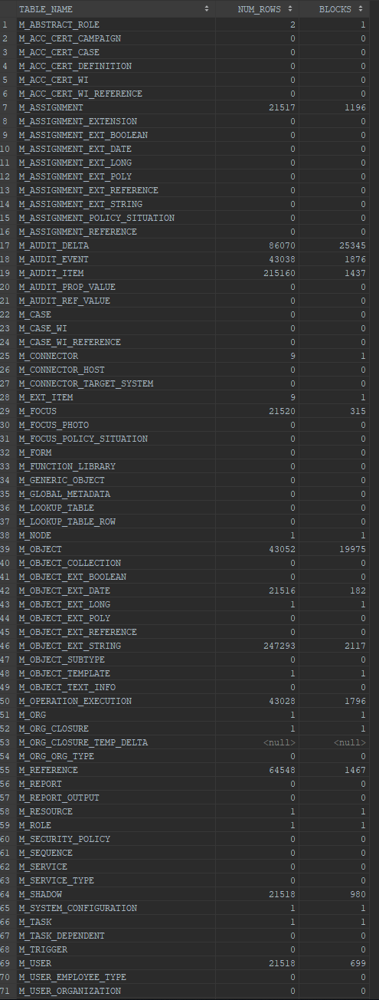

=== Performance

Let's run the import.

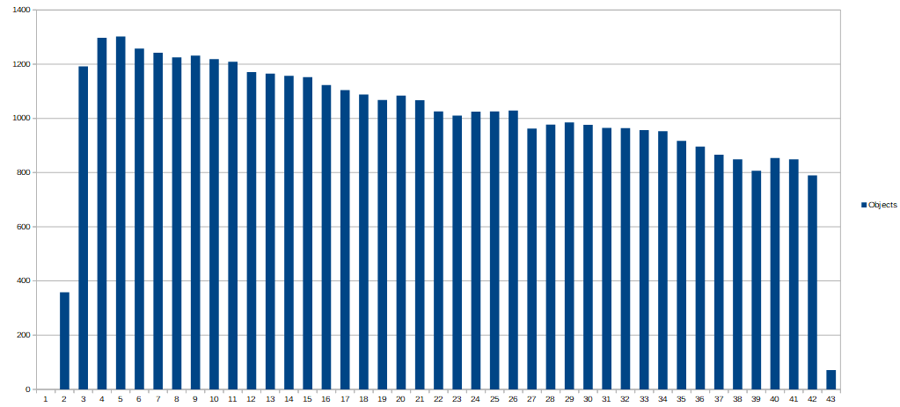

The performance degradation is there, although a bit less intense.

=== Slow queries

Slowest queries according to profiling logs:

Slowest queries according to the profiling logs (absolute counts are not relevant; they depend on how long the profiling run):

[%autowidth]
|===
| Category | SQL ID | Count 

| search-shadow-attr-OC-resource-not-dead.after-oid-null
| gf8u4pq1dzmrz
| 16

| search-shadow-attr-OC-resource.no-paging
| 8z9agnh1nyhk7
| 6

| search-shadow-attr-resource.no-paging
| bk2ms7acr0wmy
| 7

|===

This looks like everything went under 50 ms.
But why the slowdown?

Look at the searches in coordinator thread:

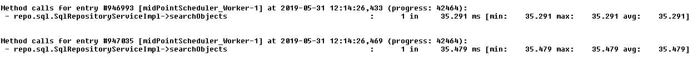

Although less than 50 ms, these numbers are still rather high.

Worker threads themselves looks OK:

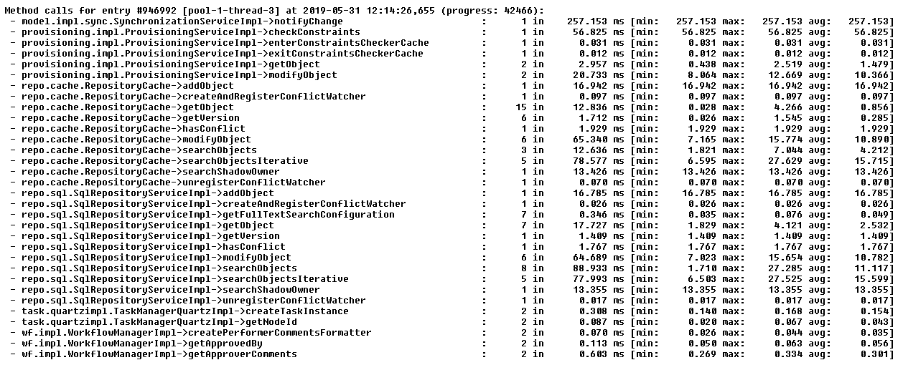

So, let us have a look at queries that took above 20 milliseconds:

[%autowidth]
|===
| Category | SQL ID | >= 50 ms | >= 20 ms 

| search-shadow-attr-OC-resource-not-dead.after-oid-null
| gf8u4pq1dzmrz
| 16
| 5485

| search-shadow-attr-OC-resource.no-paging
| 8z9agnh1nyhk7
| 6
| 2788

| search-shadow-attr-resource.no-paging
| bk2ms7acr0wmy
| 7
| 2808

|===

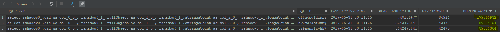

BUFFER\_GETS went down a bit, e.g. from 940M to 179M for the first query, but these numbers are still too high.

What about execution plans?

.Plan for gf8u4pq1dzmrz
[source]
----
SQL_ID  gf8u4pq1dzmrz, child number 0
-------------------------------------
select rshadow0_.oid as col_0_0_, rshadow0_1_.fullObject as col_1_0_, 
rshadow0_1_.stringsCount as col_2_0_, rshadow0_1_.longsCount as 
col_3_0_, rshadow0_1_.datesCount as col_4_0_, 
rshadow0_1_.referencesCount as col_5_0_, rshadow0_1_.polysCount as 
col_6_0_, rshadow0_1_.booleansCount as col_7_0_ from m_shadow rshadow0_ 
inner join m_object rshadow0_1_ on rshadow0_.oid=rshadow0_1_.oid left 
outer join m_object_ext_string strings1_ on 
rshadow0_.oid=strings1_.owner_oid and (strings1_.ownerType=:1  and 
strings1_.item_id=:2 ) where strings1_.stringValue=:3  and 
rshadow0_.objectClass=:4  and rshadow0_.resourceRef_targetOid=:5  and 
(rshadow0_.resourceRef_relation in (:6  , :7  , :8 )) and 
(rshadow0_.dead=:9  or rshadow0_.dead is null) order by 
NLSSORT(rshadow0_.oid, 'NLS_SORT=BINARY_AI') asc fetch first :10  rows 
only
 
Plan hash value: 748166677
 
---------------------------------------------------------------------------------------------------------
| Id  | Operation                         | Name                | Rows  | Bytes | Cost (%CPU)| Time     |
---------------------------------------------------------------------------------------------------------
|   0 | SELECT STATEMENT                  |                     |       |       |     8 (100)|          |
|   1 |  SORT ORDER BY                    |                     |     1 |  2750 |     8  (50)| 00:00:01 |
|*  2 |   VIEW                            |                     |     1 |  2750 |     7  (43)| 00:00:01 |
|*  3 |    WINDOW SORT PUSHED RANK        |                     |     1 |  2112 |     7  (43)| 00:00:01 |
|   4 |     NESTED LOOPS                  |                     |     1 |  2112 |     6  (34)| 00:00:01 |
|   5 |      NESTED LOOPS                 |                     |     1 |  2112 |     6  (34)| 00:00:01 |
|   6 |       NESTED LOOPS                |                     |     1 |   285 |     5  (40)| 00:00:01 |
|*  7 |        TABLE ACCESS FULL          | M_OBJECT_EXT_STRING |     1 |    52 |     4  (50)| 00:00:01 |
|*  8 |        TABLE ACCESS BY INDEX ROWID| M_SHADOW            |     1 |   233 |     1   (0)| 00:00:01 |
|*  9 |         INDEX UNIQUE SCAN         | SYS_C0015864        |     1 |       |     0   (0)|          |
|* 10 |       INDEX UNIQUE SCAN           | SYS_C0015815        |     1 |       |     0   (0)|          |
|  11 |      TABLE ACCESS BY INDEX ROWID  | M_OBJECT            |     1 |  1827 |     1   (0)| 00:00:01 |
---------------------------------------------------------------------------------------------------------
 
Query Block Name / Object Alias (identified by operation id):
-------------------------------------------------------------
 
   1 - SEL$4       
   2 - SEL$B4E2589B / from$_subquery$_006@SEL$4
   3 - SEL$B4E2589B
   7 - SEL$B4E2589B / STRINGS1_@SEL$2
   8 - SEL$B4E2589B / RSHADOW0_@SEL$1
   9 - SEL$B4E2589B / RSHADOW0_@SEL$1
  10 - SEL$B4E2589B / RSHADOW0_1_@SEL$1
  11 - SEL$B4E2589B / RSHADOW0_1_@SEL$1
 
Predicate Information (identified by operation id):
---------------------------------------------------
 
   2 - filter("from$_subquery$_006"."rowlimit_$$_rownumber"<=:10)
   3 - filter(ROW_NUMBER() OVER ( ORDER BY NLSSORT("RSHADOW0_"."OID",'nls_sort=''BINARY_AI'''))<=
              :10)
   7 - filter(("STRINGS1_"."ITEM_ID"=:2 AND "STRINGS1_"."STRINGVALUE"=:3 AND 
              "STRINGS1_"."OWNERTYPE"=:1))
   8 - filter(("RSHADOW0_"."OBJECTCLASS"=:4 AND "RSHADOW0_"."RESOURCEREF_TARGETOID"=:5 AND 
              INTERNAL_FUNCTION("RSHADOW0_"."RESOURCEREF_RELATION") AND ("RSHADOW0_"."DEAD" IS NULL OR 
              "RSHADOW0_"."DEAD"=:9)))
   9 - access("RSHADOW0_"."OID"="STRINGS1_"."OWNER_OID")
  10 - access("RSHADOW0_"."OID"="RSHADOW0_1_"."OID")
 
Column Projection Information (identified by operation id):
-----------------------------------------------------------
 
   1 - (#keys=1) "from$_subquery$_006"."rowlimit_$_0"[RAW,1162], 
       "from$_subquery$_006"."COL_0_0_"[VARCHAR2,144], "from$_subquery$_006"."COL_1_0_"[LOB,4000], 
       "from$_subquery$_006"."COL_2_0_"[NUMBER,22], "from$_subquery$_006"."COL_3_0_"[NUMBER,22], 
       "from$_subquery$_006"."COL_4_0_"[NUMBER,22], "from$_subquery$_006"."COL_5_0_"[NUMBER,22], 
       "from$_subquery$_006"."COL_6_0_"[NUMBER,22], "from$_subquery$_006"."COL_7_0_"[NUMBER,22]
   2 - "from$_subquery$_006"."COL_0_0_"[VARCHAR2,144], 
       "from$_subquery$_006"."COL_1_0_"[LOB,4000], "from$_subquery$_006"."COL_2_0_"[NUMBER,22], 
       "from$_subquery$_006"."COL_3_0_"[NUMBER,22], "from$_subquery$_006"."COL_4_0_"[NUMBER,22], 
       "from$_subquery$_006"."COL_5_0_"[NUMBER,22], "from$_subquery$_006"."COL_6_0_"[NUMBER,22], 
       "from$_subquery$_006"."COL_7_0_"[NUMBER,22], "from$_subquery$_006"."rowlimit_$_0"[RAW,1162], 
       "from$_subquery$_006"."rowlimit_$$_rownumber"[NUMBER,22]
   3 - (#keys=1) NLSSORT("RSHADOW0_"."OID",'nls_sort=''BINARY_AI''')[1162], 
       "STRINGS1_"."ITEM_ID"[NUMBER,22], "STRINGS1_"."OWNER_OID"[VARCHAR2,144], 
       "STRINGS1_"."OWNERTYPE"[NUMBER,22], "STRINGS1_"."STRINGVALUE"[VARCHAR2,1020], 
       "RSHADOW0_".ROWID[ROWID,10], "RSHADOW0_"."DEAD"[NUMBER,22], 
       "RSHADOW0_"."OBJECTCLASS"[VARCHAR2,628], "RSHADOW0_"."RESOURCEREF_RELATION"[VARCHAR2,628], 
       "RSHADOW0_"."RESOURCEREF_TARGETOID"[VARCHAR2,144], "RSHADOW0_"."OID"[VARCHAR2,144], 
       "RSHADOW0_1_".ROWID[ROWID,10], "RSHADOW0_1_"."OID"[VARCHAR2,144], 
       "RSHADOW0_1_"."BOOLEANSCOUNT"[NUMBER,22], "RSHADOW0_1_"."DATESCOUNT"[NUMBER,22], 
       "RSHADOW0_1_"."FULLOBJECT"[LOB,4000], "RSHADOW0_1_"."LONGSCOUNT"[NUMBER,22], 
       "RSHADOW0_1_"."POLYSCOUNT"[NUMBER,22], "RSHADOW0_1_"."REFERENCESCOUNT"[NUMBER,22], 
       "RSHADOW0_1_"."STRINGSCOUNT"[NUMBER,22], ROW_NUMBER() OVER ( ORDER BY 
       NLSSORT("RSHADOW0_"."OID",'nls_sort=''BINARY_AI'''))[22]
   4 - "STRINGS1_"."ITEM_ID"[NUMBER,22], "STRINGS1_"."OWNER_OID"[VARCHAR2,144], 
       "STRINGS1_"."OWNERTYPE"[NUMBER,22], "STRINGS1_"."STRINGVALUE"[VARCHAR2,1020], 
       "RSHADOW0_".ROWID[ROWID,10], "RSHADOW0_"."DEAD"[NUMBER,22], 
       "RSHADOW0_"."OBJECTCLASS"[VARCHAR2,628], "RSHADOW0_"."RESOURCEREF_RELATION"[VARCHAR2,628], 
       "RSHADOW0_"."RESOURCEREF_TARGETOID"[VARCHAR2,144], "RSHADOW0_"."OID"[VARCHAR2,144], 
       "RSHADOW0_1_".ROWID[ROWID,10], "RSHADOW0_1_"."OID"[VARCHAR2,144], 
       "RSHADOW0_1_"."BOOLEANSCOUNT"[NUMBER,22], "RSHADOW0_1_"."DATESCOUNT"[NUMBER,22], 
       "RSHADOW0_1_"."FULLOBJECT"[LOB,4000], "RSHADOW0_1_"."LONGSCOUNT"[NUMBER,22], 
       "RSHADOW0_1_"."POLYSCOUNT"[NUMBER,22], "RSHADOW0_1_"."REFERENCESCOUNT"[NUMBER,22], 
       "RSHADOW0_1_"."STRINGSCOUNT"[NUMBER,22]
   5 - "STRINGS1_"."ITEM_ID"[NUMBER,22], "STRINGS1_"."OWNER_OID"[VARCHAR2,144], 
       "STRINGS1_"."OWNERTYPE"[NUMBER,22], "STRINGS1_"."STRINGVALUE"[VARCHAR2,1020], 
       "RSHADOW0_".ROWID[ROWID,10], "RSHADOW0_"."DEAD"[NUMBER,22], 
       "RSHADOW0_"."OBJECTCLASS"[VARCHAR2,628], "RSHADOW0_"."RESOURCEREF_RELATION"[VARCHAR2,628], 
       "RSHADOW0_"."RESOURCEREF_TARGETOID"[VARCHAR2,144], "RSHADOW0_"."OID"[VARCHAR2,144], 
       "RSHADOW0_1_".ROWID[ROWID,10], "RSHADOW0_1_"."OID"[VARCHAR2,144]
   6 - "STRINGS1_"."ITEM_ID"[NUMBER,22], "STRINGS1_"."OWNER_OID"[VARCHAR2,144], 
       "STRINGS1_"."OWNERTYPE"[NUMBER,22], "STRINGS1_"."STRINGVALUE"[VARCHAR2,1020], 
       "RSHADOW0_".ROWID[ROWID,10], "RSHADOW0_"."DEAD"[NUMBER,22], 
       "RSHADOW0_"."OBJECTCLASS"[VARCHAR2,628], "RSHADOW0_"."RESOURCEREF_RELATION"[VARCHAR2,628], 
       "RSHADOW0_"."RESOURCEREF_TARGETOID"[VARCHAR2,144], "RSHADOW0_"."OID"[VARCHAR2,144]
   7 - "STRINGS1_"."ITEM_ID"[NUMBER,22], "STRINGS1_"."OWNER_OID"[VARCHAR2,144], 
       "STRINGS1_"."OWNERTYPE"[NUMBER,22], "STRINGS1_"."STRINGVALUE"[VARCHAR2,1020]
   8 - "RSHADOW0_".ROWID[ROWID,10], "RSHADOW0_"."DEAD"[NUMBER,22], 
       "RSHADOW0_"."OBJECTCLASS"[VARCHAR2,628], "RSHADOW0_"."RESOURCEREF_RELATION"[VARCHAR2,628], 
       "RSHADOW0_"."RESOURCEREF_TARGETOID"[VARCHAR2,144], "RSHADOW0_"."OID"[VARCHAR2,144]
   9 - "RSHADOW0_".ROWID[ROWID,10], "RSHADOW0_"."OID"[VARCHAR2,144]
  10 - "RSHADOW0_1_".ROWID[ROWID,10], "RSHADOW0_1_"."OID"[VARCHAR2,144]
  11 - "RSHADOW0_1_".ROWID[ROWID,10], "RSHADOW0_1_"."BOOLEANSCOUNT"[NUMBER,22], 
       "RSHADOW0_1_"."DATESCOUNT"[NUMBER,22], "RSHADOW0_1_"."FULLOBJECT"[LOB,4000], 
       "RSHADOW0_1_"."LONGSCOUNT"[NUMBER,22], "RSHADOW0_1_"."POLYSCOUNT"[NUMBER,22], 
       "RSHADOW0_1_"."REFERENCESCOUNT"[NUMBER,22], "RSHADOW0_1_"."STRINGSCOUNT"[NUMBER,22]
----

 +

.Plan for bk2ms7acr0wmy
[source]
----
SQL_ID  bk2ms7acr0wmy, child number 0
-------------------------------------
select rshadow0_.oid as col_0_0_, rshadow0_1_.fullObject as col_1_0_, 
rshadow0_1_.stringsCount as col_2_0_, rshadow0_1_.longsCount as 
col_3_0_, rshadow0_1_.datesCount as col_4_0_, 
rshadow0_1_.referencesCount as col_5_0_, rshadow0_1_.polysCount as 
col_6_0_, rshadow0_1_.booleansCount as col_7_0_ from m_shadow rshadow0_ 
inner join m_object rshadow0_1_ on rshadow0_.oid=rshadow0_1_.oid left 
outer join m_object_ext_string strings1_ on 
rshadow0_.oid=strings1_.owner_oid and (strings1_.ownerType=:1  and 
strings1_.item_id=:2 ) where strings1_.stringValue=:3  and 
rshadow0_.resourceRef_targetOid=:4  and (rshadow0_.resourceRef_relation 
in (:5  , :6  , :7 ))
 
Plan hash value: 3342493841
 
------------------------------------------------------------------------------------------------------
| Id  | Operation                      | Name                | Rows  | Bytes | Cost (%CPU)| Time     |
------------------------------------------------------------------------------------------------------
|   0 | SELECT STATEMENT               |                     |       |       |     6 (100)|          |
|   1 |  NESTED LOOPS                  |                     |     1 |  2017 |     6  (34)| 00:00:01 |
|   2 |   NESTED LOOPS                 |                     |     1 |  2017 |     6  (34)| 00:00:01 |
|   3 |    NESTED LOOPS                |                     |     1 |   190 |     5  (40)| 00:00:01 |
|*  4 |     TABLE ACCESS FULL          | M_OBJECT_EXT_STRING |     1 |    52 |     4  (50)| 00:00:01 |
|*  5 |     TABLE ACCESS BY INDEX ROWID| M_SHADOW            |     1 |   138 |     1   (0)| 00:00:01 |
|*  6 |      INDEX UNIQUE SCAN         | SYS_C0015864        |     1 |       |     0   (0)|          |
|*  7 |    INDEX UNIQUE SCAN           | SYS_C0015815        |     1 |       |     0   (0)|          |
|   8 |   TABLE ACCESS BY INDEX ROWID  | M_OBJECT            |     1 |  1827 |     1   (0)| 00:00:01 |
------------------------------------------------------------------------------------------------------
 
Query Block Name / Object Alias (identified by operation id):
-------------------------------------------------------------
 
   1 - SEL$B4E2589B
   4 - SEL$B4E2589B / STRINGS1_@SEL$2
   5 - SEL$B4E2589B / RSHADOW0_@SEL$1
   6 - SEL$B4E2589B / RSHADOW0_@SEL$1
   7 - SEL$B4E2589B / RSHADOW0_1_@SEL$1
   8 - SEL$B4E2589B / RSHADOW0_1_@SEL$1
 
Predicate Information (identified by operation id):
---------------------------------------------------
 
   4 - filter(("STRINGS1_"."ITEM_ID"=:2 AND "STRINGS1_"."STRINGVALUE"=:3 AND 
              "STRINGS1_"."OWNERTYPE"=:1))
   5 - filter(("RSHADOW0_"."RESOURCEREF_TARGETOID"=:4 AND 
              INTERNAL_FUNCTION("RSHADOW0_"."RESOURCEREF_RELATION")))
   6 - access("RSHADOW0_"."OID"="STRINGS1_"."OWNER_OID")
   7 - access("RSHADOW0_"."OID"="RSHADOW0_1_"."OID")
 
Column Projection Information (identified by operation id):
-----------------------------------------------------------
 
   1 - "RSHADOW0_"."OID"[VARCHAR2,144], "RSHADOW0_1_"."BOOLEANSCOUNT"[NUMBER,22], 
       "RSHADOW0_1_"."DATESCOUNT"[NUMBER,22], "RSHADOW0_1_"."FULLOBJECT"[LOB,4000], 
       "RSHADOW0_1_"."LONGSCOUNT"[NUMBER,22], "RSHADOW0_1_"."POLYSCOUNT"[NUMBER,22], 
       "RSHADOW0_1_"."REFERENCESCOUNT"[NUMBER,22], "RSHADOW0_1_"."STRINGSCOUNT"[NUMBER,22]
   2 - "RSHADOW0_"."OID"[VARCHAR2,144], "RSHADOW0_1_".ROWID[ROWID,10]
   3 - "RSHADOW0_"."OID"[VARCHAR2,144]
   4 - "STRINGS1_"."OWNER_OID"[VARCHAR2,144]
   5 - "RSHADOW0_"."OID"[VARCHAR2,144]
   6 - "RSHADOW0_".ROWID[ROWID,10], "RSHADOW0_"."OID"[VARCHAR2,144]
   7 - "RSHADOW0_1_".ROWID[ROWID,10]
   8 - "RSHADOW0_1_"."BOOLEANSCOUNT"[NUMBER,22], "RSHADOW0_1_"."DATESCOUNT"[NUMBER,22], 
       "RSHADOW0_1_"."FULLOBJECT"[LOB,4000], "RSHADOW0_1_"."LONGSCOUNT"[NUMBER,22], 
       "RSHADOW0_1_"."POLYSCOUNT"[NUMBER,22], "RSHADOW0_1_"."REFERENCESCOUNT"[NUMBER,22], 
       "RSHADOW0_1_"."STRINGSCOUNT"[NUMBER,22]
----

 +

.Plan for 8z9agnh1nyhk7
[source]
----
SQL_ID  8z9agnh1nyhk7, child number 0
-------------------------------------
select rshadow0_.oid as col_0_0_, rshadow0_1_.fullObject as col_1_0_, 
rshadow0_1_.stringsCount as col_2_0_, rshadow0_1_.longsCount as 
col_3_0_, rshadow0_1_.datesCount as col_4_0_, 
rshadow0_1_.referencesCount as col_5_0_, rshadow0_1_.polysCount as 
col_6_0_, rshadow0_1_.booleansCount as col_7_0_ from m_shadow rshadow0_ 
inner join m_object rshadow0_1_ on rshadow0_.oid=rshadow0_1_.oid left 
outer join m_object_ext_string strings1_ on 
rshadow0_.oid=strings1_.owner_oid and (strings1_.ownerType=:1  and 
strings1_.item_id=:2 ) where strings1_.stringValue=:3  and 
rshadow0_.objectClass=:4  and rshadow0_.resourceRef_targetOid=:5  and 
(rshadow0_.resourceRef_relation in (:6  , :7  , :8 ))
 
Plan hash value: 3342493841
 
------------------------------------------------------------------------------------------------------
| Id  | Operation                      | Name                | Rows  | Bytes | Cost (%CPU)| Time     |
------------------------------------------------------------------------------------------------------
|   0 | SELECT STATEMENT               |                     |       |       |     6 (100)|          |
|   1 |  NESTED LOOPS                  |                     |     1 |  2099 |     6  (34)| 00:00:01 |
|   2 |   NESTED LOOPS                 |                     |     1 |  2099 |     6  (34)| 00:00:01 |
|   3 |    NESTED LOOPS                |                     |     1 |   272 |     5  (40)| 00:00:01 |
|*  4 |     TABLE ACCESS FULL          | M_OBJECT_EXT_STRING |     1 |    52 |     4  (50)| 00:00:01 |
|*  5 |     TABLE ACCESS BY INDEX ROWID| M_SHADOW            |     1 |   220 |     1   (0)| 00:00:01 |
|*  6 |      INDEX UNIQUE SCAN         | SYS_C0015864        |     1 |       |     0   (0)|          |
|*  7 |    INDEX UNIQUE SCAN           | SYS_C0015815        |     1 |       |     0   (0)|          |
|   8 |   TABLE ACCESS BY INDEX ROWID  | M_OBJECT            |     1 |  1827 |     1   (0)| 00:00:01 |
------------------------------------------------------------------------------------------------------
 
Query Block Name / Object Alias (identified by operation id):
-------------------------------------------------------------
 
   1 - SEL$B4E2589B
   4 - SEL$B4E2589B / STRINGS1_@SEL$2
   5 - SEL$B4E2589B / RSHADOW0_@SEL$1
   6 - SEL$B4E2589B / RSHADOW0_@SEL$1
   7 - SEL$B4E2589B / RSHADOW0_1_@SEL$1
   8 - SEL$B4E2589B / RSHADOW0_1_@SEL$1
 
Predicate Information (identified by operation id):
---------------------------------------------------
 
   4 - filter(("STRINGS1_"."ITEM_ID"=:2 AND "STRINGS1_"."STRINGVALUE"=:3 AND 
              "STRINGS1_"."OWNERTYPE"=:1))
   5 - filter(("RSHADOW0_"."OBJECTCLASS"=:4 AND "RSHADOW0_"."RESOURCEREF_TARGETOID"=:5 AND 
              INTERNAL_FUNCTION("RSHADOW0_"."RESOURCEREF_RELATION")))
   6 - access("RSHADOW0_"."OID"="STRINGS1_"."OWNER_OID")
   7 - access("RSHADOW0_"."OID"="RSHADOW0_1_"."OID")
 
Column Projection Information (identified by operation id):
-----------------------------------------------------------
 
   1 - "RSHADOW0_"."OID"[VARCHAR2,144], "RSHADOW0_1_"."BOOLEANSCOUNT"[NUMBER,22], 
       "RSHADOW0_1_"."DATESCOUNT"[NUMBER,22], "RSHADOW0_1_"."FULLOBJECT"[LOB,4000], 
       "RSHADOW0_1_"."LONGSCOUNT"[NUMBER,22], "RSHADOW0_1_"."POLYSCOUNT"[NUMBER,22], 
       "RSHADOW0_1_"."REFERENCESCOUNT"[NUMBER,22], "RSHADOW0_1_"."STRINGSCOUNT"[NUMBER,22]
   2 - "RSHADOW0_"."OID"[VARCHAR2,144], "RSHADOW0_1_".ROWID[ROWID,10]
   3 - "RSHADOW0_"."OID"[VARCHAR2,144]
   4 - "STRINGS1_"."OWNER_OID"[VARCHAR2,144]
   5 - "RSHADOW0_"."OID"[VARCHAR2,144]
   6 - "RSHADOW0_".ROWID[ROWID,10], "RSHADOW0_"."OID"[VARCHAR2,144]
   7 - "RSHADOW0_1_".ROWID[ROWID,10]
   8 - "RSHADOW0_1_"."BOOLEANSCOUNT"[NUMBER,22], "RSHADOW0_1_"."DATESCOUNT"[NUMBER,22], 
       "RSHADOW0_1_"."FULLOBJECT"[LOB,4000], "RSHADOW0_1_"."LONGSCOUNT"[NUMBER,22], 
       "RSHADOW0_1_"."POLYSCOUNT"[NUMBER,22], "RSHADOW0_1_"."REFERENCESCOUNT"[NUMBER,22], 
       "RSHADOW0_1_"."STRINGSCOUNT"[NUMBER,22]

----

`TABLE ACCESS FULL`  on `M_OBJECT_EXT_STRING`  looks bad.

I will continue on Monday.

== Run 3: Statistics updated and locked down + flushing shared pool during import (Mon Jun 03 11:51:14 CEST 2019)

=== Setup

Statistics were locked at the same values as in Run 2.

There were two differences:

First,

[source,sql]
----
alter system set statistics_level=all;
----

was run before the import started.

But second one is perhaps more important.
On 12:02:32, i.e approximately 11 minutes after the import task was started, the following statement was issued:

[source,sql]
----
alter system flush shared_pool
----

It cleared - among others - cached plans for queried, including the ineffective ones.

=== Performance

Objects per minute processed:

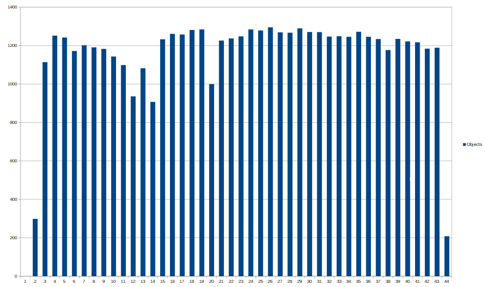

=== Slow queries

Before the shared pool flush, the execution plans for "search shadow" queries were the same as in previous runs.
The number of slow queries was like this:

[%autowidth]
|===
| Category | SQL ID | >= 20 ms 

| search-shadow-attr-OC-resource-not-dead.after-oid-null
| gf8u4pq1dzmrz
| 130

| search-shadow-attr-OC-resource.no-paging
| 8z9agnh1nyhk7
| 68

| search-shadow-attr-resource.no-paging
| bk2ms7acr0wmy
| 47

| search-user
|  +

| 47

| searchShadowOwner
|  +

| 12

|===

After the shared pool flush, the execution plans for "search shadow" queries changed; and the number of slow queries was like this:

[%autowidth]
|===
| Category | SQL ID | >= 20 ms 

| search-shadow-attr-OC-resource-not-dead.after-oid-null
| gf8u4pq1dzmrz
| 5

| search-shadow-attr-resource.no-paging
| bk2ms7acr0wmy
| 1

| search-user
|  +

| 101

| searchShadowOwner
|  +

| 2

|===

We can see that "search shadow" queries were fixed.
Overall, the searches were not that slow at all:

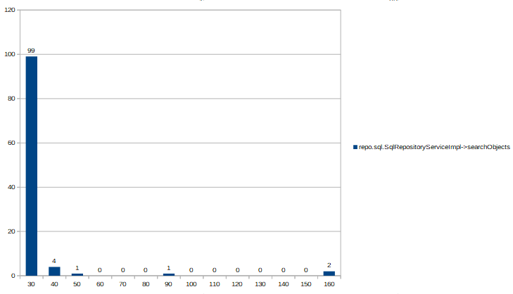

Majority of them (99 out of 107 - searchShadowOwner is a separate category) were under 30 milliseconds.

Only 8 operations are over 30 milliseconds.

Many of the search-user operations are suspicious:

[source]
----
2019-06-03 12:32:21,193 [pool-1-thread-2] searchObjects(UserType, Q{EQUAL: name,,null paging, null, R(...))
2019-06-03 12:26:44,375 [pool-1-thread-1] searchObjects(UserType, Q{EQUAL: name,,null paging, null, R(...))
...
----

They look for objects with a null name; i.e. something that simply cannot exist.
We will have a look at this.
But it's a minor problem for now.

== Run 4: Back to normal settings + flushing shared pool during import (Mon Jun 03 16:48:36 CEST 2019)

=== Setup

We unlocked the table statistics and recomputed them.
We also set `statistics_level`  back to `typical`. During the execution (again, about after 10 minutes of work) we again flushed the shared pool.

[source,sql]
----
BEGIN
    FOR cur IN (SELECT
                    table_name
                FROM user_tables WHERE LOWER(table_name) LIKE 'm\_%' ESCAPE '\') LOOP
        BEGIN
            DBMS_STATS.UNLOCK_TABLE_STATS('SYSTEM', cur.table_name);
        END;
    END LOOP;
END;

alter system set statistics_level=typical;

BEGIN
    dbms_stats.gather_schema_stats('SYSTEM');
END;

select table_name, num_rows, blocks from user_tables where table_name LIKE 'M\_%' ESCAPE '\' ;
select statistics_name, session_status, system_status, activation_level, session_settable from v$statistics_level order by statistics_name;
----

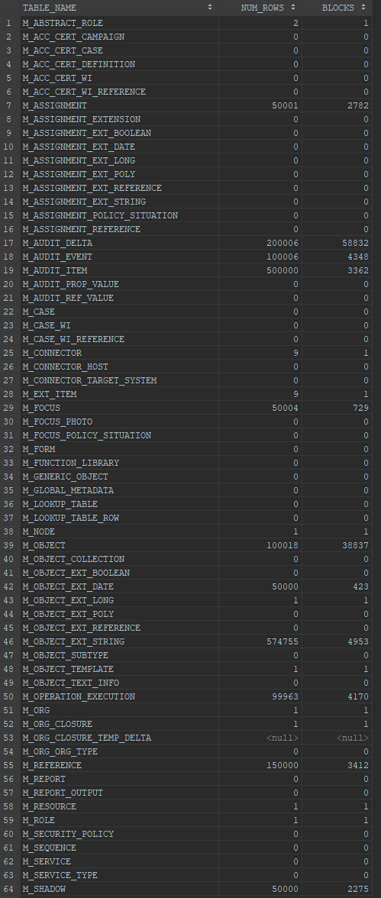

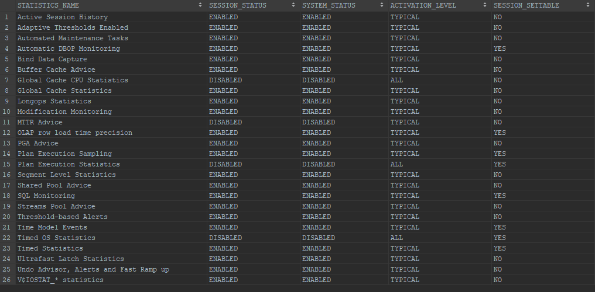

During the import we flushed the shared pool:

[source]
----
sql> alter system flush shared_pool

[2019-06-03 16:56:30] completed in 186 ms
----

=== Performance

Looks good:

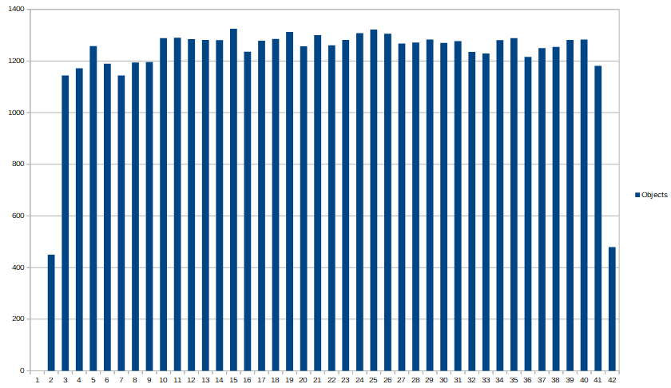

=== Slow queries

Before flush:

[%autowidth]
|===
| Category | SQL ID | >= 20 ms 

| search-user
|  +

| 9

| search-shadow-attr-OC-resource-not-dead.after-oid-null
| gf8u4pq1dzmrz
| 5

| search-shadow-attr-resource.no-paging
| bk2ms7acr0wmy
| 3

| search-shadow-attr-OC-resource.no-paging
| 8z9agnh1nyhk7
| 2

| searchShadowOwner
|  +

| 1

|===

After flush:

[%autowidth]
|===
| Category | SQL ID | >= 20 ms 

| search-user
|  +

| 75

| search-shadow-attr-OC-resource-not-dead.after-oid-null
| gf8u4pq1dzmrz
| 2

| search-shadow-attr-OC-resource.no-paging
| 8z9agnh1nyhk7
| 1

| searchShadowOwner
|  +

| 1

|===

This looks quite good as well.

All except 4 operations are under 30 milliseconds.

Again, many of these search operations are "get user with null name" ones.
These will be removed, see bug:MID-5402[].

=== Notes

These operations were the ones that took the most buffer reads before the flush:

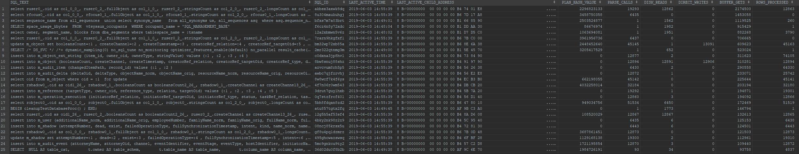

The plans:

.Plan for akbsx3axwk8dq
[source]
----
SQL_ID  akbsx3axwk8dq, child number 0
-------------------------------------
select ruser0_.oid as col_0_0_, ruser0_2_.fullObject as col_1_0_, 
ruser0_2_.stringsCount as col_2_0_, ruser0_2_.longsCount as col_3_0_, 
ruser0_2_.datesCount as col_4_0_, ruser0_2_.referencesCount as 
col_5_0_, ruser0_2_.polysCount as col_6_0_, ruser0_2_.booleansCount as 
col_7_0_ from m_user ruser0_ inner join m_focus ruser0_1_ on 
ruser0_.oid=ruser0_1_.oid inner join m_object ruser0_2_ on 
ruser0_.oid=ruser0_2_.oid where ruser0_.employeeNumber=:1  order by 
NLSSORT(ruser0_.oid, 'NLS_SORT=BINARY_AI') asc fetch first :2  rows only
 
Plan hash value: 2296823133
 
------------------------------------------------------------------------------------------------
| Id  | Operation                       | Name         | Rows  | Bytes | Cost (%CPU)| Time     |
------------------------------------------------------------------------------------------------
|   0 | SELECT STATEMENT                |              |       |       |     6 (100)|          |
|   1 |  SORT ORDER BY                  |              |     1 |  2750 |     6  (34)| 00:00:01 |
|*  2 |   VIEW                          |              |     1 |  2750 |     5  (20)| 00:00:01 |
|*  3 |    WINDOW SORT PUSHED RANK      |              |     1 |  1875 |     5  (20)| 00:00:01 |
|   4 |     NESTED LOOPS                |              |     1 |  1875 |     4   (0)| 00:00:01 |
|   5 |      NESTED LOOPS               |              |     1 |  1875 |     4   (0)| 00:00:01 |
|*  6 |       TABLE ACCESS FULL         | M_USER       |     1 |    48 |     2   (0)| 00:00:01 |
|*  7 |       INDEX UNIQUE SCAN         | SYS_C0015815 |     1 |       |     1   (0)| 00:00:01 |
|   8 |      TABLE ACCESS BY INDEX ROWID| M_OBJECT     |     1 |  1827 |     2   (0)| 00:00:01 |
------------------------------------------------------------------------------------------------
 
Query Block Name / Object Alias (identified by operation id):
-------------------------------------------------------------
 
   1 - SEL$4       
   2 - SEL$C7DBA280 / from$_subquery$_006@SEL$4
   3 - SEL$C7DBA280
   6 - SEL$C7DBA280 / RUSER0_@SEL$1
   7 - SEL$C7DBA280 / RUSER0_2_@SEL$2
   8 - SEL$C7DBA280 / RUSER0_2_@SEL$2
 
Predicate Information (identified by operation id):
---------------------------------------------------
 
   2 - filter("from$_subquery$_006"."rowlimit_$$_rownumber"<=:2)
   3 - filter(ROW_NUMBER() OVER ( ORDER BY NLSSORT("RUSER0_"."OID",'nls_sort=''BINARY_AI
              '''))<=:2)
   6 - filter("RUSER0_"."EMPLOYEENUMBER"=:1)
   7 - access("RUSER0_"."OID"="RUSER0_2_"."OID")
 
Column Projection Information (identified by operation id):
-----------------------------------------------------------
 
   1 - (#keys=1) "from$_subquery$_006"."rowlimit_$_0"[RAW,1162], 
       "from$_subquery$_006"."COL_0_0_"[VARCHAR2,144], 
       "from$_subquery$_006"."COL_1_0_"[LOB,4000], 
       "from$_subquery$_006"."COL_2_0_"[NUMBER,22], 
       "from$_subquery$_006"."COL_3_0_"[NUMBER,22], 
       "from$_subquery$_006"."COL_4_0_"[NUMBER,22], 
       "from$_subquery$_006"."COL_5_0_"[NUMBER,22], 
       "from$_subquery$_006"."COL_6_0_"[NUMBER,22], "from$_subquery$_006"."COL_7_0_"[NUMBER,22]
   2 - "from$_subquery$_006"."COL_0_0_"[VARCHAR2,144], 
       "from$_subquery$_006"."COL_1_0_"[LOB,4000], 
       "from$_subquery$_006"."COL_2_0_"[NUMBER,22], 
       "from$_subquery$_006"."COL_3_0_"[NUMBER,22], 
       "from$_subquery$_006"."COL_4_0_"[NUMBER,22], 
       "from$_subquery$_006"."COL_5_0_"[NUMBER,22], 
       "from$_subquery$_006"."COL_6_0_"[NUMBER,22], 
       "from$_subquery$_006"."COL_7_0_"[NUMBER,22], 
       "from$_subquery$_006"."rowlimit_$_0"[RAW,1162], 
       "from$_subquery$_006"."rowlimit_$$_rownumber"[NUMBER,22]
   3 - (#keys=1) NLSSORT("RUSER0_"."OID",'nls_sort=''BINARY_AI''')[1162], 
       "RUSER0_"."EMPLOYEENUMBER"[VARCHAR2,1020], "RUSER0_"."OID"[VARCHAR2,144], 
       "RUSER0_2_".ROWID[ROWID,10], "RUSER0_2_"."OID"[VARCHAR2,144], 
       "RUSER0_2_"."BOOLEANSCOUNT"[NUMBER,22], "RUSER0_2_"."DATESCOUNT"[NUMBER,22], 
       "RUSER0_2_"."FULLOBJECT"[LOB,4000], "RUSER0_2_"."LONGSCOUNT"[NUMBER,22], 
       "RUSER0_2_"."POLYSCOUNT"[NUMBER,22], "RUSER0_2_"."REFERENCESCOUNT"[NUMBER,22], 
       "RUSER0_2_"."STRINGSCOUNT"[NUMBER,22], ROW_NUMBER() OVER ( ORDER BY 
       NLSSORT("RUSER0_"."OID",'nls_sort=''BINARY_AI'''))[22]
   4 - "RUSER0_"."EMPLOYEENUMBER"[VARCHAR2,1020], "RUSER0_"."OID"[VARCHAR2,144], 
       "RUSER0_2_".ROWID[ROWID,10], "RUSER0_2_"."OID"[VARCHAR2,144], 
       "RUSER0_2_"."BOOLEANSCOUNT"[NUMBER,22], "RUSER0_2_"."DATESCOUNT"[NUMBER,22], 
       "RUSER0_2_"."FULLOBJECT"[LOB,4000], "RUSER0_2_"."LONGSCOUNT"[NUMBER,22], 
       "RUSER0_2_"."POLYSCOUNT"[NUMBER,22], "RUSER0_2_"."REFERENCESCOUNT"[NUMBER,22], 
       "RUSER0_2_"."STRINGSCOUNT"[NUMBER,22]
   5 - "RUSER0_"."EMPLOYEENUMBER"[VARCHAR2,1020], "RUSER0_"."OID"[VARCHAR2,144], 
       "RUSER0_2_".ROWID[ROWID,10], "RUSER0_2_"."OID"[VARCHAR2,144]
   6 - "RUSER0_"."EMPLOYEENUMBER"[VARCHAR2,1020], "RUSER0_"."OID"[VARCHAR2,144]
   7 - "RUSER0_2_".ROWID[ROWID,10], "RUSER0_2_"."OID"[VARCHAR2,144]
   8 - "RUSER0_2_".ROWID[ROWID,10], "RUSER0_2_"."BOOLEANSCOUNT"[NUMBER,22], 
       "RUSER0_2_"."DATESCOUNT"[NUMBER,22], "RUSER0_2_"."FULLOBJECT"[LOB,4000], 
       "RUSER0_2_"."LONGSCOUNT"[NUMBER,22], "RUSER0_2_"."POLYSCOUNT"[NUMBER,22], 
       "RUSER0_2_"."REFERENCESCOUNT"[NUMBER,22], "RUSER0_2_"."STRINGSCOUNT"[NUMBER,22]

----

 +

.Plan for 8u304maukuhgj
[source]
----
SQL_ID  8u304maukuhgj, child number 0
-------------------------------------
select rfocus0_.oid as col_0_0_, rfocus0_1_.fullObject as col_1_0_, 
rfocus0_1_.stringsCount as col_2_0_, rfocus0_1_.longsCount as col_3_0_, 
rfocus0_1_.datesCount as col_4_0_, rfocus0_1_.referencesCount as 
col_5_0_, rfocus0_1_.polysCount as col_6_0_, rfocus0_1_.booleansCount 
as col_7_0_ from m_focus rfocus0_ inner join m_object rfocus0_1_ on 
rfocus0_.oid=rfocus0_1_.oid left outer join m_reference linkref1_ on 
rfocus0_.oid=linkref1_.owner_oid and ( linkref1_.reference_type= 1) 
where linkref1_.targetOid=:1
 
Plan hash value: 3458750358
 
---------------------------------------------------------------------------------------------
| Id  | Operation                    | Name         | Rows  | Bytes | Cost (%CPU)| Time     |
---------------------------------------------------------------------------------------------
|   0 | SELECT STATEMENT             |              |       |       |     5 (100)|          |
|   1 |  NESTED LOOPS                |              |     1 |  1941 |     5  (20)| 00:00:01 |
|   2 |   NESTED LOOPS               |              |     1 |  1941 |     5  (20)| 00:00:01 |
|   3 |    NESTED LOOPS              |              |     1 |   114 |     3  (34)| 00:00:01 |
|*  4 |     TABLE ACCESS FULL        | M_REFERENCE  |     1 |    77 |     3  (34)| 00:00:01 |
|*  5 |     INDEX UNIQUE SCAN        | SYS_C0015881 |     1 |    37 |     0   (0)|          |
|*  6 |    INDEX UNIQUE SCAN         | SYS_C0015815 |     1 |       |     1   (0)| 00:00:01 |
|   7 |   TABLE ACCESS BY INDEX ROWID| M_OBJECT     |     1 |  1827 |     2   (0)| 00:00:01 |
---------------------------------------------------------------------------------------------
 
Query Block Name / Object Alias (identified by operation id):
-------------------------------------------------------------
 
   1 - SEL$8DE4227D
   4 - SEL$8DE4227D / LINKREF1_@SEL$2
   5 - SEL$8DE4227D / RFOCUS0_@SEL$1
   6 - SEL$8DE4227D / RFOCUS0_1_@SEL$1
   7 - SEL$8DE4227D / RFOCUS0_1_@SEL$1
 
Predicate Information (identified by operation id):
---------------------------------------------------
 
   4 - filter(("LINKREF1_"."TARGETOID"=:1 AND "LINKREF1_"."REFERENCE_TYPE"=1))
   5 - access("RFOCUS0_"."OID"="LINKREF1_"."OWNER_OID")
   6 - access("RFOCUS0_"."OID"="RFOCUS0_1_"."OID")
 
Column Projection Information (identified by operation id):
-----------------------------------------------------------
 
   1 - "RFOCUS0_"."OID"[VARCHAR2,144], "RFOCUS0_1_"."BOOLEANSCOUNT"[NUMBER,22], 
       "RFOCUS0_1_"."DATESCOUNT"[NUMBER,22], "RFOCUS0_1_"."FULLOBJECT"[LOB,4000], 
       "RFOCUS0_1_"."LONGSCOUNT"[NUMBER,22], "RFOCUS0_1_"."POLYSCOUNT"[NUMBER,22], 
       "RFOCUS0_1_"."REFERENCESCOUNT"[NUMBER,22], "RFOCUS0_1_"."STRINGSCOUNT"[NUMBER,22]
   2 - "RFOCUS0_"."OID"[VARCHAR2,144], "RFOCUS0_1_".ROWID[ROWID,10]
   3 - "RFOCUS0_"."OID"[VARCHAR2,144]
   4 - "LINKREF1_"."OWNER_OID"[VARCHAR2,144]
   5 - "RFOCUS0_"."OID"[VARCHAR2,144]
   6 - "RFOCUS0_1_".ROWID[ROWID,10]
   7 - "RFOCUS0_1_"."BOOLEANSCOUNT"[NUMBER,22], 
       "RFOCUS0_1_"."DATESCOUNT"[NUMBER,22], "RFOCUS0_1_"."FULLOBJECT"[LOB,4000], 
       "RFOCUS0_1_"."LONGSCOUNT"[NUMBER,22], "RFOCUS0_1_"."POLYSCOUNT"[NUMBER,22], 
       "RFOCUS0_1_"."REFERENCESCOUNT"[NUMBER,22], "RFOCUS0_1_"."STRINGSCOUNT"[NUMBER,22]

----

We see TABLE ACCESS FULL actions there.

Our traditional "search shadow" operations that were suboptimal during earlier runs are now OK even before the flush:

.Plan for bk2ms7acr0wmy
[source]
----
SQL_ID  bk2ms7acr0wmy, child number 0
-------------------------------------
select rshadow0_.oid as col_0_0_, rshadow0_1_.fullObject as col_1_0_, 
rshadow0_1_.stringsCount as col_2_0_, rshadow0_1_.longsCount as 
col_3_0_, rshadow0_1_.datesCount as col_4_0_, 
rshadow0_1_.referencesCount as col_5_0_, rshadow0_1_.polysCount as 
col_6_0_, rshadow0_1_.booleansCount as col_7_0_ from m_shadow rshadow0_ 
inner join m_object rshadow0_1_ on rshadow0_.oid=rshadow0_1_.oid left 
outer join m_object_ext_string strings1_ on 
rshadow0_.oid=strings1_.owner_oid and (strings1_.ownerType=:1  and 
strings1_.item_id=:2 ) where strings1_.stringValue=:3  and 
rshadow0_.resourceRef_targetOid=:4  and (rshadow0_.resourceRef_relation 
in (:5  , :6  , :7 ))
 
Plan hash value: 3889907648
 
--------------------------------------------------------------------------------------------------------------
| Id  | Operation                              | Name                | Rows  | Bytes | Cost (%CPU)| Time     |
--------------------------------------------------------------------------------------------------------------
|   0 | SELECT STATEMENT                       |                     |       |       |     7 (100)|          |
|   1 |  NESTED LOOPS                          |                     |     1 |  2017 |     7   (0)| 00:00:01 |
|   2 |   NESTED LOOPS                         |                     |     1 |  2017 |     7   (0)| 00:00:01 |
|   3 |    NESTED LOOPS                        |                     |     1 |   190 |     5   (0)| 00:00:01 |
|*  4 |     TABLE ACCESS BY INDEX ROWID BATCHED| M_OBJECT_EXT_STRING |     1 |    52 |     4   (0)| 00:00:01 |
|*  5 |      INDEX RANGE SCAN                  | IEXTENSIONSTRING    |     1 |       |     3   (0)| 00:00:01 |
|*  6 |     TABLE ACCESS BY INDEX ROWID        | M_SHADOW            |     1 |   138 |     1   (0)| 00:00:01 |
|*  7 |      INDEX UNIQUE SCAN                 | SYS_C0015864        |     1 |       |     0   (0)|          |
|*  8 |    INDEX UNIQUE SCAN                   | SYS_C0015815        |     1 |       |     1   (0)| 00:00:01 |
|   9 |   TABLE ACCESS BY INDEX ROWID          | M_OBJECT            |     1 |  1827 |     2   (0)| 00:00:01 |
--------------------------------------------------------------------------------------------------------------
 
Query Block Name / Object Alias (identified by operation id):
-------------------------------------------------------------
 
   1 - SEL$B4E2589B
   4 - SEL$B4E2589B / STRINGS1_@SEL$2
   5 - SEL$B4E2589B / STRINGS1_@SEL$2
   6 - SEL$B4E2589B / RSHADOW0_@SEL$1
   7 - SEL$B4E2589B / RSHADOW0_@SEL$1
   8 - SEL$B4E2589B / RSHADOW0_1_@SEL$1
   9 - SEL$B4E2589B / RSHADOW0_1_@SEL$1
 
Predicate Information (identified by operation id):
---------------------------------------------------
 
   4 - filter(("STRINGS1_"."ITEM_ID"=:2 AND "STRINGS1_"."OWNERTYPE"=:1))
   5 - access("STRINGS1_"."STRINGVALUE"=:3)
   6 - filter(("RSHADOW0_"."RESOURCEREF_TARGETOID"=:4 AND 
              INTERNAL_FUNCTION("RSHADOW0_"."RESOURCEREF_RELATION")))
   7 - access("RSHADOW0_"."OID"="STRINGS1_"."OWNER_OID")
   8 - access("RSHADOW0_"."OID"="RSHADOW0_1_"."OID")
 
Column Projection Information (identified by operation id):
-----------------------------------------------------------
 
   1 - "RSHADOW0_"."OID"[VARCHAR2,144], "RSHADOW0_1_"."BOOLEANSCOUNT"[NUMBER,22], 
       "RSHADOW0_1_"."DATESCOUNT"[NUMBER,22], "RSHADOW0_1_"."FULLOBJECT"[LOB,4000], 
       "RSHADOW0_1_"."LONGSCOUNT"[NUMBER,22], "RSHADOW0_1_"."POLYSCOUNT"[NUMBER,22], 
       "RSHADOW0_1_"."REFERENCESCOUNT"[NUMBER,22], "RSHADOW0_1_"."STRINGSCOUNT"[NUMBER,22]
   2 - "RSHADOW0_"."OID"[VARCHAR2,144], "RSHADOW0_1_".ROWID[ROWID,10]
   3 - "RSHADOW0_"."OID"[VARCHAR2,144]
   4 - "STRINGS1_"."OWNER_OID"[VARCHAR2,144]
   5 - "STRINGS1_".ROWID[ROWID,10]
   6 - "RSHADOW0_"."OID"[VARCHAR2,144]
   7 - "RSHADOW0_".ROWID[ROWID,10], "RSHADOW0_"."OID"[VARCHAR2,144]
   8 - "RSHADOW0_1_".ROWID[ROWID,10]
   9 - "RSHADOW0_1_"."BOOLEANSCOUNT"[NUMBER,22], "RSHADOW0_1_"."DATESCOUNT"[NUMBER,22], 
       "RSHADOW0_1_"."FULLOBJECT"[LOB,4000], "RSHADOW0_1_"."LONGSCOUNT"[NUMBER,22], 
       "RSHADOW0_1_"."POLYSCOUNT"[NUMBER,22], "RSHADOW0_1_"."REFERENCESCOUNT"[NUMBER,22], 
       "RSHADOW0_1_"."STRINGSCOUNT"[NUMBER,22]

----

 +

.Plan for 8z9agnh1nyhk7
[source]
----
SQL_ID  8z9agnh1nyhk7, child number 0
-------------------------------------
select rshadow0_.oid as col_0_0_, rshadow0_1_.fullObject as col_1_0_, 
rshadow0_1_.stringsCount as col_2_0_, rshadow0_1_.longsCount as 
col_3_0_, rshadow0_1_.datesCount as col_4_0_, 
rshadow0_1_.referencesCount as col_5_0_, rshadow0_1_.polysCount as 
col_6_0_, rshadow0_1_.booleansCount as col_7_0_ from m_shadow rshadow0_ 
inner join m_object rshadow0_1_ on rshadow0_.oid=rshadow0_1_.oid left 
outer join m_object_ext_string strings1_ on 
rshadow0_.oid=strings1_.owner_oid and (strings1_.ownerType=:1  and 
strings1_.item_id=:2 ) where strings1_.stringValue=:3  and 
rshadow0_.objectClass=:4  and rshadow0_.resourceRef_targetOid=:5  and 
(rshadow0_.resourceRef_relation in (:6  , :7  , :8 ))
 
Plan hash value: 3889907648
 
--------------------------------------------------------------------------------------------------------------
| Id  | Operation                              | Name                | Rows  | Bytes | Cost (%CPU)| Time     |
--------------------------------------------------------------------------------------------------------------
|   0 | SELECT STATEMENT                       |                     |       |       |     7 (100)|          |
|   1 |  NESTED LOOPS                          |                     |     1 |  2099 |     7   (0)| 00:00:01 |
|   2 |   NESTED LOOPS                         |                     |     1 |  2099 |     7   (0)| 00:00:01 |
|   3 |    NESTED LOOPS                        |                     |     1 |   272 |     5   (0)| 00:00:01 |
|*  4 |     TABLE ACCESS BY INDEX ROWID BATCHED| M_OBJECT_EXT_STRING |     1 |    52 |     4   (0)| 00:00:01 |
|*  5 |      INDEX RANGE SCAN                  | IEXTENSIONSTRING    |     1 |       |     3   (0)| 00:00:01 |
|*  6 |     TABLE ACCESS BY INDEX ROWID        | M_SHADOW            |     1 |   220 |     1   (0)| 00:00:01 |
|*  7 |      INDEX UNIQUE SCAN                 | SYS_C0015864        |     1 |       |     0   (0)|          |
|*  8 |    INDEX UNIQUE SCAN                   | SYS_C0015815        |     1 |       |     1   (0)| 00:00:01 |
|   9 |   TABLE ACCESS BY INDEX ROWID          | M_OBJECT            |     1 |  1827 |     2   (0)| 00:00:01 |
--------------------------------------------------------------------------------------------------------------
 
Query Block Name / Object Alias (identified by operation id):
-------------------------------------------------------------
 
   1 - SEL$B4E2589B
   4 - SEL$B4E2589B / STRINGS1_@SEL$2
   5 - SEL$B4E2589B / STRINGS1_@SEL$2
   6 - SEL$B4E2589B / RSHADOW0_@SEL$1
   7 - SEL$B4E2589B / RSHADOW0_@SEL$1
   8 - SEL$B4E2589B / RSHADOW0_1_@SEL$1
   9 - SEL$B4E2589B / RSHADOW0_1_@SEL$1
 
Predicate Information (identified by operation id):
---------------------------------------------------
 
   4 - filter(("STRINGS1_"."ITEM_ID"=:2 AND "STRINGS1_"."OWNERTYPE"=:1))
   5 - access("STRINGS1_"."STRINGVALUE"=:3)
   6 - filter(("RSHADOW0_"."OBJECTCLASS"=:4 AND "RSHADOW0_"."RESOURCEREF_TARGETOID"=:5 AND 
              INTERNAL_FUNCTION("RSHADOW0_"."RESOURCEREF_RELATION")))
   7 - access("RSHADOW0_"."OID"="STRINGS1_"."OWNER_OID")
   8 - access("RSHADOW0_"."OID"="RSHADOW0_1_"."OID")
 
Column Projection Information (identified by operation id):
-----------------------------------------------------------
 
   1 - "RSHADOW0_"."OID"[VARCHAR2,144], "RSHADOW0_1_"."BOOLEANSCOUNT"[NUMBER,22], 
       "RSHADOW0_1_"."DATESCOUNT"[NUMBER,22], "RSHADOW0_1_"."FULLOBJECT"[LOB,4000], 
       "RSHADOW0_1_"."LONGSCOUNT"[NUMBER,22], "RSHADOW0_1_"."POLYSCOUNT"[NUMBER,22], 
       "RSHADOW0_1_"."REFERENCESCOUNT"[NUMBER,22], "RSHADOW0_1_"."STRINGSCOUNT"[NUMBER,22]
   2 - "RSHADOW0_"."OID"[VARCHAR2,144], "RSHADOW0_1_".ROWID[ROWID,10]
   3 - "RSHADOW0_"."OID"[VARCHAR2,144]
   4 - "STRINGS1_"."OWNER_OID"[VARCHAR2,144]
   5 - "STRINGS1_".ROWID[ROWID,10]
   6 - "RSHADOW0_"."OID"[VARCHAR2,144]
   7 - "RSHADOW0_".ROWID[ROWID,10], "RSHADOW0_"."OID"[VARCHAR2,144]
   8 - "RSHADOW0_1_".ROWID[ROWID,10]
   9 - "RSHADOW0_1_"."BOOLEANSCOUNT"[NUMBER,22], "RSHADOW0_1_"."DATESCOUNT"[NUMBER,22], 
       "RSHADOW0_1_"."FULLOBJECT"[LOB,4000], "RSHADOW0_1_"."LONGSCOUNT"[NUMBER,22], 
       "RSHADOW0_1_"."POLYSCOUNT"[NUMBER,22], "RSHADOW0_1_"."REFERENCESCOUNT"[NUMBER,22], 
       "RSHADOW0_1_"."STRINGSCOUNT"[NUMBER,22]

----

 +

.Plan for gf8u4pq1dzmrz
[source]
----
SQL_ID  gf8u4pq1dzmrz, child number 0
-------------------------------------
select rshadow0_.oid as col_0_0_, rshadow0_1_.fullObject as col_1_0_, 
rshadow0_1_.stringsCount as col_2_0_, rshadow0_1_.longsCount as 
col_3_0_, rshadow0_1_.datesCount as col_4_0_, 
rshadow0_1_.referencesCount as col_5_0_, rshadow0_1_.polysCount as 
col_6_0_, rshadow0_1_.booleansCount as col_7_0_ from m_shadow rshadow0_ 
inner join m_object rshadow0_1_ on rshadow0_.oid=rshadow0_1_.oid left 
outer join m_object_ext_string strings1_ on 
rshadow0_.oid=strings1_.owner_oid and (strings1_.ownerType=:1  and 
strings1_.item_id=:2 ) where strings1_.stringValue=:3  and 
rshadow0_.objectClass=:4  and rshadow0_.resourceRef_targetOid=:5  and 
(rshadow0_.resourceRef_relation in (:6  , :7  , :8 )) and 
(rshadow0_.dead=:9  or rshadow0_.dead is null) order by 
NLSSORT(rshadow0_.oid, 'NLS_SORT=BINARY_AI') asc fetch first :10  rows 
only
 
Plan hash value: 3687861451
 
-----------------------------------------------------------------------------------------------------------------
| Id  | Operation                                 | Name                | Rows  | Bytes | Cost (%CPU)| Time     |
-----------------------------------------------------------------------------------------------------------------
|   0 | SELECT STATEMENT                          |                     |       |       |     9 (100)|          |
|   1 |  SORT ORDER BY                            |                     |     1 |  2750 |     9  (23)| 00:00:01 |
|*  2 |   VIEW                                    |                     |     1 |  2750 |     8  (13)| 00:00:01 |
|*  3 |    WINDOW SORT PUSHED RANK                |                     |     1 |  2112 |     8  (13)| 00:00:01 |
|   4 |     NESTED LOOPS                          |                     |     1 |  2112 |     7   (0)| 00:00:01 |
|   5 |      NESTED LOOPS                         |                     |     1 |  2112 |     7   (0)| 00:00:01 |
|   6 |       NESTED LOOPS                        |                     |     1 |   285 |     5   (0)| 00:00:01 |
|*  7 |        TABLE ACCESS BY INDEX ROWID BATCHED| M_OBJECT_EXT_STRING |     1 |    52 |     4   (0)| 00:00:01 |
|*  8 |         INDEX RANGE SCAN                  | IEXTENSIONSTRING    |     1 |       |     3   (0)| 00:00:01 |
|*  9 |        TABLE ACCESS BY INDEX ROWID        | M_SHADOW            |     1 |   233 |     1   (0)| 00:00:01 |
|* 10 |         INDEX UNIQUE SCAN                 | SYS_C0015864        |     1 |       |     0   (0)|          |
|* 11 |       INDEX UNIQUE SCAN                   | SYS_C0015815        |     1 |       |     1   (0)| 00:00:01 |
|  12 |      TABLE ACCESS BY INDEX ROWID          | M_OBJECT            |     1 |  1827 |     2   (0)| 00:00:01 |
-----------------------------------------------------------------------------------------------------------------
 
Query Block Name / Object Alias (identified by operation id):
-------------------------------------------------------------
 
   1 - SEL$4       
   2 - SEL$B4E2589B / from$_subquery$_006@SEL$4
   3 - SEL$B4E2589B
   7 - SEL$B4E2589B / STRINGS1_@SEL$2
   8 - SEL$B4E2589B / STRINGS1_@SEL$2
   9 - SEL$B4E2589B / RSHADOW0_@SEL$1
  10 - SEL$B4E2589B / RSHADOW0_@SEL$1
  11 - SEL$B4E2589B / RSHADOW0_1_@SEL$1
  12 - SEL$B4E2589B / RSHADOW0_1_@SEL$1
 
Predicate Information (identified by operation id):
---------------------------------------------------
 
   2 - filter("from$_subquery$_006"."rowlimit_$$_rownumber"<=:10)
   3 - filter(ROW_NUMBER() OVER ( ORDER BY NLSSORT("RSHADOW0_"."OID",'nls_sort=''BINARY_AI'''))<=:10)
   7 - filter(("STRINGS1_"."ITEM_ID"=:2 AND "STRINGS1_"."OWNERTYPE"=:1))
   8 - access("STRINGS1_"."STRINGVALUE"=:3)
   9 - filter(("RSHADOW0_"."OBJECTCLASS"=:4 AND "RSHADOW0_"."RESOURCEREF_TARGETOID"=:5 AND 
              INTERNAL_FUNCTION("RSHADOW0_"."RESOURCEREF_RELATION") AND ("RSHADOW0_"."DEAD" IS NULL OR 
              "RSHADOW0_"."DEAD"=:9)))
  10 - access("RSHADOW0_"."OID"="STRINGS1_"."OWNER_OID")
  11 - access("RSHADOW0_"."OID"="RSHADOW0_1_"."OID")
 
Column Projection Information (identified by operation id):
-----------------------------------------------------------
 
   1 - (#keys=1) "from$_subquery$_006"."rowlimit_$_0"[RAW,1162], 
       "from$_subquery$_006"."COL_0_0_"[VARCHAR2,144], "from$_subquery$_006"."COL_1_0_"[LOB,4000], 
       "from$_subquery$_006"."COL_2_0_"[NUMBER,22], "from$_subquery$_006"."COL_3_0_"[NUMBER,22], 
       "from$_subquery$_006"."COL_4_0_"[NUMBER,22], "from$_subquery$_006"."COL_5_0_"[NUMBER,22], 
       "from$_subquery$_006"."COL_6_0_"[NUMBER,22], "from$_subquery$_006"."COL_7_0_"[NUMBER,22]
   2 - "from$_subquery$_006"."COL_0_0_"[VARCHAR2,144], "from$_subquery$_006"."COL_1_0_"[LOB,4000], 
       "from$_subquery$_006"."COL_2_0_"[NUMBER,22], "from$_subquery$_006"."COL_3_0_"[NUMBER,22], 
       "from$_subquery$_006"."COL_4_0_"[NUMBER,22], "from$_subquery$_006"."COL_5_0_"[NUMBER,22], 
       "from$_subquery$_006"."COL_6_0_"[NUMBER,22], "from$_subquery$_006"."COL_7_0_"[NUMBER,22], 
       "from$_subquery$_006"."rowlimit_$_0"[RAW,1162], "from$_subquery$_006"."rowlimit_$$_rownumber"[NUMBER,22]
   3 - (#keys=1) NLSSORT("RSHADOW0_"."OID",'nls_sort=''BINARY_AI''')[1162], "STRINGS1_".ROWID[ROWID,10], 
       "STRINGS1_"."ITEM_ID"[NUMBER,22], "STRINGS1_"."OWNER_OID"[VARCHAR2,144], 
       "STRINGS1_"."OWNERTYPE"[NUMBER,22], "STRINGS1_"."STRINGVALUE"[VARCHAR2,1020], 
       "RSHADOW0_".ROWID[ROWID,10], "RSHADOW0_"."DEAD"[NUMBER,22], "RSHADOW0_"."OBJECTCLASS"[VARCHAR2,628], 
       "RSHADOW0_"."RESOURCEREF_RELATION"[VARCHAR2,628], "RSHADOW0_"."RESOURCEREF_TARGETOID"[VARCHAR2,144], 
       "RSHADOW0_"."OID"[VARCHAR2,144], "RSHADOW0_1_".ROWID[ROWID,10], "RSHADOW0_1_"."OID"[VARCHAR2,144], 
       "RSHADOW0_1_"."BOOLEANSCOUNT"[NUMBER,22], "RSHADOW0_1_"."DATESCOUNT"[NUMBER,22], 
       "RSHADOW0_1_"."FULLOBJECT"[LOB,4000], "RSHADOW0_1_"."LONGSCOUNT"[NUMBER,22], 
       "RSHADOW0_1_"."POLYSCOUNT"[NUMBER,22], "RSHADOW0_1_"."REFERENCESCOUNT"[NUMBER,22], 
       "RSHADOW0_1_"."STRINGSCOUNT"[NUMBER,22], ROW_NUMBER() OVER ( ORDER BY 
       NLSSORT("RSHADOW0_"."OID",'nls_sort=''BINARY_AI'''))[22]
   4 - "STRINGS1_".ROWID[ROWID,10], "STRINGS1_"."ITEM_ID"[NUMBER,22], 
       "STRINGS1_"."OWNER_OID"[VARCHAR2,144], "STRINGS1_"."OWNERTYPE"[NUMBER,22], 
       "STRINGS1_"."STRINGVALUE"[VARCHAR2,1020], "RSHADOW0_".ROWID[ROWID,10], "RSHADOW0_"."DEAD"[NUMBER,22], 
       "RSHADOW0_"."OBJECTCLASS"[VARCHAR2,628], "RSHADOW0_"."RESOURCEREF_RELATION"[VARCHAR2,628], 
       "RSHADOW0_"."RESOURCEREF_TARGETOID"[VARCHAR2,144], "RSHADOW0_"."OID"[VARCHAR2,144], 
       "RSHADOW0_1_".ROWID[ROWID,10], "RSHADOW0_1_"."OID"[VARCHAR2,144], 
       "RSHADOW0_1_"."BOOLEANSCOUNT"[NUMBER,22], "RSHADOW0_1_"."DATESCOUNT"[NUMBER,22], 
       "RSHADOW0_1_"."FULLOBJECT"[LOB,4000], "RSHADOW0_1_"."LONGSCOUNT"[NUMBER,22], 
       "RSHADOW0_1_"."POLYSCOUNT"[NUMBER,22], "RSHADOW0_1_"."REFERENCESCOUNT"[NUMBER,22], 
       "RSHADOW0_1_"."STRINGSCOUNT"[NUMBER,22]
   5 - "STRINGS1_".ROWID[ROWID,10], "STRINGS1_"."ITEM_ID"[NUMBER,22], 
       "STRINGS1_"."OWNER_OID"[VARCHAR2,144], "STRINGS1_"."OWNERTYPE"[NUMBER,22], 
       "STRINGS1_"."STRINGVALUE"[VARCHAR2,1020], "RSHADOW0_".ROWID[ROWID,10], "RSHADOW0_"."DEAD"[NUMBER,22], 
       "RSHADOW0_"."OBJECTCLASS"[VARCHAR2,628], "RSHADOW0_"."RESOURCEREF_RELATION"[VARCHAR2,628], 
       "RSHADOW0_"."RESOURCEREF_TARGETOID"[VARCHAR2,144], "RSHADOW0_"."OID"[VARCHAR2,144], 
       "RSHADOW0_1_".ROWID[ROWID,10], "RSHADOW0_1_"."OID"[VARCHAR2,144]
   6 - "STRINGS1_".ROWID[ROWID,10], "STRINGS1_"."ITEM_ID"[NUMBER,22], 
       "STRINGS1_"."OWNER_OID"[VARCHAR2,144], "STRINGS1_"."OWNERTYPE"[NUMBER,22], 
       "STRINGS1_"."STRINGVALUE"[VARCHAR2,1020], "RSHADOW0_".ROWID[ROWID,10], "RSHADOW0_"."DEAD"[NUMBER,22], 
       "RSHADOW0_"."OBJECTCLASS"[VARCHAR2,628], "RSHADOW0_"."RESOURCEREF_RELATION"[VARCHAR2,628], 
       "RSHADOW0_"."RESOURCEREF_TARGETOID"[VARCHAR2,144], "RSHADOW0_"."OID"[VARCHAR2,144]
   7 - "STRINGS1_".ROWID[ROWID,10], "STRINGS1_"."ITEM_ID"[NUMBER,22], 
       "STRINGS1_"."OWNER_OID"[VARCHAR2,144], "STRINGS1_"."OWNERTYPE"[NUMBER,22], 
       "STRINGS1_"."STRINGVALUE"[VARCHAR2,1020]
   8 - "STRINGS1_".ROWID[ROWID,10], "STRINGS1_"."STRINGVALUE"[VARCHAR2,1020]
   9 - "RSHADOW0_".ROWID[ROWID,10], "RSHADOW0_"."DEAD"[NUMBER,22], 
       "RSHADOW0_"."OBJECTCLASS"[VARCHAR2,628], "RSHADOW0_"."RESOURCEREF_RELATION"[VARCHAR2,628], 
       "RSHADOW0_"."RESOURCEREF_TARGETOID"[VARCHAR2,144], "RSHADOW0_"."OID"[VARCHAR2,144]
  10 - "RSHADOW0_".ROWID[ROWID,10], "RSHADOW0_"."OID"[VARCHAR2,144]
  11 - "RSHADOW0_1_".ROWID[ROWID,10], "RSHADOW0_1_"."OID"[VARCHAR2,144]
  12 - "RSHADOW0_1_".ROWID[ROWID,10], "RSHADOW0_1_"."BOOLEANSCOUNT"[NUMBER,22], 
       "RSHADOW0_1_"."DATESCOUNT"[NUMBER,22], "RSHADOW0_1_"."FULLOBJECT"[LOB,4000], 
       "RSHADOW0_1_"."LONGSCOUNT"[NUMBER,22], "RSHADOW0_1_"."POLYSCOUNT"[NUMBER,22], 
       "RSHADOW0_1_"."REFERENCESCOUNT"[NUMBER,22], "RSHADOW0_1_"."STRINGSCOUNT"[NUMBER,22]
----

After the flush (and after the import is done) these are statements with most BUFFER\_GETS:

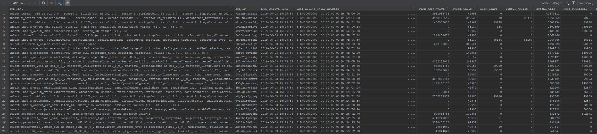

The first one is much worse than the others.
And it is the one that looks for users with the null name:

.Plan for 7rarn9hkgfxf1 (get user with null name)
[source]
----
SQL_ID  7rarn9hkgfxf1, child number 0
-------------------------------------
select ruser0_.oid as col_0_0_, ruser0_2_.fullObject as col_1_0_, 
ruser0_2_.stringsCount as col_2_0_, ruser0_2_.longsCount as col_3_0_, 
ruser0_2_.datesCount as col_4_0_, ruser0_2_.referencesCount as 
col_5_0_, ruser0_2_.polysCount as col_6_0_, ruser0_2_.booleansCount as 
col_7_0_ from m_user ruser0_ inner join m_focus ruser0_1_ on 
ruser0_.oid=ruser0_1_.oid inner join m_object ruser0_2_ on 
ruser0_.oid=ruser0_2_.oid where (ruser0_.name_norm is null) and 
(ruser0_.name_orig is null)
 
Plan hash value: 3961956736
 
---------------------------------------------------------------------------------------------
| Id  | Operation                    | Name         | Rows  | Bytes | Cost (%CPU)| Time     |
---------------------------------------------------------------------------------------------
|   0 | SELECT STATEMENT             |              |       |       |    70 (100)|          |
|   1 |  NESTED LOOPS                |              |     1 |  1892 |    70   (2)| 00:00:01 |
|   2 |   NESTED LOOPS               |              |     1 |  1892 |    70   (2)| 00:00:01 |
|*  3 |    TABLE ACCESS FULL         | M_USER       |     1 |    65 |    68   (2)| 00:00:01 |
|*  4 |    INDEX UNIQUE SCAN         | SYS_C0015815 |     1 |       |     1   (0)| 00:00:01 |
|   5 |   TABLE ACCESS BY INDEX ROWID| M_OBJECT     |     1 |  1827 |     2   (0)| 00:00:01 |
---------------------------------------------------------------------------------------------
 
Query Block Name / Object Alias (identified by operation id):
-------------------------------------------------------------
 
   1 - SEL$C7DBA280
   3 - SEL$C7DBA280 / RUSER0_@SEL$1
   4 - SEL$C7DBA280 / RUSER0_2_@SEL$2
   5 - SEL$C7DBA280 / RUSER0_2_@SEL$2
 
Predicate Information (identified by operation id):
---------------------------------------------------
 
   3 - filter(("RUSER0_"."NAME_NORM" IS NULL AND "RUSER0_"."NAME_ORIG" IS NULL))
   4 - access("RUSER0_"."OID"="RUSER0_2_"."OID")
 
Column Projection Information (identified by operation id):
-----------------------------------------------------------
 
   1 - "RUSER0_"."OID"[VARCHAR2,144], "RUSER0_2_"."BOOLEANSCOUNT"[NUMBER,22], 
       "RUSER0_2_"."DATESCOUNT"[NUMBER,22], "RUSER0_2_"."FULLOBJECT"[LOB,4000], 
       "RUSER0_2_"."LONGSCOUNT"[NUMBER,22], "RUSER0_2_"."POLYSCOUNT"[NUMBER,22], 
       "RUSER0_2_"."REFERENCESCOUNT"[NUMBER,22], "RUSER0_2_"."STRINGSCOUNT"[NUMBER,22]
   2 - "RUSER0_"."OID"[VARCHAR2,144], "RUSER0_2_".ROWID[ROWID,10]
   3 - "RUSER0_"."OID"[VARCHAR2,144]
   4 - "RUSER0_2_".ROWID[ROWID,10]
   5 - "RUSER0_2_"."BOOLEANSCOUNT"[NUMBER,22], "RUSER0_2_"."DATESCOUNT"[NUMBER,22], 
       "RUSER0_2_"."FULLOBJECT"[LOB,4000], "RUSER0_2_"."LONGSCOUNT"[NUMBER,22], 
       "RUSER0_2_"."POLYSCOUNT"[NUMBER,22], "RUSER0_2_"."REFERENCESCOUNT"[NUMBER,22], 
       "RUSER0_2_"."STRINGSCOUNT"[NUMBER,22]

----

== Conclusion

It looks like although - for reasons not known yet - Oracle fails to find optimal query plans even when having correct table/index/column statistics, flushing the shared pool some minutes after the import task is started fixes the import task performance.

What remains to be fixed is bug:MID-5402[] - something that has no visible effect on the overall performance (at least not in our testing environment), but wastes database resources.

 +