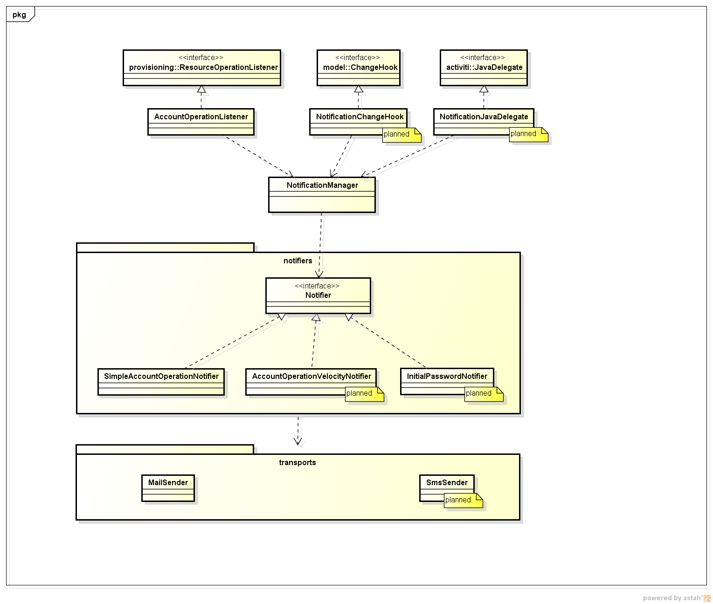

= User Notifications
:page-wiki-name: User Notifications
:page-wiki-id: 6881580
:page-wiki-metadata-create-user: mederly
:page-wiki-metadata-create-date: 2013-01-10T05:11:41.471+01:00
:page-wiki-metadata-modify-user: peterkortvel@gmail.com
:page-wiki-metadata-modify-date: 2016-02-20T15:49:24.067+01:00

== User Notifications

For an admin-level explanation of notifications, click xref:/midpoint/reference/misc/notifications/[here].

As for the architecture, the (preliminary) structure is the following:

(TODO: update!!!!!!!!!!!!)

Currently there are three channels through which notifications are sent:

. *Resource operation listener.* When provisioning module carries out an operation (either successfully or not), it invokes registered operation listeners.
One of them is _AcccountOperationListener_, which

. *Model change hook.* As model progresses through a change execution, it invokes registered change hooks.
One of them is _NotificationChangeHook_, which acts upon an operation in its FINAL phase.
After it detects a situation it is interested in, it creates a notification request and passes it to _NotificationManager_. (Was implemented, but currently not used.)

. *Activiti Java delegate.* At specified points in workflow processes there may be needed to send user notifications.
Activiti uses a concept of a Java delegate to invoke custom java functionality.
_NotificationJavaDelegate_ is such an interface to our notification framework.
(It is not implemented yet.)

=== Planned features

*Note*: In the following table, there are the following roles mentioned:

* REQUESTER, i.e. the one who requested an operation.
He may be actually the real requester (e.g. user's manager) or the user himself (in such case, REQUESTER = REQUESTEE), or IT administrator using midPoint.
This depends on how midPoint is used.

* RESOURCE_ADMIN, i.e. an administrator of a resource; should be defined as Resource attribute.

* IDM_ADMIN should be defined in System Configuration.

* ANY_OTHER should be defined as a constant or an expression somewhere (maybe in workflow configuration or System Configuration?) - an example: security administrator.

[%autowidth]
|===
| Operation | Notification(s)

| MidPoint user creation
| REQUESTEE: provide status.
If password was generated, provide the password.\*  +
REQUESTER: provide status.
If password was generated, provide the password.\*  +
ANY_OTHER: provide status.
+
+
(\*) depends on circumstances, e.g. if using SMS notifications, the password can be sent directly to requestee.
But if using mail, the requester has probably mailbox not existing or not accessible yet, so it would be better to send the password to requester.
(Or, if mails are supposed to be external to the company, notifications can go directly to requestee.)

| MidPoint user change (attributes, roles, accounts assigned, org units, ...)
| REQUESTEE: provide status and information about changes.
+
REQUESTER: provide status and information about changes.
+
ANY_OTHER: provide status and information about changes.
+
+
See also the following row.

| Change on resource (add/remove account, add/remove group membership, attribute change, ...)
| REQUESTEE: provide status and information about changes, e.g. new/removed privileges, new logins and/or passwords.
+
REQUESTER: provide status and information about changes.
+
RESOURCE_ADMIN: provide status and information about changes.
Necessary e.g. to monitor what's going on on his resource, to monitor licenses, etc.
+
ANY_OTHER: provide status and information about changes.

| MidPoint user deletion.
| REQUESTER: provide status.
+
ANY_OTHER: provide status.

| Reset password.
| REQUESTEE or REQUESTER: provide new password (see note \* in first row).

| Automatic Provisioning and identity lifecycle maintenance (e.g. LiveSync)
| IDM_ADMIN: Provide status.
If the password was generated, provide password.
+
ANY_OTHER: e.g. Security Administrator could be notified  +
Some other administrator should be provided with the generated password.

| Approval
| Before: Send approval requests to APPROVER.
+
After:  +
REQUESTER: Provide status if the request was rejected (maybe also approved).
+
REQUESTEE: Provide status if the request was rejected (maybe also approved).

|===

== External links

* What is link:https://evolveum.com/midpoint/[midPoint Open Source Identity & Access Management]

* link:https://evolveum.com/[Evolveum] - Team of IAM professionals who developed midPoint