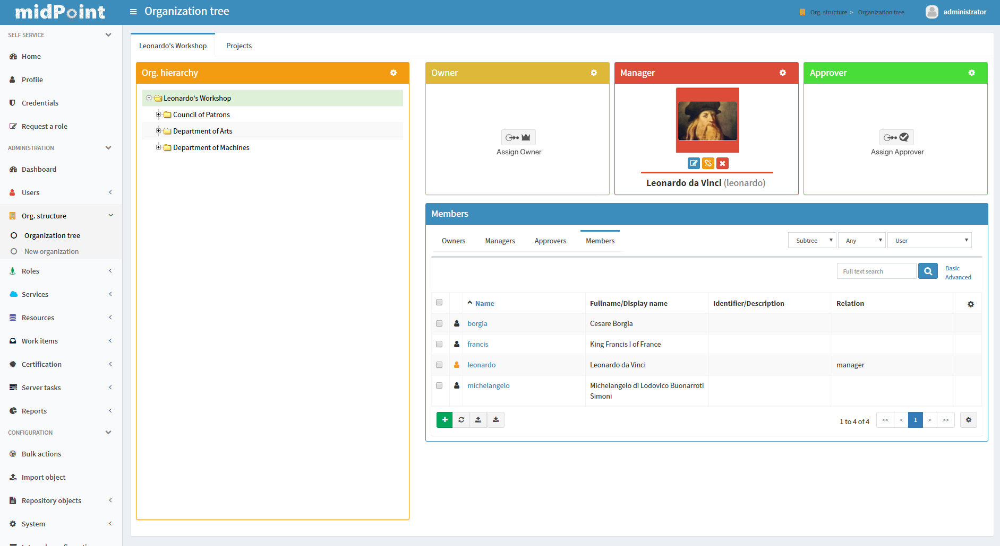

= UX Design notes
:page-wiki-name: UX Design notes
:page-wiki-metadata-create-user: semancik
:page-wiki-metadata-create-date: 2018-12-12T11:21:31.465+01:00
:page-wiki-metadata-modify-user: semancik
:page-wiki-metadata-modify-date: 2019-07-22T09:44:42.742+02:00
:page-toc: top

Various ideas of upgrades in midpoint will be shown here.
Consider these ideas just as ideas and also feel free to add your thoughts to comments.

== Name vs displayName

We have two columns in the GUI: name and displayName.
We do not want two columns.
We want one columns that will show displayName (if present) or name (if displayName is not present).
However, how do to sort/search this column?

We could search by using "or".
But that can be a hit for DB performance.
And it does not solve sorting.
Sorting by name or displayName will not provide good results.

Obviously, we need a column that will have this information already compiled.
Something like effectiveDisplayName.
But then there is still a general problem of polystrings and localization: See wiki:PolyString+Design+Notes[PolyString Design Notes].

== Orgtree Managers

First idea of upgrade is better UI in viewing organization structure.
This idea will make better searching of competent users in org unit and whole availability.

** Top "Managers" section i suggests to split into three sections.
(, Managers and Owner) My idea is about showing users that were last active or are online at that moment (if there are more than one user set) and in case of just one user in each group, just those users.

** I suggest to add more bookmarks that will help filtering and searching in table where members are.
I put there, as on image can be seen, additional "bookmarks" that each shows responsible accounts for their group.
(Ex.
Managers bookmark will show only managers in table under it)

** Next suggestion is to add buttons that represent "adding users", "adding/assign managers" and "adding/assigning approvers".

All points are shown at pictures underneath.image::VFLm.png[]

** wiki:PolyString+Design+Notes[PolyString Design Notes]