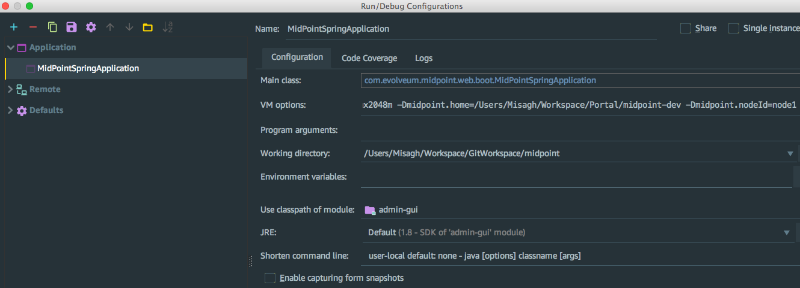
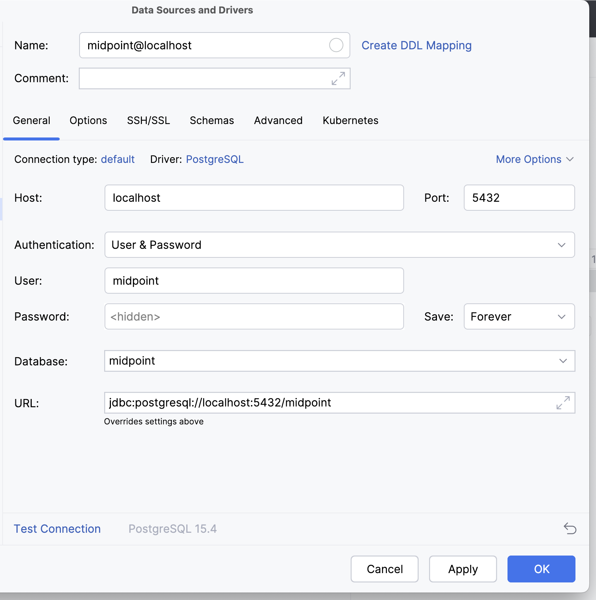
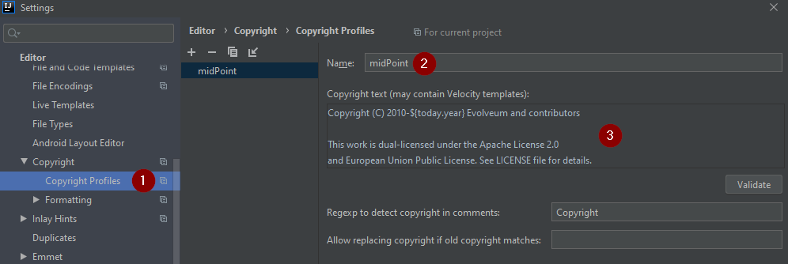
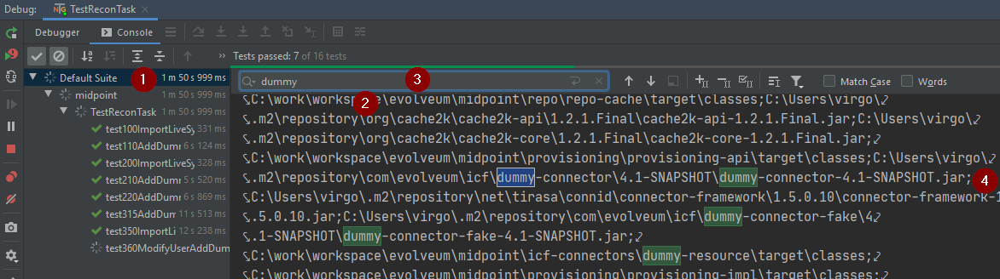
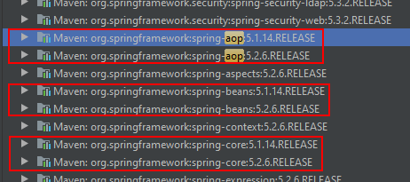
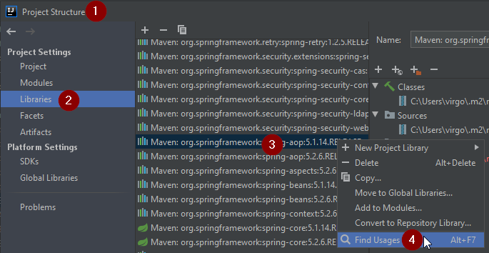
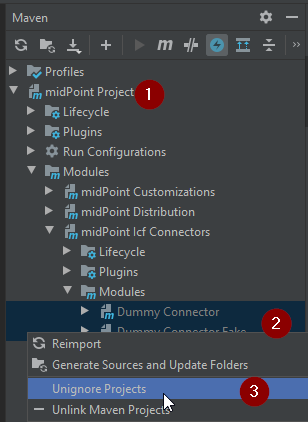

= How to start with IntelliJ IDEA
:page-wiki-name: How to start with IntelliJ IDEA
:page-wiki-id: 6258722
:page-wiki-metadata-create-user: erik
:page-wiki-metadata-create-date: 2012-10-25T11:52:37.193+02:00
:page-wiki-metadata-modify-user: martin.lizner
:page-wiki-metadata-modify-date: 2020-08-14T14:51:48.827+02:00
:page-toc: top
:page-upkeep-status: orange

== Introduction

This guide is a simple way how to start cooperate on project using IntelliJ IDEA environment.

*link:http://www.jetbrains.com[JetBrains]* for providing link:http://www.jetbrains.com/idea/[IntelliJ IDEA] - an IDE that impressed most of our development team members.
IDEA makes out team much more productive.

[TIP]
====
Unless you really plan to modify the midPoint source code you probably do not need IntelliJ IDEA or any other heavyweight development environment.
MidPoint can be easily built from the command line without an IDE.
Please see the xref:/midpoint/install/source/[] page for the details.
====

=== Install Java

JDK 11 (LTS) is supported for midPoint 4.0 and newer.
You can download from link:http://www.oracle.com/technetwork/java/javase/downloads/index.html[Oracle JDK], but you better check the license.
Or you can try more license-friendly releases like link:https://adoptopenjdk.net/[https://adoptopenjdk.net/] or link:https://www.azul.com/downloads/zulu-community/?version=java-11-lts&architecture=x86-64-bit&package=jdk[Zulu JDK from Azul].

=== Install IDEA

IDEA is provided in two editions.
You can use free _Community edition_ just fine, paid _Ultimate Edition_ offers advanced support for web development and frameworks.
But both editions allow building and running midPoint just fine.

. Download IDEA from jetbrains.com: link:http://www.jetbrains.com/idea/download/index.html[http://www.jetbrains.com/idea/download/index.html]

. Select the version for your operating system and edition.

. Install IntelliJ IDEA on your computer.

== First run of IDEA

[NOTE]
====
Outdated! There is a very good description of IDEA setup with screenshots contributed by Deepak Natarjan: *xref:idea-midpoint-init.pdf[idea-midpoint-init.pdf]*
====

. You will be asked to import settings from previous version of  IDEA.
If this is first time you're using IDEA, select _I do not have a previous version of IntelliJ IDEA or I do not want to import my settings_ and continue.

. On next screen you will be asked for license data.
Enter them and continue.

. Agree with license politics of IDEA

. On a couple of next screens you will be asked to select some IDEA plugins.
The choice is yours, but some of the plugins are essential for working on midpoint.
On first screen, select the *_Git_* VCS Integration plugin.

. Select these Web/JavaEE Technology plugins:

** Bean Validation

** Database

** FreeMarker

** Hibernate

** JSF

** Java EE

** Java Server Pages

** Persistance Frameworks

** SQL

** Spring Data

** Spring

** Spring OSGi

** Spring Security

** Spring Web Services

** Spring-AOP and @AspectJ

** Velocity

** Web Services

. Select Application Server Plugin: *_Tomcat_*

. Select HTML/Javascript Development Plugins:

** CSS

** HTML Tools

** Inspection-JS

** JavaScript Debugger

** JavaScript Intention Power Pack

** W3C Validators

. Select Other plugins:

** Ant

** AspectJ

** Copyright

** Eclipse

** Groovy

** Inspection Gadgets

** JUnit

** Maven

** Maven Integration Extension

** TestNG-J

** XpathView + XSLT

. Click Finish

== Importing MidPoint project into IDEA

. Click File - New Project

. Select 'Create project from scratch' - Next

. Fill fields Project name and select Project files location - Next - Finish

. When new project is created, click VCS in top menu - Checkout from Version control - Git

. Click the '+' icon, fill in link:https://github.com/Evolveum/midpoint.git[https://github.com/Evolveum/midpoint.git] - click OK

. Click on the midpoint repository - Click Checkout.

. Select root folder of your project - Click OK on several next screens, this will take a while

. Click on VCS again, select Enable Subversion Checkout Control - OK

. In bottom menu, click on Event Log - Click on the Settings Icon in left menu

. In AspectJ Group, Select 'No popup' option - OK

. Now you'll need to install Maven 3 from link:http://maven.apache.org/download.html[http://maven.apache.org/download.html].

. On top menu, click Run - Edit Configurations

. Click on '+' icon and select Maven

. In Parameters Section, choose your working directory, put 'clean install' in command line and 'default' in Profiles.
Name your configuration as well.

. Click on General options.
Unselect 'Use project settings' and in 'snapshot update policy' add value 'Do Not Update'.

. You may also need to set Maven home directory either to your M2\_HOME classpath variable or override it to maven installation folder.

. In Runner option panel, unselect 'Use project settings' and mark 'Skip tests' value.
Click OK.

. In main screen, select your previously edited configuration and click on green arrow icon.
This will run the build of MidPoint.
It may take up to several dozens of minutes depending on your hardware and internet connection speed.

. Download and install Tomcat 7 from link:http://tomcat.apache.org/index.html[http://tomcat.apache.org/index.html]

. To run midpoint from IDEA, you will need to create user configuration.
Click Run - Edit Configurations.

. Click on '+' button in upper left corner of the screen, choose Tomcat - Local.

. Name your configuration, then click on 'Configure' button located left to Application Server option.

. Edit Tomcat home and Tomcat base directory.
- OK

. Check  the 'Start browser' option and type 'link:http://localhost:8080/midpoint/login[http://localhost:8080/midpoint/login]' in startup page.
- OK.

. Now run your new Tomcat configuration the same way like maven build before.
Midpoint now should open in your default web browser.

=== Add Generated Sources

MidPoint build generates some source code during build.
These are especially classes generated from XSD schemas.
You need to add the folders that contain generated classes as source folders so IDEA can see them.

. From the command-line, run the build once: mvn[w] clean package

. Go to the *infra/schema* project and open module settings (right click and select Open Module settings or press F4)

. In the Sources tab click on target and uncheck the Excluded mark (in the Mark as bar)

. Expand target/generated and mark target/generated/cfx as Sources

. Mark all other sub-directories of target as Excluded (classes, cxf-codegen-plugin-markers, maven-archiver, ...)

. For midPoint 4.1 and older: Repeat steps 1~4 for the *model-client* project.

. Click OK

=== Other Tips

* Remove Spring Facets from the Project Structure (File - Project Structure - Facets).
These do not work well with maven-based spring configuration.
If the faces are present you may get false errors about duplication of some spring beans.

== Running midPoint from IDEA

If you want to run midPoint from within IDEA directly, follow the below steps cautiously:

. Make sure you have done a full build apriori, from the root parent project building/installing all components

. Create a Java Application Run Configuration that is set to run the class com.evolveum.midpoint.web.boot.MidPointSpringApplication

. For VM options, use: -Dserver.port=8080 -Xms768m -Xmx2048m -Dmidpoint.home=/path/to/midpoint-home -Dmidpoint.nodeId=node1

. In the Maven Project tool window, expand the Profiles node and make sure only ide and tomcat are selected.
All other profiles MUST be unchecked.

== Other development tasks

=== Connecting to midPoint H2 Database

. In the Database tool window, create a Data Source configuration based on H2 with the following settings

== Developer's setup

=== Setup Copyright Notices

Select *File | Settings | Editor | Copyright | Copyright Profiles* (1) and create a new profile ((2) called e.g. *midPoint*) like this:

Use the following copyright text (in (3)):

[source]
----
Copyright (C) 2010-${today.year} Evolveum and contributors

This work is dual-licensed under the Apache License 2.0
and European Union Public License. See LICENSE file for details.
----

Then select *midPoint* in the *Default project copyright* in the *File | Settings | Editor | Copyright*. Also consider switching off *Add blank line after* in *File | Settings | Editor | Copyright | Formatting*.

=== Dummy connectors and tests

Tests using dummy connectors will fail with Error importing src\test\resources\common\resource-dummy.xml during initialization.
This is caused by IDEA-maven integration.
While Maven puts JARs of other modules on the classpath, IDEA puts classes directories instead (from target directory).
This is not good for connector modules that work only in JAR form because of expected metadata. +
To run such tests directly in IDEA, set the modules *dummy-connector* and *dummy-connector-fake* as ignored (in *icf-connectors* module).
Right-click on the modules, select Maven - Ignore projects.
Then _reimport the Maven project_ unless you use auto-import.
Don't let IDEA to remove the modules from the project structure, otherwise midPoint won't build in IDE. +
What we need is this: +

Tests run OK, we can check the classpath by clicking on the top-level suite (1), then on the first grayed (shortened) line in the console (2, not displayed in the picture), and searching for dummy (3).
While the insufficient *classes* directories are still there (perhaps because we didn't remove the modules from IDEA project), the important thing is that connectors are also added in JAR form (4).
This does not happen if the two submodules are not ignored.

=== Fixing dependencies after upgrades

This example documents situation typical after Spring Boot upgrade, but it can happen with any dependency changes.
This may also be a genuine problem with Maven POM, but not necessarily.
For example:

First we have to find out what uses the old *spring-core*. For whatever reason as of IDEA 2020.1 it is not possible from the list above, not even if you open the dependency and try to find usages of the JAR.

To find the usage of a dependency open the *Project structure* window (in *File* menu, or *Ctrl+Shift+Alt+S*):

Choose libraries (2), click to the list, select the library (3) (you can start typing aop to find it faster) and in its context menu choose *Find Usages* (4).
This opens pop-up that reveals that the old library is used in *dummy-connector* - in our example at least.

Remembering from the section above, this is one of those ignored modules.
To fix the libraries, let's unignore it (you may have modules displayed as flat list, this depends on the Maven panel settings):

Now refresh the Maven structure and old duplicate dependencies should be gone.
Don't forget to ignore the modules as needed based on the section above.

If there is a genuine problem with Maven dependencies, use *mvn dependency:tree -pl submodule* to figure it out and fix accordingly - e.g. exclude or declare the dependency explicitly with specific version.