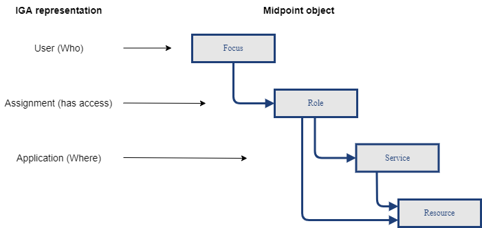

= IGA Deployment Methodology
:page-nav-title: Deployment Methodology
:page-display-order: 600
:toc:
:toclevels: 3
:sectnums:
:sectnumlevels: 3

WARNING: This page is a stub, it is a work in progress.

This document lists what should be identified and defined at the early stages of the IGA implementation in an organization. Role engineering and maintenance and Role request processes are in main focus now.

This definition is customer specific. Results of the methodology definition may be listed in the "Role design" document.

== Naming conventions

.Naming convention for roles
Well-defined naming helps in daily operation and working with the roles. It saves time on daily basis of all the users by easier searching and better overview.

Application roles shall contain application name (short form is acceptable). This is visually telling the user that he will get access to the particular application. Application name is well explaining the scope of the role.

Business roles, on the other hand, will not contain any application definition. These roles do not need scoping by default. In large organization, the business role name may include the highest organizational level or country definition for scoping.

Additional notes ::
- language - should be English. If the organization doesn't use english at all, then the naming can be in other language. This also relates to all components of the role (description, ..).
- decrease complexity - do not overcomplicate. Must be easy to understand for people.
- whether all roles are managed in all environments
- Environment name may not be included in the role name, but additional care must be held during role management - to be sure what environment is admin modifying.
- role type (application/business) should not be defined in the role naming. Readability can be increased by different graphical display of the roles using archetypes.

Examples of the application role naming::
[width=70%]
----
Format [ENV:AppName:RoleName] where:
    ENV - environment (TEST/ACC/PROD). Mandatory when roles from all environments are managed in one MP.
    AppName - short name of the application. May be different from full name to keep role names shorter. Just must be pretty clear which application it means.
    RoleName - Explanatory name of the access role. This name must be clear for users using the application.

e.g. TEST:Office365:EndUser

Additional format examples:
    [AppName:RoleName_ENV], [appname-rolename]
----

Examples of the business role naming::
[width=70%]
----
Format [ORG:RoleName] or [ORG:RoleName:ENV] where:
    ORG - highest level organization in large corporation - or country in country organization

e.g. SK:Accountant:PROD
----

== Structures of main objects

// TODO - toto cele pripravit  - rozdelenie struktur objektov
// Na poskytnutie dobreho overview je potrebne, aby sme ...

Interpretation of "Who has access where" in midpoint.

]

//TODO - toto rozviest lepsie
* Role structure (how many levels)
* Application structure
* User's structure - scoping users in reports
* Organization structure

== Rules for specifying risk level and access level

There can be 2 views for computing of

Definition of risk level may be subjective.

TODO: What is better - risk level or access level ? It is hard to say.

How to identify hi-risk roles ?
- there are 2 possible options - using risk level for each

- is risk level good for

Risk level::
// sem to, ze risk level je cislo a musime pripravit take pravidla, aby sme ho vypocitali
Risk level represented as value can be used for computing risk level of access for roles.

// jeho vypocet je senzitivny pre

Pri business roliach jeho vypocet moze

Access level - application roles::
Access level helps better distinctive manage risk of access level

* Basic user access
* Power user access
* Privileged access

//TODO - prelozit
//A tymto mozeme lepsie manazovat riziko pristupu a zlepsovat aj controlne mechanimy - teda schvalovanie a certifikacie.
//Na rozdiel od risk levelu je toto lepsie uchopitelne. Risk level umoznuje spocitavanie rizika. Ale porovnavat aplikacnu rolu s rizikom 8 s business rolou s rizikom 10 je tazke - lebo ta aplikacna rola moze obsahovat

//Nemali by sme vsak definovat ziadne obmedzenia pre spajanie roli.

Access level - business roles::
The field should be computed for business rules. The value is based on application roles access level, but most of business roles contain different types of roles. Following types can explain access level of the role quite nice:

* Basic user access
* Partially power user access
* Power user access
* Partially privileged user access
* Privileged user access

The access level values will be computed according the following rules:

[cols="5, 10", options = header, width=70%]
|===
| Level
| Rule

| Basic user access
| all contained roles are only basic access level

| Partially power user access
| >0 and <50% of contained roles are of power user and 0 privileged user

| Power user access
| >=75% of contained roles are of power user, 0 privileged user

| Partially privileged user access
| >0 and <50% of contained roles are of privileged access

| Privileged user access
| >=50% of contained roles are of privileged access

|===

== Splitting operation and engineering

#TODO#
// Tuto definovat, ktore cinnosti su operations a ktore su engineering.
// ktore nastroje pouzit kedy.
//TODO: ako by prebiehal proces - v com vytvorit (IDEA, UI) - zakladny princip ze by sa mal dat urobit plne cez GUI a engineering cez IDEU s MP Studiom. Bulk actions mozu byt robene cez Ideu - ak je potrebne upratovat mnozstvo roli.
//Toto ale asi do Deployment methodology.
