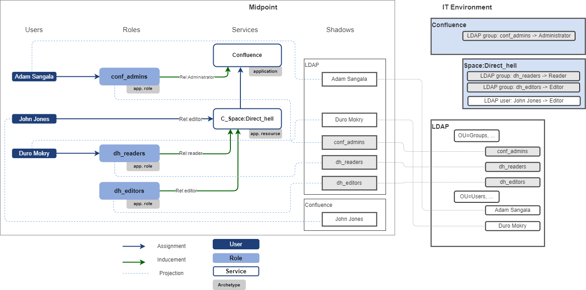
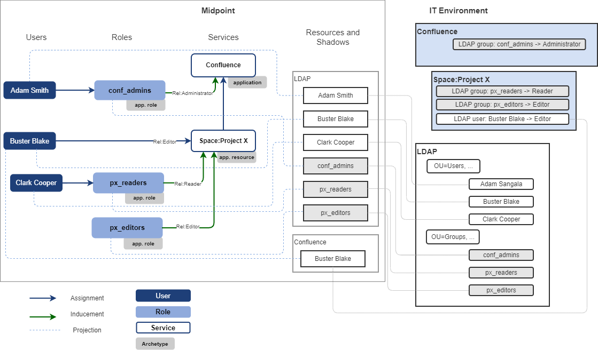

= Access Modeling
:page-nav-title: Access Modeling
:page-display-order: 200
:sectnums:
:sectnumlevels: 3

[#_access_to_application]
== Access to application

Access to xref:../objects-and-midpoint/index.adoc#_application[application] is represented in midPoint by assignment of service representing the application.
The application may be assigned directly `user -> application` or indirectly via application roles.

How is the access represented in midPoint can be described on following examples.

=== Example 1: Access to application

Following schema describes the access to application ABC. Access to the application ABC is managed via membership of LDAP groups. One user has access to the application configured directly in the application.

====
*Access model of the application ABC:*

* members of _ABC_R_ LDAP group have _Reader_ access level to application ABC,
* members of _ABC_E_ LDAP group have _Editor_ access level to application ABC,
* members of _ABC_M_ LDAP group have _Manager_ access to application ABC,
* user Clark Cooper has _Manager_ access to application ABC.

User Adam Smith is member of ABC_R LDAP group and user Buster Blake is member of ABC_M group. These groups give them access to application ABC.
====

Environment and configuration of midPoint can be described by following picture:
image:iga-concepts-application-access.png[Application access]

.Application access model
Access model of application ABC is represented by roles directly induced to ABC service representing application and direct assignment of the ABC service to user Clark Cooper. Relations are describing business description of _access level_.

Such midPoint configuration may be interpreted by technical (IAM) language or by business language.

.Technical interpretation (IAM):

* Adam Smith has role _ABC:Readers_ assigned. Therefore he has account in _LDAP_resource and is assigned in _ABC_R_ LDAP group. He has service _ABC_ assigned.
* Buster Blake has role _ABC:Managers_ assigned. Therefore he has account in _LDAP_resource and is assigned in _ABC_M_ LDAP group. He has service _ABC_ assigned.
* Clark Cooper has service _ABC_ assigned.

This technical interpretation explains information necessary for provisioning, but will not tell much about user access to the application without additional knowledge of application access model.

.Business interpretation (IGA):
This interpretation describes user access to the application. Clearly understandable by business.

* Adam Smith has _Reader_ access to application _ABC_ via application role _ABC:Readers_.
* Buster Blake has _Manager_ access to application _ABC_ via application role _ABC:Managers_.
* Clark Cooper has _Manager_ access to application _ABC_.

[#_access_to_application_resource_direct]
=== Example 2: Access to application resource - direct assignment of resource

The xref:../objects-and-midpoint/index.adoc#_application_resource[application resource] increases flexibility of access modelling and enables xref:../parametric-access.adoc[parametric access].

Application resources may be assigned directly, or via roles. When application resource is assigned directly, relation of this assignment defines access level of user to the application resource.

Following schema describes the access to Confluence space _Project X_. The space is represented by application resource.
Access to the Confluence space is managed by direct assignment of user in the space.
The schema also describes one user being administrator of whole Confluence application to display difference between managing access to whole application and just to the application resource.
====
*Access model of Confluence application*

* members of _conf_admins_ LDAP group have _Administrator_ access level to _Confluence_ application

*Access model of Confluence space Project X*

* user Buster Blake has _Editor_ access to the Confluence space _Project X_
====

Environment and configuration of midPoint can be described by following picture:

The user access to confluence space described in business (IGA) terminology:

* Buster Blake has _Editor_ access to Confluence space _Project X_.

Additionally we can tell, that Adam Smith has _Administrator_ access level to _Confluence_ application.

====
NOTE: Probably we have missing feature - how we represent relation in shadow resource ?  Association does not have relation.
====

[#_access_to_application_resource_roles]
=== Example 3: Access to application resource - utilizing roles

IGA is not being deployed on green field, but rather it must describe existing IT environment and complex access models.
In the example above, the access was assigned directly to confluence space. In some real-life situations the access model may be hybrid - access to the application resource is assigned via membership in LDAP groups and also directly.

This example describes how to model such example.

Following schema describes the access to Confluence space _Project X_. The space is represented by application resource.
Access to the Confluence space is managed by managing membership in LDAP groups. Additionaly one user are assigned to the space directly.
The schema also describes one user being administrator of whole Confluence application to display difference between managing access to whole application and just to the application resource.

====
*Access model of Confluence application*

* members of _conf_admins_ LDAP group have _Administrator_ access level to _Confluence_ application

*Access model of Confluence space Project X*

* members of _px_readers_ LDAP group have _Reader_ access level to Confluence space _Project X_
* members of _px_editors_ LDAP group have _Editor_ access level to Confluence space _Project X_
* user Buster Blake has _Editor_ access to the Confluence space _Project X_
====

Environment and configuration of midPoint can be described by following picture:

The user access to confluence space described in business (IGA) terminology:

* Clark Cooper has _Reader_ access to Confluence space _Project X_ via application role _px_readers_.
* Buster Blake has _Editor_ access to Confluence space _Project X_.

We can also tell, that Adam Smith has _Administrator_ access level to _Confluence_ application.

== Assign roles or applications ?

As shown in previous examples, user access may be described not only by assignment of roles, but also by direct assignment of applications or application resources - with definition of access level. The access level is represented in midPoint by relation of the assignment.

Typically, the access may be described as:

* Assignment of application role
* Assignment of business roles
* Assignment of application (with definition of access level)
* Assignment of application resource (with definition of access level)

It depends on actual situation what objects use to model the access.
Direct assignment of applications can decrease number of managed objects (roles are not needed) but differentiation of user roles in application just by access level (relation) may not be good enough.
The relations should be somehow standardized in the environment (editor, reader, operator, administrator, ..).

On the other hand, application resources should be in most cases assigned directly.

[#_role_hierarchy]
== Role hierarchy

In organization, business roles has inducements to application roles, another business roles or even services representing applications or application resources.
These inducements are building role hierarchy - from top level business roles, through application roles to detail metaroles.

Displaying *hierarchy of roles based on their inducements* describes the role model - structure of roles in organization.
Such structure is useful for Role manager for analysis the role structure and organization, but also for auditors or security officers for review of access that particular role or list of roles can provide.

Displaying the entire role hierarchy in the view may be resource intensive, because there can be thousands of roles and each business role can contain dozens (sometimes even hundreds) of application role or service inducements.
In addition, individual roles can be repeated in the hierarchy - an application role can occur in several business roles.
For these reasons, a report form is suitable for full display of the role hierarchy.

Such report is described in the use-case xref:../../use-cases/visibility-uc.adoc#_hierarchy_of_roles__the_role_model[hierarchy of roles - the role model].

As role hierarchy is being built during the time, it may happen that loops will be introduced into the hierarchy. Role A induces role B, that induces role C and this role induces back role A. It should be rare, but may happen. MidPoint can handle such situations during provisioning, but it is necessary to xref:../../use-cases/visibility-uc.adoc#_identification_of_loops_in_role_structure[identify loops in role structure] and handle them correctly.

.Partial display of the role hierarchy
Easier than displaying full role hierarchy is displaying just position of actual role in the hierarchy. Midpoint should display in UI for each role object:

* *all descendants* - what everything will be xref:../../use-cases/visibility-uc.adoc#_what_is_assigned_by_this_role[assigned by the role] assignment.
* *all ancestors* - in which roles xref:../../use-cases/visibility-uc.adoc#_where_is_this_role_included[is this role induced] ? For users it may be named as "included".

These 2 views can provide good overview for role manager or other IGA users while organization of roles.

As service objects representing applications and application resources may be included in hierarchy of roles, then this representation should be included also for services.

[#_defining_rules__org_units_and_roles]
== Defining rules - Org. units and roles

Roles, applications and application resources may be assigned by rules or ad-hoc by request. How these rules should be defined ?

.Organization units
Creation of inducement of roles to organization structure is preferred way of automation in role assignments.
When role is induced to org. unit, all people in the org. unit obtain the role.

Main advantage of this model is readability. Additionally, this model is easily and naturally manageable and affected scope of any role modification is quite clear (users in the org unit).

Both application or business roles and even application or application resources may be induced in org. units. It is good practice to have only small amount of inducements in one org. unit. If there are many roles induced in the org unit, the readability of the assignment rule is affected.

These rules may be displayed in xref:../../use-cases/visibility-uc.adoc#_hierarchy_of_roles__the_role_model[hierarchy of roles - the role model] report.

.Autoassignment rules
*Autoassignment rules* are _not preferred_ in IGA. Small number of rules may be defined (e.g. Employee / Contractor), but having large number of complex assignment rules is hard to read and even harder to maintain. Any exception increases complexity of environment.
+
To have autoassignment rules readable in the environment, each rule should be described in documentation.
