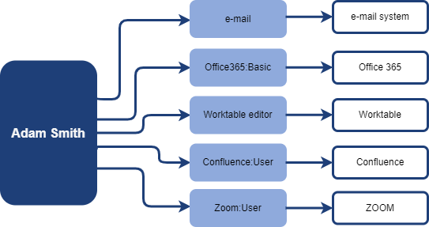

= IGA and User Access
:page-nav-title: IGA and User Access
:page-display-order: 150

IAM solution can manage user accounts and his attributes on the resources.  It provisions the users and their entitlements.
The accounts, attributes and entitlements are provisioned and managed in detail.

The user can be displayed with all details like this:

.Picture1: IAM user details
image:iga-concepts-iam-actual.png[User details]

The user has accounts in Azure AD, in AD and LDAP system and has an email. We can see user's attributes and group membership in the systems and information that his data came from HR Source system.

This is the way how technically are also user accesses implemented and provisioned. But, the user access is not directly visible without additional knowledge.
E.g.: Our user in example is member of con_user group in AD. Confluence provides basic access to all members of this group, and it means, that the user has access to the Confluence application. But, if you don't have the additional knowledge about con_user group, you can't tell that.

.Picture 2: IAM user details and applications

Of course, the *application roles* are perfect place for such additional knowledge. The application role can interconnect detail entitlement(s) (in our case it is the AD account and membership in con_user group) with the *application* and additional business information like owner, description or risk level.

Language of attributes and entitlements is the language of IT world. Language of access and applications is business. The application roles are the interconnection between these two worlds.

This movement from user -> entitlement relation to user -> application enables the switch from displaying information in technical language to displaying of information in business language.

== Where the user has access…

When the application role is linked to the application, then the model "the user has access to the application" can be described on following example.

.Picture 3: Application roles and applications

We can tell that the user has access to the following applications: e-mail system, Office 365, Worktable, Confluence.

How the access is technically enabled is defined in the technical configuration of *application role*:

.Picture 4: Application role
image:iga-concepts-application-role.png[Application role]

Application role defines also *level of access*. The level can be described just by business description, or quantitatively by categories defined in the role definition.

For better modelling of the business organization, the application roles may be organized to business roles. In the example below, the business role Trainer gives user access to 4 applications.

.Picture 5: Business role
image:iga-concepts-business-role.png[Business role]

== … and why

In real life, the users are often member of some organization unit(s) and have one or more business and application roles assigned. These roles are assigned to users automatically by some rules, or directly upon request. Knowledge, why the user has the role assigned is important for governing the user access.

The rules for automatic assignment of user access may be often defined easily just by assigning business roles (or application roles as well) to organizational units. All members of the organizational unit obtain such role and all access defined by it. Such definition of rules is perfectly readable and allows greater flexibility needed for daily business.

The user's access can be displayed this way:

.Picture 6: IGA view - assigned roles

This schema provides better visibility of the user access, because now we can see also reason why the user has access - the business rules. Whether is the rule the business role being assigned, membership in some organization unit or having the role directly assigned.

Additional details of each assignment, expiration time, when and why it was created, or by which request, can help as well.

On IGA level we can tell, that the user has access to following applications:

.Picture 7: IGA view - assigned roles and access to applications
image:iga-concepts-iga-view-full-with-apps.png[IGA view - assigned roles and access to applications]

Moving the displayed information to business level enables the information user to abstract technical details and helps to understand business structure of the access.
Also, this is enabler for moving access management from technical team (helpdesk, support IT teams) to business users with self-service tools.
From the security perspective, faster and more competent decisions may be made by business managers while recertifying the user access.