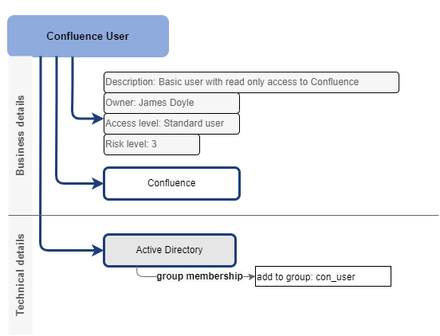

= Application Role Design
:page-nav-title: Application Role Design
:page-display-order: 200

This document describes example of relevant IGA attributes that should be defined for the application role. This does not represent visual display of the role, nor all the attributes. Attributes are not named exactly according to elements in midPoint schema. The document is showing more a user's point of view.

== Description of role content
The UI should be able to describe content of the role to users in their relevant language - business language.

The attributes of the role are separated to business description, technical details and additional configuration.

* *business description* - the data that will be visible to end-users in midPoint GUI
* *technical details* - what the role assignment will perform. The technical provisioning operation.
* *additional configuration* - the part of role configuration that can't be displayed via GUI - only available via XML.

NOTE: Please take this picture just as inspiration, not all attributes are shown.

=== Business details

Business description of the role should be defined here. It should contain any "user readable" element of role object (not limited to attribute listed below).

These elements should be displayed in the business language to be readable by any business user.

* *Role name* - the name of the role
* *Description* - free text - description of the role for end user
* *Documentation* - free text - documentation of the role - for administrators and Role manager - not visible via self-service gui
* *Application* - link to the application object (the service in midpoint) - this may be displayed also in technical elements
* *Role type* - link to some possible additional archetype(s) for managing roles
* *Environment* - Environment for which the role is designed. This attribute makes sense when midpoint manages multiple environments in one implementation.
* *Owner* - link to the midPoint user - acting as an owner
//* *Access level* - business description of the access risk. The values may be Standard user / Power user / Privileged user
* *Risk level* - numeric value of role risk - free value
* *Requestable* - whether the role is requestable or not
* *Approval policy* - link to predefined approval policy - IGA administrator should just select from existing approval policies.
//* *Lifecycle state* - This is DRAFT - should not be filled by author, set during the process
* *How to use* - free text - information for end user, that he can obtain via e-mail when the role is assigned to him - how to start with the role. Here may be URL to the application and some additional steps if these are needed.
* *Validity period* - if the role validity should be limited, then it should be defined here.

=== Technical details

Technical details of the role should contain definition of `inducement` elements (but not limited only to this element) of the role. Identification of managed resources, entitlements. Also, this component should contain assignments of metaroles or additional roles.

The description of these role components should be available in the language that technical users (e.g. application engineers) can understand, but specific midpoint terminology like "inducements" or "archetype" must be avoided.

*Documentation element* may be utilized for this description. The documentation element may be filled in manually by IGA administrator, or even _generated automatically by midpoint_.

As an example, inducement with construction on _MY_LDAP_ resource and assignment to group _abc_users_ may be described with text: "role creates account on _MY_LDAP_ system and assigns the user to group _abc_users_"

Following elements should be displayed in technical description:

* Assignments (archetypes, ...)
* Inducements
* Autoassignment rules
* Conditions
* ...

=== Additional configuration
Not everything may be designed via GUI, so there should be an option to configure the details via XML.
If such modification is performed (any element that is not displayed via UI), then notification that _additional configuration is present_ should be displayed.
