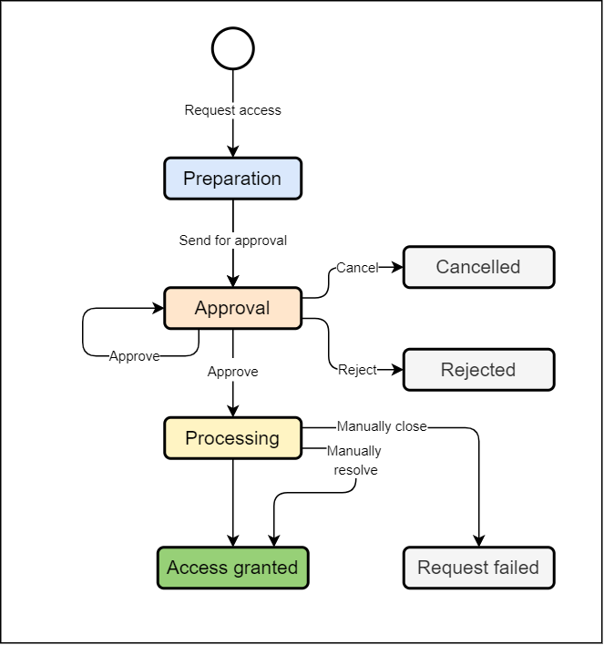

= Access Request Process Details
:page-nav-title: Process Details
:page-display-order: 100
:sectnums:
:sectnumlevels: 3

WARNING: This page is a stub, it is a work in progress.

== The access request lifecycle

This chapter describes the access request process by listing its actors, displaying the process schema, and describing each stage of the process and each step that can be performed. The process is designed to handle exceptions manually by IGA administrator.

The process description and schema are simplified to be easily adopted by people. Complexity of exceptions in approvals and implementation is hidden.

Following actors are active in the process:

* *Requestor* - the person, who created the request for role assignment/removal/modification,
* *Requestee* - the person for whom the request is created,
* *Approver* - approves or rejects the requests,
* *IGA administrator* - troubleshoots failed requests.

.Schema of the Access request process

.Stages of the access request process
[options="header", cols="10,30,10,30"]
|===
|Stage
|Description
|Action needed by
|Note

|Preparation
|Requestor creates request and can define its parameters (e.g. validity period).
|--
|--

|Approval
|Approval process the request is running. The request is waiting for one or more approvers.
|Approver
|--

|Rejected
|Final stage - the request was rejected by one of approvers. Nothing was provisioned.
|--
|--

|Processing
a|The provisioning (or deprovisioning) of individual components is running. If provisioning requires manual operations (ITSM tickets), the process is waiting till all the tickets are resolved. +
If an error appears in the provisioning, then manual intervention of IGA administrator is needed.  He can administratively move then the request to it's final stage - the `Done-Success` (if the intervention was successful) or Done-Failure (if not).
|--
|The request is in the processing stage until all components are successfully provisioned, or IGA admin manually resolved the issue and moved the request forward.

|Access granted
|Final stage - the request was successfully processed and access is granted.
|--
|--

|Request failed
|Final stage - when the request failed and IGA administrator was not possible to resolve the failure.
|--
|The inconsistency may be present - e.g. when all but one application roles in business role were provisioned, but one not. And solution for the issue was not found.

|===

.Operation steps of the access request process
[options="header", cols="3,10,15,10,18,25,20"]
|===
|
|Actual stage
|Operation
|Target stage
|Who can perform
|What happens
|Notification

|1.
|--
|Request access
|Preparation
|Requestor
|Requestor can select the role, requestee and can define its parameters (e.g. validity period).
|--

|2.
|Preparation
|Send for approval
|Approval
|Requestor
a|Approval cycle is started. +
Requestor can't modify the request since this moment.
a|Requestee, +
First approver

|3.
|Approval
|Approve
a|Approval +
or +
Processing
a|Approver, +
Approver's deputy, +
IGA administrator on behalf of the approver
a|Approval stage is approved and the approval is moved to another stage. +
If it is the end of approval, then the request is moved to Processing stage
|Next approver

|4.
|Approval
|Cancel
|Cancelled
a|Requestor, +
IDM administrator on behalf of the requestor
|Request is moved to Cancelled stage.
|Requestor & requestee

|5.
|Approval
|Reject
|Rejected
a|Approver, +
Approver's deputy, +
IGA administrator on behalf of the approver
|Request is moved to Rejected stage.
|Requestor & requestee

|6.
|Processing
|--
|Access granted
|--
a|Automated step. +
Final step of the request when all provisioning tasks are finished successfully
|Requestor & requestee

|7.
|Processing
|Manually resolve
|Access granted
|IGA administrator
a|Just administrative closure of request that is in error state - in case that troubleshooting was successful. +
Any technical operation must be performed independently.
|Requestor & requestee

|8.
|Processing
|Manually close
|Request failed
|IGA administrator
a|Just administrative closure of request that is in error state - in case that troubleshooting was NOT successful. +
Any technical operation must be performed independently.
|Requestor & requestee

|===

NOTE: The user, who pushed the button is excluded from notification.
