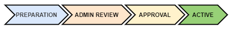
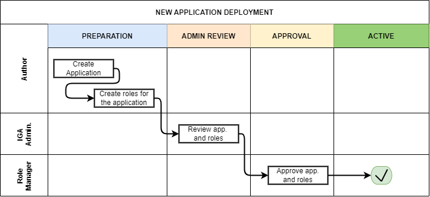

= Role Engineering and Maintenance Process
:page-nav-title: Role Engineering and Maintenance
:page-display-order: 200
:page-toc: top
:toclevels: 3
:sectnums:
:sectnumlevels: 3

WARNING: This page is a stub, it is a work in progress.

Role engineering and maintenance process describes process of collection of various technical information and their synthesis and transformation into business object representing way of accessing of the application - the application role. Also, this process involves collection of application roles into business role - business representation of access of particular business user.

This process requires a cross-team cooperation. Although some application roles may be defined by application engineers or administrators themselves, multiple people must be involved for some other roles. The individual tasks in the process are sometimes unclear. People may understand the concepts and rules differently, the applications may have different internal data models etc.

To have the process effective and manageable, it is designed with the xref:../concepts.adoc[IGA design concepts] in mind.

The Role engineering and maintenance process (sometimes just Role engineering process) is designed to be lightweight and fast, but needs to be fully documented and governed by Role manager. Exceptions are to be managed by IGA administrator or Role manager himself.

Following actors are active in the process:

* *Author* - the person, who created the request for the role creation.
** Application Engineer is typically author of application roles
** Business user is typically author of business roles.
* *Role Owner* - performs decisions of role modifications and assignments. Often it is application engineer for application roles and business manager for business roles.
* *IGA administrator* - reviews the roles and applications definitions and verify them from the viewpoint of technical accuracy and processing details.
* *Role manager* - governs the roles structure. Reviews the roles from the view of their position in the whole model and business functionality.

The process in high level can be described by schemas how the roles are created, updated and decommisioned. After reading the description in the chapters below, please review also details of the process in the xref:role-engineering-details.adoc[process details] page.

== Building New Roles

During creation, the new role flows through 4 stages from a DRAFT to the role that is in ACTIVE stage. New roles in ACTIVE state can be assigned and requested.

image::role-eng-new-role.png[]

Author creates new role in the DRAFT stage. In this stage he can update the definition as long as is needed. When the design is finished, he forwards the role to IGA administrator for review.

ADMIN REVIEW stage is included in the process because of the complexity of creation of the role. IGA administrator is able to help author to correct role definition to ensure that the role is technically correct. After review, the IGA administrator forwards the role definition to Role manager for final approval.

Role manager reviews the role from the view of their position in the whole model and its business functionality. If the role design fulfills the requirements, it is approved and moved to ACTIVE state. Of course, the Role manager may reject the role creation or return it for redesign. The steps are described in the xref::role-engineering-details.adoc[process details] page.

=== New Application Role

Definition of application role is not an easy task. It often can't be performed by one person only.

Application roles are created by engineers of the applications that these roles are defining access to. The Application engineer is the position that has the most knowledge about technical implementation of access to the application. Even though Application engineer has knowledge about the application, he may not have enough knowledge of identity management system. So this definition is often product of cooperation of Application engineer and IGA administrator.

To offload IGA administrators, Midpoint must support application engineers with good interface for role definition.
As midpoint configuration may be very complex, the interface must abstract of midpoint terminology and structure and provide the application engineer structured data in a form that the skilled IT engineer is able to fill intuitively or after minimum of learning.

Following schematic interface for xref:app-role-design.adoc[application role design] provides view of what elements should be provided to application engineer for definition.

=== New Business Role

Definition of business role is easier, and therefore it may be managed by business personnel. At least at beginning the business roles definitions and configuration will be managed mostly by Role manager or IGA administrators based on his requests.

The process for engineering of business roles is the same as for application roles. Only difference is that business role may be created by business user.

Schematic description of user interface for business role request is in the xref:business-role-design.adoc[business role design] page.

=== Deployment of New Application

The definition of application roles requires one additional step - definition of application. Applications should be related to application inventory and the objects should be created automatically or manually by application engineer.

Basic step is the definition of an application. The application object can collect data about how the access into application is defined. Whether existing resource or manual connector.

Application is defined by Application engineer. When the application is defined (still in DRAFT stage), the Application engineer will create also all application roles for the application.

Approval of application is processed by the same steps as approval of the related application roles. These objects are then processed by IGA administrator and Role manager together.

== Role Modification

image::role-eng-active-to-active.png[Role engineering - update role]

Of course role definition may be modified. The modification also needs to go through approval process. All existing assignments are updated according to the new definition only after the role modification is approved.

Modifications may include updates of business details (e.g. description, owner) not affecting role assignments or technical details related affecting provisioning. If the technical details of roles are updated, then recompute of the role assignments is needed.

image::role-eng-modify-role.png[]

Approval policies <su potrebne pre
Specific modifications may include different approvals for some specific modifications. E.g. adding application role into business role may require approval of both roles, but does not need approval of Role manager.

Role updates initiated by IGA engineer or Role manager

====

Pokial upravy iniciuje IGA inzinier alebo Role manager, je o upravach vlastnik roly notifikovany. Notifikacia je z dovodu informovanosti, ale nie je nevyhnutne kazde schvalovanie.

====

Recompute of users having the role will be needed.
//TODO - linka na recompute do detailov.

NOTE: Some operations for roles modification (e.g. massive updates) may be performed by IGA administrator using Midpoint studio to decrease effort needed for multiple role updates.

=== Updating Application Role

====
Tuto velmi nie je co povedat - mozno celu kapitolu dame prec.

Mozno len spomenut,

Update aplikacnej roly moze vygenerovat viacere
- moznosti - pridanie nejake
====

=== Updating Business Role

====
Updatovanie business roly je najbeznejsia operacia z procesu. Ide najcasejsie o pridanie alebo odobratie aplikacnej roly.

V tomto pripade je potrebny recompute userov.

//TODO: see role assignments recompute
====

=== Updating Application

====
TODO
====

== Role Decommissioning

image::role-eng-active-to-archived.png[Role engineering - decommissioning]

At the end of its lifecycle, each role or application object should be correctly decommissioned. The role assignments needs to be removed.

Decommissioning in real life is often phased. Therefore, the role engineering process allows the role to be first in "deprecated state" and only later on to be really decommissioned. The deprecated state allows the assignments to be still valid, but no new assignments can be created.

//TODO: recompute is neded

=== Decommissioning Application Role

====

Decommissioning aplikacnych roli znamena
====

=== Decommissioning Business Role

====
TODO
====

=== Decommissioning Application

====
TODO
====

== Process Monitoring and Optimization

TODO
// Ako bude prebiehat manazment procesu a jeho optimalizacia.

=== Weekly role design commitee

For increasing of the process throughput ... TODO
// toto je potrebne pre zefektivnnenie procesu - na tejto platforme dokaze efektivnejsie riesit zlozite definicie pri ktorych je potrebna komunikacia. Tu musi vidiet role manager aktualne requesty a musi ich byt schopny rychlo spracuvat - modifikovat, schvalit, vratit na prepracovanie.

== Troubleshooting the process

TODO
// sem popisy, ake problemy mozu nastat a ako ich riesit

== Process examples

TODO
// tuto prejst na prikladoch, ako by taky proces vyzeral, co by bolo potrebne urobit

=== Application deployment

TODO
// tuto prejst popis procesu nasadenia aplikacie - spojenie s definovanim roly a postupne vytvaranie.

// TODO: END dokumentu - dalej su len poznamky, co pomazeme.
