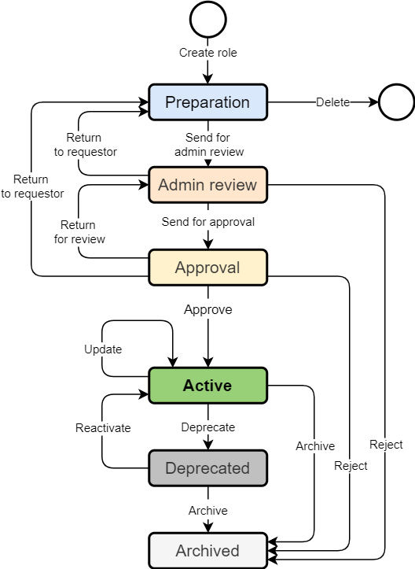

= Role Engineering and Maintenance Process Details
:page-nav-title: Process details
:page-display-order: 200
:page-toc: float-right
:toc: macro
:toclevels: 3
:sectnums:
:sectnumlevels: 3

== The role engineering and maintenance lifecycle

This chapter describes details of the role engineering and maintenance process by listing its actors, displaying the process schema, and describing each stage of the process and each step that can be performed. The process is designed to handle exceptions manually by IGA administrator.

The process description and schema are simplified to be easily adopted by people.

Following actors are active in the process:

* *Author* - the person, who created the request for the role
* *Role manager*
* *Approver* - approves or rejects the requests,
* *IGA administrator* - troubleshoots failed requests.

.Schema of the role engineering and maintenance process

.Stages of the role engineering and maintenance process
[options="header", cols="10,30,10,30"]
|===
|Stage
|Description
|Action needed by
|Note

|Draft
|Draft of the role for role creation. Created by author, but not pushed anywhere yet. e.g - waiting for some information, waiting for devel team with configuration of objects.
|Author of the role
|The role is in the author's playground , no action is required from anybody else.

|Admin-review
|IDM administrator / Role administrator reviews roles in this stage. Verifies that the role is consistent with the Role Model document, all components are well defined and all related technical components (e.g. groups ) are created.
If specific IDM components - like new resources are being prepared, the IDM administrator acts together with IDM engineer to prepare IDM environment.
|IGA administrator
|Quite common, this is the stage when the role is designed in detail, IDM admininistrators are checking overall processing of the role and often they are redesigning some details to help the new system engineers.

|Proposed
|Role prepared for approval by Role manager. He may move the role into production.
|Role manager
|Primary place for role manager action.
Modifications may be made in this stage, but only by Role manager. The modifications are logged.

|Active
|Basic operational state of the role. Such role may be assigned.
|--
|--

|Active-updated
|Additional operational state of the role. This active role has some updates pending approval.
Role may be assigned, the assignments are using the actual role state.
|Role manager
|#TODO#

|Deprecated
|Intermediate stage for roles being removed.
Role can't be assigned. Existing assignments are not affected.
|--
|The role still may be assigned if it is included in some other role.

|Archived
|Final stage of the role lifecycle. All assignments are removed. Role is kept here just for track of it's history.
|--
|#TODO#

|===

.Operation steps of the role request process
[options="header", cols="3,10,10,10,19,25,20"]
|===
|
|Actual stage
|Operation
|Target stage
|Who can perform
|What happens
|Notification

|1.
|--
|Create role
|--
a|System engineer, +
Application owner, +
IGA administrator, +
Role manager
|Object of the role is created. Anything in the object may be edited and modified in this stage.
The role in this stage can't be assigned nor included in other roles.
|--

|2.
|Draft
|Send for admin review
|Admin review
a|Author of the role, +
Role owner, +
IGA administrator, +
Role manager
|The status of the role changes.
Operation is sent to IDM administrator who can check the role definition and finalize the deails.
a|Role owner, +
Role author

|3.
|Draft
|Delete
|--
a|Author of the role, +
Role owner, +
IGA administrator, +
Role manager
|--
a|Role owner, +
Role author

|4.
|Admin review
|Send for approval
|Proposed
a|IGA administrator, +
Role manager
|When the role details are verified, this step moves the role to Proposed stage.
a|Role owner, +
Role author

|5.
|Admin review
|Return to requestor
|Draft
a|IGA administrator, +
Role manager
|--
a|Role owner
Role author

|6.
|Proposed
|Approve
|Active
|#TODO#
|--
a|Role owner, +
Role author

|7.
|Proposed
|Return for review
|Admin review
|#TODO#
|--
a|Role owner, +
Role author

|8.
|Proposed
|Return to requestor
|Draft
|#TODO#
|--
a|Role owner, +
Role author

|9.
|Active
|Update
|Active-updated
|#TODO#
|--
|Role owner

|10.
|Active
|Deprecate
|Deprecated
|#TODO#
|--
|Role owner

|11.
|Active
|Archive
|Archived
|#TODO#
|--
|Role owner

|12.
|Active-updated
|Approve changes
|Active
|#TODO#
|--
|Role owner

|13.
|Active-updated
|Reject changes
|Active
|#TODO#
|--
|Role owner

|14.
|Deprecated
|Archive
|Archived
|#TODO#
|--
|Role owner

|15.
|Deprecated
|Reactivate
|Active
|#TODO#
|--
|Role owner

|===

=== Differencies in the process for business roles

Main difference is the visual form of the role. Application role contains multiple technical components. Business role is just list of application roles. together with some business data.

// sem lepsi popis.
#TODO - vyriesit situaciu ked updatujem business rolu - a bolo by dobre, aby mi pridanie roly do business roly schvalil jej vlastnik#

