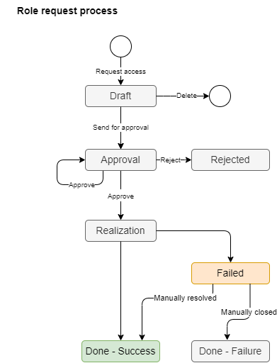

= Role Request Process
:source-highlighter: highlightjs
:toc:
:toclevels: 3
:sectnums:
:sectnumlevels: 3

WARNING: This page is a stub, it is a work in progress.

Technically, Role request process is self-service process of assignment management - their creation, removal and modification.

== Concepts and terminology

Role request process is designed to be managed, documented and measurable from beginning to end - from role request, through approval, till all provisioning steps are performed. Manual steps are part of the role request monitoring. Role request is finished when all automatic and all manual components are done successfully.

The process is designed as clear as possible::
Exceptions are to be managed by IGA administrator.

One request is processing assignment/removal/modification of one role::
This will decrease complexity of the role request approval, management and troubleshooting. On contrary, it will (significantly) increase number of individual notification and approval steps. As a countermeasure, UI must provide means for easy/fast review of multiple requests on one page and multiple request approval.

Requests are created for operations generated via self-service UI and related REST calls only::
Admin interface operations should not generate requests. IDM administrators manage multiple users. Their work is to perform large cleanups and modifications. Of course, cases for manual operations will be generated even based on such operations.

Process will support delegated administration::
Roles can be requested by the user for himself/herself, or for somebody else. Specific privileges will be needed for this. This feature allows management of access for whole team.

Types of operation::
The table lists types of operation that may appear and how to handle them. We are combining who is requesting, for whom is request done and what operation is being performed.

.Types of operation
[options="header", cols="10,10,15,5,30"]
|===
|Who | To whom | Operation | Approval / Notification | Note

|End user |-self- |Role assignment
|Yes/Yes
a| Standard role request process with approval.

|End user |-self- |Role removal
|No/Yes
a| No approval for removal. +
Decreasing of number of approvals. If needed for particular roles it may be enabled.

|End user |-self- |Change of assignment parameters
|Yes/Yes
a|Examples: +
- Change of team in the cloud team space +
- Increase of role assignment validity +
NOTE: Supported in UI, but not nice.

|End user |Other user |Role assignment
|Yes/Yes
a|Standard approval. +
Additional approval by the affected person may be needed.

|End user |Other user |Role removal
|No/Yes
a|No approval for removal. +
Decreasing of number of approvals. If needed for particular roles it may be enabled.

|End user |Other user |Change of assignment parameters
|Yes/Yes
|Standard approval.
|===

== The role request lifecycle

This chapter describes the role request process by listing its actors, displaying the process schema, and describing each stage of the process and each step that can be performed. The process is designed to handle exceptions manually by IGA administrator.

The process description and schema are simplified to be easily adopted by people. Complexity of exceptions in approvals and realization is hidden.

Following actors are active in the process:

* *Requestor* - the person, who created the request for role assignment/removal/modification,
* *Requestee* - the person for whom the request is created,
* *Approver* - approves or rejects the requests,
* *IGA administrator* - troubleshoots failed requests.

.Schema of the Role request process

.Stages of the role request process
[options="header", cols="10,30,10,30"]
|===
|Stage
|Description
|Action needed by
|Note

|Draft
|Draft of the request for access. Created by author, but not sent anywhere yet.
|Requestor
|Role request is in the shopping cart. Nothing sent yet.

|Approval
|Approval process the request is running. The request is waiting for one or more approvers.
|Approver
|--

|Rejected
|Fina stage - the request was rejected by one approver. Nothing was provisioned.
|--
|--

|Realization
|The provisioning (or deprovisioning) of individual components is running. If provisioning requires manual operations (ITSM tickets), the process is waiting till all the tickets are resolved.
|--
|Realization is better name than provisioning - easier to understand for end-users.

|Done - Success
|Final stage - the request was successfully processed and access is running.
|--
|--

|Failed
a|Error state of the request - if any of the components failed during provisioning stage. +
Manual intervention of IGA administrator is needed. He can administratively move then the request to it's final stage - the `Done-Success` (if the intervention was successful) or Done-Failure (if not).
|IDM administrator
|The request is in provisioning stage until all components are or succesfully provisioned, or failed.

|Done - Failure
|Final stage - when the request failed and IGA administrator was not possible to resolve the failure.
|--
|The inconsistency may be present - e.g. when all but one application roles in business role were provisioned, but one not. And solution for the issue was not found.

|===

.Operation steps of the role request process
[options="header", cols="3,10,15,10,18,25,20"]
|===
|
|Actual stage
|Operation
|Target stage
|Who can perform
|What happens
|Notification

|1.
|--
|Request access
|Draft
|Requestor
|Request is created (is added to the shopping cart).
|--

|2.
|Draft
|Send for approval
|Approval
|Requestor
a|Approval cycle is started. +
Requestor can't modify the request since this moment.
a|Requestee, +
First approver

|3.
|Draft
|Delete
|--
a|Requestor, +
IDM administrator
|Request is deleted.
|--

|4.
|Approval
|Approve
a|Approval +
or +
Realization
a|Approver, +
Approver's deputy, +
IDM administrator on behalf of the approver
a|Approval stage is approved and the approval is moved to another stage. +
If it is the end of approval, then the request is moved to Realization stage
|Next approver

|5.
|Approval
|Reject
|Rejected
a|Approver, +
Approver's deputy, +
IDM administrator on behalf of the approver
|Request is moved to Rejected stage.
|Requestor & requestee (if there are manual operations in realization)

|6.
|Realization
|--
|Done-Success
|--
a|Automated step. +
Final step of the request when all provisioning tasks are finished successfully
|Requestor & requestee

|7.
|Realization
|--
|Failed
|--
a|Automated step. +
When all provisioning tasks are finished and some of them failed, then the proces
|IGA administrator

|8.
|Failed
|Manually resolved
|Done-Success
|IGA administrator
a|Just administrative closure of request that is in error state - in case that troubleshooting was successful. +
Any technical operation must be performed independently.
|Requestor & requestee ( in case of delegated request, the requestee)

|9.
|Failed
|Manually closed
|Done-Failure
|IGA administrator
a|Just administrative closure of request that is in error state - in case that troubleshooting was NOT successful. +
Any technical operation must be performed independently.
|Requestor & requestee ( in case of delegated request, the requestee)

|===

Note: user, who pushed the button is excluded from notification

== Process Monitoring and Optimization

// sem moznosti, ako je mozne proces monitorovat - co vsetko merat a ako.
TODO

== Troubleshooting of the process

// sem to, ze musime podporit delegovanu administraciu tak, aby specializovani admini pre proces vedeli osetrovat vypadky v procese
// proces nebude zlozity, exceptions budu osetrovane ad-hoc -> postupne sa vybuduje knowledge base ako tie veci riesit. -> a veci sa mozu doplnit
TODO

== Process example

// tuto prejst na prikladoch, ako by taky proces vyzeral, co by bolo potrebne urobit
TODO