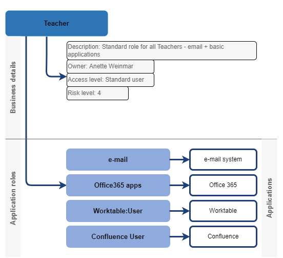

= IGA Use Cases: Visibility and Reports
:page-nav-title: Visibility and reports use-cases
:page-display-order: 500
:page-toc: top
:toclevels: 3
:sectnums:
:sectnumlevels: 3

WARNING: This page is a work in progress.

The IGA system should provide useful IGA information from the data. Especially for external customers (auditors / security officers / business).

NOTE: The IGA reporting is designed in detail xref:../reporting/index.adoc[here]. The pages are not yes synchronized and not all use-cases are covered. This is work in progress.

== Reporting technology

[#_analyze_reports_in_database]
=== Analyze reports in database

Scenario::
User wants to utilize known analytical tool for analysis of prepared reports. He wants to analyze the data in the reports and potentially combine the data or enhance it with additional data from outside.
+
He does not want to repeat each time operation of importing new report from csv file. Just want to have environment prepared and refresh it with the data from new report.

Actors::
Reports are configured by IGA engineer or IGA administrator - he can be called as _report designer_ for this use-case.
+
Typical user of the report for such analysis is Role manager or IGA administrator/IGA engineer from internal IGA team. From external environment, the Security officer or IT Auditor are the users for this scenario.

Motivation::
All data shall be exportable to csv or created into a reporting database (tables / materialized views) - where the data may be analyzed.
+
The reporting database is useful solution for preparing pre-computed information out of the data in IGA solution. Authorized users then can use their analytical tools to obtain results they know and need in efficient and repeatable way. They can avoid daily repeating preparation of data from csv files.
+
Working with reports require computing power too. Having the reports saved in independent database will save resources for provisioning and self-service operations and avoid affecting overall midpoint performance.

User Story::
* Report designer configures the report to provide results to _reporting database_ - e.g. by creating table or refreshing materialized view for the report.
** He can schedule it to run in specified times.
** He defines access to the report data.
* User configures his analytical tool to connect to reporting database and open the report results.
* User perform analysis of the report to get information out of data in the report. If necessary, enhances the report data with additional computation. Saves the configuration.
* Next time, the user, just opens the analytical tool and refreshes it with the actual data. No load from csv, no data preparation is needed.

Note: Analytical tools may start with Excel connected to the reporting database via ODBC, or it can be any other BI tool - just depends on user needs and options.

[#_scheduled_reports]
=== Scheduled reports

Scenario::
* Report user doesn't want to wait for preparation of the report.
* Report user need to have reports from the same time each day to have comparable results.
* Report user needs to have consistent reports from each day (week) for analysing trends over time.
* Multiple users are using the same report - it is good to ha

Actors::
_Report user_ could be Role manager, Security manager, any business manager or IGA administrator. Any user, that should have access to reports.
_Report designer_ is typically IGA engineer or IGA administrator.

Motivation::
Computing of report results may take time and resources - especially in large environments. User does not want to wait to the report to be finished.
+
Users often prefer to have data from specific time over last minute data - e.g. when comparing results of reports over time.
+
If reports are used by multiple users, then the preparing reports for all of them can significantly save system resources over running the report for each user, or .
+
On the other hand, scheduling and precomputing all reports even when these are not used could waste the resources. The solution engineer should decide which reports to schedule and when.

User Story::
* The report designer configures report to be run in specified times and provide results.
** He defines whether all data to be replaced or new data will be added (e.g. new csv file or added rows to reporting results)

[#_specify_set_of_objects_for_reports]
=== Specify set of objects for reports

Scenario::
A report user wants to run report not over full scope but filtered for specific set of objects. e.g. for the users from his team.

Actors::
_Report user_ could be Role manager, Security manager, any business manager or IGA administrator. Any user, that should have access to reports.

Motivation::
The reports should be provided for full set of users or roles, or it can be filtered.
Specifying of scope for the report may decrease report preparation time.
Also, such report is easier to analyze using import from csv.

User Story::
End user selects a report, selects defined parameters (prepared in report definition) and run it.
The report output will contain results filtered according conditions set by the user.

Implementation::
The use-case is already implemented.
Selection of objects by report user wile starting the report is enabled by option to configure `parameter` element of collection report.
Providing a csv file with source data for selection of the records is enabled by configuration of `behavior/direction` element of the report.
Documentation is at xref:/midpoint/reference/misc/reports/configuration/index.adoc[Report configuration] page.
+
Small disadvantage - the actual implementation allows individual objects as parameters for selection, but not set of objects (e.g. multiple user's to compare).

NOTE: The implementation of reverse reports as processing objects specified in csv file is quite unintuitive. It would be great to provide the functionality for bulk tasks.

[#_option_to_run_sql_in_reports]
=== Option to run SQL in reports

Scenario::
An report designer needs to prepare report that is not supported by actual midpoint capabilities, or is being performed over large sets of data and could not be computed in acceptable time.

Actors::
_Report designer_ is typically skilled IGA engineer.

Motivation::
For some specific reports and specific environments it would be usefull if an report designer can design a report just as a SQL select over the internal midpoint structures.
+
Such reports may not be using standard midpoint design (collection), but bypassing internal processing of midpoint structures may increase speed of report generation and move some reports over large data sets from _impossible_ to possible area.
+
Such type of report generation should relate only for "normal reports", not _import reports_. No data modification may be allowed on database level below midpoint's referential integrity checks.

User Story::
This situation may be solved in 2 different way - within midpoint, or via external SQL query.
+
*Using midpoint methods*, the _report designer_ prepares new report definition and configures the query not via collection, but using SQL query. The report is set up to perform output to database (see use-case xref:#_analyze_reports_in_database[Analyze reports in database]).
+
If the report is configured *via external SQL query* (e.g. preparing materialized view or table in reporting database), then the query may be scheduled to run in specified time. The configuration is performed outside midPoint.
+
In both cases, the report results are the same - the table or materialized view in reporting database. End users are using their analytical tools to analyze the report data.

== Visibility of single objects

=== Role content - in business readable form

Scenario::
* Helpdesk operator wants to know what the specific application role does. What objects it is managing. e.g. He needs to verify that the role manages specific group in LDAP, or whether the role provides access to the application he thinks.
* Application engineer wants to review the roles that are managing access to "his" application. He just want to open the role and check "what the role does".

Actors::
Application engineers, helpdesk operators, security officers, auditors, ... - the "technical users".

Motivation::
Display the role definition to application engineers, helpdesk operators, security officers, auditors, ... - the "technical users" who have knowledge about identity management, provisioning, roles or technology infrastructure, but don't know specific midpoint terminology.
+
Provide the role configuration for fast review.

User story::
* Technical user opens the role in UI, e.g. in "business summary tab", and can see the configuration of the role in easily readable form.
Application role can have the configuration display divided to "business attributes" visible to end users and its technical configuration.
* The role should display inducements and their construction in form e.g. "role manages group cn=app_users,ou=groups,o=org in resource "our LDAP", additional roles included (assignment / inducement) in the role (e.g. application roles in business role), additional authorizations.

* If the definition is too complex to be easily displayed, it is enough to display additional text "Role provides also additional configuration not displayable in the business form, please refer detail configuration of the role."

* Additionally to description element, also documentation element of the role should be displayed. It can be useful for explanation of the role configuration for the technical users.

*Examples for displaying of the role configuration*

.Application role
image:iga-concepts-application-role.drawio.png[Application role]

.Business role

=== User's history - in business readable form.

Scenario::
IGA administrator or Helpdesk operator is troubleshooting some issue with an user. He is looking for information what happened to the user and when. He needs to get fast overview _what_ happened to the user directly from the view.
+
The fast overview saves time because the admin does not need to open each delta one-by-one.

Actors::
IGA administrators, helpdesk operators. Sometimes even user himself.

Motivation::
We have user's history, but it is hard to get information out of it.
From the view we can see just that the user was created or updated in particular time + channel and outcome of the operation.
Each event must be opened and reviewed to see what happened to the user. This is inconvenient and time-consuming particularly if there were many modify operations on the user.
+
Operator needs to get better information what happened in each operation directly from the view.

User Story::

* Operator opens the user history, selects the time constraints, and can see each event enhanced with its business description.
 The history view contains additional columns for:

** operation - e.g. Created / Modified / Disabled / Enabled / New assignment(s) / Assignment(s) removed / Assignment(s) modified
** attributes - it would be nice if we can see list of attributes that were updated (this must be handled carefully - maybe just list 3-4 and if more was updated, then just display "multiple attributes were updated"). The same should be displayed for assignments.
+
Operation attributes should not be included here, or included on request/checkbox.

** assignments - here names of assignments that were added or removed or updated. Constrains are the same as with attributes (not to display too many - view must stay to be readable).

* Reader can search in the history -  somehow easily. It would be ideal, if the user could be able to find when particular attribute was changed to/from particular value using AXIOM and the same for assignments.
+
Of course, this level will require advanced users, but when the operator or admin knows the query, he can be very efficient.

=== What is the access of the user ?

Scenario::

Actors::

Motivation::

User Story::

#TODO#

=== Who has access to the application and why ?

Scenario::

Actors::

Motivation::

User Story::

#TODO#

== Big picture over assignments

=== Who has access where and why ? / Main IGA report (assignments report)

Scenario::

Actors::

Motivation::

User Story::

#TODO#

=== Who are the privileged users ?

Scenario::

Actors::

Motivation::

User Story::

#TODO#

=== Who are the highest risk users ?

Scenario::

Actors::

Motivation::

User Story::

#TODO#

== Big picture over roles

=== Compare roles and their attributes

Scenario::

Actors::

Motivation::
Listing of roles and their specified attributes - view and compare

User Story::

#TODO#

=== Compare orgs and their attributes

Scenario::

Actors::

Motivation::
Listing of ORGs and their specified attributes - view and compare

User Story::

#TODO#

=== View hierarchy of roles

Scenario::
User needs to see roles in hierarchy based on inducements and role archetypes

Actors::

Motivation::

User Story::

#TODO#

=== Role structure analysis 1: What is assigned by the roles
Report of roles and all their descendants.

Scenario::

Actors::

Motivation::

User Story::

#TODO#

=== Role structure analysis 2: Where are the roles included
Report of roles and all their ancestors

Scenario::

Actors::

Motivation::

User Story::

#TODO#

=== What applications can be accessed by the roles ?

Scenario::

Actors::

Motivation::

User Story::

#TODO#

[#_what_accounts_are_created_by_roles_what_entitlements_are_managed_by_roles]
=== What accounts are created by roles? / What entitlements are managed by roles?

Scenario::
A user wants to know on what resources are accounts created by assignment of the role. Or what roles are creating accounts on specific resources.

Actors::
IGA administrator, Role manager

Motivation::
The information may be needed during some troubleshooting or during analysis of roles. Examples:

* IGA administrator is troubleshooting some issue with accounts on some resources and wants minimize the scope to specific roles acting with the resource
* Role manager wants to organize the roles and identify overlapping roles (the roles that perform the same operations).

User Story::
The users should run a report listing all (or specified set of) roles and collecting information of accounts and entitlements that are managed by the roles. The user then analyzes the report by his own means.

#TODO - some example of the report.#

=== Identification of loops in role structure

Scenario::

Actors::

Motivation::

User Story::

#TODO#

== Other big picture views and reports

=== Comparison of role assignments (what should be) and actual representation on managed objects (what is)
Discrepancies - on users level, attribute level - for specified attributes

Scenario::

Actors::

Motivation::

User Story::

#TODO#

=== What resources we are managing ?

Scenario::

Actors::

Motivation::

User Story::

#TODO#

=== What objects we are (not) managing on the particular resource

Scenario::

Actors::

Motivation::

User Story::

#TODO#

== Process monitoring reports

=== Monitor the role engineering process

Scenario::

Actors::

Motivation::

User Story::

#TODO#

=== Monitor the access request process

Scenario::

Actors::

Motivation::

User Story::

#TODO#

=== Monitor the access certification process

Scenario::

Actors::

Motivation::

User Story::

#TODO#