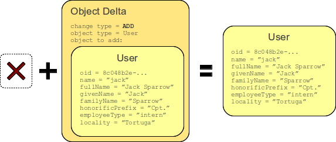
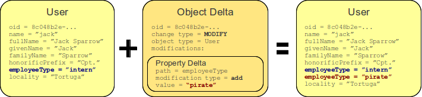
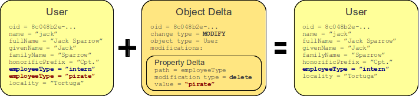
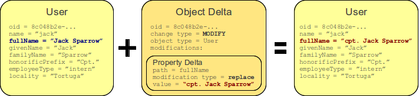
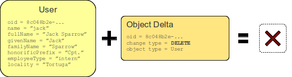

= Prism Deltas
:page-nav-title: Deltas
:page-wiki-name: Deltas
:page-wiki-id: 7307518
:page-wiki-metadata-create-user: semancik
:page-wiki-metadata-create-date: 2013-01-29T16:59:09.783+01:00
:page-wiki-metadata-modify-user: semancik
:page-wiki-metadata-modify-date: 2020-11-24T10:53:14.515+01:00
:page-toc: top

Deltas are data structures that describe xref:/midpoint/reference/concepts/relativity/[Relativity].
Deltas describe how a thing should be modified.
It does rely on how the thing looked before the change or how it will look after the change.
Delta describes only what was changed.

There are several types of deltas.
The basic difference is about the _thing_ is changing:

* *Object Delta* describes a change of an object.
It means that object delta identifies the changed object by xref:/midpoint/devel/prism/concepts/object-identifier/[Object ID].
Object delta tells about:

** *ADD* of a new object.
Application of such a delta simply results in creation of a new object.
This delta contains a complete new object to be added.

** *MODIFICATION* of an existing object.
Application of this delta modifies object that already exists.
This is the most complex delta because it can describe the change in very fine details.
It contains modifications in a form of _item deltas_ (see below).

** *DELETE* of existing object.
Application of this delta deletes an existing object - with all its properties and containers and references.
This delta does not contain almost anything.
It just has the xref:/midpoint/devel/prism/concepts/object-identifier/[Object ID] of the object to delete.

* *Item Delta* describes a change of an item which is a property, container or a reference.
It describes only a very small change - a change of a _single item_.
Therefore complex changes can only be described by using several item deltas together.
A group of item deltas is called _modifications_ because they describe how an object is modified (they cannot apply to add or delete object delta).
Item delta describes *values* that are being added, removed or replaced with respect to an item.
Therefore the item delta may also be of several types:

** *add* of new values.
The values in item delta are added to the existing values.
Existing values are left as they are.

** *delete* of existing values.
The values in item delta are removed from the set of existing values.
Other existing values are left as they are.

** *replace* of the values.
All existing values are removed and all the values in item delta are added.

A picture is worth a thousand words therefore next sections provide examples of the most common delta types.

== Object ADD Delta

Object ADD delta is adding a new object.
It contains a complete representation of new object to be added.

The diagram above illustrates the application of ADD delta.
The object did not exist before delta application.
The delta contains an object that should be added.
When the delta is executed, a new object is created that is a copy of the object specified in the delta.

The object provided in the delta may or may not have xref:/midpoint/devel/prism/concepts/object-identifier/[Object ID].
If it does then that OID will be used.
If it does not then it will be generated when the delta is executed.
The ADD object delta obviously works only if such object does not exist already.
Attempt to apply ADD delta to an existing objects results in an error.

.Object ADD delta
[source,xml]
----
<objectDelta>
    <changeType>add</changeType>
    <objectType>c:UserType</objectType>
    <objectToAdd>
        <c:user>
            <c:name>jack</c:name>
            ...
        </c:user>
    </objectToAdd>
</objectDelta>
----

== Object MODIFY Delta

TODO: intro

=== Object MODIFY:add Delta

.Object MODIFY:add delta
[source,xml]
----
<objectDelta>
    <changeType>modify</changeType>
    <objectType>c:UserType</objectType>
    <oid>e3ba0a70-6ef3-11e2-8c1f-001e8c717e5b</oid>
    <modification>
        <modificationType>add</modificationType>
        <value>
            <c:employeeType>pirate</c:employeeType>
        </value>
    </modification>
</objectDelta>
----

==== ADD modification with container values

When adding new container value, specified equivalence strategy is consulted - by default https://github.com/Evolveum/prism/blob/f94401bca7222d9f87606bede23f3b6a7255e158/infra/prism-api/src/main/java/com/evolveum/midpoint/prism/equivalence/ParameterizedEquivalenceStrategy.java#L132[ParameterizedEquivalenceStrategy.realValueConsiderDifferentIds()] is used.
This means that if the provided value is equivalent (using the provided strategy) to any existing
value, it is not added, it overrides the previous value instead.
If overriden value had a container ID, it is adopted by the new value as well.
See xref:/midpoint/devel/prism/schema/basic-definitions/#container[Prism basics, containers]
and section about multi-value containers there for more details about container IDs.

So yes, `ADD` modification can also work as a replace for individual container values.

=== Object MODIFY:delete Delta

.Object MODIFY:delete delta
[source,xml]
----
<objectDelta>
    <changeType>modify</changeType>
    <objectType>c:UserType</objectType>
    <oid>e3ba0a70-6ef3-11e2-8c1f-001e8c717e5b</oid>
    <modification>
        <modificationType>delete</modificationType>
        <value>
            <c:employeeType>pirate</c:employeeType>
        </value>
    </modification>
</objectDelta>
----

Container values can be deleted:

* By providing "skeletal" container value with ID of the deleted value,
the actual value of the container is ignored.
* By providing container value without ID but otherwise equivalent according to the provided
strategy, see ADD above for details.

=== Object MODIFY:replace Delta

.Object MODIFY:replace delta
[source,xml]
----
<objectDelta>
    <changeType>modify</changeType>
    <objectType>c:UserType</objectType>
    <oid>e3ba0a70-6ef3-11e2-8c1f-001e8c717e5b</oid>
    <modification>
        <modificationType>replace</modificationType>
        <value>
            <c:fullName>cpt. Jack Sparrow</c:fullName>
        </value>
    </modification>
</objectDelta>
----

Replace modification has no meaning for individual container values, just like with any other item,
only the whole item (i.e. the container, that is all its values) can be replaced.

Replace modification is also typically used to reset the item, that is to delete all the values.
To do so, simply provide no value with the replace modification.

=== Complex Object MODIFY Delta

TODO: show how to use several item deltas in a single object delta

== Object DELETE Delta

Object DELETE delta is deleting an existing object.
It contains just an OID and a type of an object to delete.

The diagram above illustrates the application of DELETE delta.
An object did exist before delta application.
The delta contains OID and type of the object.
When the delta is executed the object is deleted and it no longer exists.

The DELETE object delta obviously works only if such object does exist.
Attempt to apply DELETE delta to an non-existing objects results in an error.

.Object DELETE delta
[source,xml]
----
<objectDelta>
    <changeType>delete</changeType>
    <objectType>c:UserType</objectType>
    <oid>e3ba0a70-6ef3-11e2-8c1f-001e8c717e5b</oid>
</objectDelta>
----