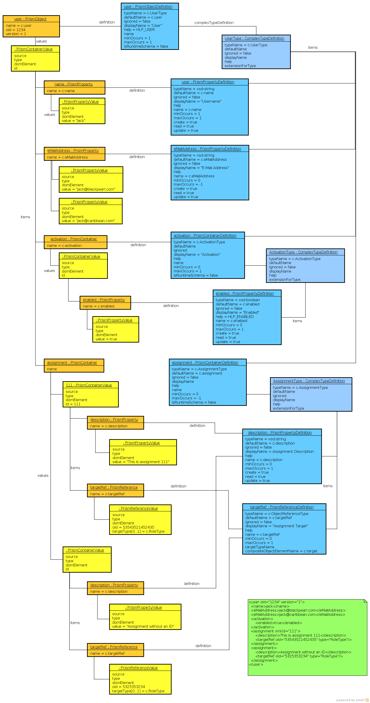
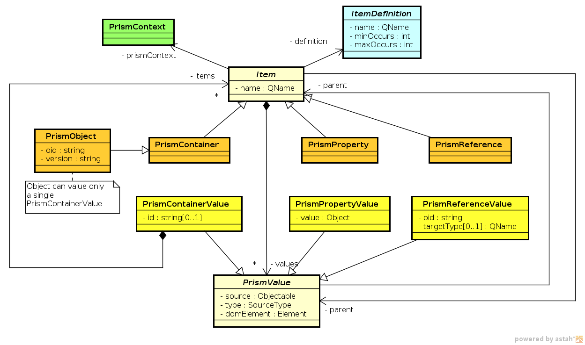
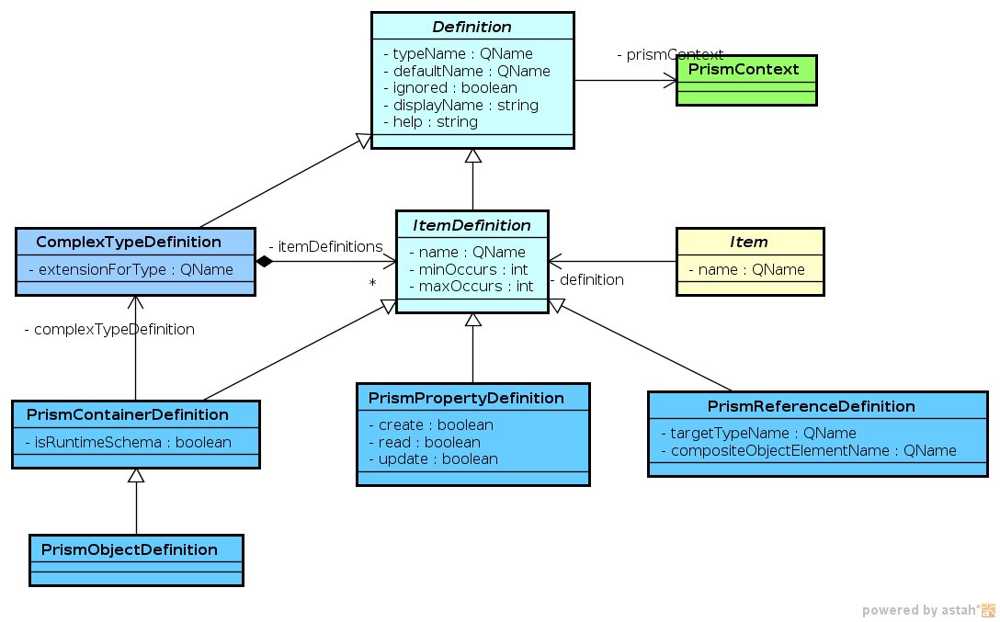

= Prism Data Structures
:page-nav-title: Data Structures
:page-wiki-name: Prism Data Structures
:page-wiki-id: 4423828
:page-wiki-metadata-create-user: semancik
:page-wiki-metadata-create-date: 2012-05-06T20:39:27.462+02:00
:page-wiki-metadata-modify-user: semancik
:page-wiki-metadata-modify-date: 2020-11-24T12:38:11.120+01:00

== Prism Items

Each prism data structure is constructed from _items_. An item can be of three types:

* *Property* is an item that contains useful value.
It usually contains primitive data types such as string, integer or date.
But it may also contain complex data structures.
Property is the "atomic" unit of information, it cannot be divided to smaller parts.
Property values can be added, deleted or replaced, but only a complete value.
Prism does not care for anything smaller than a property.

* *Reference* points to a prism object.
It is used to represent relationship between prism objects.

* *Container* contains other items: properties, references or other containers.
Containers build the structure of prism data.

== Prism Objects

*Prism objects* are special cases of prism containers.
Although prism data can be represented without objects, objects give a kind of order to the data.
Objects are supposed to be stand-alone meaningful sets of prism data.
Each object has its unique identifier called simple _object identifier_ or OID for short.
Prism _references_ are used to point to objects which is a method to create complex data structures.

== Prism Values

Prism items have values.
Property values contain real data, reference values contain OIDs and types of objects that they point to and container values contain a collection of sub-items.
All the values contain also meta-data: how they were created and the object that caused the creation of the value (e.g. object that holds an expression that generated the value).

Any prism item (except object) may have multiple values.
Such values are unordered.
Limiting the values to unordered makes it much easier to work with xref:/midpoint/reference/concepts/relativity/[Relativity].

== Prism Definitions

Every item may have a definition.
The definition specifies item value type, multiplicity, dynamics, access constraints, etc.

Complex types are not represented directly as item definition but rather indirectly.
The same complex type can be used in many definitions therefore it needs to be separate.
This also goes well with XSD and other schema languages.

Prism Definitions do not only relate to prism items, but they form its own structure: prism schema.
The prism schema is like a template for objects and can be used to validate the objects.

== Example

Following diagram provides an example of prism object that has XML representation of:

[source,xml]
----
<user oid="1234" version="1">
  <name>jack</name>
  <eMailAddress>jack@blackpearl.com</eMailAddress>
  <eMailAddress>jack@caribbean.com</eMailAddress>
  <activation>
    <administrativeStatus>enabled</administrativeStatus>
  </activation>
  <assignment id="111">
    <description>This is assignment 111</description>
    <targetRef oid="cda0757c-2e48-11eb-8885-af08d4e61ff0" type="RoleType"/>
  </assignment>
  <assignment>
    <description>Assignment without an ID</description>
    <targetRef oid="eb28d904-2e48-11eb-8992-9b95a16239bd" type="RoleType"/>
  </assignment>
</user>
----

Items are shown in orange, values are yellow.
All the items have appropriate definitions, shown in blue.

== Class Diagrams

NOTE: The class diagrams may be slightly outdated.
However, they still describe the reality reasonably well.

