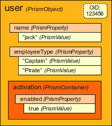

= Prism
:page-toc: top
:page-moved-from: /midpoint/prism/*

_Prism_ is a data representation layer.
Prism is responsible for parsing the data from _data representation formats_ such as XML, JSON or YAML.
Prism makes the data available to Java application in an abstract, format-independent way.

Prism can read and write the data in any of the common data formats (XML, JSON or YAML).
The data are made available to the application in a common form, regardless of which representation format was used.
Prism can then write the data to any data format as well.
The users may use any data format of their choice when working with the Prism-based application.

The data are usually available to the application through several _facets_.
One of the facets makes the data available in a form of generated code (Java beans).
This makes the use of the data very easy, it also allows the compiler to catch basic programming errors.
The other facet allows to iterate over the data, inspect the data structures and values in a way that is similar to working with hashmaps.
This method allows to access all the details about data (and metadata).
It provides access to data structures in a programmatic way, which allows the application to work with custom schema extensions.

Prism is a completely schema-based system.
Prism knows the definition of every data item in every data structure.
It knows data item names, data types, multiplicity and all the details of data model.
Prism is designed to work with _dynamic_ schemas, schemas that are available only in runtime.

Prism is a very powerful component.
It allows to write a code that is independent of the representation format (XML, JSON, YAML) or data storage mechanism (relational database, NoSQL, LDAP).
However, this flexibility has its cost.
Some concepts of Prism may seem unusual and strange, it needs some time and effort to get used to Prism.

.Why "Prism"?
TIP: An optical prism is a multi-faceted optical element that breaks the light to its constituent spectral colors.
Similarly to optical prism, the Prism framework has many facets and its "breaks" data to its constituent elements.
The data can be accessed by many ways (facets, or spectral colors).
It allows to inspect even a miniscule detail of the data or meta data.
Prism can also represent the data in many ways, such as XML, JSON or YAML.

== Data Representation Formats

Prism can work with the data in several data formats.
The following representations describe the same _user_ data structure in XML, JSON and YAML:

[source,xml]
----
<user>
    <name>alice</name>
    <fullName>Alice Anderson</fullName>
    <activation>
        <administrativeStatus>enabled</administrativeStatus>
    </activation>
</user>
----

[source,json]
----
{
    "@root" : "user",
    "name" : "alice",
    "fullName" : "Alice Anderson",
    "activation" : {
        "administrativeStatus" : "enabled"
    }
}
----

[source,yaml]
----
"@root": "user"
name: "alice"
fullName: "Alice Anderson"
activation:
    administrativeStatus: "enabled"
----

All the three files will result in the same Prism data structures when they are parsed.
Prism data can be stored in any of these formats.

== Prism Java API

Prism is a Java framework, designed to be used in Java applications.
Prism data are represented as Java data structures.
There are two ways how data can be accessed.

The native Prism way is to use the concepts of items and values.
This method is similar to working with hashmaps and lists.
The following pseudo-code illustrates the way how to access full name of a user data structure:

[source,java]
----
user.findProperty("fullName").getRealValue()
----

The Prism Java objects can be schematically illustrated as follows:

Then there is another way to access the data.
This method relies on a code generated from the schema at build time:

[source,java]
----
user.getFullName()
----

Both methods can be combined in any way to access the same data structure:

[source,java]
----
user.asObjectable().setFullName("Alice Adams")
...
user.findProperty("fullName").getRealValue() // Returns "Alice Adams"
----

The usual application indeed combines both methods.
The "bean" method based on generated code is used to easily access items specified in static schema.
This makes the code easy to write, taking full advantage of IDE auto-completion features.
This also means that compiler can quickly catch most usual errors.
The code is also easy to read and maintain.
However, this method works only for data structures that are part of the static schema that is available at compile time.
It is also quite simplistic and limited.
Therefore the "native" method is used to get full access to all the data.
It can be used to iterate over the data, visualize them, transform them, render user interface forms and so on.

Please see xref:data-structures/[Data Structures] page for more details.

== Prism Schema

Prism is a schema-based framework.
It is supposed to know definition of every data item it works with.
Prism knows whether the item is string, whether it is a structured container, what data items it contains, whether it is single-value of multi-valued and so on.

Prism is built on an assumption that the basic part of the data model (schema) is available during compile time.
This _static schema_ is used to generate the code for the "bean" Java classes, used to access Prism data structures.
However, Prism can also work with dynamic schemas that are available at run-time.
This method is usually used to extend the basic data model with custom data items (_schema extension_).
However, Prism can work with a schema that is dynamically discovered at run-time.

Prism schema is traditionally specified in a form of XML Schema Definition (XSD) language.
However, the capabilities of XSD are quite limited and extension of XSD with custom annotations has its limits.
Therefore, there is an ongoing effort to migrate Prism to xref:/midpoint/devel/axiom/[Axiom], a new modeling language for abstract data structures.

== Deltas

Prism data structures were designed with the https://wiki.evolveum.com/display/midPoint/Relativity[relative change model] in mind.
Prism library contains integral support for deltas: objects that describe relative change of prism items and objects.
Deltas can be applied (patch) to prisms to get the resulting state.
Prisms can be compared (diff) to generate deltas that describe the difference.
As prism items have proper definitions this process is much more reliable as compared to e.g. direct XML or JSON diffs.

Please see xref:concepts/deltas/[] for the details.

== Prism Evolution

Prism was originally developed as a data modeling layer of xref:/midpoint/[midPoint] and it is still part of midPoint project.
There is a plan to make Prism a separate, reusable component.

Prism is still in development.
The Prism API is not completely stable, it is still evolving.
However, the existing Prism data structures are used for many years and there is a considerable code base depending on them (i.e. almost all the code in midPoint).
Therefore no big disruptive changes are expected.

== See Also

* xref:/midpoint/devel/axiom/[Axiom] data modeling language
* xref:data-structures/[Data Structures]
* xref:concepts/deltas/[Prism Deltas]
