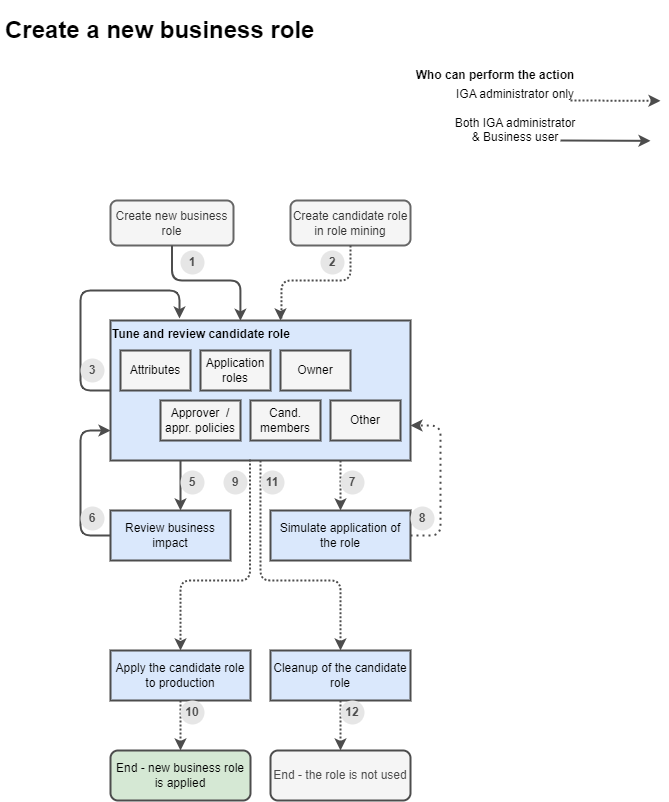

= Role design process - notes
:page-display-order: 100

This document describes design notes of _creation of new business_ role. This is *high level description* to understand big picture of role creation.

//TODO: Doplnit aj na konfiguraciu aplikacnej roly. Doplnit do schemy "provisioning"

The process can be applied to creation of new business role from scratch, or as a new candidate role in role mining.

== Notes to the process
[options="header", cols="18, 6, 16, 10, 40"]
|===
| Step
| Action
| Actor
| LS
| Notes

| Create new business role
| 1
| IGA Administrator or Business user
| -> Draft
a| Starting new business role wizard in GUI.

This start may be also done via some more complex operations (e.g. create copy of a business role).

| Create candidate role in role mining
| 2
| IGA Administrator
| -> Draft
a| Creation of new candidate role in role mining.

| Tune and review candidate role
| 3
| IGA Administrator or Business user
| Draft
a|Editing the content of the role. +
Running through the wizard or oepning individual tiles of already configured role and performing modification of :

    - attributes
    - application roles
    - governance (owners, approvers) / approval policies
    - proposed members (not yet implemented)
    - other (induced roles, ...)

Content of the role may be edited and modified by different people and in iterations. Role should be kept in this stage until intentionally and explicitly moved further.

Users may get back to the role and continue filling the details when they collect necessary information.

NOTE: Documentation of required changes (some TODOs). How to do it ? Cases ?

|
| 5
| IGA Administrator or Business user
|
| Button: "Review business impact"

| Review business impact
|
| Business user
| Draft
a| Panel displaying actual modifications of the role object and impact on other assignments - business view.

* Role modifications
* Changes of assignments (direct and indirect) +
"Following roles and access will be added, following roles and access will be removed. Role will be assigned to following users."

No user attribute changes here. If we display attributes we should display also accounts. It would be too complicated.

|
| 6
| IGA Administrator or Business user
|
| Just closing the page

|
| 7
| IGA Administrator
|
| Button: "Simulate application of the role"

| Simulate application of the role
|
| IGA Administrator
| Draft
a| Panel displaying actual modifications of the role object and impact on other assignments - technical view.

Probably standard simulation with added details about actual role modifications.

|
| 8
| IGA Administrator
|
| Just closing the page

|
| 9
| Business user or IGA Administrator
|
a| Button: "Apply to production"

NOTE: Should this be done by business user ? Probably yes.

| Apply the new role to production
|
| IGA Administrator
| -> Active
a| MP assigns new role to members, unassign application roles directly assigned (except roles assigned by rule)

Note: Unassign only when the role is replacing app roles (role mining).

|
| 10
|
|
| Probably no action necessary.

| END - new business role is applied
|
| N/A
| Active
| The new role is in full production and can be used.

|
| 11
| IGA Administrator
|
| Button: "Cleanup of the candidate role"

It will be used when the candidate role should not be applied and should be removed.

| Cleanup of the candidate role
|
| IGA Administrator
| -> Archived
| The role is set to LS: Archived.

Should we keep the role ???

|
| 12
|
|
| Probably no action necessary.

| END - the candidate role is not used
|
| N/A
| Archived
|

|===
