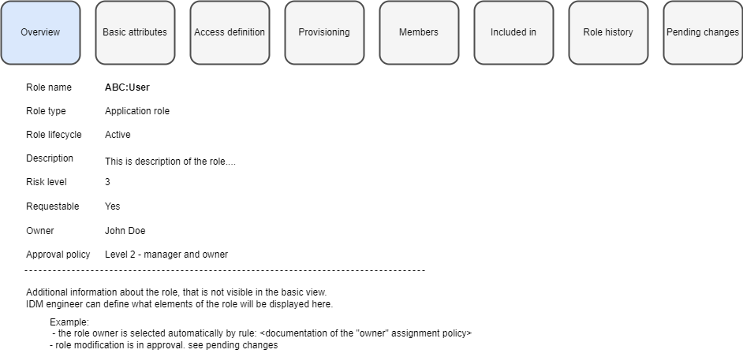

= Role screen - panels
:page-display-order: 300

Role should be displayed in _business look_ (or better in the _wizard look_) for standard users.
It means, that user opening existing role can see the screens in the same design how he saw them during creation of the role.
He will not need to learn two different user interfaces and won't get confused of role configuration.

This way, the interface will be easier and better oriented for business users or users who do not use midPoint interface often (e.g. application administrators who need to modify their roles).
Our standard user interface can still be displayed under link "Advanced view", so some options can be even hidden from the business view.

The tiles can represent our existing panels.

.A very rough example for business view of role

It doesn't matter whether tiles are horizontally or vertically alligned - this is for Patko. Just the tiles should be known for users who were creating the role and role wizard.

When role is created, the user can switch between tiles in any order. Like users are switching between panels.

Following table describes what should be displayed in each panel. With information whether the panel should be displayed while creation of new role.

== The structure of panels

[options="header", cols="7,10,30,7"]
|===
| Panel
| Content
| Details and notes
| Display in new role

| *Overview*
| Overview of the role (computed)
a|
This is main panel describing the content of the role.
Everything displayed in this panel is read only. Editable details are in other panels.

The panel displays defined attributes and some additional important overview information about the role. E.g. that role is under modification.

Examples of what can  be displayed in the role:

* Count of members
* Count of induced roles (for business roles)
* Documentation of autoassignment policy (e.g."The role is automatically assigned to users of type "E")
* Information that there is pending modification of the role (some approval cases related to the role)
* If there are triggers for recompute role members it should be displayed here as well

Engineer can define additional information that will be displayed in the role or hide some information (e.g. he can hide counts of members for large environments).
| No

| *Basic attributes*
| Panel basic attributes
a|
This is basic panel of the role. The same as existing basic panel.

Addionally, the panel will contain role owner and approval policy selection.

* The owner can be selected not using relations but just selecting user from list of users (like related objects). This is more natural and understandable by business users.
* The approval policy can be selected from already prepared approval policies (dropdown like in lookup tables)

| Yes

| *Access definition*
| Inducements (except construction inducements)
a|
Induced roles, services (applications). Should view actual inducements and provide option for editing.

During selection, inducements won't be displayed as tiles, but as a list - there is a lot of roles/applications. User should be able easily filter by type (role/service/org) and also by archetype.
| Yes

| *Provisioning*
| Construction inducements and assignments of metaroles
a|
The panel provides information: "Where assignment of this role create objects, and what exactly it will do on the resources."

Construction inducements here.
Should provide information on which resources an account is created.
Together with information of associations created (which group is being assigned) and mappings.

The mappings and associations are visible in the view.

Assignments of metaroles should be also displayed here.

| Yes (only for application roles)

| *Members*
| Assignments of this role (on User objects)
a|
To whom is this role assigned. Our existing members panel with slight modifications.

Assignments with relation other than owner, manager or approver.

We should display direct user by default and indirect upon request (some checkbox). Configurable by engineer as it is now.

NOTE: We should display somehow "candidate members" for business roles prepared by role-mining. But how ? Shouldn't it be specific panel ?
| No

| *Included in*
| Assignments and inducement of this role (on Role, ORG and Service(?) objects)
a|
ORGs, Roles, and Services where the role is already induced or assigned.

This panel displays "rules". Defined by inducement in ORG or Business role.

Read only.

NOTE: Shouldn't we display here as well some autoassignment policies ? Or some mappings in object templates ?

| No

| *Role history*
| Role history and  closed historical cases
a|
All role modifications. Audit records related to role modifications:

* modification of role object attributes (lifecycleState too)
* modification of assigment/inducements in the role object (also owner / approver relation)
* all events where the role is being assigned/induced to other Roles. _Are we able to do this ?_

Should not display role assignments/unassignments on User objects. This may be provided by request.

Engineer should be able to configure interval for default search for audit records and historical cases. Standard 24 hours doesn't make much sense, unlimited is problematic. This depends on installation.

This panel should display also historical (inactive) approval cases related to the role. Probably in independent table.

NOTE: When new owner/approver of the role is being approved, the case does not relate to the role but to the user.

| No

| *Pending changes*
| Cases related to the role
a|
Actual cases that are in approval.

Cases and their deltas in some better business display. E.g.:
Modification of attributes "description" -> in approval since 2024/01/10, approver "John Doe"
Modification of access -> in approval since 2024/01/15, approver "Ivan Deere, John Doe"

NOTE: When new owner/approver of the role is being approved, the case does not relate to the role but to the user. How to display this ?

| No

|===

There may be also some "Other" panel for some configuration we can't display in existing panels. Don't know what exactly should be there.

Advanced view (our existing user interface) should display the full set of configuration options.