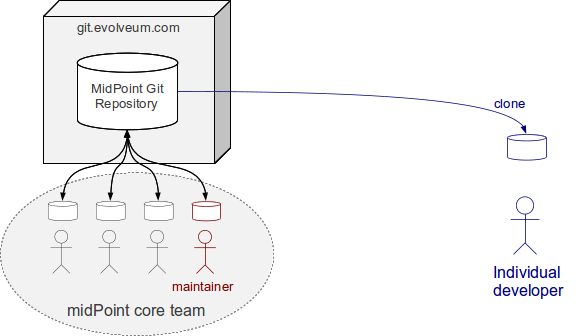
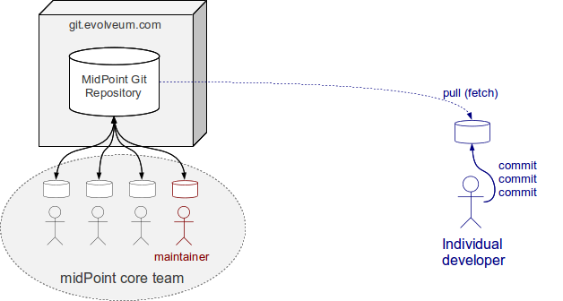
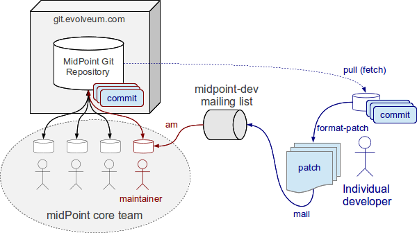
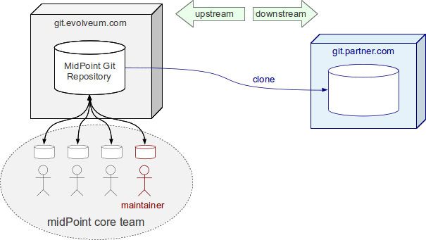
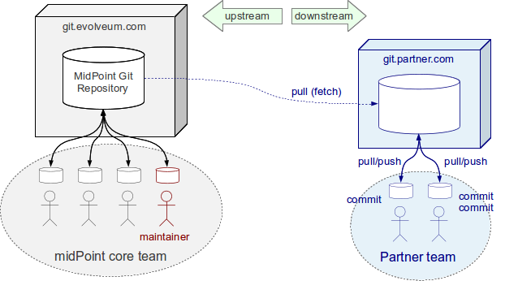
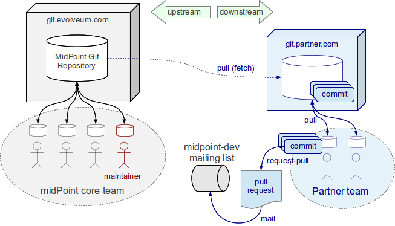
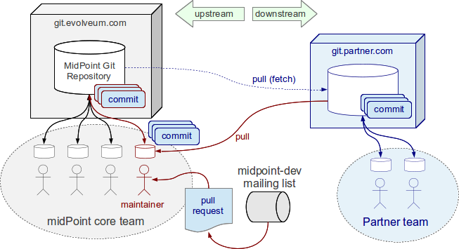

= Traditional Use of Git
:page-wiki-name: Traditional Use of Git
:page-wiki-id: 26411178
:page-wiki-metadata-create-user: semancik
:page-wiki-metadata-create-date: 2018-07-23T11:07:40.978+02:00
:page-wiki-metadata-modify-user: semancik
:page-wiki-metadata-modify-date: 2018-07-23T11:10:01.379+02:00
:page-toc: top
:page-upkeep-status: yellow

== Git

https://git-scm.com/[Git] is a https://en.wikipedia.org/wiki/Distributed_version_control[distributed version control] system that we use to maintain midPoint source code.
Its non-centralized character allows for a variety of development models and workflows.
This page describes just two possible scenarios but almost any approach supported by git is possible to use with midPoint development.
Although it is easy to start contributing to midPoint by following the instructions on this page understanding of Git principles is important for efficient midPoint development.
Please see our xref:/midpoint/devel/source/git/[Git] page for more details about git, location of our source code repositories, tips for using git software, etc.

== GitHub

Evolveum maintains midPoint repository on GitHub:

https://github.com/Evolveum/midpoint[https://github.com/Evolveum/midpoint]

This is the *primary midPoint repository*.
GitHub users may use this repository to submit a contribution.
This is the easiest way how individual developers can contribute to midPoint.
Please see xref:/community/development/[Development Participation] page and https://help.github.com/articles/fork-a-repo/[github documentation] for the details.

== Traditional Git Usage

=== Individual Developers

The easiest way for individual developers to contribute patches is by using github.
The process goes like this:

. Fork the repository.
Github provides a very convenient "fork" button that creates your own copy of midPoint repository.
You will have read-write permission to this copy.

. Develop your contribution on the "fork".
Use it just like any other git repository.

. Pull request.
Github provides another convenient button to issues a _pull request_ when your contribution is done.
The pull request is a request to merge your contribution to the main midPoint development branch.
When you issues a pull request the midPoint maintainer will be notified.
Shortly after this you will be contacted by the maintainer if any additional steps are needed.

=== Individual Developers: Mailing list

There is another and more traditional way how to contribute patches to midpoint by using the mailing list.
This does not require a github account, any server software or any other difficult setup.
Following examples assume the use of git command-line tools.
However similar approach should also be possible by using Git GUIs.
This method is ideal for contributing small pieces of work (one or two commits at a time) done by individual developers.
It is less suitable for contributing larger pieces of work and it is not suitable for larger development teams.

First the developer clones midPoint git repository:

[source]
----
git clone https://github.com/Evolveum/midpoint.git
----

Cloning the repository creates a private copy of the entire midPoint git repository.
The clone also checks out the current `master` branch which is used by midPoint core team for development.

[TIP]
.Credit and commit meta-data
====
 This process maintains the commit metada such as information about the original committer (the contributing author).
The name of the contributor will be properly recorded in the midPoint source code history.
Therefore please make sure that you have properly set up your git identity before doing the first commit:

[source]
----
git config --global user.name "John Doe"
git config --global user.email johndoe@example.com
----

====

The developer can review the code, fix bugs, add new features, etc.
by working on his private copy.
He can normally commit the changes to his repository:

[source]
----
git commit
----

The work may take some time and it may be distributed to several commits.
The midPoint core team is working in the meantime therefore the cloned repository may quickly get outdated.
It is recommended to regularly update the cloned repository to the most recent state using `git pull`:

[source]
----
git pull
----

The "pull" will fetch the changes from the main midPoint repository and merge them with the local commits done by the developer.

[TIP]
.Licence headers
====
Before contributing your work please make sure that any files that you create have appropriate Apache licence headers.
Existing files already have appropriate headers so there is no need to modify these.
Existing files can also be used as a template to copy&paste the licence headers.

====

When the work is done and tested (do not forget testing!) it is time to contribute it.
First make sure that your repository is reasonably up-to-date and that your work merges smoothly with current `master` branch:

[source]
----
git pull
----

Then use `format-path` git command to format your commits into e-mail messages:

[source]
----
git format-patch -M origin/master
----

This command will create several file with `.patch` extension (one for each commit).
These files are formatted as e-mail messages and can be directly used by your e-mail client to send to the `midpoint-dev` mailing list (see https://lists.evolveum.com/mailman/listinfo/midpoint-dev[https://lists.evolveum.com/mailman/listinfo/midpoint-dev]). Your work is now contributed to the project.

Please note that the patches sent to the mailing list contain the actual work being contributed.
In case of more substantial contributions this may be a lot of data.
It may be better to use a process based on _pull requests_ for contributors that plan to provide bigger contributions (see next section).

One of midPoint maintainers will notice the patch in the mailing list.
He will use the `git am` command to extract and apply the patches to the main midPoint repository.
The maintainer also checks that the patches apply cleanly and that everything works well.
The maintainer may contact the patch author in case of any issues.
If everything goes will the maintainer then pushes the commits to the main midPoint repository.

=== Development Teams

Larger development teams will need their own repository to work on.
The work in the team needs to be shared before it is complete and ready to be contributed.
Therefore a server-side clone of the main midPoint repository is needed.
This can be done by self-hosting the repository by installing git server-side tools or by using the services of a https://en.wikipedia.org/wiki/Comparison_of_source-code-hosting_facilities[hosting site] such as https://github.com/[GitHub].

First of all initialize your repository (referred to as "partner" in this section).
Initialize it by cloning the main midPoint repository.
This may be done easily by using the function of a web site or a combination of git client-side tools.

[source]
----
git clone https://github.com/Evolveum/midpoint.git
----

The main midPoint repository (maintained by Evolveum) is considered to be _upstream_. All changes flow down from this main repository to other partner repositories whose are considered _downstream_. For a correct cooperation it is important to keep the partner directory reasonably up-to-date.
This is responsibility of the partner teams and it is done by pulling the changes from the main (_upstream_) midPoint repository in regular intervals.

As the primary midPoint repository is hosted on gitHub the easiest way how to do this is actually use github "fork" button similarly as an individual developer would do.
However in this case it is better to "fork" into a shared repository instead of an individual one.
Github supports concept of _organization_ that is perhaps the best way how to set up a shared repository.
Simply create an organization on github and "fork" the primary midPoint repository into your new organization.
Then you can create teams and give permissions to developers in your organization.

[TIP]
.Credit and commit meta-data
====
 This process maintains the commit metada such as information about the original committer (the contributing author).
The name of the contributor will be properly recorded in the midPoint source code history.
Therefore please make sure that you have properly set up your git identity before doing the first commit:

[source]
----
git config --global user.name "John Doe"
git config --global user.email johndoe@example.com
----

====

The partner development team then works normally.
The team commits changes and shares their work by pulling and pushing from the partner repository.
The work on contribution may take quite a long time and it may contain a lot of commits.
It might be a good idea to create a topic branch for bigger contributions (but this is not strictly required).

[source]
----
git pull
git commit
git push
----

[TIP]
.Licence headers
====
Before contributing your work please make sure that any files that you create have appropriate Apache licence headers.
Existing files already have appropriate headers so there is no need to modify these.
Existing files can also be used as a template to copy&paste the licence headers.

====

When the contribution is ready to be submitted on of the partner team members creates a _pull request_. The pull request is a request to merge your contribution to the main midPoint development branch.
If you have forked the midPoint repository on github then you can use the very convenient "pull request" button that github provides.
This takes care of all the details.
Just push the button and follow the instructions.

If you are self-hosting the git repository you have to use-mail to transfer pull request.
Pull request is placed in a short e-mail message that describes the the partner team is finished with a work, what commits are part of this work and from where are the commits available.
The pull request does *not* contain the patches therefore it can be used to contribute quite a large pieces of work.
The pull request is then sent to `midpoint-dev` mailing list (see https://lists.evolveum.com/mailman/listinfo/midpoint-dev[https://lists.evolveum.com/mailman/listinfo/midpoint-dev]).
The work is now contributed to the project.

One of midPoint maintainers gets the pull request from the mailing list.
He adds the partner repository as one of his git _remotes_ and pulls the commits from it.
He does all merging with the current development branches as necessary.
The maintainer makes sure that the commits merge smoothly with the current code and that everything works well.
The maintainer may contact the patch author in case of any issues.
If everything goes will the maintainer then pushes the commits to the main midPoint repository.

== Tips and Best Practice

See xref:/community/development/[Development Participation] page.

== Licence and Credit

See xref:/community/development/[Development Participation] page.

== Development Guidelines

See xref:/midpoint/devel/guidelines/[Development Guidelines]

== See Also

* xref:/community/[Participation]

* xref:/community/development/[Development Participation]

* xref:/midpoint/introduction/openness/[Openness]

* xref:/midpoint/devel/source/git/[Git]

* xref:/midpoint/devel/guidelines/[Development Guidelines]

* https://git-scm.com/book/en/Distributed-Git-Contributing-to-a-Project[Git Book, chapter "Distributed Git - Contributing to a Project"]