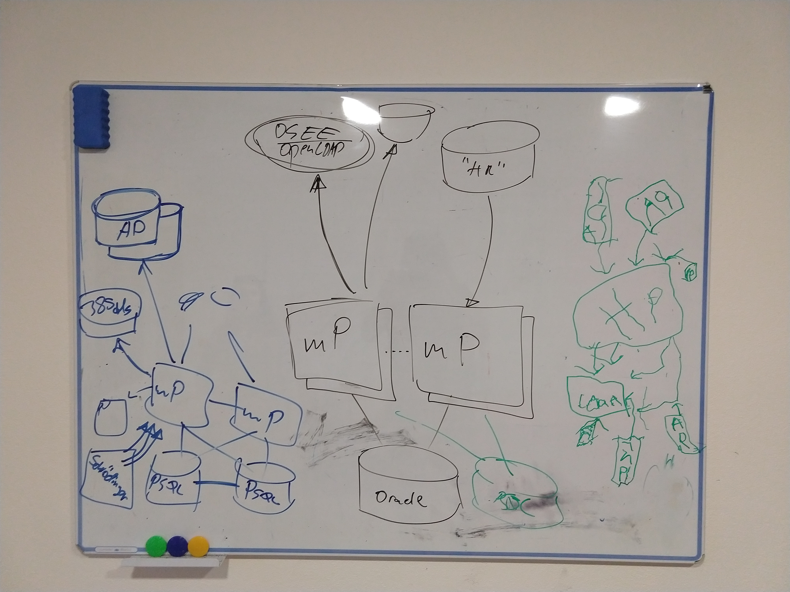

= Big Testing NG Ideas
:page-wiki-name: Big Testing NG Ideas
:page-wiki-id: 39583958
:page-wiki-metadata-create-user: semancik
:page-wiki-metadata-create-date: 2019-10-16T10:43:28.758+02:00
:page-wiki-metadata-modify-user: semancik
:page-wiki-metadata-modify-date: 2019-10-16T11:00:38.352+02:00
:page-upkeep-status: orange

This page describe the next-generation testing environment for midPoint.
Those are just rough plans and ideas from team discussions.

It looks like we need two somehow separate testing environments.
For the lack of better names let's call them "fat" (drawn in blue below) and "tall" (drawn in black below).

BTW, please suggest better names for these environments if you have an idea.
And do not mind the green drawing.
That is work of really junior engineer.

== Fat Environment

* Goal: continuous integration/e2e testing (functionality)

* Designed for automated, repeatable testing

* Driven by Jenkins

* Variety of resources and end systems (AD, OpenLDAP, 389ds, ) a.k.a "Resource ZOO"

* Easy to wipe, reset and start clean tests (except for AD and similar difficult resources)

* Relatively small number of identities (1k-10k)

* Complex interchangeable midPoint configuration (e.g. final setup of midpoint trainings)

== Tall Environment

* Goal: performance/scalability testing

* Designed for manual or semi-manual testing.

* Environment setup and tests execute manually by a tester (using scripts).

* Limited number of resources.

* Difficult to wipe and reset.
May take long hours or days.

* Large number of identities (1M-10M)

* Relatively simple midPoint configuration, small number of possible configurations