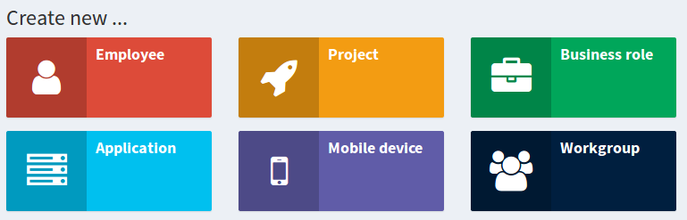

= Archetype Improvements (Planned)
:page-nav-title: Archetype Improvements
:page-wiki-name: Archetype Improvements (Planned Feature)
:page-wiki-id: 27361684
:page-wiki-metadata-create-user: semancik
:page-wiki-metadata-create-date: 2019-01-31T11:18:42.025+01:00
:page-wiki-metadata-modify-user: semancik
:page-wiki-metadata-modify-date: 2019-02-01T11:05:01.566+01:00
:page-planned: true
:page-upkeep-status: yellow

== Motivation

MidPoint contains basic wiki:Archetypes[archetype functionality] since midPoint 4.0. While even this basic functionality is very powerful, there is always a room for improvement.
This page describes possible archetype improvements for the future.

== User Interface

Archetypes are supported in midPoint user interface.
And when combined with wiki:Object+Collections+and+Views[object views] there is a way how to integrate the archetype to user interface so it looks almost the same way as static midPoint object types.
But the archetypes are still quite segregated under their primary object types of users, roles, orgs and so on.
E.g. archetype views are always second-level menu items.
It may be desirable to create a top-level menu items for some archetypes.
E.g. we may want to see "Employees" instead of "Users" as a top-level menu item.
Or we may want add additional top-level menu item for projects.
This is currently not supported, but it can be implemented.

In a similar fashion we may want to have a single page where any "archetyped" object can be created by a single click:

Our current thinking is that there may be an elegant way to support this functionality by using wiki:Customizable+Dashboards[Customizable Dashboards].

== Archetype Schema

MidPoint supports xref:/midpoint/reference/schema/custom-schema-extension/[custom schema extension] functionality for a long time.
The limitation is that this schema is bound to the static types, such as UserType or RoleType.
It cannot be applied to archetypes directly.
The workaround was to hide extra extension properties by using object template.
As object template can be archetype-specific, this works.
But it is quite difficult to maintain: adding new extension property for an archetype means hiding this property in all other archetypes.

Therefore it would be much better if each archetype can define its own schema extension.
And this is feasible to implement, but it is not necessarily easy.
The current "dogma" in midPoint is that the schema is known completely at midPoint start time (hence the need to a restart when extension schema is changed).
This can be changed, but it means dealing with fundamental layer that underlines midPoint (wiki:Prism+Schema[Prism schema]). But we will get to that eventually.
But as this is not an easy task, therefore it won't be anytime soon unless there is a xref:/support/subscription-sponsoring/[platform subscriber] asking for it.

== Misc Improvements

We would like to make following improvements to the archetype functionality:

* We would like to define custom lifecycle model for archetypes.

* Archetype support for all applicable objects (e.g. resource and task)

* Full support for assignmentRelation (e.g. support in assignment, indirect specification with inducement chaining, order > 1, etc.)

* Convenient user interface to manage archetype definitions.

* Archetypes for archetypes (meta-archetypes)

* Archetype-related UX improvements (e.g. more consistent application of archetype icons and colors)

== See Also

* wiki:Archetypes[Archetypes]

* wiki:Customizable+Dashboards[Customizable Dashboards]

* wiki:Object+Collections+and+Views[Object Collections and Views]