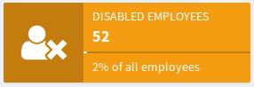
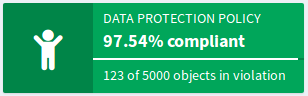
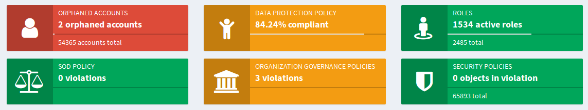

= Compliance
:page-wiki-name: Compliance
:page-wiki-id: 26411433
:page-wiki-metadata-create-user: semancik
:page-wiki-metadata-create-date: 2018-08-24T16:15:29.694+02:00
:page-wiki-metadata-modify-user: semancik
:page-wiki-metadata-modify-date: 2019-10-14T10:08:58.435+02:00
:page-planned: true
:page-toc: top
:page-upkeep-status: orange

== Introduction

Information technology does not exist in an isolated world.
There are many external factors that influence data processing in information systems.
Among those are regulations, legislation, recommendations, best practices and other limitations and guidelines.
Those issues affect the identity management field in a significant way.
And it is not difficult to understand the reasons.
Information technologies govern major part of our lives.
And identity management technologies in particular work with very sensitive and powerful type of data: personal data.
This is further amplified by the fact that identity management systems control access to other sensitive assets.
It is no wonder that identity management technologies are a prime target for regulations.

But there is one major concern that makes compliance with the regulations real nightmare: complexity.
Identity management may seem like a simple task.
In reality, it is anything but it.
It is common that identity management systems govern complex xref:/midpoint/reference/cases/approval/[processes] based on sophisticated xref:/midpoint/reference/roles-policies/policies/policy-rules/[policies and rules].
The processes are built to maintain identity-related structures such as xref:/midpoint/reference/roles-policies/roles/rbac/[role-based access control (RBAC)] structures, xref:/midpoint/reference/org/organizational-structure/[organizational hierarchies], project-oriented structures, self-managed organizations and all the other kinds of identity-related structures.
This gets even more complex by internal feedbacks in the system: processes influence the role structure which can influence organizational structures which influence the processes.
And all is supposed to be governed by policies.
But nothing in this system is really static.
Roles, organizational structures and even policies have their lifecycle.
They are changing all the time.
And of course there is a lifecycle of the identities themselves.
Identity management system is in a state of an ever-changing dynamic flow.

It is almost impossible to apply regulations to such a system - unless such a task is assisted by sophisticated technology.
Fortunately, identity management systems are in ideal position to assist with identity governance, compliance and identity management.
It is all almost natural evolution: identity management systems already manage the identities, roles and policies.
It is quite a straightforward idea to extend capabilities of identity management systems to also evaluate compliance of the policies, roles and identity relations.

The idea itself is simple, but actual implementation may be full of tricky details and complexities.
Fortunately, midPoint was designed with evolution and flexibility in mind.
And evolving midPoint into a comprehensive identity governance and compliance system is perfectly feasible.
However, the effort is perhaps too big to be taken in a single step.
Therefore we have divided the compliance functionality into a number of steps.
Each step is build upon previous one - and all the compliance features are firmly based on features of a proven midPoint platform.

== Planned Features

=== Step 1: Compliance Reporting

Policies, roles, configurations, data mappings - together they create sophisticated, but also very complex structure.
First step in any compliance functionality is to bring visibility into those structures.
And even a seemingly simple mechanism can provide enormous improvements.
One such a mechanism is already planned for midPoint development: xref:/midpoint/reference/admin-gui/collections-views/[Object Collections and Views].

The idea of object collections may look simple, but there is unexpected strength in it.
Object collections can be slightly extended to support simple compliance reporting.
Simply speaking, the collection itself provides already a form of compliance reporting.
E.g. even a simple filter can be used to show disabled users or active roles.
If we add ability to use xref:/midpoint/reference/expressions/expressions/[expressions] in filters then this feature gets more interesting as we would be able to show all the users that are about to expire in next two weeks.
If we add a bit of metadata (e.g. timestamp of last lifecycle transition) then the things may be get even more interesting, e.g. we can get ability to show all the roles in `proposed` lifecycle state that are stuck in this state for more than a month.
Or we could show all the orphaned accounts that were detected in last 24 hours.

This will give us very basic compliance reporting.
But this can be extended even further.
We can extend object collection with the definition of the _domain_.
In other words the collection may know what is the set of all the objects from which the collection is filtered out.
For example the collection of _disabled employees_ may know that it is in fact selected from list of _all employees_.
Then the collection can evaluate percentages.
For example, the _disabled employees_ collection may show that there are 52 disabled employees, which is 2% of all employees.

The collections could be easily presented in user interface, like this:

This can be accompanied by a list of disabled employees, therefore an administrator can take action to remediate the situation.

This compliance reporting gets even more interesting when it is coupled with xref:/midpoint/reference/roles-policies/policies/policy-rules/[policy rules].
When a policy rule is evaluated, a special-purpose _policy situation_ property is set.
The policy situation is set in every object or even every xref:/midpoint/reference/roles-policies/roles/assignment/[assignment] for which the policy rule is triggered.
Then the _policy situation_ can be used to report on the result of policy rule evaluation.

For example, let's assume that we are about to implement new xref:/midpoint/reference/roles-policies/policies/segregation-of-duties/[segregation of duties (SoD)] policy.
However, we do not want to blindly roll out the policy, as existing role assignments may immediately be in violation and that may impact the business.
Therefore we would like to know how many existing assignments are in violation of the policy.
We may want to manually resolve the situation for each violation.
But that may take some time, it may take days or even weeks.
And we would like to monitor the progress.
Therefore this is what we can do:

. Set up SoD policy rules.
Those rules will *not* enforce the policy.
Not yet.
The rules will just set a special policy situation when evaluated.

. Recompute all the objects to evaluate the assignments and policies.
This will set the policy situations in objects.

. Set up object collection that collects all the objects and assignments with that policy situation.

. Use object collection to list all the objects that are in violation, setup dashboard widget to monitor the progress and so on.

This is a very flexible mechanism as it relies on xref:/midpoint/reference/roles-policies/policies/policy-rules/[policy rules] that are already quite flexible.
E.g. several policy rules may use the same policy situation, therefore their effect may be evaluated together.
E.g. several rules may work together to implement _data protection_ policy and the progress of data protection implementation can be monitored by using a single collection.
This is a first step to create complex, manageable policies that can be extended in the next steps.

[TIP]
.Synergy: Object lists/views and policy rules
====
Compliance reporting is a xref:/midpoint/features/synergy/[synergistic feature].
It is designed as a natural extension of another planned feature:
xref:/midpoint/reference/admin-gui/collections-views/[Object Collections and Views].
It is expected that the capabilities of object views will improve in time.
There are expected user experience improvements, better customization support and so on.
Each time collections&views are improved then also compliance reporting will get the same improvements.

In addition to that compliance reporting is firmly based on xref:/midpoint/reference/roles-policies/policies/policy-rules/[policy rules] which form a base of a very powerful midPoint feature.
Policy rules are supported in current midPoint versions.
However, this feature has not yet reached its full potential.
As the policy rules are going to evolve, compliance reporting will become ever more powerful.

====

=== Step 2: Compliance Dashboard

First step is all about seeing a single compliance aspect in isolation.
However, it is not enough to comply with just one regulation or recommendation.
Information security landscape is far from being flat.
The system should be kept in compliance with existing policies, while at the same time it should converge to be compliance to new policies, updated recommendation and business needs.
This is a multi-dimensional space.
Watching each compliance aspect in isolation is useful, but it would be much more useful to see them together in a form of _compliance dashboard_.

This is a configurable and partially customizable dashboard dedicated to compliance.
It can be used to see many compliance aspects at the same time.
Therefore compliance officer can see the state of the system at the first sight.
Click on each dashboard widget will bring up detailed information about that specific aspect and any potential problem can be immediately acted upon.

See also xrefv:/midpoint/reference/master/admin-gui/dashboards/compliance-dashboard/[]

[TIP]
.Synergy: Dynamic customizable dashboards
====
Compliance dashboard is a xref:/midpoint/features/synergy/[synergistic feature].
It is designed to fit together another planned midPoint feature: dynamic and xref:/midpoint/reference/admin-gui/dashboards/[customizable dashboard].
It is planned that future midPoint versions will have ability to define dynamic dashboards containing various widgets, each widget displaying a specific aspect of the system state.
One widget may display operations that are currently running, another widget may display recent errors detected in the system, yet another widget may display performance indicators.
In that case compliance dashboard will be just a special case of such a dynamic and customizable dashboard.
In this case the compliance dashboard may seamlessly take advantage of the dynamic nature of all the other midPoint dashboards.

====

=== Step 3: Thresholds and Notifications

Data collection, analysis and metrics are undoubtedly important.
But the metrics themselves will not make anyone compliant.
It is an appropriate action taken at appropriate moment that at the very heart of compliance.
But an administrator must know that something is wrong before he can take the action.
Dashboards are an excellent tool to get an overview.
But administrators have better things to do than to sit all day in front of a screen and watch the dashboards.
Therefore it is very important that midPoint notifies administrators in case that things go really wrong.

However, midPoint needs to know what "really wrong" means.
We probably do not want to wake up an administrator in the middle of the night just because we have discovered an old disabled account.
That can surely wait for the morning.
But if there is an active orphaned account with superuser privileges - that may require immediate attention.
What we need here is definition of conditions and thresholds that can describe various compliance situations.
Action can then be associated with such situations.
Mild violation could only change the color of associated dashboard widget.
More serious violation could send out mail notification.
And severe violation could raise a red alert.

Existing midPoint notification system can be reused and extended to send out the notifications.
This may include mail notifications, mobile text messages (SMS) or any similar system.

=== Step 4: Compliance and Synchronization

Many compliance metrics are focused on roles, policies, organizations or other objects that are stored inside midPoint.
And one can go quite a long way towards compliance by using this approach.
But ultimately, it is not the policy that really matters.
It is the reality.
The policy and the user data may indicate that everything is in order.
But midPoint has a strong connection with reality.
xref:/midpoint/reference/synchronization/introduction/[Synchronization] takes place almost all the time.
And if we look around it is just a question of time when we discover something that is not all right.
MidPoint can discover an orphaned account.
Or we can discover that a crucial account that should be there was deleted.
Or maybe this particular account has superuser privileges, but it does not any role that would justify that.

Some such situations are handled automatically by xref:/midpoint/reference/synchronization/introduction/[synchronization] mechanism.
Mappings can be used to correct attributes and privileges that are wrong.
Privileges can be automatically revoked, accounts may be disabled.
But midPoint relies on input data to make correct computation and they may be wrong or outdated.
Therefore that particular account really needs superuser privileges, we just do not know about it.
And it may not be the brightest idea to act blindly.
This may be emergency situation and the privileges may be needed for disaster recovery purposes.
Removing the privileges automatically or disabling an account may make the disaster significantly worse.
Therefore it may be wiser to notify the administrator and ask for a decision.

This is in fact yet another part of compliance mechanisms.
MidPoint synchronization routines discover policy violation - an object which does not comply with a policy.
But instead of taking immediate action we will just record the incident - and maybe notify the administrators.
The administrators can then take any action they deem appropriate in that specific situation.

MidPoint synchronization mechanisms were designed for extensibility.
Therefore we can extend the set of synchronization actions to include compliance-related actions such as notification.
We can also simply mark the violating xref:/midpoint/reference/resources/shadow/[shadow object] with a specific policy situation marker.
Therefore such object will be seen in compliance dashboards and an administrator can take manual action to remediate the situation.

Some situations are easy to detect by synchronization, for example new account or missing account.
Those are big event that are "granular" enough to be detected at this stage.
But there are more subtle situations that are more difficult to detect.
Maybe an attribute values is wrong.
Maybe the account is member of a group where it should not belong.
Those events cannot be easily detected by synchronization which works with quite rough-grain events.
But there are fine-grain in midPoint: recomputation of attributes values, application of roles, attribute-level reconciliation, processing of xref:/midpoint/reference/resources/entitlements/[entitlements] and so on.
Those mechanisms can detect violations at a very fine level.
However, the only action that midPoint cat take now is to fix the situation by automatically correcting the values.
But this can be improved.
There may be reactions that are similar to the synchronization reactions.
But this kind of reactions may work on a much finer level.
They can just record the situation and wait for manual action.
Or they can do something even smarter - which leads us to xref:/midpoint/features/planned/remediation/[remediation].

=== Step 5: Scheduled and Printable Compliance Reports

Most organizations are perfectly fine with compliance dashboard and on-line compliance reports.
But some organizations require more formalities.
Maybe a pretty, human-readable and printable report on the progress of data protection compliance is needed to be sent out every week.

MidPoint already has xref:/midpoint/reference/misc/reports/[reporting features] that can be used to create similar reports.
However, reusability of current reporting features for the purposes of compliance reporting is quite limited.
It is possible, but it is very likely that a heavy customization of the reporting mechanism may be needed to create nice compliance report.
But this can be improved.
We can create reporting templates that are tailored especially for the purposes of compliance reporting.
This is likely to require new functions in midPoint reporting components, but those functions can be created.
MidPoint should be fully capable of creating camera-ready printable compliance reports.

=== Follow up: Remediation

Compliance features are without any doubt necessary.
And they will make an excellent extension of existing midPoint features.
But we do not plan to stop there.
Compliance features can be used to find policy violations and to act on them to remediate the situation.
However, such actions may still not be entirely easy to do manually without any assistance.
Fortunately, midPoint could provide such assistance.
We plan to implement features that could significantly improve xref:/midpoint/features/planned/remediation/[remediation] process.
We consider this to be a natural extension of compliance features.

Please see xref:/midpoint/features/planned/remediation/[Remediation] page for more details.

== See Also

* xref:/midpoint/reference/admin-gui/collections-views/[Object Collections and Views]

* xref:/midpoint/reference/roles-policies/policies/policy-rules/[Policy Rules]

* xref:/midpoint/reference/synchronization/introduction/[Synchronization]

* xref:/midpoint/features/planned/remediation/[Remediation]