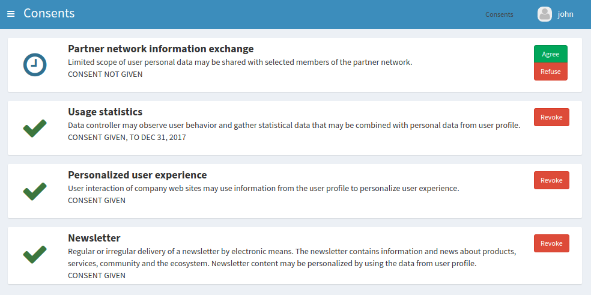
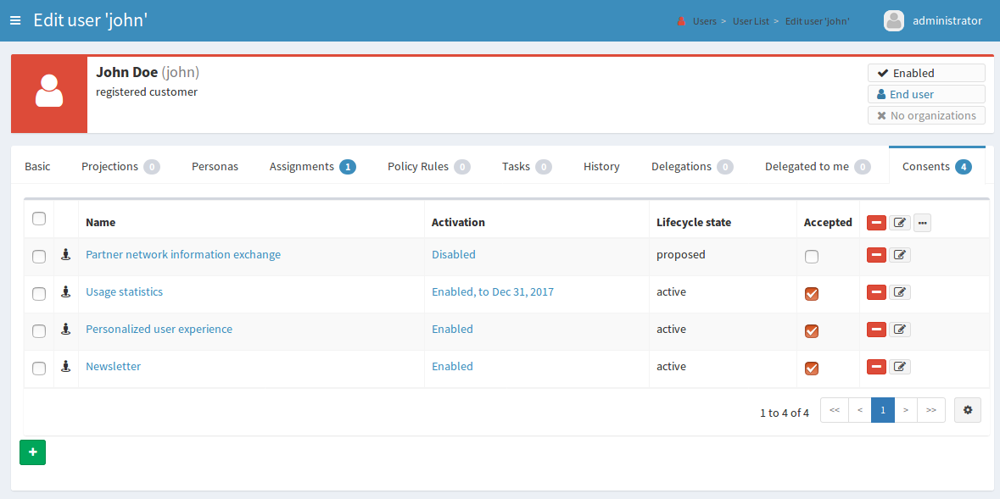

= Consent Management (GDPR)
:page-wiki-name: Consent Management (GDPR)
:page-wiki-id: 24675082
:page-wiki-metadata-create-user: semancik
:page-wiki-metadata-create-date: 2017-08-29T11:12:28.935+02:00
:page-wiki-metadata-modify-user: vera
:page-wiki-metadata-modify-date: 2018-01-16T16:11:47.120+01:00
:page-planned: true
:page-upkeep-status: yellow

== Motivation

Identity management and governance is all about processing personal information.
Traditional identity management usually deals with information about employees and contractors and the processing is quite strictly limited to the job responsibilities of employees.
But identity management and governance solutions are evolving.
Today's IDM systems often manage information about customers, citizens, social network users and so on.
While the technical details of personal information processing for such user groups are almost the same, there are crucial methodology differences.
What we deal here with is the information about people with whom we do not necessarily have any strong legal contract.
Personal information processing for these user classes was mostly determined by "terms of service" statements and weak legislation.
Therefore, personal information processing was some kind of a grey zone and poor information processing methods were often tolerated.
But that is about to change as soon as the General Data Protection Regulation (GDPR) becomes enforceable.

[TIP]
.General Data Protection Regulation (GDPR)
====
The General Data Protection Regulation (Regulation (EU) 2016/679) is a regulation of European Commision aimed at strengthening the data protection.
GDPR intention is to give control back to people over their personal data.
Its primary concerns are EU citizens and companies, but it also affects subjects that make business within European Union, that process data about EU citizens and so on.
Therefore, this regulation is likely to have a very broad world-wide impact in a long term.
====

GDPR is addressing various aspects of data processing.
But perhaps the most obvious changes that GDPR brings are affecting the way how users consent to processing of their data.
First of all, GDPR requires that there must be a _lawful basis_ for data processing.
If there is no legal basis, then personal information cannot be processed.
The lawful basis may be an employee contract, business contract or other legitimate interest.
But for some user classes there is no such legal basis.
Therefore, the only option that allows data processing for such users is their explicit consent.

However, the consent is no easy way either.
The regulation is quite strict about the way how consent is acquired and managed.
The consent cannot be bundled within "terms of service" or similar agreements.
The user must be clearly informed about to whom and for what the consent is given.
The consent must always be explicit.
For example, the pre-ticked opt-in boxes are quite explicitly prohibited.
The consent must always be easily revocable.
The user has the right to see what she or he has consented to and revoke the consent at any moment.
Revocation of consent must be as easy as acquisition of consent.
Therefore, if the consent is acquired by ticking a box then it must be revoked in a similar way.
Sending a letter to revoke consent would most likely not be acceptable any longer.
When the consent is revoked and there is no other legal basis for data processing then the data processing must stop immediately.
All the applications that maintain copies of the data will be affected.

It gets even more complex.
You may already have user consent to process data.
But existing consent is not likely to comply with those rules.
Consent was often bundled with terms of service.
Maybe it was acquired by a pre-ticked box.
Maybe the user was not clearly informed.
Such consent will no longer be acceptable after May the 25th.
In those cases the consent must be re-acquired before the regulation becomes enforceable.

The big problem is that the current IT applications are not designed with the good data processing methods in mind.
Vast majority of applications does not understand the concept of consent.
The best that some applications can do is to present a user with a checkbox before the service is provisioned.
But there is no management of consent after that moment.
There is usually no easy way how to display given consent, how to revoke the consent, how to manage overlapping consents with different validity or for different scopes of processing.
And even if there was such support in applications this has to be supported by each application separately.
This is going to be extremely expensive.
And even worse, this would undoubtedly lead to a poor user experience and in fact it may also violate the regulation.

Fortunately, there is a convenient solution.
In fact the solution has been existing for years.
There simply was only a very little commercial interest to develop the solution's details.
We all know what that solution is: identity management and governance.
The IDM systems can already reach to all the crucial applications and manage identity data.
This is exactly what is needed to implement proper data protection methods.
All that is needed is a modification of the existing approach to provide proper user interfaces and additional mechanisms.
But we already have a very solid foundation to build that on.

The concept of consent is undoubtedly an important part of GDPR.
And a good IDM system can make a proper consent management feasible - or even easy.
However, it is good to keep in mind that the consent is only one of the lawful bases for data processing.
And in fact consent is usually only a last resort: if there are other legitimate interests to process the data then it is recommended to use those instead of consent.
Good IDM system can manage not only consent, but also other legitimate interests.
See xref:/midpoint/features/planned/lawful-bases-for-data-processing/[Management of Lawful Bases for Data Processing (GDPR)] for more information.

== Consent Management

We propose a new consent management functionality for midPoint.
The new functionality will be provided to end users (e.g. customers) and also to Data Protection Officers (DPOs):

* DPOs will be able to set up data protection scopes that specify purpose and scope of intended data processing.
MidPoint will maintain the record of user consents to the data protection scopes for later review.

* End users will be able to see the list of all the consents that they have given.
All the details will be displayed: when the consent was given, to what the user consented, to whom was the consent given, the consent scope and so on.

* End users will be able to revoke the consent.
Consent revocation will automatically trigger deprovisioning of user data - unless there is another lawful basis that justifies continued data processing.

* Overlapping consents will be properly managed.
For example midPoint can manage pre-GDPR consents that automatically expire on 25 May, continuing processing of data only for those users where the GDPR-compliant consent was re-acquired.

* DPOs can review active consents and other xref:/midpoint/features/planned/lawful-bases-for-data-processing/[lawful bases] for any user.

* User consent processing will be compatible with processing of other lawful bases and legitimate interests.
Consent can seamlessly overlap with other lawful bases.
MidPoint will compute the resulting data management scope and carry out all necessary identity data modifications.

From the user perspective, the consent management will be available in two flavors based on intended audience.
The end users will be presented with intuitive user interface to manage their consents.
The interface will be simplified not to confuse the users and clearly present the required information.
This will be a brand-new part of midPoint end-user self-service user interface.

The data protection officer will be able to use full power of midPoint administration user interface.
However, there will be new views intended especially for DPOs.
Those views will show consent given by individual users.
When support for other xref:/midpoint/features/planned/lawful-bases-for-data-processing/[lawful bases] is also implemented, those two screens will be integrated into a single unified view.
The information will be presented in a compact and customizable way, so the specific presentation can be tuned to exact requirements allowing efficient execution of DPO duties.

== Implementation

The implementation of consent management will follow midPoint principle of reuse.
The consent will be modelled as an assignment, the protection scopes will be modelled as special types of roles.

The protection scope will specify all the details mandated by GDPR for consent: to whom is the consent given, what is the scope of consent and so on.
But being a role it can also define all the technical implementation details that the consent implies: the target systems where the data will be managed, which properties are to be managed and so on.
Therefore, both legal and technical side will be maintained in a single object, so it will be easy to keep them consistent.

The consent itself will be modelled as an assignment to the role which represents the protection scope.
When a consent is given, such assignment is created.
This will automatically trigger provisioning of all the accounts that are allowed by the consent and proper set up of all the attributes.
But most importantly this also works the other way.
When a consent is revoked, then deprovisioning is automatically triggered.
The data for which there is no other lawful basis will be removed, the accounts deleted or archived.
Existing and well proven midPoint mechanisms will be used to execute such data management tasks.

By reusing existing mechanisms we are also enabling all the advanced features in a very natural way.
For example the consents may be given only for a specific time period.
For this we can reuse existing xref:/midpoint/reference/concepts/activation/[assignment validity constraints.] The protection scopes may be hierarchical: one protection scope being subset of another protection scope.
xref:/midpoint/reference/roles-policies/roles/rbac/[Role hierarchy] can be reused to model this behavior.
And so on.

There are many potential improvements of this mechanism for the future.
For example assignment lifecycle can be used to model consents that were solicited, but not yet given.
This can also be used for expired and revoked consents.
Protection scopes and even individual consents might be made to be part of certification campaigns and so on.

One extremely interesting feature is a seamless integration with other xref:/midpoint/features/planned/lawful-bases-for-data-processing/[lawful bases] that allow data processing - once that feature is implemented.
The other lawful bases will be also modelled as protections scopes, which are in fact a special type of a role.
Therefore, if both consent and other lawful basis allow processing of data in a certain system, midPoint will seamlessly compute the complete set of attributes and privileges given by both protection scopes.
When a consent is revoked then only those attributes not given by any other lawful basis are removed.
The attributes for which there is still a lawful basis will remain provisioned until that lawful basis is applicable.
In fact, the only thing that makes consent different from other lawful bases for processing is that the consent is managed by the end user.
It is the end user who gives and revokes the consent.
But in all other aspects the management of consent will be perfectly unified with the management of other lawful bases for data processing.
This will make the resulting solution clean, elegant and easy to maintain in a long run.

== See Also

* xref:/midpoint/features/planned/lawful-bases-for-data-processing/[Management of Lawful Bases for Data Processing (GDPR)]

* xref:/midpoint/reference/roles-policies/roles/assignment/[Assignment]

* xref:/midpoint/reference/roles-policies/roles/rbac/[Advanced Hybrid RBAC]