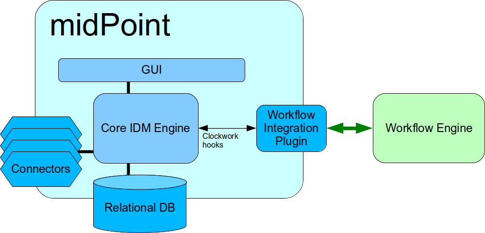

= External Workflow Integration Plugin
:page-wiki-name: Workflow Integration Plugin
:page-wiki-id: 39583864
:page-wiki-metadata-create-user: semancik
:page-wiki-metadata-create-date: 2019-10-08T15:08:26.721+02:00
:page-wiki-metadata-modify-user: semancik
:page-wiki-metadata-modify-date: 2019-10-11T12:43:49.421+02:00
:page-planned: true
:page-upkeep-status: yellow
:page-toc: top

== Solution

MidPoint should be able to forward a process to a workflow system and continue the process when workflow engine is finished.

MidPoint has an ability to suspend existing processes.
This ability is used for internal xref:/midpoint/reference/cases/approval/policy-based-approvals/[approvals] in midPoint.
The same ability can be used to integrate midPoint with an external workflow engine.

Workflow integration plugin is needed as a _glue code_ between midPoint and a workflow engine.
The plugin can integrate into midPoint processes using xref:/midpoint/reference/concepts/clockwork/clockwork-and-projector/[clockwork] hooks.
The hooks can be used to intercept the process and suspend it (switch it to "background"). Then a similar mechanism is used to resume the process once the external workflow is finished.

Theoretically the implementation is quite straightforward.
However, there is a lot of potential problems:

* Clockwork hook interface is not officially a public interface.
Yet.
It is used for internal integration.
But it was not completely validated and interface definition may change.
This interface needs to be stabilized, documented and open to public use.
It is expected that first integration with an external workflow engine will needs some changes or extensions in the interface.

* There is no robust plugin system in midPoint.
Therefore the plugin has either to be bundled into midPoint or there must be a custom build by using xref:/midpoint/reference/deployment/maven-overlay-project/[overlay project].

* How to pass parameters to workflow and how to interpret to results? Do we need a hardcoded "midPoint interface" to workflow processes? Or do we need expressions that can be used to easily customize the integration?

* Expression-based plugin will require that midPoint expression evaluation code is exposed to third-party plugins, interfaces need to be stabilized and documented.
We also need to think about security (e.g. xref:/midpoint/reference/expressions/expressions/profiles/[Expression Profiles]).

* How to synchronize status of midPoint and workflow engine in case of failures? E.g. in case that the notification about completed process is lost.

* Plugin configuration - where do we store that? Do we need a new object type? Can we use system configuration?

* How to monitor the status of the plugin? How do we know that the midpoint-workflow connection went down?

Those issues can be resolved during the course of midPoint development.
However, some changes into midPoint code may be needed to properly support all the workflow use cases.

== Workflow engines

It is obvious that every workflow engine will need its own plugin in midPoint.
The plugin will either be hardcoded to a specific set of processes.
Or it may be a more generic plugin where data translation is driven by expressions.

One of the first candidates for workflow integration is Camunda.

== See Also

* xref:/midpoint/reference/concepts/workflows/[]
* xref:/midpoint/reference/concepts/workflows/external-workflow-integration/[]
* xref:/midpoint/reference/cases/approval/policy-based-approvals/[Policy-based approvals]
