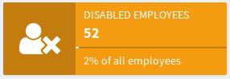
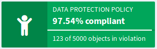

= Object Collections and Views Improvements
:page-wiki-name: Object Collections and Views Improvements
:page-wiki-id: 30245461
:page-wiki-metadata-create-user: semancik
:page-wiki-metadata-create-date: 2019-04-24T14:16:39.341+02:00
:page-wiki-metadata-modify-user: semancik
:page-wiki-metadata-modify-date: 2019-04-24T15:25:59.908+02:00
:page-upkeep-status: red
:page-upkeep-note: Reflect recent developmnet
:page-toc: top

== Motivation

There are many motivations for this feature, each of them looking at the feature from a slightly different angle.

=== User Experience

Firstly, there are lists of objects that are used quite frequently, such as list of all employees, list of all contractors, list of all business roles and so on.
It would be nice to have such lists pre-defined and then reuse that definition in many places:

* Menu: It would be nice to have a menu item to quickly list all employees or business roles.
Just click on that and there is a user list that contains just the employees.

* Dashboard: Having a custom dashboard widget that displays object collection and works as a quick access to see the collection would be nice as well.

* Search: Global search field may be extended with a control that allows searching in specific collection (e.g. employees, business roles, ...)

In addition to that, there may be specific views defined for a collection.
E.g. we would like to see different columns when we list employees than the columns that we see for business roles.
Similar approach may be applied to ordering, default items present in the search box and other details of user interface presentation.

=== Lightweight Reporting

As midPoint already has ability to export results of a search operation as CSV this can be used to create quick ad-hoc reporting capability.
Just define frequently-used filter as object collection.
Then click on that collection in menu, click on the CSV export button and import that to your favorite spreadsheet processor.

=== Compliance Reporting

The idea of object collections may look simple, but there is unexpected strength in it.
Object collections can be slightly extended to support simple compliance reporting.
Simply speaking, the collection itself provides already some form of compliance reporting.
E.g. even a simple filter can be used to show disabled users or active roles.
If we add ability to use xref:/midpoint/reference/expressions/expressions/[expressions] in filters then this feature gets more interesting as we would be able to show all the users that are about to expire in next two weeks.
If we add a little bit of metadata (e.g. timestamp of last lifecycle transition) then the things may be get even more interesting, e.g. we can get ability to show all the roles in `proposed` lifecycle state that are stuck in this state for more than a month.
Or we could show all the orphaned accounts that were detected in last 24 hours.

This will give us very basic compliance reporting.
But this can be extended even further.
We can extend object collection with the definition of the _domain_. In other words the collection may know what is the set of all the objects from which the collection is filtered out.
For example the collection of _disabled employees_ may know that it is in fact selected from list of _all employees_. Then the collection can evaluate percentages.
For example, the _disabled employees_ collection may show that there are 52 disabled employees, which is 2% of all employees.

The collections could be easily presented in a form of dashboard widget, like this:

Click on the dashboard widget could lead directly to a list of disabled employees, therefore an administrator can take action to rectify the situation.

This compliance reporting gets even more interesting when it is coupled with xref:/midpoint/reference/roles-policies/policies/policy-rules/[policy rules]. When a policy rules is evaluated a special-purpose _policy situation_ property is set.
The policy situation is set in every object or even every xref:/midpoint/reference/roles-policies/roles/assignment/[assignment] for which the policy rule is triggered.
Then the _policy situation_ can be used to report on the result of policy rule evaluation.

For example, let's assume that we are about to implement new xref:/midpoint/reference/roles-policies/policies/segregation-of-duties/[segregation of duties (SoD)] policy.
However, we do not want to blindly roll out the policy, as existing role assignments may immediately be in violation and that may impact the business.
Therefore we would like to know how many existing assignments are in violation of the policy.
We may want to manually resolve the situation for each violation.
But that may take some time, it may take days or even weeks.
And we would like to monitor the progress.
Therefore this is what we can do:

. Set up SoD policy rules.
Those rules will *not* enforce the policy.
Not yet.
The rules will just set a special policy situation when evaluated.

. Recompute all the objects to evaluate the assignments and policies.
This will set the policy situations in objects.

. Set up object collection that collects all the objects and assignments with that policy situation.

. Use object collection to list all the objects that are in violation, setup dashboard widget to monitor the progress and so on.

This is a very flexible mechanism as it relies on xref:/midpoint/reference/roles-policies/policies/policy-rules/[policy rules] that are already quite flexible.
E.g. several policy rules may use the same policy situation, therefore their effect may be evaluated together.
E.g. several rules may work together to implement _data protection_ policy and the progress of data protection implementation can be monitored from a single dashboard widget.

The object collection concept can be further refined in the future.
E.g. there may be thresholds that change dashboard widget color, send notifications and so on.
E.g. we could display the above dashboard widget as red if the compliance percentage gets below 95%.

=== Configuration Consistency

Object views are mostly just a presentation concept, those affect only the user interface.
But underlying object collections can be used for much wider purpose.
Most notably, the collections may be reused in authorizations and policy rules.
E.g. It would be nice to use just "employees" as a criterion in xref:/midpoint/reference/security/authorization/[authorizations] instead of copying the search filter everywhere.
Similarly this collection may be reused in policy rule specifications.
In the future there may be scanner tasks that scan just the objects that belong to the collections, bulk actions for the collections and similar improvements.

Reusing the definition on many places is not just convenience.
It is important for consistency of configuration.
Nothing in the IDM world is really constant.
E.g. the definition what is an _employee_ may change in time.
If object collection is used properly, then that definition needs to be updated in just one place.
All the authorizations, views and dashboards should adapt automatically.

=== New Policy Rules

Object collections open new opportunities for midPoint.
The amount of objects that is part of the collection may change, the collection may grow or shrink.
And it is quite obvious that there may be events associated with such changes.
For example we might want to notify the administrator if the proportion of disabled user is suspiciously high.
Or we want to notify security officer in case that the overlap of people that have both executive controlling privileges gets too high.
In other words: we may want to react when a specific threshold is reached.

In midPoint 4.0 several objects were "promoted" to be able to contain assignments.
Object collection was one of those.
This means, that object collections can now contain policy rules.
In a typical midPoint tradition of reuse, we want to apply policy rules to the collections themselves.
Therefore reaching a specific threshold may be just a new _constraint_ for a policy rule.
Then the usual actions associated with policy rules can be applied.
Which, once again, works very well with somehow an independent functionality with quite similar effect: xref:/midpoint/reference/tasks/thresholds/[thresholds].

[TIP]
.Synergy: Object lists/views, policy rules and thresholds
====
Object collection policy rules functionality is a xref:/midpoint/features/synergy/[synergistic feature].
It is designed as a natural extension of existing midPoint features such as xref:/midpoint/reference/roles-policies/policies/policy-rules/[policy rules] and xref:/midpoint/reference/tasks/thresholds/[thresholds].
====

Combination of policy rules and object collections is a critical part of planned xref:/midpoint/features/planned/compliance/[compliance] functionality.
It is also important for xref:/midpoint/reference/admin-gui/dashboards/[customizable dashboards].

== Implementation

=== Phase 1: Collections and Views

Implement definition of a collection (as a new object type).
Collections will contain simple xref:/midpoint/reference/concepts/query/[object query].
*Implemented in midPoint 4.0.*

Implement object views as part of midPoint user interface.
The views can define basic properties (columns, sorting.
maybe search box configuration).
List views in menu.
No dashboard support yet.
*Implemented in midPoint 4.0.*

Note: _Collection_ is not just GUI concept, it is core concept.
_View_ is a GUI concept that builds on top of object collection.

=== Phase 2: Compliance

Allow the use of xref:/midpoint/reference/expressions/expressions/[expressions] in collection e xref:/midpoint/reference/concepts/query/[object query]. (e.g. all users about to expire in two weeks).

Implement concept of collection _domain_ to allow evaluation of percentages.

Make system dashboard configurable.
Allow replacing current hardwired widgets with custom widgets based on collections.
Allow adding new widgets.
Partial (experimental) functionality in midPoint 4.0.

Optional: create single "compliance dashboard" which will be empty (and disabled) by default.
But this page can be used to create a custom dashboard with compliance widgets showing various compliance collections.

Add more metadata to make specific compliance collections useful (e.g. timestamp of last lifecycle transition, timestamp of sync situation change, timestamp of policy situation change)

=== Phase 3: Use Collections in Authorizations and Policy Rules

Make collections usable in authorizations and policy rules.
E.g. specify authorization to access all employees, specify global policy rules that applies to all employees and so on.

=== Future

* Collection "domain" as a reference to another collection.

* Selection for global search to search in specific collection (employees, business roles, ...)

* Integrate with reporting, e.g. ability to schedule a report based on object collection that will produce CSV or a spreadsheet and send it by mail.

* Threshold definition in collections and their properties (e.g. above 10%: display widget as red)

* New Policy rules that triggers on collections, e.g. percentage of a collection more than 5%, count less that 1, etc.

* Use of object collections in xref:/midpoint/reference/misc/bulk/[bulk actions]

* Use object collections in request access (shopping cart), see xref:/midpoint/reference/admin-gui/request-access/configuration/[Request access configuration]

=== Implementation Considerations

* Create object collection/view as a data type that can be placed in system configuration? Or create that as a new object type.
New object type is more work, but there are advantages:

** Referable by OID

** Delegated administration of the collection/view

** Policy situation for the collection itself (e.g. threshold triggers)

** Collection policies in (meta)roles.

** Collection owner, lifecycle, approver, etc.

* Do we need to have a list of all applicable collections (e.g. similar to global policy rules)?

* Maybe a compromise: create collection as a new object, but view should be part of adminGuiConfig?

* Collection of collections? Probably harmless, but there may be benefits.

* Collections may be used frequently (especially if used in authorizations).
Efficient caching mechanism for collection definitions is needed.
Probably reuse and extend existing caching mechanisms.

=== Expected Limitations

* Collections and views could be used only on (native) midPoint objects.
Which includes users, roles, orgs, services, resources, tasks and almost anything else.
With a notable exceptions of work items (e.g. approvals).
Work items will not work with object collections and view (at least not yet).
But some approval information can be evaluated indirectly, e.g. by looking at object metadata.

=== Related Improvements

Additional improvements may be needed for this feature to be usable in a convenient way:

* Lightweight recompute process that will only update policy rule situations.
Currently the policy situation gets updated during full recompute.
This is perfectly acceptable for consistent small-to-medium scale deployments.
But for complex, large and/or partially inconsistent deployments an improvement to recompute process may be needed.

* "Quick preview" of a policy rule effect: GUI functionality that transparently sets up policy situation for the rule (or rulesets/policies) and associates a collection(s) with it.

* The concept of _policy_ as a collection of related policy rules.
The _policy_ may be used to evaluate many related policy rules together, version them together, control their lifecycle and so on.

* It may be needed to record assignments that are not yet approved (e.g. in _proposed_ lifecycle state).
Currently such assignments are only part of the delta which is encapsulated in approval processes and work items.
It is not directly observable in the objects (e.g. users).

* Support for several custom dashboards, e.g. operational dashboard, security dashboard, compliance dashboard.
Each dashboard with a custom set of widgets.

* xref:/midpoint/reference/schema/archetypes/[Archetypes] (meta-roles) could act as implicit collections.
As could any in fact any (abstract) role.
As could orgs, but there the membership in collection can go deeper, which may be tricky to do implicitly.
But all of this assumes that we will have full support for configurable relations.
Otherwise we won't know which relation to consider for collection.
E.g. we want role members (relation=default) to be members of the collection, but we do not want role owners or approvers.

* xref:/midpoint/features/planned/compliance/[Compliance] is heavily based on object collections.

* xref:/midpoint/reference/admin-gui/dashboards/[Customizable Dashboards] are meant to display collection information.

Those features are anticipated in the future, but they are not yet planned to any specific midPoint version or implementation date.

== See Also

* bug:MID-3408[]

* bug:MID-3517[]

* xref:/midpoint/reference/roles-policies/policies/policy-rules/[Policy Rules]

* xref:/midpoint/reference/admin-gui/collections-views/show-only-active-users/[Object collections and views configuration]

* xref:/midpoint/reference/schema/archetypes/[Archetypes]

* xref:/midpoint/features/planned/compliance/[Compliance]

* xref:/midpoint/reference/admin-gui/dashboards/[Customizable Dashboards]

 +