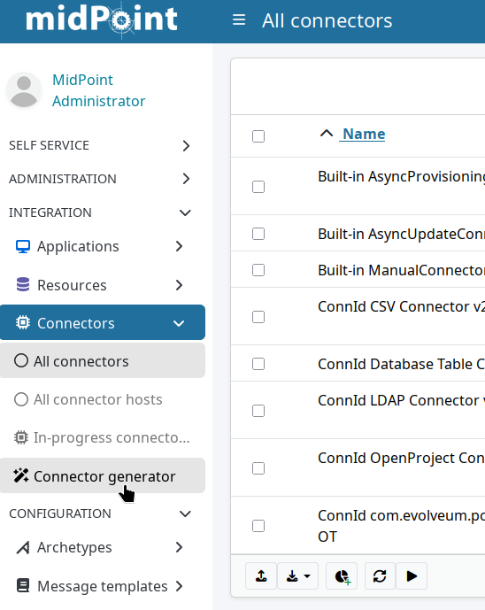
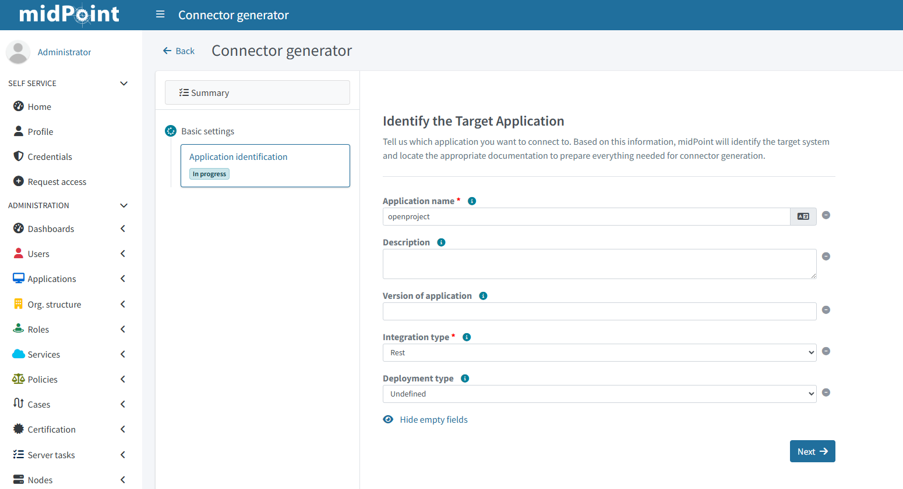
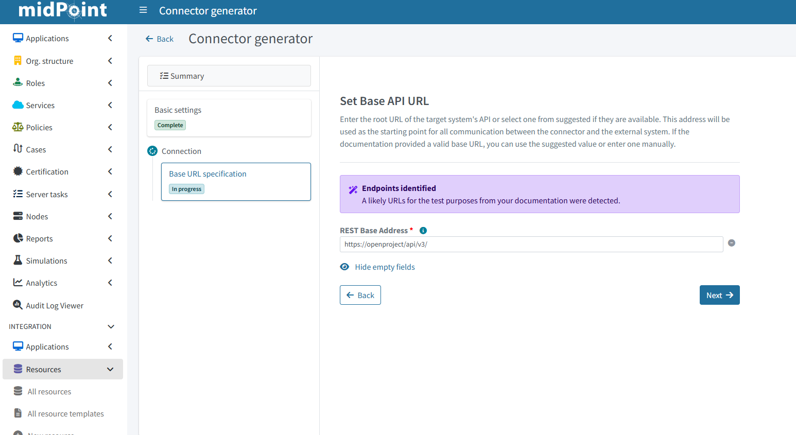
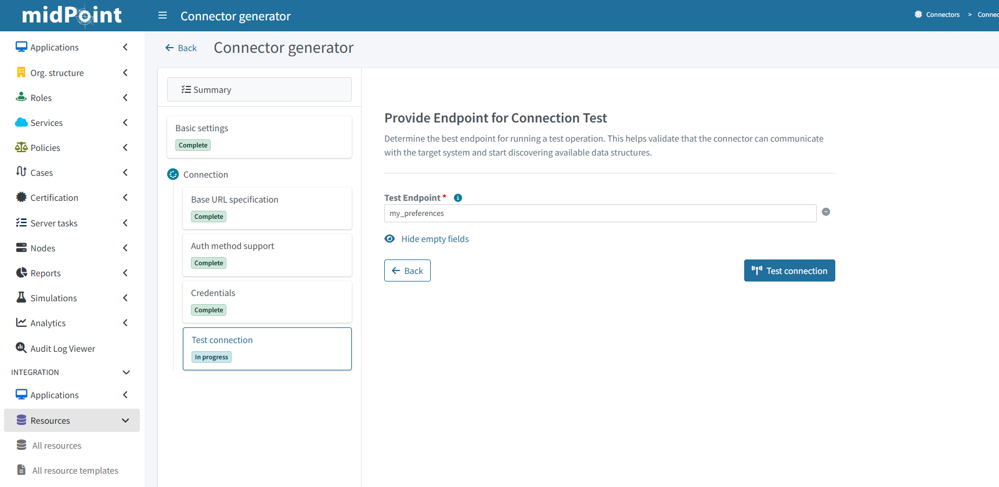

= AI-assisted connector creation with midPilot
:page-nav-title: Create connector with AI
:page-display-order: 430
:page-experimental: true
:page-toc: top
:page-description: This how-to guide describes how to work with the midPoint AI-assisted connector creation wizard in midPoint.
:page-keywords: connector generator, generator, identity connectors, connectors, ai, midpilot, llm

This how-to guide describes how to work with the midPoint AI-assisted connector creation wizard in midPoint.

[NOTE]
====
The execution time of specific steps of the connector generator differ based on the difficulty of the evaluated task.
Some of the operations might take seconds, other a considerably longer time, usually minutes.
The time of processing also depends on the used LLM and other local environment aspects.
====

After startup of the environment, as described in the section <<_environment_startup,"Environment Startup">>, you can start the connector generation flow.

:sectnums:

== Start connector creation wizard

. In [.nowrap]#icon:microchip[] *Connectors*#, click [.nowrap]#icon:wand-magic-sparkles[] *Connector generator*#.

== Basic info about the target application

Once in the wizard, you need to fill in basic information about the application you are about to connect.
The most important bits are the application *name* and its *integration type*.

* The *name* defines what the AI searches for when looking for the documentation of the target system. +
    For example, _OpenProject_, _Slack_.
* The *integration type* dictates how to communicate with the target system.
    Look into the API documentation of your application to find out whether it supports REST or SCIM.
    Most applications work with REST.

In case of the sample environment:

* Application name: _OpenProject_
* Integration Type: _REST_

== Documentation discovery

In the next step, midPilot searches for the available documentation and provides the relevant links for you to select the appropriate one.

In the case of the sample environment, select the documentation containing the URL `+++https://www.openproject.org/docs/api/+++`

image::i_con-gen-integration-documentation.png[]

== Connector identification

After choosing the documentation the next step is to specify some information (basic maven coordinates) about the Connector.
The mandatory fields come with a pre-filled default which can be changed;
if working with the sample environment, you can leave them as they are.

image::i_con-gen-basic-info.png[]

The next couple of steps are streamlined together and executed automatically:

* the wizard will generate some basic connector objects,
* a test resource for the connector is created,
* documentation is parsed for base api url and authentication information.

image::i_con-gen-creating-connector.png[]

== Target application API base URL

The next input is needed during the specification of the API base URL.
This means the connector needs to know the address on which your target application listens to requests.

In the case of the sample environment: `+++https://openproject/api/v3/+++`.

== Authentication methods

Most applications require authentication.
In this step, select the appropriate authentication method supported by your application.

In case of the sample environment: _Basic Authentication_.

image::i_con-gen-auth-method.png[]

In the next step, fill in the authentication parameters based on the selected method.

// TODO: Can we write the sample environment usr:psw here?

image::i_con-gen-auth-params-test.png[]

== Test connection

Lastly, select an endpoint which midPilot can use to verify it can access the target application.

In the case of the sample environment: `my_preferences`.

Once the connection is verified, you are presented with the summary dashboard and from which you can move on to further steps in connecting the application.

////
The above line does not apply anymore - there's the Select object class to be configured screen whence user goes to configure further integration steps
TBD: Object class configuration;
based on how the wizard flows from there, links to content describing synchronization, mapping, correlation, and other rules
////

== Next steps

In further steps the connector wizard generates the operation scripts based on the chosen object class.
The initially generated scripts are centered around the "Read" portion of the connector operations.
Afterward the user is provided with a choice to pick what kind of operation will be generated next,

You can switch to a summary view during the generation of the connector, it provides a quick overview of the generated object classes, the possibility to pick the next object class or operation to be generated and more.

image::i_con-gen-summary.png[]

Once you have the connector created, the flow to connect your application continues in the "traditional" manner:

* Create a resource for the application you are connecting.
* Define resource object types.
* Set up correlation rules, mappings, and synchronization rules.
* Validate the setup using simulations.

The good news is that the AI assistance of midPilot does not end with connector generation.
You can let midPilot generate suggestions for mappings, correlation, or synchronization rules.

:sectnums!:

== See also

* xrefv:/midpoint/reference/master/admin-gui/resource-wizard/object-type/correlation/#ai-correlation[]
* xrefv:/midpoint/reference/master/admin-gui/resource-wizard/object-type/statistics/[]
* xrefv:/midpoint/reference/master/admin-gui/resource-wizard/object-type/mapping/#use-ai-to-generate-mappings[]
* xrefv:/midpoint/reference/master/admin-gui/resource-wizard/object-type/synchronization/#generate-reactions[]