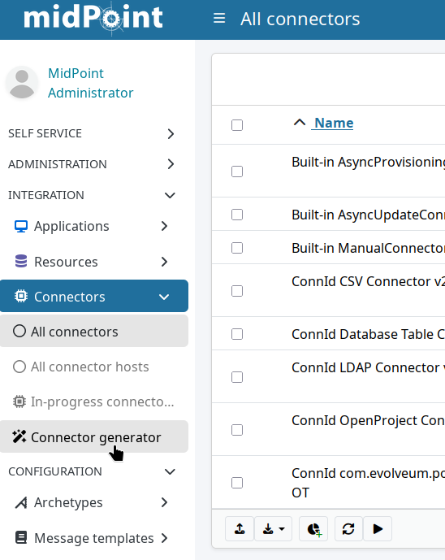
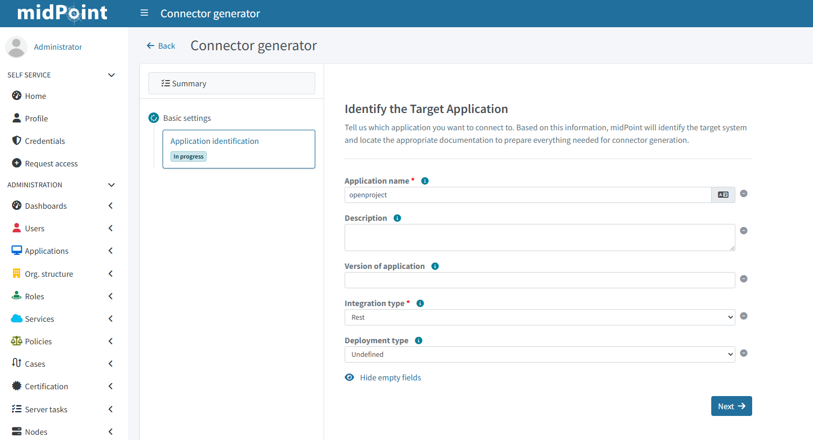
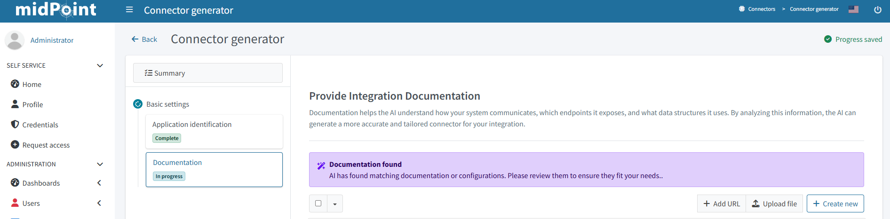
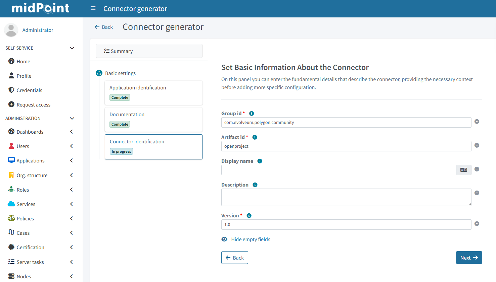
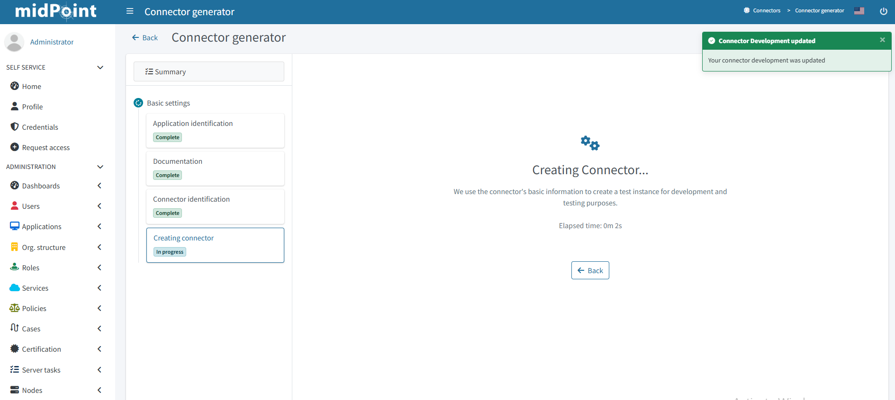
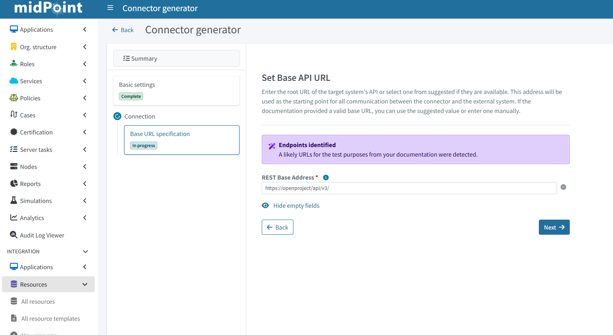
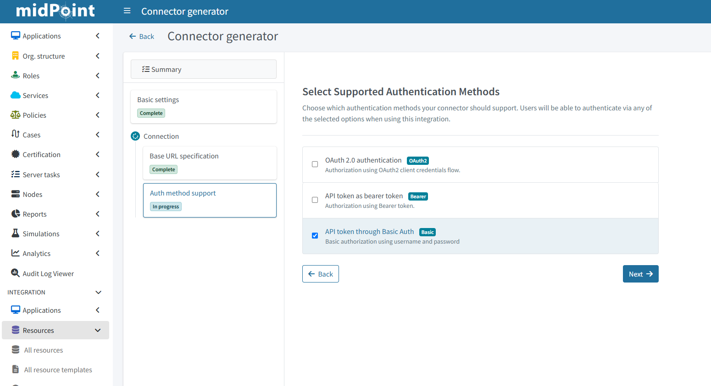
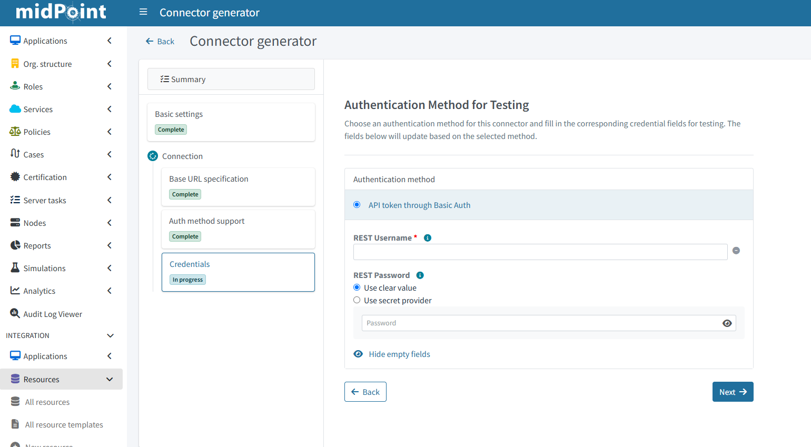
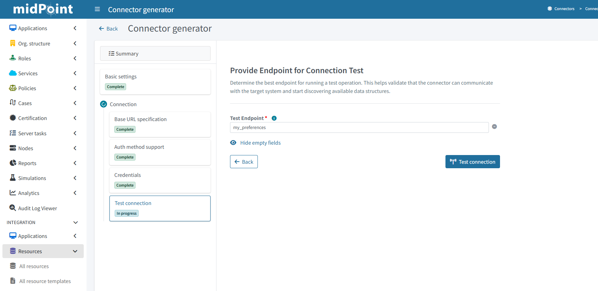
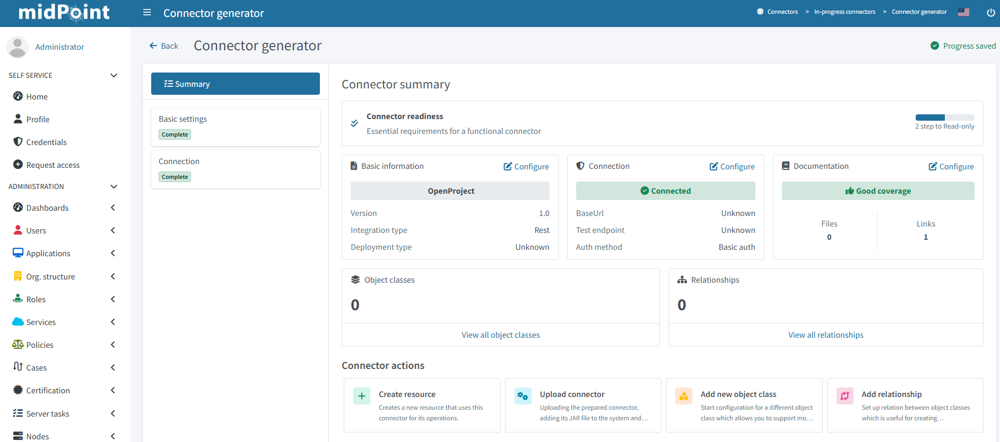

= AI-assisted connector creation with midPilot
:page-nav-title: Create connector with AI
:page-display-order: 430
:page-experimental: true
:page-toc: top
:page-description: This guide describes how to work with the midPoint AI-assisted connector creation wizard in midPoint.
:page-keywords: guide, connector generator, generator, identity connectors, connectors, ai, midpilot, llm

This guide describes how to work with the midPoint AI-assisted connector creation wizard in midPoint.

[NOTE]
====
The execution times of specific steps of the connector generator differ based on the difficulty of the evaluated task.
Some of the operations might take seconds, others considerably longer—usually minutes.
The time of processing also depends on the used LLM and other environment aspects.
====

After startup of the environment, as described in xref:/midpoint/get-started/try-ai-in-midpoint/setup/[], you can start the connector generation flow.

:sectnums:

== Start connector creation wizard

. In [.nowrap]#icon:microchip[] *Connectors*#, click [.nowrap]#icon:wand-magic-sparkles[] *Connector generator*#.

== Basic info about the target application

The first step in the wizard is to fill in basic information about the application you are about to connect.
The most important bits are the application *name* and its *integration type*.

* The *name* defines what the AI searches for when looking for the documentation of the target system. +
    In this this demo, type _OpenProject_.
* The *integration type* dictates how to communicate with the target system.
    Look into the API documentation of your application to find out whether it supports REST or SCIM.
    Most applications work with REST. +
    In this this demo, select _REST_.

== Documentation discovery

In the next step, midPilot searches for the available documentation and provides the relevant links for you to select the appropriate one.

In this demo environment, select the documentation containing the URL `+++https://www.openproject.org/docs/api/+++`

== Connector identification

After choosing the documentation, the next step is to specify some information (basic maven coordinates) about the connector.
The mandatory fields come with pre-filled defaults which can be changed;
in the demo environment, you can leave them as they are.

[NOTE]
====
If you launch the connector generator wizard repeatedly for the same target application, you need to increment the connector *version* to avoid conflicts.
====

The next couple of steps are streamlined together and executed automatically:

* The wizard generates some basic connector objects.
* A test resource for the connector is created.
* Documentation is parsed for the base API URL and authentication information.

== Target application API base URL

The next input is needed during the specification of the API base URL.
The connector generator needs to know the address on which your target application listens to requests.

In the case of the demo environment: `+++https://openproject/api/v3/+++`.

== Authentication methods

Most applications require authentication.
In this step, select the appropriate authentication method supported by the target application.

In the case of the demo environment: _Basic Authentication_.

In the next step, fill in the authentication parameters based on the selected method.

In the case of the demo environment, use the xref:/midpoint/get-started/try-ai-in-midpoint/setup/#_access_services[API key you have created earlier].

== Test connection

Lastly, select an endpoint which midPilot can use to verify that it can access the target application.

In the case of the demo environment: `my_preferences`.

Once the connection is verified, click the [.nowrap]#icon:list-check[] btn:[Summary]# button at the top left to view the summary dashboard, from which you can move on to further steps in connecting the application.

== Next steps

In further steps, the connector wizard generates the operation scripts based on the chosen object class.
The initially generated scripts are centered around the "Read" portion of the connector operations.
Afterward the user is provided with a choice to pick what kind of operation will be generated next,

You can switch to the [.nowrap]#icon:list-check[] btn:[Summary]# view during the generation of the connector, it provides a quick overview of the generated object classes, the possibility to pick the next object class or operation to be generated, and more.

Once you have the connector created, the flow to connect your application continues in the "traditional" manner:

* xref:/midpoint/reference/admin-gui/resource-wizard/create-resource-using-wizard/[Create a resource] for the application you are connecting.
* xref:/midpoint/reference/admin-gui/resource-wizard/object-type/[Define resource object types].
* Set up xref:https://docs.evolveum.com/midpoint/reference/support-4.10/admin-gui/resource-wizard/object-type/correlation/[correlation rules], xref:/midpoint/reference/admin-gui/resource-wizard/object-type/mapping/[mappings], xref:/midpoint/reference/admin-gui/resource-wizard/object-type/synchronization/[synchronization rules], etc.
* Validate the setup using xref:/midpoint/reference/admin-gui/simulations/[simulations].

The good news is that the AI assistance of midPilot does not end with connector generation.
You can let midPilot generate suggestions for mappings, correlation, or synchronization rules.

// TODO: Create more guides on working with midPilot - mappings, correlations, etc.

:sectnums!:

== See also

* xrefv:/midpoint/reference/master/admin-gui/resource-wizard/object-type/correlation/#ai-correlation[]
* xrefv:/midpoint/reference/master/admin-gui/resource-wizard/object-type/statistics/[]
* xrefv:/midpoint/reference/master/admin-gui/resource-wizard/object-type/mapping/#use-ai-to-generate-mappings[]
* xrefv:/midpoint/reference/master/admin-gui/resource-wizard/object-type/synchronization/#generate-reactions[]