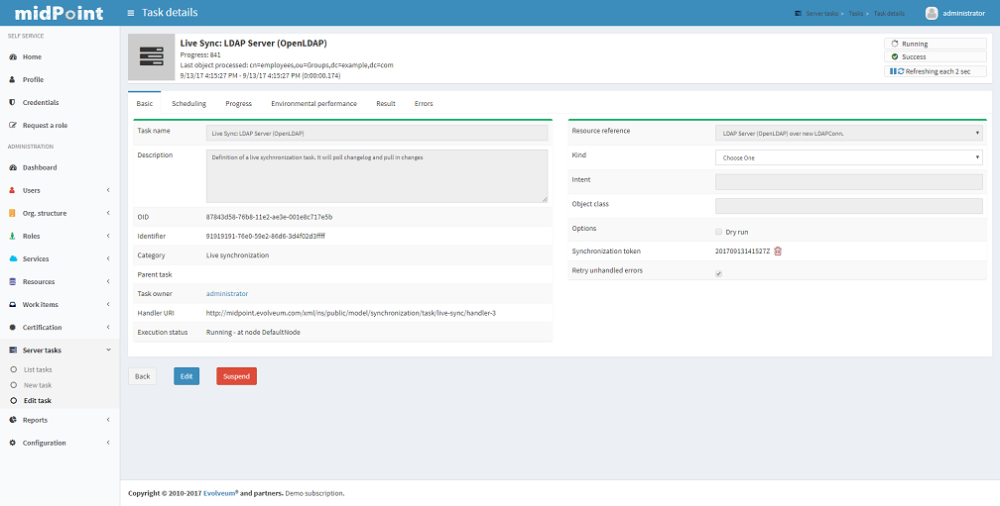

= MidPoint Administration Interface User Guide
:page-wiki-name: Administration Interface
:page-wiki-id: 3571754
:page-wiki-metadata-create-user: vix
:page-wiki-metadata-create-date: 2012-01-20T10:21:28.833+01:00
:page-wiki-metadata-modify-user: ssurmanek
:page-wiki-metadata-modify-date: 2017-10-02T10:35:47.414+02:00
:page-upkeep-status: orange
:page-toc: top

midPoint's Administration Interface is accessible at link:http://localhost:8080/midpoint/admin[http://localhost:8080/midpoint]/. Right after installation, there is one pre-configured administrator user named "administrator" after installation.
You can create more administrator users later.

To log in using "administrator" user, go to link:http://localhost:8080/midpoint/admin[http://localhost:8080/midpoint/] and log in:

[%autowidth,cols="h,1"]
|===
| Username | administrator

| Password
| `5ecr3t`

|===

Always use this URL when you intend to log in to Administration Interface, even after you've logged out.
By default, after logout, the login page is set to redirect the subsequent login to the End User Interface, which is suitable for 99% users in most organizations.
By using link:http://localhost:8080/midpoint/admin[http://localhost:8080/midpoint/] URL you will always use Administration GUI.

[TIP]
====
"administrator" is an (almost) ordinary user in the midPoint database.
Therefore you can change it later, create more administrative users and so on.

====

== Administration Interface Navigation

The Administration Interface is designed as follows: the main features (or main menus) are displayed as vertical tabs.
After selecting the tab, under the main menus is displayed available tasks (or submenus).
The central part of the page displays a list of users, roles, resources etc.
depending on the tab and task selection.

Right after you log in, "Dashboard" tab is selected and quick information: Personal info (Last login date, Last unsuccessful login etc.), System status and total count of main repository objects, related to logged user are displayed in the central part of the page.

== Managing Users

midPoint users represent real human beings with all their linked resource accounts.
By managing midPoint users you can also manage some or all of their linked resource accounts.

To create, modify or delete midPoint users, click the "Users" -> "List Users" tab.
A list of users is displayed in a table with some basic attributes: Name (login), Given Name, Family Name, Full Name, E-mail and Accounts. +
You can sort the user list by attribute by clicking on table column header and if you click at the same column again you can select whether the sorting should be ascendent or descendent.

You can find the user / s, using the search panel on the right top part of the page.

The current version of GUI allows you to manage single users only, with the exception of deleting users, enable/disable, unlock or reconcile users.
The future version of Administration Interface will allow you to manage multiple users at once.

=== Understanding Users and Accounts

*_Users_*are stored locally in midPoint repository.
*_Accounts_*are data structures representing users on _resources_. For example, a particular user may have his LDAP account, Active Directory account, Solaris account, etc.
The systems that hold the accounts are known to midPoint as _resources_. midPoint needs to know quite a lot about a resource to be able to manage accounts in it.
The information needed by midPoint include the type of the resource, hostnames, ports, administrative user identifiers and credentials, patterns and templates for new accounts, a definition of account attribute synchronization details and so on.

The table below provides example of relationships between Users, Accounts and Resources:

[%autowidth,cols="h,1,1,1"]
|===
|   | Represents | Stored in | Example

| User
| Physical person
| midPoint Repository
| Jane Smith  +
John Doe

| Account
| Data records used to access a system (e.g. information system)
| a Resource
| `jsmith123` +
`uid=doejr,ou=people,dc=example,dc=com`

| Resource
| A remote system that midPoint manages
| remote computer
| LDAP server `ds1.example.com` +
Active Directory server over there in my server room

| Assignment
| A decision or a policy regarding properties which an object should have
| an User, a Role, an Organizational unit
| Localhost CSVfile, Pirate Role

|===

There are two kinds of relations between account and user.
An account could be _assigned_ to user or an account could be _linked_ to user.
The xref:/midpoint/reference/synchronization/introduction/[synchronization] process treats these two cases in different manners.
More info on subject you will find xref:/midpoint/reference/roles-policies/roles/assignment/assigning-vs-linking/[here].

=== Creating Users

To create user, click the "Users" -> "New User" tab.
A new form will be displayed, requiring you to enter basic user information.
The "Name" entry will be used as a user identifier and also for logging into midPoint.

Fields marked with `*` (asterisk) are mandatory, you cannot save the form if they are empty.

image::CreatingUsers.png[]

The "Administrative status" field will allow the user to use his/her account in midPoint or his/her associated resource accounts after they are linked.

Click button "Save" for quick save without preview or button "Preview changes" to display what was changed or button "Back" to return to User list menu.

=== Deleting Users

To delete one or more users, select them in the "List Users" page and click the "Delete" button.
A confirmation dialog appears.
Click the "Yes" button to delete users.

[WARNING]
====
Please note that "Delete" will delete midPoint users *and* all their linked resource accounts.
====

=== User Details

To display user details, modify user attributes, assign resource accounts or disable/enable them, click the user name in the user list.
A new form will be displayed for the selected user. +
The information is organized in few panes: Basic, Projection, Personas, Assignment, Tasks, History, Delegations, Delegated to me.
Action buttons are placed in the bottom bar.

The "Basic" pane displays the basic information stored in midPoint's repository: Name, Given Name, Family Name and other users attributes.
Special attributes are contained in sections Activation and Password.
You can select attributes to disable/enable user, enable his access to midPoint GUI and set a user password there.
+
The Projections pane displays linked user's accounts, i.e. accounts on resources that belong to this user and midPoint knows about them.
For example: if user's Active Directory and Directory Server accounts were synchronized or linked to midPoint, they will be displayed with all configured attributes. +
The Personas pane contains different facets of a physical person.
One physical person may have several _personas_ for use in different environments or for different responsibilities. +
The Assignments pane displays accounts, roles or organizational units assigned to the user.
It means accounts, roles or organizational units that user should have got.
If an account is assigned to user and users account is deleted from resource, a new account linked to this user is automatically created. +
The Tasks pane displays tasks related to that user. +
The History pane displays list of all actions related to that user.
There is also options for filtering according to date, Event Type, Initiator of the action, Item which was changed, etc. +
The Delegations pane offers option to create temporary deleagation of part of privileges to another user, which can be also deleted here. +
The Delegated to me displays list of delegations which make deputy from the current user.

The pane headers also contain information about number of user's projections, assignments, tasks and delegations related to the user.

Click button Back to go back to the User list.

=== Modifying User Attributes

To modify user attributes, click on the name of user in the User list. Now you can change every user's attribute.
There are three boxes in the right part of the header of a user.
The first one shows activation status, displays special privileges (End user, Superuser, etc.) and the last one displays the highest relation to organization unit.
Except user attributes, you can activate (enable) or deactivate (disable) all linked user's accounts including midPoint itself.
You can also change user's password in all linked user's accounts including midPoint itself.
Three small icons right onthe right top corner of the properties of the Basic pane offers options to show metadata, sort properties and show empty fields

You have to press button Save to save your modifications to user.
Only then they are valid, otherwise they are lost.
You can take a list of changes you are going to make via clicking Preview changes button.

Click button Back to go back to the User list.

[TIP]
====
Please note that changes of user's attributes may be synchronized to user's resource accounts automatically based on the resource schema handling configuration.
====

=== Modifying User Account Attributes

To modify user (resource) account attributes, click the Projections pane after you have clicked on the user from a user list.
Now you can change every user account attribute. +
The account attributes are displayed in tables, one table for each account.

Except user attributes, you can activate (enable) or deactivate (disable) this user account in the Activation section of the table (if the resource supports account activation).
You can also change this account password in the Password section of the table (if the resource supports changing passwords).

Click Save changes to save changes or Back to go back to the User list.

=== Enabling/Disabling User Accounts

To enable/disable user accounts, select them and click on the Enable or Disable button.
Information on whether the account is enabled or disabled is shown in the header of each account.

=== Changing User Password(s)

To change passwords on all user accounts including midPoint, please refer to the chapter Modifying User Account Attributes (Credentials part on the Basic pane of User Details page).
If you want to change only some resource account passwords, please refer to the chapter Modifying User Account Attributes (Credentials part(s) on the Projections pane of User Details page).

=== Assigning/Unassigning accounts, roles or organizational units

To modify user assignments, start modifying user.
If you want to add new assignment, open the Assignments pane and then choose Assign (Assign Org.) options under gear wheel.
A new window with choices will appear.
Select which kind of assignment you want to add.
Select your choice and click button Add.
If you want to unassign some assignments, select it and click on Unassign button on the bottom part of page.

[IMPORTANT]
Unassigning some roles will delete some user's resource accounts.

Click Save to quick save changes or Back to go back to the User list.

=== Adding Resource Accounts

To add one or more resource accounts to the user, click on the Add projection button in the Projections pane.
Now you can select resources in the opened window and click Add.
The accounts are not immediately created, instead, you can explode table of attributes for each account and then you can change some user account attributes.

Besides user attributes, you can activate (enable) or deactivate (disable) the user account in the Activation part of the table (if the resource supports an account activation).
You can also set the account password in the Credentials part of the table (if the resource supports changing passwords).
By default, the activation and password are inherited from the midPoint account.

[TIP]
====
The account form is dynamically generated using the resource schema definition in the resource object.
====

[TIP]
====
Please note that some resource attribute values will be generated automatically based on the resource configuration after you submit the form.
====

Click Save to quick save changes or Back to go back to the User list.

=== Deleting Resource Account

To delete one or more resource accounts linked to the user, select them and click on the Delete option under the gear wheel.
The account is not deleted until you save the form.

Click Save to quick save changes or Back to go back to the User list.

=== Unlinking Resource Account

To remove link between midPoint user and resource account and to keep the resource account on the resource, select it and click on the Unlink option under the gear wheel.
The account is not unlinked until you save the form.

Click Save to quick save changes or Back to go back to the User list.

== Managing Roles

Roles represent sets of resources and resource attributes including resource privileges, which will be enforced when the role is assigned to or unassigned from the user.
TODO By assigning a role, you specify that the user *should* have the resource account(s) specified by the role.
By unassigning a role, you specify that the user *should not* have the resource account(s) specified by the role.
More on midPoints Role Based Access Control you will find xref:/midpoint/reference/roles-policies/roles/rbac/[here].

To create, modify or delete roles, click the Roles tab.
A list of roles is displayed in a table with the role Name, Display name, Identifier and Description.

You can sort the role list by name by clicking on the table column header and if you click at the same column again you can select whether the sorting should be ascendent or descendent.

=== Creating Roles

To create role, click the Roles - New Role tab.
A new form will be displayed, requiring you to enter basic role information.
Fields marked with `*` (asterisk) are mandatory, you cannot save the form if they are empty.

The Administrative status field set to disabled causes unassigning projections, which that role induces, from the object which has that role in assignments.

Click button Save for quick save without preview or button Preview changes to display what was changed or button Back to return to User list menu.

To save your role click the Save button or click the Back button to go back to the Role list.

=== Role Details

To display role details and modify role properties, click the user name in the role list.
A new form will be displayed for the selected role. +
The information is organized in few panes: Basic, Projections, Personas, Assignments, Tasks, Inducements, Members, Governance and Policy constraints.
Action buttons are placed in the bottom bar.

The Basic pane displays the basic information stored in midPoint's repository: Name, Display Name, Description and other roles attributes.
Special attributes are contained in sections Activation.
You can select attributes to disable/enable role.
+
The Projections pane displays linked resouce objects, i.e. group on resources that belong to this role and midPoint knows about them. +
TODO The Personas pane  +
The Assignments pane displays assignments which apply to that role. +
The Tasks pane displays tasks related to that role. +
The Inducements pane displays indirect assignments which apply to object assignes that role. +
The Members displays list of the objects which assignes that role. +
TODO The Governance pane +
The Policy constraints pane allows defining minimal and maximal number of assignments.

Click button Back to go back to the Role list.

=== Modifying Roles

To modify a role, click the Roles - List Roles tab and then click the role name.

To modify role attributes, click on the name of role in the Role list. Now you can change every role's attribute.
There is a box in the right part of the header of a role which displays activation status.
Except role attributes, you can activate (enable) or deactivate (disable) role.
This action causes unassigning projections, which that role induces, from the object which has that role in assignments.
Three small icons right onthe right top corner of the properties of the Basic pane offers options to show metadata, sort properties and show empty fields

You have to press button Save to save your modifications to role.
Only then they are valid, otherwise they are lost.
You can take a list of changes you are going to make via clicking Preview changes button or click the Back button to go back to the Role list.

[TIP]
====
Please note that changes of role's attributes may be synchronized to role's resource automatically based on the resource schema handling configuration.
====

=== Modifying Role Resource Attributes

To modify role (resource) attributes, click the Projections pane after you have clicked on the role from a role list.
Now you can change every role resource attribute. +
The object attributes are displayed in tables, one table for each object.

Except resource attributes, you can activate (enable) or deactivate (disable) this role in the Activation section of the table (if the resource supports account activation).

Click Save changes to save changes or Back to go back to the Role list.

=== Deleting Roles

To delete a role, click the Roles tab and then click the List roles link.
Select the role(s) to delete and then click the Delete button.

== Managing Resources

Resources represent the applications and information systems connected to midPoint, where resource accounts should be managed.

To create, modify or delete resources, click the Resources - List resources tab.
A list of resources is displayed in a table with some basic attributes: Name (in midPoint), Connector type, Version (of the connector), and the basic options icons.

You can sort the resource list by name by clicking on the table column header and if you click at the same column again you can select whether the sorting should be ascendent or descendent.

Please refer to the xref:/connectors/[Resource and Connector Reference] chapter for more information.

=== Understanding Resource Configuration

Resource definition is perhaps the most important part of midPoint configuration.
It configures connection to resource, resource object classes and attributes (resource schema), mapping of these attributes to the midPoint object model, resource capabilities, password policies, etc.

Resource definition is an ordinary XML object in midPoint repository.
Therefore it has its OID and a name that has to be unique across all defined resources. +
You can check it clicking through the path Configuration-Resources(from List objects)- a resource of your choice from the list of available resources.

Resource configuration object is composed of following sections:

* *Connector Reference*: Refers to specific connector that is used for access to resource.
Either OID reference to connector object or a smart reference to connector type is required.
List of available connectors is in xref:/connectors/connectors/[Identity Connectors] chapter.
This list is not closed.
We are able to produce a proper connector tailored for customers target systems.

* *Resource Configuration*: Connector specified by resource connectorRef is just a bunch of code.
For the connector to work properly it needs configuration.
Such configuration specifies name of host where the resource resides, TCP/IP port number, technical account that should be used to connect to it, password for that account, database table name, directory root, filenames, etc.
Configuration properties are different for each connector type.

* *Schema configuration*: Resource schema (attributes) can be defined statically or it will be generated automatically when the connector is initialized first time and if the resource supports getting schema.
Most resources support it, e.g. LDAP, Database Table, CSV file, Active Directory.
The resource schema differs for each connector and/or resource (e.g. two LDAP-based resources can use same connector, but resource attributes may completely differ).

* *Schema handling*: Specification of handling the objects defined in resource schema.
E.g. read-only or read-write attributes, account object classes, expressions to determine values, etc.
Schema handling specifies decisions of an IDM administrator how the resource schema should be used, e.g. what object types to use for an account, how to set up the attributes, how to deal with passwords, etc.
Schema handling is the part of resource definition that takes the most of the administrator attention.
It is the place where resource behavior can be customized.
Schema handling also influences how the resource will be presented in the GUI, e.g. it sets display names for attributes and account types.

* *Resource capabilities*: Resource capabilities can be used to configure special features of the resource: if this section is used, it will override connector's capabilities.
This configuration can be used to simulate capabilities if the connector does not support them (e.g. an account de/activation: which attribute is used to store the account status and which values represent an activated/deactivated account) or hide native connector capabilities for this resource even if the connector supports them.
If you want to use native connector's capabilities without modification, you don't need to set capabilities for the resource at all.

* *TODO Scripts (Before/After Actions)*: Scripts can be used to run custom action before/after the connector operation, e.g. to create a home directory for user and set some access rights.
Not all connectors support scripts.
The language for the script and script arguments meaning are specific to the connector.

* *Synchronization*: Synchronization enables you to synchronize changes from the resource to midPoint.
The changes such as account creation, modification and deletion can be synchronized if the resource and connector support synchronization or by using other synchronization flavours.

Several XML namespaces are used within the resource object.
Please refer to the chapter xref:/midpoint/devel/xml-namespace-list/[XML Namespace List]. In the examples, we will use the following prefixes:

* *icfc*: connector schema namespace (attributes common for all ICF connectors)

* *icfs*: resource schema namespace (attributes common for all ICF connectors)

* *icfcconnector*: connector schema for each connector type (attributes only for this connector type)

* *ri*: resource instance (attributes only for this resource instance)

* *c* and often the default namespace: midPoint's common schema (attributes common for all midPoint objects)

More on subject with example code you will find in chapter xref:/midpoint/reference/resources/resource-configuration/[Resource Configuration].
To understand how to use the resource samples documented in the xref:/connectors/[Resource and Connector Reference] chapter, please take into consideration that each resource sample is documented inline.

=== Resource Details

To display resource details, list resource objects or import resource objects, click the resource name in the resource list (available under Resources tab).
A new page will be displayed for the selected resource.

The information is organized as follows: Details, Defined Tasks, Accounts, Entitlements, Generics, Uncategorized, Connector.

In the bottom of all the sections are buttons: Back to go back to resource list, Test Connection to testing if connection to Resource system is successfully established, Refresh Shema to refresh changes in schema, Edit configuration to modify configuration properties, Show using wizard to display resource definition in wizard, Edit using wizard to modify resource definition through wizard, Edit XML to edit resource definition in XML format through embedded editor.

The Details pane displays basic information about the resource: connector name, status and its version, basic information about resource configuration and resource objects that can be managed on this resource, e.g. accounts, groups, LDAP object classes etc.

The Defined Tasks pane displays tasks related to that resource.

The Accounts contains lists of accounts in repository and on the resource system and summary table, too.
It also offers options for filtering accounts (according to any attribute) and executing account operation such as Import, Delete, Enable/Disable account and Remove/Change owner.
In the bottom part of this pane are options for create tasks.

The Entitlements pane and the Generics pane contain the same sections as Account pane, however for other objects (groups, projects etc.). Objects in these panes are categorized by the intent.

The Uncategorized pane offers option to filter Repository/Resource objects according to Object Class.
The Connector pane displays information about used connector.

=== Creating Resources

The first way how to create a new resource is using the wizard.
Although the wizard offers graphical guideline, it is quite complex and so a bit complicated.
To open the wizard click Resource - New Resource.
The new page will be opened, where you should fill the resource name, optionally description and connector host if needed, and choose one of connectors from the list.
Each step of resource creation contains help button in the upper right corner.
Clicking on it you get the help with resource wizard.

image::newResource.png[]

The next step is Resource Configuration.
Configuraton properties according to chosen connector are located in this section.
Then follows sections defining resource object classes and attributes (resource schema), mapping of these attributes to the midPoint user model, resource capabilities, password policies, etc.
These sections are more specifically described in xref:/midpoint/reference/resources/resource-configuration/[Resource Configuration documentation].

The second way of creating resources is using the Import resource definition feature (available under Resources tab).
There are sample resources definition in XML files on link:https://github.com/Evolveum/midpoint-samples/tree/master/samples/resources[GitHub]. You can copy, alter the resource samples and import.

=== Modifying Resources

You can use the same ways of modifying resources as were described in chapter Creaing Resource. Additionally there is option to modify resource using embedded XML editor.
You can open the editor clicking on Edit XML button in the bottom part of resource details page.

=== Deleting Resources

To delete the resource you can either select it in List resources page (available under Resources tab) and then click the Delete button , or select one or more resources in the Resources page (available under Repository objects from Configuration tab) and then click the Delete button.

=== Testing Resource Connection

To test the resource configuration and connection, navigate yourself to List resources page and then you can either click on the resource name and then click the Test connection button.
If there is no problem with the resource connection, a success message will appear on the popup window and the status icon color will change to green. +
If there is any problem with resource connection, an error message will appear on the popup window and the status icon color will change to red or orange according to type of the problem.

A grey icon with a question mark means that the resource connection has not been tested recently.

[TIP]
====
Please note that the resource connection status information is valid only at the time of the test.
After that, it might be out of date and/or inaccurate.
====

=== Listing Resource Objects

To display a list of resource objects that currently exist on the resource, click the resource name in the List resources, then open the Account pane (Entitlement pane or Generics pane according to correspondence definition between resource object type and midPoint object type) and click on the Resource button located in the right upper corner of the pane.
Each object kind can be devided into more intents.
Uncategorized pane offers option to list object by object class.
The paging control at the bottom of the account list allows you to display more objects or set page size.

The synchronization situation and owner of an object are shown in line with the object name. You can remove or change an owner, delete, enable/disable or import object via clicking a proper option using the gear wheel.

=== Importing Resource Objects

To import resource objects that currently exist on the resource into midPoint repository, list resources objects and then click the Import option for the corresponding resource object from the list.
You have to configure synchronization configuration (at least enable xref:/midpoint/reference/synchronization/[synchronization], configure correlation/confirmation and inbound expressions).

A new task will be created named Import from resource (resource name) and you can check its status in xref:/midpoint/reference/tasks/[] menu.

The synchronization situation and owner of an object are shown in line with the object name.
You can remove or change an owner, delete, enable/disable or import object via clicking a proper option using the gear wheel.

[TIP]
====
Consider this feature being functional only if xref:/midpoint/reference/synchronization/introduction/[] part of Resource configuration is properly set.
====

== Server Tasks

Server Tasks are one-time or recurrent tasks scheduled for execution at a point in time.
They are typically used for LiveSync synchronization and Reconciliation.

To see the tasks, use List Tasks item within Server Task menu.
You can easily filter tasks by their execution state (i.e. runnable/running, waiting, suspended, closed) and category (e.g. live synchronization, reconciliation, workflow, etc).

You can sort the task list by attribute (currently by name only) by clicking on table column header and if you click at the same column again you can select whether the sorting should be ascendent or descendent.

image::ServerTasks.png[]

You can execute the following operations on a task, or more tasks at once:

* *suspend*: suspension means that the task execution is stopped and the task is placed into `suspended` state, preventing it from being scheduled until it is resumed.
(Note that, technically, all we can do is to _request_ task handler to exit, so placing the task into suspended state can take certain time - depending on particular task handler.
GUI operation is implemented in such a way that it waits a defined time interval, 2 seconds by default, and if the task would not stop within that time, you would get a warning message explaining the situation.)

* *resume*: you can resume a task that has been suspended.
It could be suspended either on your request, automatically on failure of recurring task, or on restart of non-resilient task.
When resuming, the task handler is simply started (again).
For many kinds of tasks, the handler will use stored information to continue where it has left off.

* *delete*: when choosing this action, the task will be first suspended (in order to stop its execution, if it's executing) and then deleted.
In a similar way as explicit suspension, the GUI waits defined time (2 seconds) after requesting suspension, and then proceeds with the deletion whether the task has been stopped or not.

* *run now*: the task could be scheduled to run immediately, giving no regards to defined schedule time.

As for nodes in cluster, there are the following operations available:

* *stop scheduler*: puts the selected node into `stopped` state, meaning that no further task executions will be scheduled on it.

* *stop scheduler + tasks*: the same as above, but, in addition, all tasks currently executing on that node are stopped (applying their `threadStopAction` attribute, see xref:/midpoint/reference/tasks/task-manager/[Task Manager].

* *start*: puts the node back into `running` state.

* *delete*: used to delete obsolete nodes; cannot be applied to nodes that are alive.

The following advanced (diagnostic) options are also available, dealing with all tasks executing at current node:

* *Stop all threads*: the same as *stop scheduler + tasks* executed on the current node, but, in addition, Cluster Manager thread is stopped as well.
This is useful to keep logs clean when diagnosing a problem; it is not recommended to be used during normal operation.

* *Start all threads*: gets the situation back into normal (starts Cluster Manager thread and the scheduler).

* *Synchronize tasks*: used to synchronize Quartz and midPoint task information.
Basically, jobs in Quartz are updated to reflect current state of affairs as seen by the midPoint repository.
Needed only when something goes really wrong.

* *Synchronize approval requests: TODO*

* *Refersh tasks: TODO*

To see detailed information about a task, click the task name.

=== One-time and Recurring Tasks

There are two types of tasks: one-time (single) and recurring:

* *The single tasks* will be executed only once, either immediately after the task creation or at the specified time (next run time).

* *The recurring tasks* will be executed immediately after the task creation and then again, based on the schedule interval (in seconds) or a cron like specification.
TODO: example.

For more information please refer to the xref:/midpoint/reference/tasks/task-manager/[Task Manager] section.

=== Task Detail

Task Details page displays basic state information in the header and six sections: Basic, Sheduling, Envirnonmental performance, Result, Errors:

You can see the following task attributes on the Task Detail page in the section *Basic* (some attributes are displayed in the task list as well):

* *Task Name*: the name of the task in midPoint

* *Description:* the description of the task

* *Task oid*: unique object identifier (object oid)

* *Identifier: *lightweight identifier, mostly used to identify short-lived objects in midPoint.
It is *not* guaranteed that the identifier is globally unique or that it is transferable to other installations.

* *Category*: user-visible task category

* *Parent*: the parent of that task, if the task is subtask.

* *Handler URI*: handler for executing tasks, e.g.: `link:http://midpoint.evolveum.com/model/sync/handler-1[http://midpoint.evolveum.com/model/sync/handler-1]` for synchronization

* *Execution Status*:

** *CLOSED*: the task has executed and is done, it may be safely deleted

** *RUNNING*: the task is currently executing or ready to be executed

** *WAITING*: the task is being executed externally or is waiting for some kind of external singal (e.g. external workflow waiting for an approval)

** *SUSPENDED*: the task is temporarily suspended (paused)

* *Resource Reference*: the resource related to the task execution (e.g. where synchronization is requested)

* *Kind: *the kind of object on the resource related to the task execution

* *Intent: *the intent of object kind on the resource related to the task execution

* *Object class: *the class of object on the resource related to the task execution

* *Options:* dry run - evaluate situations defined in synchronization section of a resource configuration, but skip reactions

* *Synchronization token:* only for LiveSync

* Retry unhandled errors:

*Scheduling*: attributes related to when the task should be executed:

* *Recurring task*: whether the task is recurring or single-run.

* *Tightly bound*: if yes, the task permanently occupies a thread on a node; if no, the thread is allocated when needed (and on any node); see xref:/midpoint/reference/tasks/task-manager/[Task Manager]

* *Schedule interval*, *Schedule cron-line specification*, *Do not start before*, *Do not start after*: self-explaining; see also xref:/midpoint/reference/tasks/task-manager/[Task Manager].

* *Misfire action*: what to do if the task could not be started on scheduled time: either execute immediately or reschedule; see xref:/midpoint/reference/tasks/task-manager/[Task Manager].

* *Thread stop action*: what to do on node shutdown or failure: restart, reschedule, suspend, close; see xref:/midpoint/reference/tasks/task-manager/[Task Manager].

* *Task run last started*: the last time the task run was started

* *Task run last finished*: the last time the task run was finished

* *Next scheduled task run*: the time the task will be started again (if all goes well) executing in longer intervals (e.g. reconciliation).

Columns in task list that need explanation:

* *Executing At*: the node that executes the task thread.
For tightly-bound tasks the node name is shown here even if the task is not currently executing, because the thread is allocated to it.

* *Current Run Time*: the current task run time.

* *Scheduled To Start Again*: time when is the task scheduled to run again or empty value when this task will not be executed again (e.g. for single-run or suspended tasks).

*Progress *and* Envirnonmental performance* sections displays statistical information about task execution.

*Result* section contains list of the subtasks and their result status

*Errors* section displays list of errors which arise during task execution.

=== Editing Tasks

To edit a task, click the task name and then click the Edit button in the bottom part of details page. +
Depending on the current task state, some attributes may not be editable; if you want to change them, you have to suspend the task first.

Click the Cancel editing button to go back to xref:/midpoint/reference/tasks/[#Server Tasks] and discard changes or Save button to save the changes.

=== Add Task

To add a new task, click the Server Tasks and then click the New Task item.
A new form is displayed.

Please fill the fields according to the before mentioned description.

[TIP]
====
Currently, only live synchronization, reconciliation, import accounts, recomputation, and demo tasks can be added using the Administration Interface.
====

Click the Save button to save the task, or click Back to go back to xref:/midpoint/reference/tasks/[#Server Tasks].

=== Task Manager Configuration

Configuration of the task manager is (temporarily) described in the xref:/midpoint/reference/tasks/task-manager/configuration/[Task Manager Configuration] document.

== Managing midPoint Configuration

You can manage midPoint's configuration from within your web browser.

To view, edit or delete configuration settings, configure logging and debugging or import and manage XML objects click the Configuration tab.

To list XML objects, such as Users, Resource etc.
click the Respository Objects link in submenu.

To view or edit XML objects, such as Users, Resources etc.
click on the name of the object.

To import new objects from local files or embedded text editor click the Import object link in submenu.

To configure logging, click the Logging link in the Configuration.

=== Listing Objects

To view/edit objects directly using the Debug pages XML editor, click the Configuration tab and then the Repository objects link.
A List Objects form appears.
Use combo box to select the *type* of objects to list.
By default, for the first time you visit this page, System configuration object type is selected.
Click on the type to list the selected objects.

The objects are listed in two-column table with the options buttons on the right side - Export and Delete.
Clicking the object name will view/edit the object.
Clicking on the Delete button will delete the object from your repository.
Export button allows you to export the object as XML file.
Dropdown menu opened after click on the gear wheel offers options to delete selected objects at once, export all/selected objects at once and delete all identities.

[NOTE]
====
Please be extremely careful when using Delete and Delete selected feature!
====

=== Editing Objects

You can view/edit your objects by clicking the Configuration tab, then selecting Repository Objects link, selecting the object type (e.g. User) and then by clicking on the object name.
An embedded XML editor appears which allows you to edit the object.

Click on the Save button to save your changes or click the Back button to abandon changes and go back to the Object list.

[TIP]
====
You can use the Debug pages Edit objects feature to directly edit the objects, which can be very useful because some GUI features are not implemented yet.
For example, you can edit advanced settings here.
====

=== XML editor

To edit/view repository objects midPoint uses the feature rich Ace xml editor.
All features are accessible through keyboard shortcuts listed on the link:https://github.com/ajaxorg/ace/wiki/Default-Keyboard-Shortcuts[Ace editor web page].

[TIP]
====
The features of Ace xml editor are dependent on web browser.
Expect strongly restricted behavior when using old Internet Explorer browser.
====

=== Importing Objects

Importing objects is a very powerful feature allowing you to import a previously backed-up object, a new object or a sample object (e.g. resource).

To import an object from the embedded XML editor or a file and store it in midPoint's repository, click the Configuration tab, then select Import object link.

The default is selected to Import from file.
You can also choose another import type - Use embedded editor.

The embedded editor is used for write (or copy and paste) the object.

Several options can be set for the import task:

* *Protected by encryption*: whether the clear text passwords should be replaced by encrypted values (true) or the clear text passwords should be kept (false).
Default: true.

* *Fetch resource schema*: whether the resource schema should be fetched after the import (true) or the resource schema will be fetched only when the resource is used for the first time.
This option has no influence on other than Resource objects.
Default: false

* *Keep OID*: whether the existing OID should be used when re-importing (overwriting) object with no OID defined in XML file/editor (true) or a new OID should be generated (false).
Default: false.

* *Overwrite existing object*: whether the import should automatically overwrite existing object (true) or it should skip existing objects and show error (false).
Default: false.

* *Referential integrity*: whether the import should check any references before importing and not import an object referencing an unknown object (true) or the reference check should be skipped (false).
Default: false.

* *Summarize errors*: whether the error message should be detail or summary.
Default: true.
- TODO_not implemented yet_

* *Summarize successes*: whether the success message should be detail or summary.
Default: true.

* *Validate dynamic schema*: whether the dynamic schema should be validated before importing each object (true) or the schema check should be skipped (false).
Default: true.

* *Validate static schema*: whether the static schema should be validated before importing each object (true), or the schema check should be skipped (false).
Default: true.

* *Stop after errors exceeded*: stop the import after a defined number of errors has occurred.
Default: 0 (don't stop regardless of any errors).

* *Choose file*: click here to select your file instead of using embedded XML editor

When the object is loaded or written, click on the Import Object button.

=== Understanding Logging: Loggers, Levels and Appenders

midPoint uses link:http://logback.qos.ch/[Logback] subsystem for logging.
For more technical information please refer to link:http://logback.qos.ch/documentation.html[Logback documentation].

To understand how to customize midPoint's logging, you need to know the basic elements of it.

The _logger_ defines a *source* of messages.
There are several loggers defined by default:

* *Root logger*: messages from all components of midPoint, including external libraries

* *midPoint logger*: messages from all components of midPoint

* *Class/Packages/Subsystem loggers*: messages from specific components of midPoint, such as Model, Provisioning, Repository, Web etc.

* *Audit logger*: messages from auditing subsystem

The _level_ defines a log level.
Message with specified or higher log level (severity) will be logged.
You can define the log level for each logger except the Audit logger, where the log levels are defined automatically (but can be disabled).

The log levels are defined as below:

. *ALL*: everything will be logged

. *OFF*: nothing will be logged at all

. *ERROR*: errors will be logged

. *WARN*: warnings and errors will be logged

. *INFO*: information messages (non-errors), warnings and errors will be logged

. *DEBUG*: debug messages, information messages, warnings and errors will be logged

. *TRACE*: trace messages, debug messages, information messages, warnings and errors will be logged

The *Class/Packages/Subsystem logger* log level can be used to make the component log *more* than any upper logger (midPoint, Root) specifies.
However, it can't be set to log *less* than any upper logger (midPoint, Root).

Consider these examples:

* setting DEBUG log level for Provisioning component only, and keeping all other subsystems on OFF log level, set DEBUG log level only for the Provisioning subsystem and set every other logger including the Root logger to OFF.
This is what you will use commonly when debugging only a single component

* setting DEBUG log level for Root logger will override any component lower log level setting, i.e. you can't set Provisioning component log level to OFF, because the upper DEBUG will still win

[TIP]
====
Please note that the higher log level you set, the more information you will see in your logs (which is obvious) and the more time you will need to hunt specific messages in +
the logs.
On the other hands, it will really help you to debug problems if you set your log level higher.
As a rule of thumb, don't set DEBUG or TRACE levels unless you *really* need and consider setting the higher log level only for specific subsystems.
====

Finally, the _appender_ defines the *destination* of messages with configured (and higher) log level originating in configured logger.
You can create one or more appenders to filter messages from specific loggers and/or of specific log levels to separate files.

The appenders can be configured at the Class/Packages/Subsystem or the Audit level.
If they are not, midPoint appender is used.
If there is no appender configured, Root appender will be used. +
This design allows you to use one appender for all messages without any configuration, but allows you to define specific appenders matching your requirements.

There is one default appender configured in midPoint named IDM_LOG:

[%autowidth]
|===
| Name | Pattern | File path | File pattern | Max. history | Max file size [kB] | Appending

| IDM_LOG
| %date [%X{subsystem}] [%thread] %level (%logger): %msg%n
| ${catalina.base}/logs/idm.log
| ${catalina.base}/logs/idm-%d{yyyy-MM-dd}.%i.log
| 10
| 100MB
| 🗸

|===

The log file will be idm.log, stored in application server's logs directory, at most 100MB big and then rotated and renamed according to the date and at most 10 files for that day will be kept.

For example: idm.log is the current log file, idm.log.2012-01-20.log, idm.log.2012-01-20.1.log, idm.log.2012-01-19.log etc.
are the previous log files.

The appender settings are hidden by default.
To modify the appenders (create new, update or delete), click on the Appenders header and change Appenders settings.

=== Logging Configuration

To change midPoint's logging settings, click the Configuration tab and then the Logging link.
A logging settings form appears.

To change *Root logger* settings, set Root logger level and/or appender.
By default, the log level is set to INFO and the appender to IDM_LOG.

To change *midPoint logger* settings, set midPoint logger level and/or appender.
By default, the log level is undefined (inherited from Root logger) and the appender is undefined (inherited from Root logger).

To change *Class/Package/Subsystem* settings, set logger level and/or appender for specific subsystem.
By default, the log level is undefined (inherited from midPoint logger) and the appender is undefined (inherited from midPoint appender).

To add standard/component logger click the Add standard logger/Add component logger button and choose standard/component logger from the drop-down list.
To add a custom class/package logger, click the Add logger button.
Set a log level and/or an appender.
By default, the log level is set to ALL and the appender is undefined (inherited from midPoint appender).

You can set the class/package logger as follows:

* *com.evolveum.some.package.SomeClass*: to configure logging for *all methods of the* com.evolveum.some.package.SomeClass *class*

* *com.evolveum.some.package*: to configure logging for *the whole package* com.evolveum.some.package

To delete a logger, select the logger(s) to delete and click the Delete logger button.

Click the Save button to save your modifications and make them active.
Clicking Cancel button you discard all changes.

[TIP]
====
Unless you are debugging, the default are just fine.
The intensive logging and/or profiling has serious performance impact.
====

=== Auditing Configuration

To change midPoint's auditing settings, click the Configuration tab and then the Logging link.
Audit settings are displayed under the list of loggers.

You can turn on basic auditing (logging with INFO log level) by checking the Audit log checkbox, or even more detailed auditing (logging with DEBUG log level) by checking the Details checkbox.
By default, the auditing is off and the appender is undefined (inherited from midPoint logger).

Please refer to the xref:/midpoint/reference/security/audit/[Auditing] chapter for more information.

Click the Save button to save your modifications and make them active.

=== Profiling Configuration

MidPoint contains mechanisms to monitor its own performance during execution (in production or test environments).
These mechanisms can be controlled in section Profiling in Configuration tab.

Currently, midPoint profiling mechanism contains these features:

* *Request Filter* - Use this feature to capture HTTP requests statistics, specifically how long it took midPoint to prepare and send response to specific request,

* *Performance Statistics* - Once in 10 minutes, midPoint will scan itself and collect parameters about used system resources,

* *Dump Interval* - since every profiling event is dumped to special log file after it is processed by profiling mechanism, user is able to define interval of these dumps.
You want midPoint to dump this information 12 or 24 times a day?
No problem, simply adjust this interval (in minutes).

* *Subsystem Profiling* - midPoint will collect information about activity of specific subsystems inside midPoint.
Currently, profiling of these subsystems is supported: Model, Repository, Provisioning, Ucf, Resource object change listener, Task Manager, Workflow.

To change profiler logging, change the Log Subsystem Entry/Exit settings:

* *off*: no profiling, this is the default value

* *entry/exit*: for each Java method, time interval between entry and exit is measured

* *arguments*: for each Java method, time interval between entry and exit is measured and entry arguments are logged

[TIP]
====
The intensive logging and/or profiling has serious performance impact.
====

=== Keeping metadata for all objects (Creation, modification, approvals)

midPoint stores information about most important actions that can be performed while using it.
These interactions are recorded on business level, essentially recording  who does what, who changed what or who approved what.
These records are called metadata and are within midPoint objects.
So, what kind of metadata is stored? Provided examples are related to operations with users.

. *Creation* - metadata of every object contain information about exact time of creation (in form of a timestamp) and a reference to user, who performed this action.
We also track channel responsible for this action.

. *Modification* - modification metadata are stored when someone modifies object in midPoint.
We keep information about last change of object in metadata.
More information about history of changes can be seen in audit logs.
Timestamp and reference to user performing modification is kept.

. *Approval* - when performing actions that require some form of approving, a reference to modification approver is kept in metadata as well.

== Security Policy Configuration

Security Policy defines configuration of password, security question, self-service registration, etc.
All this information is included in security policy objects which can be found in Configuration tab in section Repository objects by listing Security Policy objects.

Please refer to the chapter xref:/midpoint/reference/security/security-policy/[Security Policy Configuration] for more information.

TODO consider merging the mentioned chapter here.

== Synchronization

One of the most important concepts of midPoint deployment is the synchronization.
After you install midPoint, you have to bring it to life by creating user accounts and link them to their corresponding resource accounts.
Of course, you can create users manually, but if you have more than 20 users, it may get a little boring, and if you have more than 100 users, it may become impossible.

Usually there is one authoritative resource, that can be used for initial user creation.
Sometimes there are multiple (or many) authoritative sources.
Yet, the initial data loading is only the beginning.
The content of the authoritative source(s) will change.
And the user-account mapping should remain up to date as well.

Therefore there are xref:/midpoint/reference/synchronization/flavors/[multiple ways] of creating user accounts in midPoint and/or linking them with their corresponding resource accounts.
All of them can be described as *synchronization*.

All synchronization flavors have something in common: no matter how the synchronization was started, the configuration (or policy) is stored in the resource object.
When a resource account change is detected on a resource, the resource account owner in midPoint has to be found.
This is simple, if the account was already linked to a midPoint user.
Otherwise, a correlation (or even confirmation) rule is applied to find a possible owner of the account.
The result of the correlation/confirmation expressions is a xref:/midpoint/reference/synchronization/situations/[synchronization situation].

The synchronization responses configuration from resource is then applied to find a corresponding action to the situation.

If the midPoint user account is created or modified as a result of the synchronization response, the resource account attributes' inbound expressions are executed to set up the midPoint user attributes.
Additionally, a user template may be processed to compute some midPoint attributes even if they were not synchronized from resource.

If a midPoint user is created or modified, the midPoint user attributes may be provisioned to other resource account using the corresponding outbound expressions in those resources.

=== Live Synchronization

Live synchronization can be configured for almost real-time synchronization with a resource providing the list of recent changes.

To configure Live synchronization, the resource has to support the cap:livesync xref:/midpoint/reference/resources/resource-configuration/capabilities/[capability].
You also have to xref:/midpoint/reference/synchronization/introduction/[configure] the correlation/confirmation expressions, the situation responses and actions and the inbound expressions for resource attributes.
Then you can create or import the synchronization task object.

The following example defines a synchronization task from OpenDJ advanced sync sample:

* *name*: task name in midPoint (Server Tasks)

* *taskIdentifier*: unique task identifier, it will be generated during the import if not present

* *ownerRef*: oid of user used to run this task.
This must be administrative user.
TODO: update after authorization model change.

* *execution*: running, this task is marked as ready to start

* *exclusivityStatus*: released, this task will be claimed by any midPoint node when starting

* *handlerUri*: fixed constant; this task will be a synchronization task

* *objectRef*: oid of resource to synchronize (not name!)

* *recurrence*: recurring, this task will be executed at scheduled intervals

* *binding*: tight, this task will be run in the same thread and always on the same node

* *schedule/interval*: schedule interval for this task (in seconds, thus 5 seconds)

[source,xml]
----
<task
        xmlns="http://midpoint.evolveum.com/xml/ns/public/common/common-1.xsd"
        xmlns:xsi="http://www.w3.org/2001/XMLSchema-instance"
        xmlns:xsd="http://www.w3.org/2001/XMLSchema"
        xmlns:my="http://myself.me/schemas/whatever"
        xsi:schemaLocation="http://midpoint.evolveum.com/xml/ns/public/common/common-1.xsd ../../../../../../infra/schema/src/main/resources/xml/ns/public/common/common-1.xsd
                                                          http://www.w3.org/2001/XMLSchema ../../../../../../infra/schema/src/test/resources/standard/XMLSchema.xsd">
  <name>Synchronization: Embedded Test OpenDJ</name>
  <description>
    Definition of a live sychnronization task. It will poll changelog and pull in changes
  </description>
  <taskIdentifier>91919191-76e0-59e2-86d6-3d4f02d3ffff</taskIdentifier>
  <ownerRef oid="00000000-0000-0000-0000-000000000002"/>
  <executionStatus>running</executionStatus>
  <exclusivityStatus>released</exclusivityStatus>
  <handlerUri>http://midpoint.evolveum.com/model/sync/handler-1</handlerUri>
  <objectRef oid="ef2bc95b-76e0-48e2-86d6-3d4f02d3e1a2"/>
  <recurrence>recurring</recurrence>
  <binding>tight</binding>
  <schedule>
    <interval>5</interval>
  </schedule>
</task>

----

=== Reconciliation

Reconciliation is comparing the real attributes of the accounts (what is) with the user properties and assignments in midPoint (what should be).
Reconciliation is iterating over all the accounts and can find accounts that should not be on the resource, accounts that are not yet in the midPoint and should be linked to their owners, etc.
It is a kind of a safety net mechanism as it can reliably detect all the changes.
However, it is also the least efficient of all the synchronization mechanisms.
Reconciliation is usually executed as a scheduled task.

To configure reconciliation, you have to xref:/midpoint/reference/synchronization/introduction/[configure] the correlation/confirmation expressions, the situation responses and actions and the inbound expressions for resource attributes.
Then you can create or import the reconciliation task object.

The following example defines a reconciliation task for OpenDJ sample resource:

* *name*: task name in midPoint (Server Tasks)

* *taskIdentifier*: unique task identifier, it will be generated during the import if not present

* *ownerRef*: oid of user used to run this task.
This must be administrative user.
TODO: update after authorization model change.

* *execution*: running, this task is marked as ready to start

* *exclusivityStatus*: released, this task will be claimed by any midPoint node when starting

* *handlerUri*: fixed constant; this task will be a reconciliation task

* *objectRef*: oid of resource to reconcile (not name!)

* *recurrence*: recurring, this task will be executed at scheduled intervals

* *binding*: loose, this task will be run in new thread on any node

* *schedule/interval*: schedule interval for this task (in seconds, thus 3600 seconds, one hour)

[source,xml]
----
<task
        xmlns="http://midpoint.evolveum.com/xml/ns/public/common/common-1.xsd"
        xmlns:xsi="http://www.w3.org/2001/XMLSchema-instance"
        xmlns:xsd="http://www.w3.org/2001/XMLSchema"
        xmlns:my="http://myself.me/schemas/whatever"
        xsi:schemaLocation="http://midpoint.evolveum.com/xml/ns/public/common/common-1.xsd ../../../../../../infra/schema/src/main/resources/xml/ns/public/common/common-1.xsd
                                                          http://www.w3.org/2001/XMLSchema ../../../../../../infra/schema/src/test/resources/standard/XMLSchema.xsd">

  <!-- Resource printable name -->
  <name>Reconciliation: OpenDJ</name>
  <extension>
  </extension>

  <taskIdentifier>91919191-76e0-59e2-86d6-3d4f02d30000</taskIdentifier>
  <ownerRef oid="00000000-0000-0000-0000-000000000002"/>
  <executionStatus>running</executionStatus>
  <exclusivityStatus>released</exclusivityStatus>
  <handlerUri>http://midpoint.evolveum.com/model/sync/reconciliation-handler-1</handlerUri>
  <objectRef oid="ef2bc95b-76e0-59e2-86d6-3d4f02d3ffff"/>
  <recurrence>recurring</recurrence>
  <binding>loose</binding>
  <schedule>
    <interval>3600</interval>
  </schedule>
</task>

----

=== Importing Accounts from Resource

Import from resource is a special case of synchronization that pretends that all resource accounts have been just created.

You have to enable xref:/midpoint/reference/synchronization/[synchronization], the correlation/confirmation expressions, the situation responses and actions and the inbound expressions for resource attributes.
Then you can import the resource accounts as documented in Importing Resource Objects.
