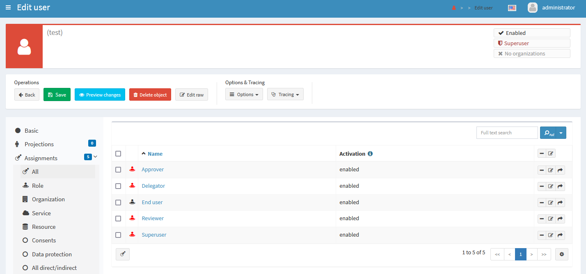
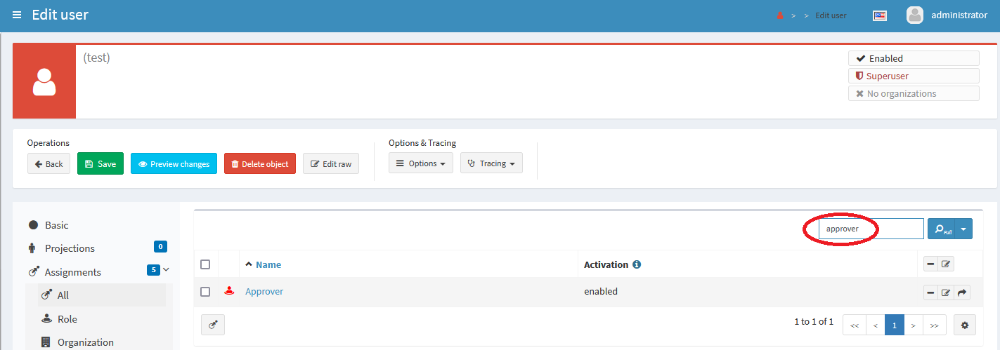
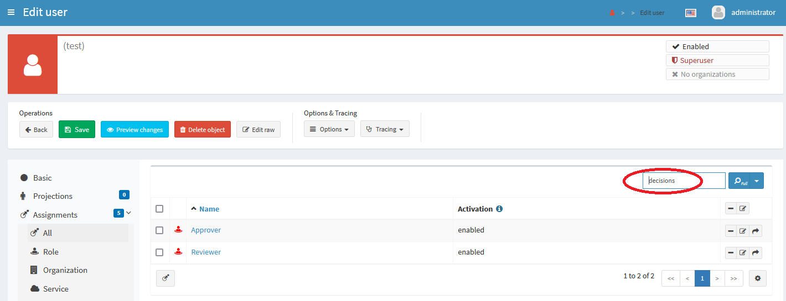
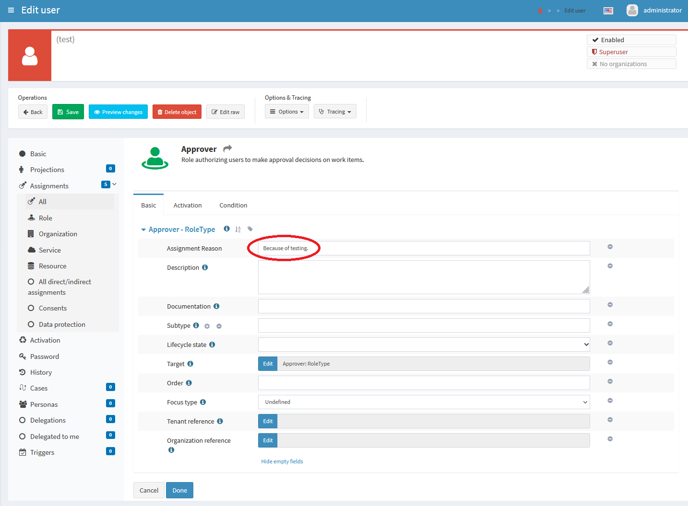
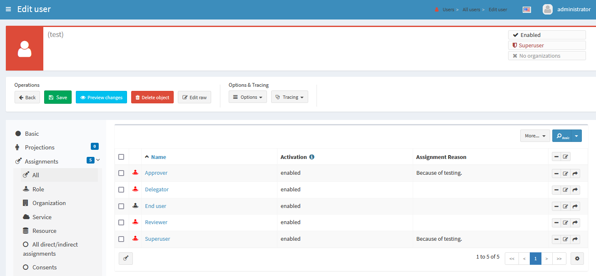
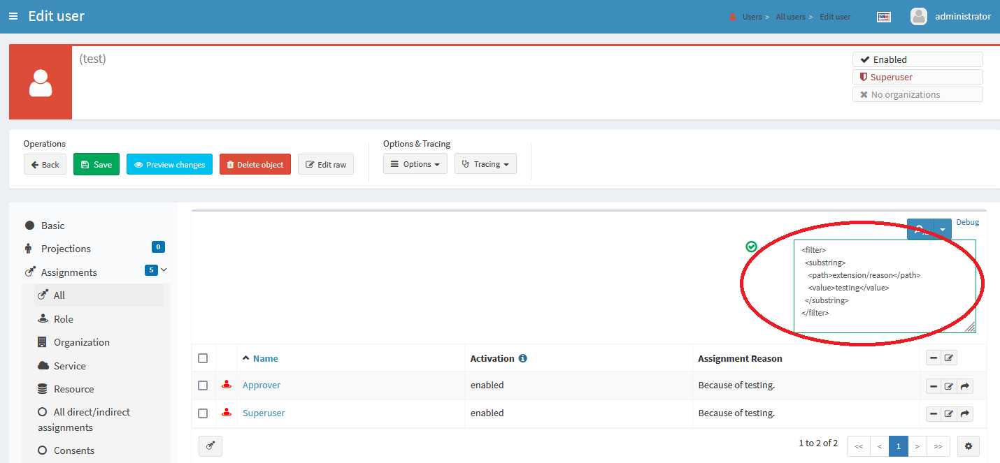
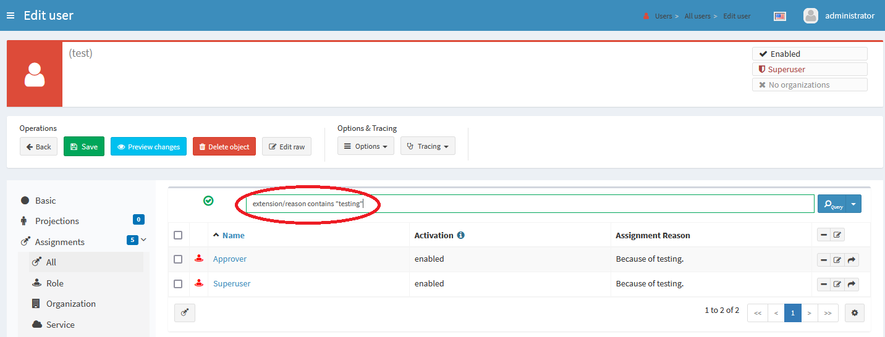
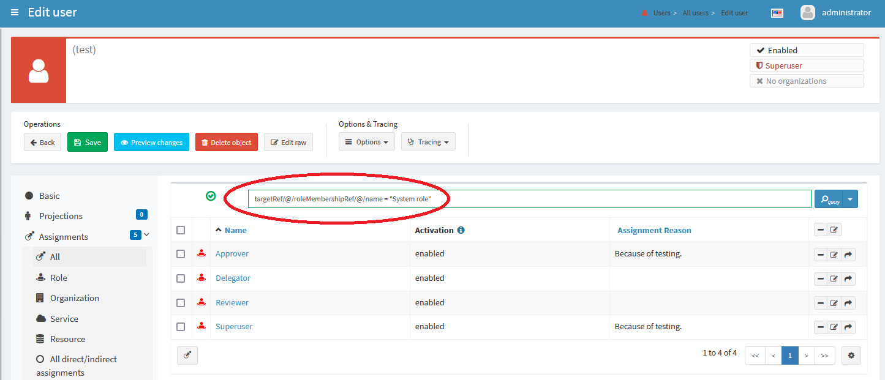

= GUI: Assignment Repository Search
:page-since: 4.6
:page-toc: top

== Background Information

When displaying assignments, midPoint - by default - uses so-called _in-memory_ search.
It is faster but has various limitations: The main one is that it is not possible to formulate
advanced queries, like "show only assignments of roles whose names contain specified text".
However, since midPoint {page-since} the _repository-based_ search is available as an alternative.

== Enabling Repository Search for an Assignments Panel

By default, all assignments panels use in-memory search.

The repository-based search is enabled per object type and per assignment panel. It is done by
adding or editing `adminGuiConfiguration -> objectDetails -> objectDetailsPage` section
in the system configuration.

The following example illustrates how to enable repository-based search for the panel that shows
all assignments of a user.

.Enabling repository search for "All assignments" panel
[source,xml]
----
<systemConfiguration>
    ...
    <adminGuiConfiguration>
        ....
        <objectDetails>
            <objectDetailsPage>
                <type>UserType</type> <!--1-->
                <panel>
                    <identifier>assignments</identifier>
                    <panel>
                        <identifier>allAssignments</identifier> <!--2-->
                        <listView>
                            <dataProvider xsi:type="RepositoryAssignmentDataProviderType"/> <!--3-->
                        </listView>
                    </panel>
                </panel>
            </objectDetailsPage>
        </objectDetails>
    </adminGuiConfiguration>
    ...
</systemConfiguration>
----

<1> Causes this configuration to be applied to user assignments
<2> Denotes "all assignments" panel
<3> The most important part: enables repository-based search

If you already have configuration for `User` object details page, you should merge this into your
existing configuration.

NOTE: As it is obvious from the configuration example, this configuration is per object type.
If you want repository-based search for assignments of other object types, you need to add
`objectDetailsPage` configuration for each of them.

For additional existing assignment panels and their GUI configuration see xref:/midpoint/reference/admin-gui/admin-gui-config/[Admin GUI Configuration].

After saving these changes, you should log out and log in again. Otherwise, the changes would not
be applied to your GUI session.

== Enabling Full-Text Search

The repository search provider allows you to use full-text search in assignment panels. In order
to use this feature, full-text indexing must be enabled system-wide. Please see
xref:/midpoint/reference/repository/full-text-search/[Full-Text Search] for details.

For clarity of search for end-users, we recommend setting full-text indexing at least for
the following properties:

[%autowidth]
[%header]
|===
| Type | Property | Description
| `AssignmentHolderType` | `name` | Target name displayed for most assignments.
| `AbstractRoleType` | `displayName` | Alternative name displayed for roles and services
(if present).
|===

The following configuration snippet indexes `name` for all `AssignmentHolderType` objects
(i.e. almost all objects in the system) and additionally `displayName` and `description`
for all abstract roles. It is to be put into the system configuration object at the root level.
(Do not forget to reindex the repository after including it.)

.Full-text search configuration example
[source,xml]
----
<fullTextSearch>
    <enabled>true</enabled>
    <indexed>
        <objectType>AssignmentHolderType</objectType>
        <item>name</item>
    </indexed>
    <indexed>
        <objectType>AbstractRoleType</objectType>
        <item>displayName</item>
        <item>description</item>
    </indexed>
</fullTextSearch>
----

=== An Example of Full-Text Search

Let us have a user `test` with the following five role assignments:

After entering `approver` into the full-text search box the `Approver` role assignment is shown:

After entering `decisions` into the full-text search box the `Approver` and `Reviewer` assignments
are shown:

It is because they have the description of "Role authorizing users to make approval decisions on
work items." and "Role authorizing users to make decisions on certification cases.", respectively.
Only those two objects contain the word `decisions` in their full-text indexed properties.

=== Full-Text Search Limitations

The full-text search currently matches only properties of the _target object_, e.g. the role that
is assigned to the user. The properties of the assignment itself (e.g. the description of the
assignment) are not searchable by this feature.

== Adding Extension Properties to Assignments

MidPoint supports extending the structure of assignments, just like it does for ordinary objects.

=== Extending the Schema

For example, the following `extension.xsd` file (put into the `schema` directory in midPoint home)
adds a `string` property named `reason` to an assignment. It may denote the reason why the
assignment has been created.

For role, this schema defines additional `string` property `externalName`, which may
denote role name as intended for external systems.

.Sample `extension.xsd` file
[source,xml]
----
<xsd:schema elementFormDefault="qualified"
            targetNamespace="http://example.com/xml/ns/mySchema"
            xmlns:a="http://prism.evolveum.com/xml/ns/public/annotation-3"
            xmlns:c="http://midpoint.evolveum.com/xml/ns/public/common/common-3"
            xmlns:xsd="http://www.w3.org/2001/XMLSchema">

    <xsd:complexType name="AssignmentExtensionType">
        <xsd:annotation>
            <xsd:appinfo>
                <a:extension ref="c:AssignmentType"/>
            </xsd:appinfo>
        </xsd:annotation>
        <xsd:sequence>
            <xsd:element name="reason" type="xsd:string" minOccurs="0" maxOccurs="1">
                <xsd:annotation>
                    <xsd:appinfo>
                        <a:indexed>true</a:indexed>
                        <a:displayName>Assignment Reason</a:displayName>
                        <a:displayOrder>120</a:displayOrder>
                    </xsd:appinfo>
                </xsd:annotation>
            </xsd:element>
        </xsd:sequence>
    </xsd:complexType>

    <xsd:complexType name="RoleExtensionType">
        <xsd:annotation>
            <xsd:appinfo>
                <a:extension ref="c:RoleType"/>
            </xsd:appinfo>
        </xsd:annotation>
        <xsd:sequence>
            <xsd:element name="externalName" type="xsd:string" minOccurs="0" maxOccurs="1">
                <xsd:annotation>
                    <xsd:appinfo>
                        <a:indexed>true</a:indexed>
                        <a:displayName>External Name</a:displayName>
                        <a:displayOrder>120</a:displayOrder>
                    </xsd:appinfo>
                </xsd:annotation>
            </xsd:element>
        </xsd:sequence>
    </xsd:complexType>
</xsd:schema>
----

Note that it's necessary to restart midPoint after augmenting or changing the extension schema,
e.g. by adding a file like this one.

=== Making Custom Property Visible in Assignment List

We can add custom columns to the assignment panel by modifying `panel->listView` item in the
admin GUI configuration.

.Adding newly-created property to assignment list
[source,xml]
----
<systemConfiguration>
    ...
    <adminGuiConfiguration>
        ....
        <objectDetails>
            <objectDetailsPage>
                <type>UserType</type>
                <panel>
                    <identifier>assignments</identifier>
                    <panel>
                        <identifier>allAssignments</identifier>
                        <listView>
                            ...
                            <includeDefaultColumns>true</includeDefaultColumns> <!--1-->
                            <column> <!--2-->
                                <name>reason</name> <!--3-->
                                <path>extension/reason</path> <!--4-->
                            </column>
                        </listView>
                    </panel>
                </panel>
            </objectDetailsPage>
        </objectDetails>
    </adminGuiConfiguration>
    ...
</systemConfiguration>
----

<1> Setting this to `true` preserves original default columns, so we do not need to redeclare them.
<2> Adds the column definition
<3> Name (identifier) of the column
<4> Item path of the data to be displayed in the column. In this case it is `extension/reason`.

NOTE: Do not forget to log out and log in after this change, to make it effective.

Now, we can put values into this property, e.g. like this:

We may do the same for e.g. `Superuser` assignment, leading to:

Now, if the repository search is enabled, we can also search in indexed assignment extension fields.
It is necessary to use either Advanced Search or Axiom Query Search feature for this.

For example:

.Advanced search (XML)
[source,xml]
----
<filter>
  <substring>
    <path>extension/reason</path>
    <value>testing</value>
  </substring>
</filter>
----

.Axiom query search
[source,axiom]
----
extension/reason contains "testing"
----

NOTE: Because of current limitations (see the end of this guide) it is necessary to save the user
object before being able to search for its assignments' properties.

Other examples of using advanced or Axiom search are in later parts of this guide.

=== Making Custom Column Sortable

By default, the assignments are sorted alphabetically by the target name. (See the
list of current limitations for the issues connected to using display names in objects shown,
when sorting according to name is used.)

However, it is possible to make our custom column sortable (again, if we are using
`RepositoryAssignmentDataProvider`) by declaring `sortProperty` for column.

The sort property is still an experimental feature, so syntax for declaration is a bit complex:
it is in the form of item path with full namespace declarations.

As an example, if we want to enable sorting on our extension `reason` property, we need to have
the following column definition in `panel->listView` section.

.Making the custom column sortable
[source,xml]
----
<column>
    <name>reason</name>
    <path>extension/reason</path>
    <sortProperty>
        declare namespace myext="http://example.com/xml/ns/mySchema";
        extension/myext:reason
    </sortProperty>
</column>
----

WARNING: This feature is currently not available in some configurations. This is going to be fixed.

=== Adding columns displaying assignment target data

It is possible to add custom columns, which displays data from assignment target
and it's extension, but there are some limitations, based on assignment panel type.

All - `allAssignments`::
panel and code assumes that target is `AbstractAssignmentHolderType`. If you want
to add column which display target extension for `RoleType`, `OrgType` or `ServiceType`
you need to use column with expressions. This columns can not be sortable.
Role - `roleAssignments`::
panel and code assumes that target is `RoleType` and contains extension data for `RoleType`.
Organizations - `orgAssignments`::
panel and code assumes that target is `OrgType`
Service - `serviceAssignments`::
panel and code assumes that target is `ServiceType`

==== Adding column displaying information from reference itself (name or OID)

.Column displaying `name` of target (not display name)
[source,xml]
----
<column>
    <name>targeName</name>
    <path>targetRef</path>
    <export>
        <expression>
            
        </expression>
    </export>
</column>
----

.Column displaying `oid` of target
[source,xml]
----
<column>
    <name>targetOid</name>
    <path>targetRef</path>
    <export>
        <expression>
            
        </expression>
    </export>
</column>
----

==== Adding target extension column for concrete type panels

IMPORTANT: This works only on assignment panels wit concrete target (Role, Organization, Service) and Repository search must be enabled.

For concrete type panels adding column, which displays target extension is straight-forward and similar to adding normal custom column.

If our schema has indexed extension property named `externalName`  defined for `RoleType`, we are able to add it as column to *Assignments -> Role* panel.
The path for this property (relative to assignment) is `targetRef/@/extension/externalName`.

.Column displaying `externalName` extension from target.
[source,xml]
----
<column>
  <name>extName</name>
  <path>targetRef/@/extension/externalName</path>
</column>
----

If we want to make this column also sortable, we need to add `sortProperty` to `column`.

.Column displaying `externalName` extension from target.
[source,xml]
----
<column>
  <name>extName</name>
  <path>targetRef/@/extension/externalName</path>
  <sortProperty>targetRef/@/extension/externalName</sortProperty>
</column>
----

==== Adding target extension column to All Assignments panel

Since not all target types may contain extension (if it is defined in concrete type for example), adding column is bit trickier and require use of `script` expression and more verbose column definition. Since the extension property is not present in all possible
assignment target types we can not sort by it.

We can display our custom property `externalName` also on `allAssignments` panel, using
following snippet:

[source,xml]
----
<column>
    <name>externalName</name>
    <path>targetRef/@</path> <1>
    <display>
        <label>External Name</label> <2>
    </display>
    <export>
        <expression>
            
        </expression>
    </export>
</column>
----

<1> In this case target must be whole target object (`targetRef/@`)
<2> Since this column is custom column using expressions, we also need to define
display name of column
<3> We can use basic expression functions to get extension property. The function `getExtensionPropertyValue` has arguments object (in case of simple expression it is `input`), namespace and local name of extension property.

== Using Advanced or Axiom Search Feature

It is possible to formulate advanced queries using either Advanced (XML) or Axiom Search.

In the case of assignments, you are able to perform queries that deal with both _assignment data_
and _assignment target data_. The latter are accessed via so-called dereferencing using special
path component `@`.

NOTE: You can learn more about filters and dereferencing in xref:/midpoint/reference/concepts/query/query-api/[Query API Documentation].

Let us have a look at some examples.

.Displaying assignments whose target name contains string `user`
====
[source,xml]
.Advanced (XML filter)
----
<filter>
  <substring>
    <path>targetRef/@/name</path>
    <value>user</value>
  </substring>
</filter>
----

.Axiom filter
[source,axiom]
----
targetRef/@/name contains "user"
----
====

.Displaying assignments to objects, which are members of "System role"
====

[source,xml]
.Advanced (XML filter)
----
<filter>
    <equal>
        <path>targetRef/@/roleMembershipRef/@/name</path>
        <value>System role</value>
    </equal>
</filter>
----

.Axiom filter
[source,axiom]
----
targetRef/@/roleMembershipRef/@/name = "System role"
----
====

Note that we are looking for all assignments targeting an object that is itself a member of `System role`
object - assuming that `System role` is an archetype. There are currently four such assignments: all except
`End user`-targeted one.

NOTE: When considering the available properties for search, take into account that the root object
for queries in this panel is `AssignmentType`. So you may open the schema definition for this object,
and refer to all its indexed properties (i.e. present in the repository).

== Current Limitations

The following are current limitations of repository-based search in assignment views. (Some of
them have been already mentioned in this guide.)

. New (i.e. unsaved) assignments are not being filtered. All of them are always displayed at start
of the list using the green color, regardless of whether they match the search filter, or not.
The reason is that they are not yet present in the repository.
. For the same reason, any changes made to the assignments and not yet saved into the repository
are not reflected in the filtering results. For example, if you search for the `extension/reason`
property of the assignment, any changes made to this property are reflected in the search result
only after the user object is saved into the repository.
. Assignment lists sorted by `Name` may appear unsorted if `Display Name` of the target object
(e.g. role) is different from its `Name`. (The combined sort based on name and display name
is not supported.)
. When sorting according to an extension property, the property must be declared as _single-valued_
(`maxOccurs` = 1, which is the default in XSD). This is quite logical, as sorting according to
multivalued property is - in principle - undefined.
. Full-text search is performed on _target_ of an assignment (e.g. assigned role) only.
The content of assignment itself is not indexed for full-text search.
. We recommend to enable repository-based search only on `allAssignments`, `roleAssignments`,
`serviceAssignments` or `orgAssignments` panels, since other panels rely on in-memory search.
