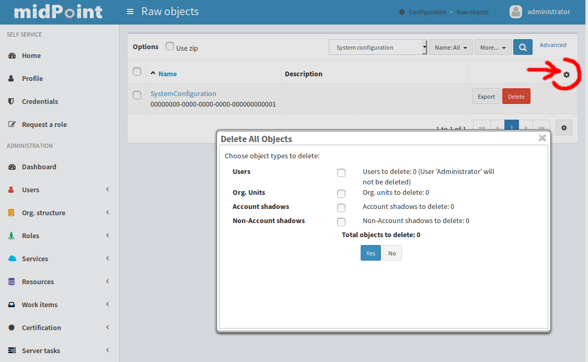

= Cleaning Up The Mess HOWTO
:page-wiki-name: Cleaning up the mess HOWTO
:page-wiki-id: 24674327
:page-wiki-metadata-create-user: semancik
:page-wiki-metadata-create-date: 2017-05-25T11:35:58.478+02:00
:page-wiki-metadata-modify-user: vera
:page-wiki-metadata-modify-date: 2018-01-29T16:07:54.068+01:00
:page-upkeep-status: yellow

So, you have experimented with midPoint.
Now you have thousands of users, some roles, accounts randomly linked, unlinked and deleted and you can no longer tell what works and what does not.
You want to clean it all up and start over.
We know that feeling.
We were there.
And we still get there.
Quite often.
So, this is how you can clean up.

== Cleaning up MidPoint

The most common reason for making the mess out of your deployment is when you are experimenting with synchronization.
Usually when you are trying to pull the data from an HR system into midPoint.
In that case the resource state is OK, it is not changed in any way.
So all you need is to clean up midPoint data.
And more precisely just the identity data: users, shadows, roles, organizations.
This situation is so common that we have a special button for this.
It is nicknamed "laxative button".
You can find it in Configuration -> Repository Objects, click on to top-right cog button and choose "delete all identities" from the menu.

You can select what object types are going to be deleted.
The data will be deleted only from midPoint repository, the resources will *not* be affected.
This it is a nice, clean and quick way how to clean up the mess caused by import of synchronization.

== Cleaning up MidPoint and Resources

If you have already provisioned accounts to the resources and want to clean them up then a different approach has to be used.
The way to go is to use wiki:Bulk+actions+(midPoint+scripting+language)[bulk actions] to delete all users and all accounts linked to them.
Like this:

.Deletes all users and their accounts - USE WITH CARE
[source,xml]
----
<s:executeScript xmlns:s="http://midpoint.evolveum.com/xml/ns/public/model/scripting-3"
          xmlns:q="http://prism.evolveum.com/xml/ns/public/query-3">
    <s:pipeline>
        <s:search>
            <s:type>UserType</s:type>
            <s:searchFilter>
                <q:not>
                    <q:equal>
                        <q:path>name</q:path>
                        <q:value>administrator</q:value>
                    </q:equal>
                </q:not>
            </s:searchFilter>
        </s:search>
        <s:action>
            <s:type>delete</s:type>
        </s:action>
    </s:pipeline>
    <s:options>
        <s:continueOnAnyError>true</s:continueOnAnyError>
    </s:options>
</s:executeScript>
----

[WARNING]
====
This is potentially dangerous, because it is modifying resources.
You may delete something that you have not intended to delete.
And that may be irreversible.
Use with care.

====

=== Limitations

* "continueOnAnyError" is implemented since midPoint 3.6.

* This form of bulk action will read all the objects into memory before deleting them.
This is needed, as currently (midPoint 3.6 and earlier) not all repository implementations can safely delete an object while searching all the objects at the same time.
Therefore, this form will work reliably for small-to-medium deployments.
The usage in large deployments is questionable.
This limitation can be fixed (bug:MID-3940[]).
Please consider xref:/support/subscription-sponsoring/[purchasing a subscription].

== See Also

* wiki:Bulk+actions+(midPoint+scripting+language)[Bulk actions (midPoint scripting language)]