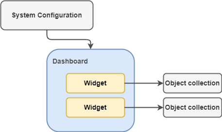
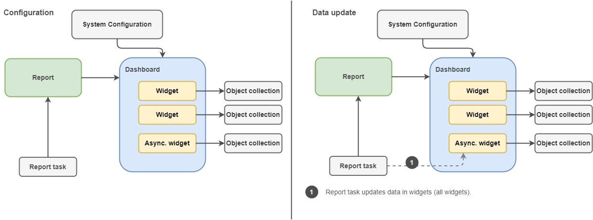

= Dashboards HOWTO
:page-wiki-metadata-create-user: mspanik
:page-since: "4.4"

This guide explains what components you need to create dashboard, how do they interact and how you can build new dashboard.

NOTE: Configuration in midPoint is flexible and can be done in many ways. This tutorial explains basic concepts that can be enhanced and modified.

== Components
From update perspective you have 2 kinds of dashboards (or better - widgets). Standard and asynchronous.

Values of standard widgets are computed every time you open the dashboard. This may be a problem when you need to deal with large amounts of data.

Asynchronous widget allows you to update the data in specified intervals by task. Data are not computed every time when user opens dashboard, what can save system resources and users don't have to wait for data computation.

Additionally, the asynchronous widget may display system status at specific time of the day independently of the time when the data are displayed. E.g. Status of users at 07:00 each day.

=== Standard dashboard
To configure standard dashboard you need following objects:

Object collection::
    Standard object collection defining filter of objects that are counted in dashboard.

//#You can skip this object if your dashboard loads data from audit events.#

Dashboard::
    The dashboard object representing dashboard page in UI. It contains one or multiple widgets displaying data. Each widget relates to some object collection.
Configuration in SystemConfiguration.xml::
    In SystemConfiguration you need to define that dashboard is displayed. You need to add `<configurableUserDashboard>` element and link the dashboard (see example below.)
+
----
<configurableUserDashboard>
    <identifier>test-dashboard</identifier>
    <configurableDashboardRef oid="44e211d9-27c7-466e-ad40-f6d626f88eb1" relation="org:default" type="c:DashboardType"/>
</configurableUserDashboard>
----

=== Dashboard with asynchronous widgets

The configuration of asynchronous dashboards is slightly more complex.

Additionally to standard dashboard, the dashboards with asynchronous widgets needs also:

Report::
    Report object here just defines link between report task updating the data and the dashboard.

Report task::
    Report task updates the data in widgets. It updates the data directly in element `widget/data/storedData` in the dashboard object. The report task should be scheduled to update the data regularly.

To update the dashboard data just run the predefined report task. Scheduling the task is recommended.

You can also run the report itself, just, when you run the report, it creates new Report task with generated name and this task is run instead of the preconfigured task.

Asynchronous widget is identified by `widget/data/sourceType = "widgetData"` or `widget/data/displaySourceType = "widgetData"`. displaySourceType element overrides source type only for displaying the number on widget. sourceType is used for redirect to details page.

NOTE: Don't confuse the Report task with xref:/midpoint/reference/tasks/synchronization-tasks/asynchronous-update[Asynchronous update task] which is used for updating data from resources.

== Setup
NOTE: We recommend to use IDEA with xref:/midpoint/tools/studio/usage/index.adoc[midPoint Studio] plugin. Engineering midPoint with Studio is definitely much easier.

=== How to deploy standard dashboard ?

. Prepare and xref:/midpoint/tools/studio/usage/index.adoc#uploading-midpoint-objects[upload] Object collection defining filter of objects.
. Prepare and upload Dashboard.
. Add `<configurableUserDashboard>` element to SystemConfiguration and upload the configuration.
. Check configuration:
.. Logout and login to UI to apply changes in SystemConfiguration
.. go to Dashboards/<your_new_dashboard> to see its content.

=== How to deploy dashboard with asynchronous widgets ?

. Prepare and upload Object collection defining filter of objects.
. Prepare and upload Dashboard.
. Prepare and upload Dashboard report.
. Prepare and upload Report task.
. Add `<configurableUserDashboard>` element to SystemConfiguration and upload the configuration.
. Check configuration:
.. Logout and login to UI to apply changes in SystemConfiguration
.. go to Dashboards/<your_new_dashboard> to see its content. The asynchronous widgets should display `Unknown` value.
.. run the Report task, or wait till it is run on schedule.
.. go to Dashboards/<your_new_dashboard> to see its content. The asynchronous widgets should display correct data.

When you upload dashboard with asynchronous widgets, it will display `Unknown` value until the report task is not run and the value of `<storedData>` widget element is not filled in.

== Dashboard Example

This example contains dashboard `Howto-example` providing quick information of enabled and disabled users in the environment. The dashboard consists of 2 widgets:

    - all disabled users
    - all enabled users - updated asynchronously

Objects from the example are located in midpoint samples in link:https://github.com/Evolveum/midpoint-samples/tree/master/samples/dashboard/howto[samples/dashboard/howto] directory.

The example consists of:

    - collection-enabled-users.xml - Object collection filtering enabled users.
    - collection-disabled-users.xml - Object collection filtering disabled users.
    - dashboard-howto-example.xml - Dashboard definition
    - report-dashboard-howto-example.xml -
    - task-report-dashboard-howto-example.xml

== Setup Example

NOTE: We recommend to use IDEA with xref:/midpoint/tools/studio/usage/index.adoc[midPoint Studio] plugin. Engineering midPoint with Studio is definitely much easier.
To set up the example in your testing environment just copy the example files from samples to your project and:

. Upload object collections `collection-enabled-users.xml` and `collection-disabled-users.xml`
. Upload dashboard `dashboard-howto-example.xml`
. Upload dashboard report `report-dashboard-howto-example.xml`
. Upload report task `task-report-dashboard-howto-example.xml`
. Add configuration into your SystemConfiguration and upload the configuration.
+
----
<configurableUserDashboard>
    <identifier>dashboard-howto-example</identifier>
    <configurableDashboardRef oid="44e211d9-27c7-466e-ad40-f6d626f88eb1" relation="org:default" type="c:DashboardType"/>
</configurableUserDashboard>
----
+
Alternative: If you are modifying system configuration via UI:

.. go to `Configuration/System`, click on `Admin GUI` Configuration
.. choose `User Dashboards` tab and add new dashboard.
.. fill in "dashboard-howto-example" as Identifier, select "dashboard-howto-example" in Dashboard field
.. click save
. If you modified SystemConfiguration via XML, logout and login to midPoint UI.
. Go to `Dashboards/Howto-example` dashboard.
+
You can see that second widget displays "Unknown" as value. This is expected.
. Go to `Server Tasks/Report Tasks` and run the task `Report task: dashboard-howto-example`. The task updates values in widgets of the Dashboard.
. Go to `Dashboards/Howto-example` dashboard.
+
You can see that second widget value is updated by actual number of enabled users.

If you want to schedule the task, just uncomment the `<schedule>` element in the `task-report-dashboard-howto-example.xml` and modify the schedule according your needs.

== See Also

- xref:/docs/midpoint/reference/dashboards/[Customizable Dashboards] - main info about dashboards
- xref:/docs/midpoint/reference/dashboards/configuration/[Dashboard Configuration] - details of dashboard configuration
- xref:/docs/midpoint/reference/misc/reports/configuration/[Report Configuration] - details of reports configuration
- xref:/docs/midpoint/reference/misc/reports/examples/example-report-number-of-members/[Example of Dashboard Report:Number of members] - more complex example of dashboard and dashboard report