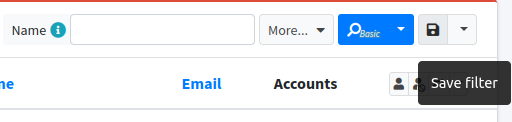
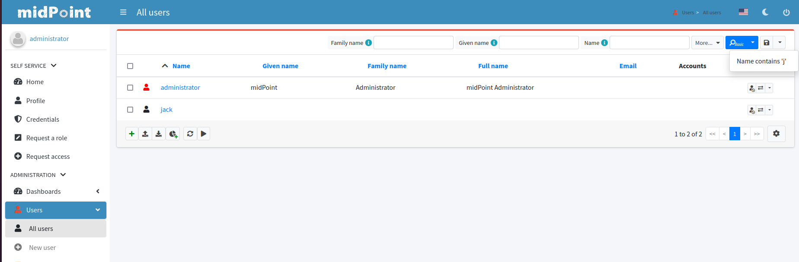

= MidPoint Administration Interface User Guide
:page-upkeep-status: orange
:page-toc: top

This page describes the possibilities of user profile configuration. For now it contains only the documentation about saved filters and its usage.

== Saved filters (still in development state)

Saved filters feature is implemented on the pages through out midPoint where the list of objects of some collection view is displayed (for more information about object collection views, please see xref:/midpoint/reference/admin-gui/collections-views/[Object Collections and Views]). This can be default collection view objects list page (such All users page) or configured object collection view page (e.g. Employees collection view configured for User type).

This feature improves the search of objects im midPoint giving the possibility to save the most often used or the most complicated filters. Saved once the filter can be reused within multiple user sessions and can be spread among a group of users with the help of admin gui configuration merging mechanism.

To save the filter the user can use the Save filter button on the Search panel (which is situated on the right side of the search panel, next to Search button).

After the user clicks Save filter button, Save filter popup is displayed where the user should specify the name of the filter and confirm the saving. After relogin of the user the saved filter will be displayed in the filters list next to Save filter button (for now the mechanism of up-to-the-minute changes applying is not implemented for the Saved filters feature). To apply the filter, just select it from the list.

