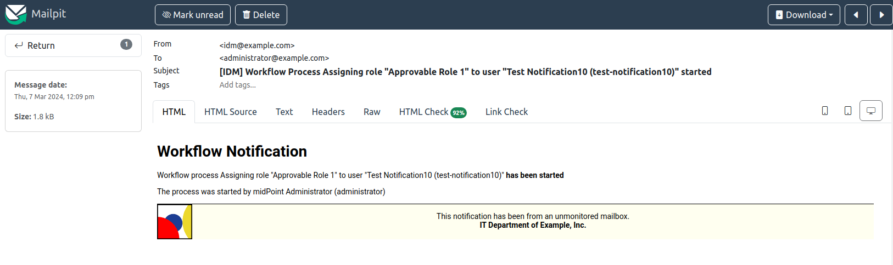
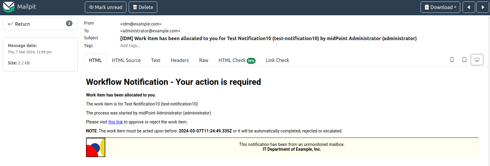
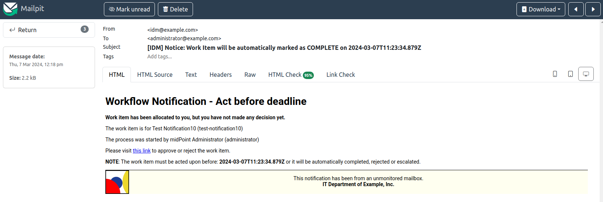
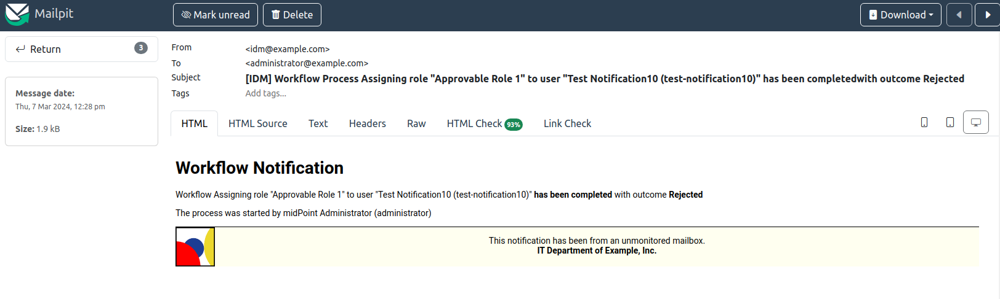
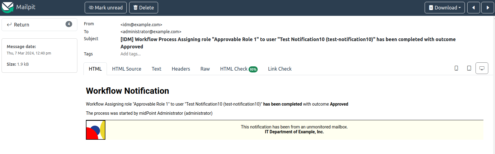

= Notifications HOWTO
:page-wiki-metadata-create-user: vix
:page-since: "4.5"
:page-since-improved: [ "4.6", "4.7", "4.8" ]
:page-toc: top
:experimental:

== Basic Information

MidPoint can be configured to send notifications upon certain events.
The default configuration does not contain any notification configuration so there are no notifications sent by midPoint at all.
This document show how to work with notifications for common use cases and how to improve them.

Please refer also to xref:/midpoint/reference/misc/notifications/[] and xref:/midpoint/reference/misc/notifications/configuration/[] for reference information.

:sectnums:
== Setting Infrastructure Parameters

Before creating notifications, System Configuration's _Infrastructure_ parameters must be configured.

* *defaultHostname*: defines the midPoint server hostname that will be used when generating notifications with links to midPoint GUI. Example: `localhost` (for local testing) or `midpoint`.
* *publicHttpUrlPattern*: if midPoint is located behind a reverse proxy, provide URL of midPoint visible from outside. Examples:
** `https://midpoint.example.com/iam`
** `https://$host/midpoint` where `$host` will be replaced with `defaultHostname` value by midPoint

TIP: You _can_ use only `publicHttpUrlPattern` with value `https://midpoint.example.com/iam` and don't need to set `defaultHostname` when using a reverse proxy, but please note that `defaultHostname` is used also for other purposes such as intra-cluster communication.

.Example fragment of System configuration object:
[source,xml]
----
<infrastructure>
    <defaultHostname>midpoint</defaultHostname>
    <publicHttpUrlPattern>https://$host/midpoint</publicHttpUrlPattern>
</infrastructure>
----

== Message Transport Configuration

Message transport defines the notification mechanism of the notifications.

The following example configures midPoint transport named `mail` to send e-mail notifications via _unsecured_ communication using host `localhost` and port `25`:

.Example fragment of System configuration (local SMTP server):
[source,xml]
----
<messageTransportConfiguration>
    <mail>
        <name>mail</name>
        <server>
            <host>localhost</host>
            <port>25</port>
            <transportSecurity>none</transportSecurity>
        </server>
        <defaultFrom>idm@example.com</defaultFrom>
    </mail>
</messageTransportConfiguration>
----

TIP: If you are using secured communication with your SMTP server, you need to import its SSL certificate to midPoint's keystore. Please see also xref:/midpoint/reference/misc/notifications/configuration/#configuring-transports[]

The following example is useful for local testing as it creates midPoint transport named `mail` which redirects all e-mail notifications to a file stored in midPoint server filesystem:

.Example fragment of System configuration (e-mail redirection to a file):
[source,xml]
----
<messageTransportConfiguration>
    <mail>
        <name>mail</name>
        <redirectToFile>/opt/midpoint/var/log/example-mail-notifications.log</redirectToFile>
        <defaultFrom>idm@example.com</defaultFrom>
    </mail>
</messageTransportConfiguration>
----

Please refer to xref:/midpoint/reference/misc/notifications/configuration/#configuring-transports[] for more options.

== Default Notification Configuration

As stated earlier, there is _no default_ notification configuration.
Notification handlers need to be explicitly used.
Having said that, the default configuration of the notification handlers might be useful to inspect - to know what you can expect.

In the following example we will configure only `recipientExpression` but not `subjectExpression` nor `bodyExpression` - e-mail subject and body will be generated by the notifiers (<<Setting Infrastructure Parameters,infrastructure parameters are omitted from the configuration>>)

.(Show System configuration fragment)
[%collapsible]
====
.Example System configuration object fragment
[source,xml]
----
<notificationConfiguration>
    <handler>
        <name>Default Notification Handler</name>
        <description>
            The default set of notifications for demonstration purposes and/or for further customization.
        </description>

        <simpleUserNotifier>
            <name>notify-administrators-about-users-all</name>
            <description>Notify system administrators about all user-related operations.</description>
            <recipientExpression>
                <value>idm@example.com</value><!--1-->
            </recipientExpression>
            <transport>mail</transport>
        </simpleUserNotifier>
    </handler>
</notificationConfiguration>
<messageTransportConfiguration>
    <mail>
        <name>mail</name>
        <server>
            <host>localhost</host>
            <port>25</port>
            <transportSecurity>none</transportSecurity>
        </server>
        <defaultFrom>idm@example.com</defaultFrom>
    </mail>
</messageTransportConfiguration>
----
<1> Fixed e-mail recipient `idm@example.com`

====

Create a new testing user with the following properties:

* *Name*: `test-notification1`
* *Given name*: `Test`
* *Family name*: `Notification1`
* *Full name*: `Test Notification1`
* *E-mail address*: `test.notification1@example.com`

The e-mail notification will be created and delivered with the default content:

Please note how the default content was constructed:

* *From*: _idm@example.com_ (configured in _messageTransportConfiguration_ as `defaultFrom`)
* *To*: _idm@example.com_ (configured in _simpleUserNotifier_ as `recipientExpression`)
* *Subject*: _User creation notification_ (generated by the notifier itself)
* *Message body*: generated by the notifier itself, includes the following information:
** operation status (`SUCCESS`)
** user related to the operation
** notification creation (event) date
** changes as recorded by midPoint
** information about requester (user performing the operation - `administrator`)
** information about channel of the operation

As you can see, the notification is quite information-rich, but looks quite technical, too.
We will improve the notifications later.

Let's add other notifiers now.

.(Show System configuration fragment)
[%collapsible]
====
.Example System configuration object fragment:
[source,xml]
----
<notificationConfiguration>
    <handler>
        <name>Default Notification Handler</name>
        <description>
            The default set of notifications for demonstration purposes and/or for further customization.
            TODO: add lifecycleStatus when available.
        </description>

        <simpleUserNotifier>
            <name>notify-administrators-about-users-all</name>
            <description>Notify system administrators about all user-related operations.</description>
            <recipientExpression>
                <value>idm@example.com</value><!--1-->
            </recipientExpression>
            <transport>mail</transport>
        </simpleUserNotifier>

        <simpleResourceObjectNotifier>
            <name>notify-administrators-about-resource-objects-all</name>
            <description>Notify system administrator about all resource objects.</description>
            <recipientExpression>
                <value>idm@example.com</value><!--2-->
            </recipientExpression>
            <transport>mail</transport>
        </simpleResourceObjectNotifier>

        <userPasswordNotifier>
            <name>notify-administrators-about-midpoint-password</name>
            <description>New midPoint user password is sent to the administrator</description>
            <recipientExpression>
                <value>idm@example.com</value><!--3-->
            </recipientExpression>
            <transport>mail</transport>
        </userPasswordNotifier>

        <accountPasswordNotifier>
            <name>notify-user-about-new-account-password</name>
            <description>Notification with new account password is sent to the account owner (if he/she has e-mail address)</description>
            <transport>mail</transport>
            <!--4-->
        </accountPasswordNotifier>
    </handler>
</notificationConfiguration>
<messageTransportConfiguration>
    <mail>
        <name>mail</name>
        <server>
            <host>localhost</host>
            <port>25</port>
            <transportSecurity>none</transportSecurity>
        </server>
        <defaultFrom>idm@example.com</defaultFrom>
    </mail>
</messageTransportConfiguration>
----
<1> Fixed e-mail recipient `idm@example.com`
<2> Fixed e-mail recipient `idm@example.com`
<3> Fixed e-mail recipient `idm@example.com`
<4> No recipient defined; will use the account owner if his/her e-mail address is defined in midPoint
====

Create a new testing user with the following properties:

* *Name*: `test-notification2`
* *Given name*: `Test`
* *Family name*: `Notification2`
* *Full name*: `Test Notification2`
* *E-mail address*: `test.notification2@example.com`
* Password: Secret123

The e-mail notification will be created and delivered with the default content:

Please note how the default content was constructed:

* *From*: _idm@example.com_ (configured in _messageTransportConfiguration_ as `defaultFrom`)
* *To*: _idm@example.com_ (configured in _simpleUserNotifier_ as `recipientExpression`)
* *Subject*: _User creation notification_ (generated by the notifier itself)
* *Message body*: generated by the notifier itself, includes the following information:
** operation status (`SUCCESS`)
** user related to the operation
** notification creation (event) date
** changes as recorded by midPoint, *password is not revealed here*
** information about requester (user performing the operation - `administrator`)
** information about channel of the operation

Second e-mail notification has been created and delivered with the default content:

Please note how the default content was constructed:

* *From*: _idm@example.com_ (configured in _messageTransportConfiguration_ as `defaultFrom`)
* *To*: _idm@example.com_ (configured in _simpleUserNotifier_ as `recipientExpression`)
* *Subject*: _User password notification_ (generated by the notifier itself)
* *Message body*: generated by the notifier itself, includes the following information:
** password for the new user

Let's see how the e-mail notifications work with other-than-create operations.

Update your `test-notification2` user by changing user's description property.

The e-mail notification will be created and delivered with the default content:

Please note how the default content was constructed:

* *From*: _idm@example.com_ (configured in _messageTransportConfiguration_ as `defaultFrom`)
* *To*: _idm@example.com_ (configured in _simpleUserNotifier_ as `recipientExpression`)
* *Subject*: _User modification notification_ (generated by the notifier itself)
* *Message body*: generated by the notifier itself, includes the following information:
** operation status (`SUCCESS`)
** user related to the operation
** notification creation (event) date
** changes as recorded by midPoint (`description` property)
** information about requester (user performing the operation - `administrator`)
** information about channel of the operation

Let's see how the notifications behave with a password change.
Change your `test-notification2` user's password.

The e-mail notification will be created and delivered with the default content:

Please note how the default content was constructed:

* *From*: _idm@example.com_ (configured in _messageTransportConfiguration_ as `defaultFrom`)
* *To*: _idm@example.com_ (configured in _simpleUserNotifier_ as `recipientExpression`)
* *Subject*: _User modification notification_ (generated by the notifier itself)
* *Message body*: generated by the notifier itself, includes the following information:
** operation status (`SUCCESS`)
** user related to the operation
** notification creation (event) date
** changes as recorded by midPoint (*password is not revealed*)
** information about requester (user performing the operation - `administrator`)
** information about channel of the operation

The second notification shows:

Please note how the default content was constructed:

* *From*: _idm@example.com_ (configured in _messageTransportConfiguration_ as `defaultFrom`)
* *To*: _idm@example.com_ (configured in _simpleUserNotifier_ as `recipientExpression`)
* *Subject*: _User password notification_ (generated by the notifier itself)
* *Message body*: generated by the notifier itself, includes the following information:
** new password for the existing user

As you can see, the default behavior is to send notification also about password changes and not only about initial passwords.

In midPoint, edit `test-notification2` user and assign a role to provision the account in a target system.

The e-mail notification will be created and delivered with the default content:

Please note how the default content was constructed:

* *From*: _idm@example.com_ (configured in _messageTransportConfiguration_ as `defaultFrom`)
* *To*: _idm@example.com_ (configured in _simpleResourceObjectNotifier_ as `recipientExpression`)
* *Subject*: _Account creation notification_ (generated by the notifier itself)
* *Message body*: generated by the notifier itself, includes the following information:
** operation status (`SUCCESS`)
** user related to the operation (owner of the account)
** notification creation (event) date
** account changes as recorded by midPoint (*password is not revealed*)
** information about requester (user performing the operation - `administrator`)
** information about channel of the operation

The second notification shows:

Please note how the default content was constructed:

* *From*: _idm@example.com_ (configured in _messageTransportConfiguration_ as `defaultFrom`)
* *To*: _test.notification2@example.com_ (the account owner, used as default if `recipientExpression` in _simpleAccountPasswordNotifier_ is not defined and that user has e-mail address)
* *Subject*: _Account password notification_ (generated by the notifier itself)
* *Message body*: generated by the notifier itself, includes the following information:
** password for the new account

(A third notification related to user modification - role assignment - would be sent as well.
This is omitted for brevity.)

As you can see, the same notifications are used for all user-related operations.

To change this default behavior, we need to use _filters_.

*Lessons learned*:

* the default configuration of notifiers can be very useful... but also very technical
* the default configuration of notifiers is used for all kinds of operations (Add, Modify, Delete)

== Adding Filters

Let's configure our password notifiers to send passwords only for *add* operation (when user/account is created) and only if the operation was successful.

.(Show System configuration fragment)
[%collapsible]
====
.Example System configuration object fragment:
[source,xml]
----
<notificationConfiguration>
    <handler>
        <name>Default Notification Handler</name>
        <description>
            The default set of notifications for demonstration purposes and/or for further customization.
        </description>

        <simpleUserNotifier>
            <name>notify-administrators-about-users-all</name>
            <description>Notify system administrators about all user-related operations.</description>
            <recipientExpression>
                <value>idm@example.com</value><!--1-->
            </recipientExpression>
            <transport>mail</transport>
        </simpleUserNotifier>

        <simpleResourceObjectNotifier>
            <name>notify-administrators-about-resource-objects-all</name>
            <description>Notify system administrator about all resource objects.</description>
            <recipientExpression>
                <value>idm@example.com</value><!--2-->
            </recipientExpression>
            <transport>mail</transport>
        </simpleResourceObjectNotifier>

        <userPasswordNotifier>
            <name>notify-administrators-about-midpoint-password</name>
            <description>New midPoint user password is sent to the administrator but only if user was successfully created.</description>
            <operation>add</operation><!--4-->
            <status>success</status><!--5-->
            <recipientExpression>
                <value>idm@example.com</value><!--3-->
            </recipientExpression>
            <transport>mail</transport>
        </userPasswordNotifier>

        <accountPasswordNotifier>
            <name>notify-user-about-new-account-password</name>
            <description>Notification with new account password is sent to the account owner (if he/she has e-mail address), but only if the account was successfully created.</description>
            <operation>add</operation><!--4-->
            <status>success</status><!--5-->
            <transport>mail</transport>
        </accountPasswordNotifier>
    </handler>
</notificationConfiguration>
<messageTransportConfiguration>
    <mail>
        <name>mail</name>
        <server>
            <host>localhost</host>
            <port>25</port>
            <transportSecurity>none</transportSecurity>
        </server>
        <defaultFrom>idm@example.com</defaultFrom>
    </mail>
</messageTransportConfiguration>
----
<1> Fixed e-mail recipient `idm@example.com`
<2> Fixed e-mail recipient `idm@example.com`
<3> Fixed e-mail recipient `idm@example.com`
<4> Only for operation `add`
<5> Only if operation finished successfully
====

Change your `test-notification2` user's password.

This time, the user/password notifications won't be sent.
Only user/account changes will be reported, not revealing the actual password.

*Lessons learned*:

* adding filters to otherwise default configuration of notifiers is easy, but very powerful

== Separating Notifiers Using Filters

Filters can be used to create different notifications for different operations, statuses or recipients.
This allows to create specific subjects - if needed.

.(Show System configuration fragment)
[%collapsible]
====
.Example System configuration object fragment:
[source,xml]
----
<notificationConfiguration>
    <handler>
        <name>Default Notification Handler</name>
        <description>
            The default set of notifications for demonstration purposes and/or for further customization.
        </description>

        <simpleUserNotifier>
            <name>notify-administrators-about-users-add</name>
            <description>Notify other system administrator only about user additions</description>
            <operation>add</operation>
            <recipientExpression>
                <value>idm-add@example.com</value>
            </recipientExpression>
            <subjectExpression>
                <value>User added</value><!--1-->
            </subjectExpression>
            <transport>mail</transport>
        </simpleUserNotifier>

        <simpleUserNotifier>
            <name>notify-administrators-about-users-modify</name>
            <description>Notify other system administrator only about user modifications</description>
            <operation>modify</operation>
            <recipientExpression>
                <value>idm-modify@example.com</value>
            </recipientExpression>
            <subjectExpression>
                <value>User modified</value><!--2-->
            </subjectExpression>
            <transport>mail</transport>
        </simpleUserNotifier>

        <simpleUserNotifier>
            <name>notify-administrators-about-users-delete</name>
            <description>Notify other system administrator only about user deletions</description>
            <operation>delete</operation>
            <recipientExpression>
                <value>idm-delete@example.com</value>
            </recipientExpression>
            <subjectExpression>
                    <value>User deleted</value><!--3-->
            </subjectExpression>
            <transport>mail</transport>
        </simpleUserNotifier>

        <simpleResourceObjectNotifier>
            <name>notify-administrators-about-resource-objects-all</name>
            <description>Notify system administrator about all resource objects.</description>
            <recipientExpression>
                <value>idm@example.com</value>
            </recipientExpression>
            <transport>mail</transport>
        </simpleResourceObjectNotifier>

        <userPasswordNotifier>
            <name>notify-administrators-about-midpoint-password</name>
            <description>New midPoint user password is sent to the administrator but only if user was successfully created.</description>
            <operation>add</operation>
            <status>success</status>
            <recipientExpression>
                <value>idm@example.com</value>
            </recipientExpression>
            <transport>mail</transport>
        </userPasswordNotifier>

        <accountPasswordNotifier>
            <name>notify-user-about-new-account-password</name>
            <description>Notification with new account password is sent to the account owner (if he/she has e-mail address), but only if the account was successfully created.</description>
            <operation>add</operation>
            <status>success</status>
            <transport>mail</transport>
        </accountPasswordNotifier>
    </handler>
</notificationConfiguration>
<messageTransportConfiguration>
    <mail>
        <name>mail</name>
        <server>
            <host>localhost</host>
            <port>25</port>
            <transportSecurity>none</transportSecurity>
        </server>
        <defaultFrom>idm@example.com</defaultFrom>
    </mail>
</messageTransportConfiguration>
----
<1> Subject for user additions
<2> Subject for user modifications
<3> Subject for user deletions
====

In midPoint, edit `test-notification2` user and update user's `description` once again.

The e-mail notification will be created and delivered with the default content:

Please note how the default content was constructed:

* *From*: _idm@example.com_ (configured in _messageTransportConfiguration_ as `defaultFrom`)
* *To*: _idm-modify@example.com_ (configured in _simpleUserNotifier_ for _modify_ operation as `recipientExpression`)
* *Subject*: _User modified_ (configured in _simpleUserNotifier_ for _modify_ operation as `subjectExpression`)
* *Message body*: generated by the notifier itself, includes the following information:
** operation status (`SUCCESS`)
** user related to the operation
** notification creation (event) date
** changes as recorded by midPoint
** information about requester (user performing the operation - `administrator`)
** information about channel of the operation

Add, modify and delete operations now send different e-mail notifications using different subjects and recipients.

*Lessons learned*:

* notifications can be sent to different recipients with different subjects using filters

== Adding Message Templates (Plain Text)

We could re-use the previous example to also populate different message bodies.
We will introduce the message templates to make it even more universal and to move the configuration from System configuration to separate objects.

*Please note*: we will use various _variables_ now to create dynamic messages.
Refer to xref:/midpoint/reference/misc/notifications/configuration/#expression-variables-for-any-events[expression variables] for more information.

.(Show System configuration fragment)
[%collapsible]
====
.Example System configuration object fragment:
[source,xml]
----
<notificationConfiguration>
    <handler>
        <name>Default Notification Handler</name>
        <description>
            The default set of notifications for demonstration purposes and/or for further customization.
        </description>

        <simpleUserNotifier>
            <name>notify-administrators-about-users-add</name>
            <description>Notify other system administrator only about user additions</description>
            <operation>add</operation>
            <recipientExpression>
                <value>idm2@example.com</value>
            </recipientExpression>
            <messageTemplateRef oid="95e1cd9e-abb7-4e9c-aa48-e9bc70282bc2"/><!--1-->
            <transport>mail</transport>
        </simpleUserNotifier>

        <simpleUserNotifier>
            <name>notify-administrators-about-users-modify</name>
            <description>Notify other system administrator only about user modifications</description>
            <operation>modify</operation>
            <recipientExpression>
                <value>idm2@example.com</value>
            </recipientExpression>
            <subjectExpression>
                <value>User modified</value><!--2-->
            </subjectExpression>
            <transport>mail</transport>
        </simpleUserNotifier>

        <simpleUserNotifier>
            <name>notify-administrators-about-users-delete</name>
            <description>Notify other system administrator only about user deletions</description>
            <operation>delete</operation>
            <recipientExpression>
                <value>idm2@example.com</value>
            </recipientExpression>
            <subjectExpression>
                <value>User deleted</value><!--3-->
            </subjectExpression>
            <transport>mail</transport>
        </simpleUserNotifier>
    </handler>
</notificationConfiguration>
<messageTransportConfiguration>
    <mail>
        <name>mail</name>
        <server>
            <host>localhost</host>
            <port>25</port>
            <transportSecurity>none</transportSecurity>
        </server>
        <defaultFrom>idm@example.com</defaultFrom>
    </mail>
</messageTransportConfiguration>
----
<1> Message template should specify the subject
<2> Subject for modified users defined here
<3> Subject for deleted users deleted here
====

This time we need also the message template:

.(Show Message template)
[%collapsible]
====
.Message template `message-template-user-add`
[source,xml]
----
<messageTemplate xmlns="http://midpoint.evolveum.com/xml/ns/public/common/common-3"
                 oid="95e1cd9e-abb7-4e9c-aa48-e9bc70282bc2">
    <name>message-template-user-add</name>
    <description>Template for simple user notifier for added users, to be customized.</description>
    <defaultContent>
        <subjectExpression><!--1-->
            
        </subjectExpression>
        <bodyExpression><!--3-->
            
        </bodyExpression>
    </defaultContent>
</messageTemplate>
----
<1> Subject expression
<2> Velocity language used for expressions (we could also use Groovy).
<3> Body expression
====

Create a new testing user with the following properties:

* *Name*: `test-notification4`
* *Given name*: `Test`
* *Family name*: `Notification4`
* *Full name*: `Test Notification4`
* *E-mail address*: `test.notification4@example.com`

The e-mail notification will be created and delivered with the following content:

Please note how the e-mail content was constructed:

* *From*: _idm@example.com_ (configured in _messageTransportConfiguration_ as `defaultFrom`)
* *To*: _idm2@example.com_ (configured in _simpleUserNotifier_ for _modify_ operation as `recipientExpression`)
* *Subject*: _[IDM] User test-notification4 added with operation result SUCCESS_ (created in _message-template-user-add_ used by _simpleUserNotifier_ with operation: _add_)
* *Message body*: generated by the message template with the following information:
** operation status (`SUCCESS`)
** user related to the operation
** information about requester (user performing the operation - `administrator`)

Add, modify and delete operations now send different e-mail notifications using different message templates which produce different subjects and bodies.

*Lessons learned*:

* message templates allow customization outside System configuration. Typically, they are used for `subjectExpression` and `bodyExpression`. The message templates can utilize various xref:/midpoint/reference/misc/notifications/configuration/#expression-variables-for-any-events[expression variables] available for notifications.

== Adding Message Templates (HTML)

When we start using message templates to override the default e-mail content generated by notifiers, we can move to HTML content as well.

We will update the message template for `add` operation.

.(Show Message template)
[%collapsible]
====
.Message template `message-template-user-add`
[source,xml]
----
<messageTemplate xmlns="http://midpoint.evolveum.com/xml/ns/public/common/common-3"
                 oid="95e1cd9e-abb7-4e9c-aa48-e9bc70282bc2">
    <name>message-template-user-add</name>
    <description>Template for simple user notifier for added users, to be customized.</description>
    <defaultContent>
        <contentType>text/html; charset=UTF-8</contentType><!--1-->
        <subjectExpression>
            
        </subjectExpression>
        <bodyExpression>
            
        </bodyExpression>
    </defaultContent>
</messageTemplate>
----
<1> Content-type specified (HTML)
====

Create a new testing user with the following properties:

* *Name*: `test-notification4`
* *Given name*: `Test`
* *Family name*: `Notification4`
* *Full name*: `Test Notification4`
* *E-mail address*: `test.notification4@example.com`

The e-mail notification will be created and delivered with the following content:

image::simpleUserNotifier-create-with-template-html.png[100%,title=simpleUserNotifier with HTML message template - user add]

Please note how the e-mail content was constructed:

* *From*: _idm@example.com_ (configured in _messageTransportConfiguration_ as `defaultFrom`)
* *To*: _idm2@example.com_ (configured in _simpleUserNotifier_ for _modify_ operation as `recipientExpression`)
* *Subject*: _[IDM] User test-notification5 added with operation result SUCCESS_ (created in _message-template-user-add_ used by _simpleUserNotifier_ with operation: _add_)
* *Message body*: generated by the message template with the following information:
** operation status (`SUCCESS`)
** user related to the operation
** information about requester (user performing the operation - `administrator`)
** icon/logo, look and feel are defined in the HTML code of the message template

Add, modify and delete operations now send different e-mail notifications using different message templates which produce different subjects and bodies.

*Lessons learned*:

* message templates can be prepared with HTML formatting
* just like with plain text message templates, the customization is placed outside System configuration.
The message templates can utilize various xref:/midpoint/reference/misc/notifications/configuration/#expression-variables-for-any-events[expression variables] available for notifications.

== Adding Attachments

If needed, you can add attachments (text or binary) to your e-mails.
In the following example, we will attach a file (text/plain for simplicity) for each new user to the notification.

We will update the message template for `add` operation.

.(Show Message template)
[%collapsible]
====
.Message template `message-template-user-add`
[source,xml]
----
<messageTemplate xmlns="http://midpoint.evolveum.com/xml/ns/public/common/common-3"
                 oid="95e1cd9e-abb7-4e9c-aa48-e9bc70282bc2">
    <name>message-template-user-add</name>
    <description>Template for simple user notifier for added users, to be customized.</description>
    <defaultContent>
        <contentType>text/html; charset=UTF-8</contentType>
        <subjectExpression>
            
        </subjectExpression>
        <bodyExpression>
            
        </bodyExpression>
        <attachment><!--1-->
            <contentType>text/plain</contentType>
            <contentId>attached-password-notes.txt</contentId>
            <fileName>password-notes.txt</fileName>
            <contentFromFile>/opt/midpoint/var/attachments/password-notices.txt</contentFromFile>
        </attachment>
    </defaultContent>
</messageTemplate>
----
<1> Attachment definition for `/opt/midpoint/var/attachments/password-notices.txt` file
====

Create a new testing user with the following properties:

* *Name*: `test-notification6`
* *Given name*: `Test`
* *Family name*: `Notification6`
* *Full name*: `Test Notification6`
* *E-mail address*: `test.notification6@example.com`

The e-mail notification will be created and delivered with the following content:

Please note how the e-mail content was constructed:

* *From*: _idm@example.com_ (configured in _messageTransportConfiguration_ as `defaultFrom`)
* *To*: _idm2@example.com_ (configured in _simpleUserNotifier_ for _modify_ operation as `recipientExpression`)
* *Subject*: _[IDM] User test-notification6 added with operation result SUCCESS_ (created in _message-template-user-add_ used by _simpleUserNotifier_ with operation: _add_)
* *Message body*: generated by the message template with the following information:
** operation status (`SUCCESS`)
** user related to the operation
** information about requester (user performing the operation - `administrator`)
** icon/logo, look and feel are defined in the HTML code of the message template
* *Attachment* `password-notes.txt` is included (the file is located in midPoint server filesystem)

Add, modify and delete operations now send different e-mail notifications using different message templates which produce different subjects and bodies - and attachments, if needed.

*Lessons learned*:

* attachments can be used in notifications to include images, documents or other information.
The attached files must be available by midPoint, e.g. stored in midPoint's `midpoint.home` directory (`/opt/midpoint/var/` in our example) or can be constructed using the expressions.

== Localized Message Templates

MidPoint allows localization of message templates based on *recipient's* `preferredLanguage` or `locale` property.
If the recipient's `preferredLanguage` or `locality` does not match the localized content of the template, the defaults (`defaultContent`) will be used.

In the following example we will demonstrate this on `accountPasswordNotifier` which by defaults uses the account owner as the recipient.
If the account owner has e-mail address defined in midPoint, it will be used and user's `preferredLanguage` or `locality` will be considered.

.(Show System configuration fragment)
[%collapsible]
====
.Example System configuration object fragment:
[source,xml]
----
<notificationConfiguration>
    <handler>
        <name>Default Notification Handler</name>
        <description>
            The default set of notifications for demonstration purposes and/or for further customization.
        </description>

        <simpleUserNotifier>
            <name>notify-administrators-about-users-add</name>
            <description>Notify other system administrator only about user additions</description>
            <operation>add</operation>
            <recipientExpression>
                <value>idm2@example.com</value>
            </recipientExpression>
            <messageTemplateRef oid="95e1cd9e-abb7-4e9c-aa48-e9bc70282bc2"/>
            <transport>mail</transport>
        </simpleUserNotifier>

        <simpleUserNotifier>
            <name>notify-administrators-about-users-modify</name>
            <description>Notify other system administrator only about user modifications</description>
            <operation>modify</operation>
            <recipientExpression>
                <value>idm2@example.com</value>
            </recipientExpression>
            <subjectExpression>
                <value>User modified</value>
            </subjectExpression>
            <transport>mail</transport>
        </simpleUserNotifier>

        <simpleUserNotifier>
            <name>notify-administrators-about-users-delete</name>
            <description>Notify other system administrator only about user deletions</description>
            <operation>delete</operation>
            <recipientExpression>
                <value>idm2@example.com</value>
            </recipientExpression>
            <subjectExpression>
                <value>User deleted</value>
            </subjectExpression>
            <transport>mail</transport>
        </simpleUserNotifier>

        <accountPasswordNotifier>
            <name>notify-user-about-new-account-password</name>
            <description>Notification with new account password is sent to the account owner (if he/she has e-mail address)</description>
            <transport>mail</transport>
            <messageTemplateRef oid="dbba04c4-75e3-4476-99cb-d4e0d78e4975" /><!--1-->
        </accountPasswordNotifier>
    </handler>
</notificationConfiguration>
<messageTransportConfiguration>
    <mail>
        <name>mail</name>
        <server>
            <host>localhost</host>
            <port>25</port>
            <transportSecurity>none</transportSecurity>
        </server>
        <defaultFrom>idm@example.com</defaultFrom>
    </mail>
</messageTransportConfiguration>
----
<1> Message template for accountPasswordNotifier should specify subject and body
====

This time we need also the message template for `accountPasswordNotifier`:

.(Show Message template)
[%collapsible]
====
.Message template `message-template-user-add`
[source,xml]
----
<messageTemplate xmlns="http://midpoint.evolveum.com/xml/ns/public/common/common-3"  oid="dbba04c4-75e3-4476-99cb-d4e0d78e4975">
    <name>message-template-account-password</name>
    <description>Template for account password notifier, to be customized.</description>
    <defaultContent>
        <contentType>text/html; charset=UTF-8</contentType>
        <subjectExpression>
            
        </subjectExpression>
        <bodyExpression>
            
        </bodyExpression>
    </defaultContent>
    <localizedContent><!--1-->
        <language>sk</language><!--2-->
        <subjectExpression>
            
        </subjectExpression>
        <bodyExpression>
            
        </bodyExpression>

    </localizedContent>
</messageTemplate>
----
<1> This is the configuration for localized messages...
<2> {nbsp}... more specifically for Slovak language (sk) configured in recipient's `preferredLanguage` or `locale`.
====

Create a new testing user with the following properties:

* *Name*: `test-notification10`
* *Given name*: `Test`
* *Family name*: `Notification10`
* *Full name*: `Test Notification10`
* *E-mail address*: `test.notification10@example.com`
* *Preferred language*: `Slovenčina`
* *Password*: `Secret123`
* Assign a role to create an account in a target system

The e-mail notification will be created and delivered with the following content:

Please note how the default content was constructed:

* *From*: _idm@example.com_ (configured in _messageTransportConfiguration_ as `defaultFrom`)
* *To*: _test.notification10@example.com_ (the account owner, used as default if `recipientExpression` in _simpleAccountPasswordNotifier_ is not defined and that user has e-mail address)
* *Subject*: _[IDM] Heslo pre účet test-notification10_ (created in _message-template-account-password_ for `sk` localization, used by _simpleAccountPasswordNotifier_ with operation: _add_)
* *Message body*: created in _message-template-account-password_ for `sk` localization, includes the following information:
** password for the new account

(Other notification(s) are omitted for brevity.)

*Lessons learned*:

* message templates allow localization of the notification content based on *recipient's* `preferredLanguage` or `locale` properties. If recipient's properties do not match the localized configurations, the default localization of the template will be used

== Approvals-Related Notifications

This chapter will utilize the previously explained configuration concepts to achieve similar configuration also for approvals-related notifications.
As not all midPoint users are required to use midPoint approvals mechanism, you can think of this chapter as an appendix.

NOTE: Notifications for users involved in approvals require that their e-mail addresses are not empty.

NOTE: In this examples, a single role is configured with approvals.
This configuration is not included.

The System configuration object is _extended_ with the following configuration:

.(Show System configuration fragment)
[%collapsible]
====
.Example System configuration object fragment
[source,xml]
----
<notificationConfiguration>
    <handler>
    . . .
        <simpleWorkflowNotifier><!--1-->
            <name>notify-requester-about-workflow-start</name>
            <category>workflowProcessEvent</category>
            <description>Notification is sent to the requester (if he/she has e-mail address) when workflow starts.</description>
            <operation>add</operation>
            <messageTemplateRef oid="12ded411-8cc1-4322-b7a6-df8315591b95"/>
            <transport>mail</transport>
        </simpleWorkflowNotifier>

        <simpleWorkflowNotifier><!--2-->
            <name>notify-requester-about-workflow-end</name>
            <category>workflowProcessEvent</category>
            <description>Notification is sent to the requester (if he/she has e-mail address) when workflow ends.</description>
            <operation>delete</operation>
            <messageTemplateRef oid="b037aa68-cb6d-4cdd-8c5d-bb68de4fa03a"/>
            <transport>mail</transport>
        </simpleWorkflowNotifier>

        <simpleWorkflowNotifier><!--3-->
            <name>notify-assignee-about-workitem-creation</name>
            <category>workItemAllocationEvent</category>
            <description>Notification is sent to work item assignee (if he/she has e-mail address) when the work item is created</description>
            <operation>add</operation>
            <messageTemplateRef oid="59e32934-d240-4bc1-9276-0f6a7357e896"/>
            <transport>mail</transport>
        </simpleWorkflowNotifier>

        <simpleWorkflowNotifier><!--4-->
            <name>notify-assignee-about-workitem-modification</name>
            <category>workItemAllocationEvent</category>
            <description>Notification is sent to work item assignee (if he/she has e-mail address) when the work item is updated e.g. forwarded or because of deadline warning</description>
            <messageTemplateRef oid="4c7d3fca-7a99-45ba-b6a6-110710b64b1f"/>
            <operation>modify</operation>
            <transport>mail</transport>
        </simpleWorkflowNotifier>
    </handler>
</notificationConfiguration>
----
<1> Notification is sent when approval workflow starts (event category: `workflowProcessEvent`, operation: `add`).
The notification is sent to the requester by default.
<2> Notification is sent when approval workflow finishes (event category: `workflowProcessEvent`, operation: `delete`).
The notification is sent to the requester by default.
<3> Notification is sent when workitem is created and allocated to the assignee (event category: `workItemAllocationEvent`, operation: `add`).
The notification is sent to the assignee by default.
<4> Notification is sent when workitem is modified, e.g. forwarded to another approver or because of the deadline warning (event category: `workItemAllocationEvent`, operation: `modify`).
The notification is sent to the assignee by default.

====

We also need message templates:

.(Show Message template for workflow start)
[%collapsible]
====
[source,xml]
----
<messageTemplate xmlns="http://midpoint.evolveum.com/xml/ns/public/common/common-3"
                 oid="12ded411-8cc1-4322-b7a6-df8315591b95">
    <name>message-template-workflow-event-started</name>
    <description>Template for simple workflow notifier for workflow start, to be customized.</description>
    <defaultContent>
        <contentType>text/html; charset=UTF-8</contentType>
        <subjectExpression>
            
        </subjectExpression>
        <bodyExpression>
            
        </bodyExpression>
    </defaultContent>
</messageTemplate>
----
====

.(Show Message template for workflow end)
[%collapsible]
====
[source,xml]
----
<messageTemplate xmlns="http://midpoint.evolveum.com/xml/ns/public/common/common-3"
                 oid="b037aa68-cb6d-4cdd-8c5d-bb68de4fa03a">
    <name>message-template-workflow-event-finished</name>
    <description>Template for simple workflow notifier for workflow end, to be customized.</description>
    <defaultContent>
        <contentType>text/html; charset=UTF-8</contentType>
        <subjectExpression>
            
        </subjectExpression>
        <bodyExpression>
            
        </bodyExpression>
    </defaultContent>
</messageTemplate>
----
====

.(Show Message template for workitem creation)
[%collapsible]
====
[source,xml]
----
<messageTemplate xmlns="http://midpoint.evolveum.com/xml/ns/public/common/common-3"
                 oid="59e32934-d240-4bc1-9276-0f6a7357e896">
    <name>message-template-workitem-added</name>
    <description>Template for simple workflow notifier for work item creation, to be customized.</description>
    <defaultContent>
        <contentType>text/html; charset=UTF-8</contentType>
        <subjectExpression>
            
        </subjectExpression>
        <bodyExpression>
            
        </bodyExpression>
    </defaultContent>
</messageTemplate>
----
====

.(Show Message template for workitem modification)
[%collapsible]
====
[source,xml]
----
<messageTemplate xmlns="http://midpoint.evolveum.com/xml/ns/public/common/common-3"
                 oid="4c7d3fca-7a99-45ba-b6a6-110710b64b1f">
    <name>message-template-workitem-modified</name>
    <description>Template for simple workflow notifier for work item modification (e.g. time out warning), to be customized.</description>
    <defaultContent>
        <contentType>text/html; charset=UTF-8</contentType>
        <subjectExpression>
            
        </subjectExpression>
        <bodyExpression>
            
        </bodyExpression>
    </defaultContent>
</messageTemplate>
----
====

If you assign an approvable role to your testing user `test-notification10` with e-mail `test.notification10@example.com` in midPoint, the following notification will be created and delivered to the requester:

Please note how the default content was constructed:

* *From*: _idm@example.com_ (configured in _messageTransportConfiguration_ as `defaultFrom`)
* *To*: _administrator@example.com_ (the requester, used as default if that user has e-mail address)
* *Subject*: _[IDM] Workflow Process Assigning role "Approvable Role 1" to user "Test Notification10 (test-notification10)" started_ (created in _message-template-workflow-event-started_, used by _simpleWorkflowNotifier_ with category: _workflowProcessEvent_ and operation: _add_)
* *Message body*: created in _message-template-workflow-event-started_, includes the following information:
** information about the case name (also in subject) which includes information what is being assigned to whom
** information that the process has been started

The second notification is constructed and delivered to the role assignment approver:

Please note how the default content was constructed:

* *From*: _idm@example.com_ (configured in _messageTransportConfiguration_ as `defaultFrom`)
* *To*: _administrator@example.com_ (the workitem assignee (role approver), used as default if that user has e-mail address)
* *Subject*: _[IDM] Work Item has been allocated to you for Test Notification10 (test-notification10) by midPoint Administrator (administrator)_ (created in _message-template-workitem-added_, used by _simpleWorkflowNotifier_ with category: _workItemAllocationEvent_ and operation: _add_)
* *Message body*: created in _message-template-workitem-added_, includes the following information:
** information that you need to act upon the workitem and that is has been allocated to you
** information about the requestee (_test-notification10_ user)
** information about the requester (_administrator_ user)
** link to the workitem to approve/reject it
** *Only if a deadline has been configured*: information about the workitem deadline

If the approvals are configured with a deadline for automatic workitem completion (e.g. automatic reject) and reminders, the approver will receive one or several reminder notifications:

Please note how the default content was constructed:

* *From*: _idm@example.com_ (configured in _messageTransportConfiguration_ as `defaultFrom`)
* *To*: _administrator@example.com_ (the workitem assignee (role approver), used as default if that user has e-mail address)
* *Subject*: _[IDM] Work Item will be automatically marked as COMPLETE on 2024-03-07T11:23:34.879Z_ (created in _message-template-workitem-modified_, used by _simpleWorkflowNotifier_ with category: _workItemAllocationEvent_ and operation: _modify_)
* *Message body*: created in _message-template-workitem-modified_, includes the following information:
** information that you need to act upon the workitem but you did not act yet
** information about the requestee (_test-notification10_ user)
** information about the requester (_administrator_ user)
** link to the workitem to approve/reject it
** information about the workitem deadline

If the approver rejects the request or if the approvals are configured with a deadline for automatic workitem completion and approver fails to act in time, the workflow will be finished with reject:

Please note how the default content was constructed:

* *From*: _idm@example.com_ (configured in _messageTransportConfiguration_ as `defaultFrom`)
* *To*: _administrator@example.com_ (the requester, used as default if that user has e-mail address)
* *Subject*: _[IDM] Workflow Process Assigning role "Approvable Role 1" to user "Test Notification10 (test-notification10)" has been completed with outcome Rejected_, used by _simpleWorkflowNotifier_ with category: _workflowProcessEvent_ and operation: _delete_)
* *Message body*: created in _message-template-workflow-event-finished_, includes the following information:
** information that the workflow has been completed with outcome Rejected
** information about the requester (_administrator_ user)

However, if the approver approves the work item, the workflow will be finished successfully:

Please note how the default content was constructed:

* *From*: _idm@example.com_ (configured in _messageTransportConfiguration_ as `defaultFrom`)
* *To*: _administrator@example.com_ (the requester, used as default if that user has e-mail address)
* *Subject*: _[IDM] Workflow Process Assigning role "Approvable Role 1" to user "Test Notification10 (test-notification10)" has been completed with outcome Approved_, used by _simpleWorkflowNotifier_ with category: _workflowProcessEvent_ and operation: _delete_)
* *Message body*: created in _message-template-workflow-event-finished_, includes the following information:
** information that the workflow has been completed with outcome Approved
** information about the requester (_administrator_ user)

If the role assignmend caused any user/account modification and you have configured appropriate notifications, other notifications would be send after the workitem approval.

TIP: You could change the `recipientExpression` for `simpleWorkflowNotifier` and category: `workflowProcessEvent` to (Groovy) `requestee?.emailAddress` to inform the requestee about the workflow start and finish.

== Tips And Tricks

* if recipient's e-mail address is not defined, e-mail is not sent
* some notifiers have default recipients, e.g. `simpleWorkflowNotifier` use by default:
** `requester.emailAddress` for `workflowProcessEvent` events
** `assignee.emailAddress` for `workflowAllocationEvent` events
* when working with Java methods called from Velocity, you need to prepend method with `$` and enclose parameters in `${variable}` notation or the method will not be called at all, e.g.:
+
[source]
----
#set ( $obj = $midpoint.resolveReferenceIfExists( ${item.getValue().getTargetRef()} )  )
----
* when using Velocity template language, be careful about newlines! Newline in Velocity becomes newline in plain text content (e.g. in e-mail subject).
+
To suppress a newline while still keeping your Velocity code in multiple lines, end the line in Velocity with a comment (`##`):
+
.Suppressing newlines in Velocity
[source,xml]
----
<subjectExpression>
    
</subjectExpression>
----
** this would produce the subject as: `[IDM] Work Item has been allocated to you for Test Notification10 (test-notification10) by midPoint
Administrator (administrator)` (single line)
