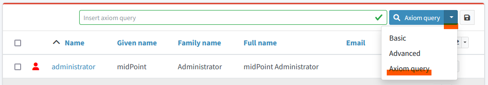
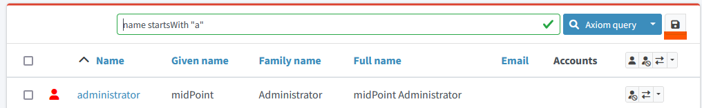

= GUI: Search with AXIOM - EXAMPLES
:page-wiki-metadata-create-user: mspanik
:page-since: "4.4"

Midpoint provides multiple mechanisms to xref:/midpoint/reference/concepts/query/[query] data. This document provides basic information of xref:/midpoint/reference/concepts/query/axiom-query-language/[AXIOM query language] and examples of its usage in midPoint GUI.

The document is intended for users who understand midPoint concepts and architecture (IDM operators, administrators, engineers,...). They can use the AXIOM language in deeper analysis and searching for the objects and their relations in GUI.

Although this document specifies to GUI usage, AXIOM query language can be used not only there but also in other queries instead of XML query language.

== Basic Information

Axiom Query Language is a language used to query objects in midPoint repository. It is a universal language used to search for objects in the repository, filter objects, set up object references and so on. The language closely follows midPoint data model. Names of the properties, attributes and all the data items are directly taken from midPoint data model (e.g. fullName, activation/effectiveStatus).

AXIOM provides following comparison operators: "=", "!=", "<", "<=", ">", ">=" with their usual meaning. Strings may be compared also with _"startsWith"_, _"endsWith"_, _"contains"_ and _"fullText"_ operators (note: fullText operator requires configuration of fulltext index).

AXIOM provides also logical operators _"and"_, _"or"_ and _"not"_. Execution of complex queries may be ordered using brackets "(" and ")".

Objects in midPoint are binded by relations (assignments, inducements, ..). AXIOM provides dereferencing mechanism with operator "@" which allows searching objects using attributes and values in the references. See examples below for usage.

You can create complex queries also using _"match"_ operator and _"exists"_ operator. See examples below for their usage.

More detail information and description of the operators can be found at xref:/midpoint/reference/concepts/query/axiom-query-language/[Axiom Query Language] documentation.

== How to start

Basic search query is shown above each view by default. User can switch to AXIOM query by clicking the query button and choosing the _Axiom query_ option.

Objects are searched in specific view in GUI. If user needs to search all objects of specific type, he has to select the relevant view (All users, All roles, All services).

Knowledge of internal structure of midPoint objects is necessary - at least basic names of attributes and basic understanding of assignment/targetRef attribute and roleMembershipRef attribute.
If the user needs to find name of specific attribute, he can use _Edit raw_ button on the object details page.

Search queries are case-sensitive. Query `givenName = "John"` is different from `givenName = "john"`

=== Saved searches

User can save predefined useful filters for future use - by using _Save filter_ button.

== AXIOM Query Examples

[options="header", cols="20, 30, 40"]
|===
|Request
|AXIOM Query
|Details

3+|*Search by attributes in object*

|Find users with specific given name
|`givenName = "John"`
|
|Find users with last name starting with specific string
|`familyName startsWith "Wo"`
|

|Find roles with name ending with specific string
|`name endsWith "LAST"`
|Searching in _All roles_ view

|Find service where _Application URL_ extension attribute contains specific string.
|`extension/appUrl contains "mycompanyname.com"`
|Attributes specific for the deployment are in objects stored as extension attributes in <extension> XML element.

To search these attributes you need to include "extension/" in the attribute name.

|Find disabled users in _All users view_
|`activation/administrativeStatus = "disabled"`
|

3+|*Search by attributes in referenced objects*

|Find User with specific assignment
|`assignment/targetRef/@/name = "End user"`
|The dereferencing operator "@" states that everything behind relates to the referenced object.

|Find User with service object indirectly assigned
|`roleMembershipRef/@/name = "SAP application"`
|The indirect assignment of service object represents "access to application"

|Find users of specific archetype
|`archetypeRef/@/name = "External Users"`
|

3+|*Logical operators in search*

|Find all external users with specific given name.
|`archetypeRef/@/name = "External Users" and givenName = "John"`
|

3+|*Search by dates and times*

|Find all users created after particular date
|`metadata/createTimestamp > "2022-09-21"`
|

|Find all users created on particular date (e.g. 19/10/2022)
|`metadata/createTimestamp >= "2022-10-22" and metadata/createTimestamp < "2022-10-23"`
| createTimestamp is datetime value. The value with time is larger just the date. 2022-10-22T01:05:13 that is larger than "2022-10-22"

|Find users modified in specific second
|`metadata/modifyTimestamp >= "2022-10-02T12:53:32"and metadata/modifyTimestamp < "2022-10-02T12:53:33"`
|

3+|*Search through assignments or inducements* +
These searches are valid in views listing objects - users, roles, services. For searches in the object panels see below.

|Find users with specific roles directly assigned
|`assignment/targetRef/@/name = "End user"`
|

|Find users with specific role assigned (directly or indirectly)
|`roleMembershipRef/@/name = "End user"`
|roleMembershipRef contains both direct and indirect assignments.

Note: roleMembershipRef may not be up-to-date if the role definition was updated and it's members were not recomputed.

|Find users without any service assigned (directly or indirectly)
|`roleMembershipRef not matches (targetType = ServiceType)`
|roleMembershipRef contains both direct and indirect assignments.

|Find users without any role or service assigned (directly or indirectly)
|`roleMembershipRef not matches (targetType = RoleType) AND roleMembershipRef not matches (targetType = ServiceType)`
|

|Roles without any inducement
|`inducement not exists`
|_exists_ operator with _not_ operator together. +
This can't be used with assignments if roles have assigned archetypes.

|Find users without any role or service directly assigned
|`assignment/targetRef not matches ( targetType = RoleType) AND assignment/targetRef not matches ( targetType = ServiceType)`
|Assignment attribute contains direct assignments only.

Query is rather complex, because each user has at least one assignment assigned - archetype assignment.

|Users with account on specific resource
|`linkRef/@ matches ( +
. type ShadowType +
and resourceRef matches (oid = "093ba5b5-7b15-470a-a147-889d09c2850f") +
and intent = "default"
)`
|Resource is identified by OID

Note: For detail explanation of the query please check additional xref:/midpoint/reference/concepts/query/axiom-query-language/examples/[Example AXIOM queries] page.

|Users with account on specific resource
|`linkRef/@ matches ( +
. type ShadowType +
and resourceRef/@/name = "LDAP" +
and intent = "default" )`
|Like previous query, just the resource is identified by resource name.

3+|*Referencing (supported since version 4.6)*

|In roles view, find all roles that are assigned to specific user
|`. referencedBy (@type = UserType AND name = "adam" AND @path = assignment/targetRef)`
| Dot is important in the query.

3+|*Searching in All accesses panel (supported since version 4.7)* +
View in "All accesses" panel displays content of "roleMembershipRef" attribute. So name of this attribute must be excluded from the queries.
|All assigned roles
|`. matches (targetType = RoleType)`
|You can also use ServiceType for services or OrgType for organizational units.

|All accesses starting with gallery in the display name
|`@/displayName startsWith "gallery"`
|The view shows display names of the objects. So search for name element could bring confusing results if name and displayName are different.

|All applications where the user has access
|`@/archetypeRef/@/name="Application"`
|This searches for all references with archetype named "Application". The same way you can search for "Application role" or "Business role".

3+| *Searching in user assignments* +
Views in "Assignments" panels display content of "assignment" attribute. So name of this attribute must be excluded from the queries.

|All roles assigned directly
|`targetRef matches (targetType = RoleType)`
|

|All assignments (roles or other) with name starting with "C"
|`targetRef/@/name startsWith "C"`
|NOTE: Dereferencing (search with @) is working in the assignment panel only when xref:../assignment-repository-search/index.adoc[repository search is enabled]. This is not enabled by default.

|===

== See Also

- xref:/midpoint/reference/concepts/query/[midPoint Query] - Query concepts in midPoint
- xref:/midpoint/reference/concepts/query/axiom-query-language/[Axiom Query Language] - Main page of AXIOM query language.
- xref:/midpoint/reference/concepts/query/axiom-query-language/examples/[Example Axiom Queries] - Additional examples with more detail explanation.
- xref:/midpoint/reference/concepts/query/axiom-query-language/expressions/[Expressions in Axiom Query] - Expressions in AXIOM queries.
- xref:/midpoint/devel/axiom/concepts/[Axiom Concepts] - Developers documentation - detail concepts of AXIOM query language.