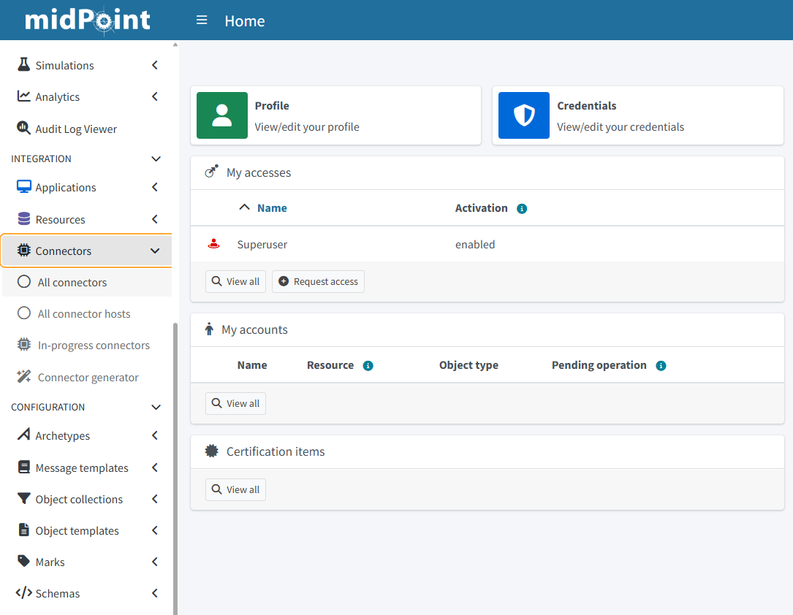
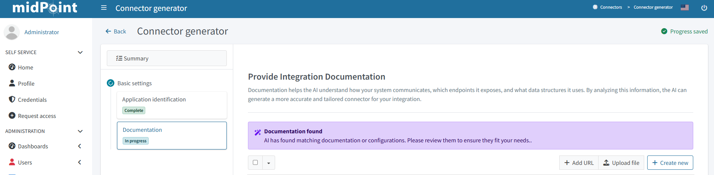
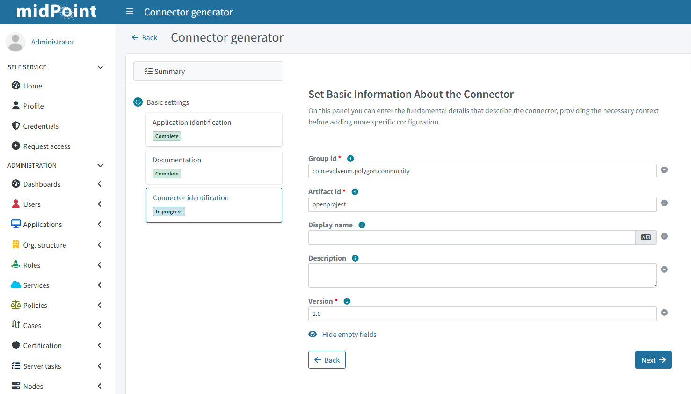
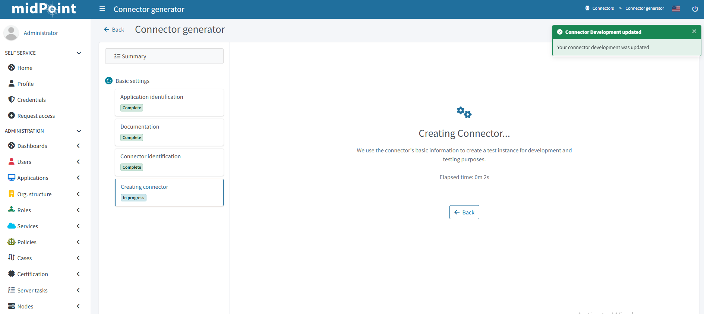
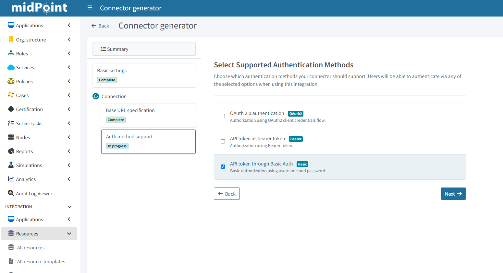
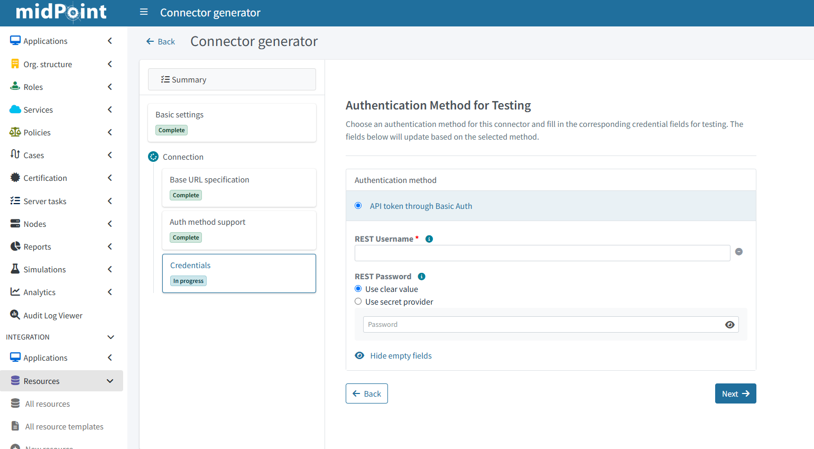
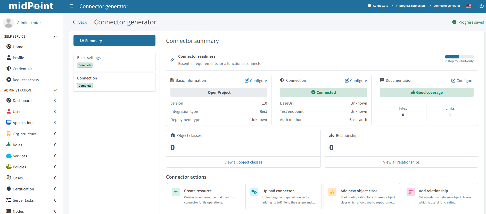

= Trying out the midPilot connector generator
:page-nav-title: Guide
:page-display-order: 10
:page-liquid:
:toclevels: 2
:page-upkeep-status: green
:page-keywords:  [ 'connector generator', 'generator", "identity connectors", "connectors" ]
:page-description: ""
:page-toc: top

== Introduction

Identity projects often stall not on business logic, but on the tedious work of building and maintaining custom connectors for every target system.
MidPoint's midPilot connector generator tackles this by using API documentation and AI‑assisted analysis to produce ready‑to‑use identity connectors with far less manual effort.

This tutorial walks through setting up the midPilot Connector Generator microservice using Docker Compose and running it alongside a local midPoint instance on your workstation.

By the end, you will have a working development environment with midPilot’s connector generator accessible on a local URL and midPoint running in a separate container.
This guide assumes you are comfortable with Docker and Docker Compose, have basic familiarity with midPoint, and can run commands from a terminal on Linux, macOS, or WSL.

IMPORTANT: Preview, the midPilot connector generator and its components are still under development, some concept may change during development.

== Prerequisites

Before using the environment with midPilot code generator make sure you have prepared the following:

* *Docker* - You need to have Docker installed on your computer.
Check the documentation on link:https://docs.docker.com/engine/install/[Docker Engine] for guides on setting up Docker.

+
[TIP]
====
To check if you have Docker already installed on your computer, run `docker --version` in your terminal.
This should return the Docker version, such as `Docker version 27.5.1, build 9f9e405`.
If not, Docker is not in link:https://en.wikipedia.org/wiki/PATH_(variable)[PATH] and likely not installed at all.
====

* *Bash* - Bash is a widely used shell on Linux-based systems.
If you are on Linux or macOS, you probably have it installed already.
On Windows, you can use the WSL2 layer which has the Bash shell.

* *Internet connection* - Docker compose pulls the required Docker images during bootstrap of the compose stack, also when using online documentation for code generator internet connectivity is needed.

== Sample Environment

At the link:https://github.com/Evolveum/midpoint-samples/tree/master/samples/demo/codegen-openproject[following link] you can find a ready‑to‑use Docker Compose environment that you can use as a sample to try out the midPilot Connector Generator.

The sample environment includes:

* The midPilot connector generator microservice.
* A midPoint instance.
* Container holding postgresql databases for both of the above services.
* An OpenProject container as an example target system.
* A container with a nginx reverse proxy in front of the openProject service (Self signed certificate, some warnings might be present).

The environment does not contain any sample data other than the initial configuration present in midPoint.
Sample objects in the example target system have to be set up after initialization by accessing the openProject service.
For more details on how to access it see the section <<_access_services,"Access To Environment Services">> .

[[_environment_properties]]
=== Environment Properties

The repository also contains an example .env file that you can use as a starting point for your local configuration.

sampleRef::demo/codegen-openproject/.env.example[]

The following are the properties related to the midPilot code generator:

* *LLM__OPENAI_API_KEY*: OpenAI-compatible API key used to authenticate requests to an LLM provider or an OpenAI-compatible proxy.
* *LLM__OPENAI_BASE_URL:* OpenAI-compatible endpoint (i.e. https://openrouter.ai/api/v1)
* *SEARCH__METHOD_NAME*: either "ddgs" or "brave" ( Using the "brave" search api is recommended yet additional configuration is needed, see below).
** *Search engine* api used to locate and fetch the documentation used to generate the connector code.
* BRAVE__API_KEY: API key, to use the "brave" search engine API.
* BRAVE__ENDPOINT: API endpoint, to use the "brave" search engine API.

[[_environment_startup]]
=== Environment Startup

To initialize the environment you need to download the content of the link:https://github.com/Evolveum/midpoint-samples/tree/master/samples/demo/codegen-openproject[sample directory] to your host system.

Inside the directory use the example environment properties file to create a ".env" file containing your local configuration.

====
[source, bash]
----
mv .env.example .env
----
====

* Update the environment properties based on the <<_environment_properties,"Environment Properties">> section of this guide.
* In the directory containing the "docker-compose.yml" file execute the following command:

====
[source, bash]
----
docker compose up -d
----
====

Docker will pull the images in the compose stack and execute services specified in the containers.

* After the process is complete you can validate that the services are running, in the same directory execute:

====
[source, bash]
----
docker compose ps
----
====

There should be a total of 6 services "Up" and running with "midpilot-connector-gen" in their name.

[[_access_services]]
=== Access To Environment Services

Use the following to access the services in the environment:

* The midPoint service:
** a web API on , link:http://localhost:8080/midpoint/[localhost:8080].
*** Username: Administrator
*** Password: op3nS*sam#
* The midPilot service:
** a documentation endpoint with swagger UI on link:http://localhost:8090/docs[localhost:8090/docs],
** a REST api endpoint on, "http://midpilot-connector-gen:8090/api/v1".
* A openProject instance:
** a web API on, link:https://localhost:8443/[localhost:8443],
*** Username: admin
*** Password: admin
** REST api endpoint on, "https://openproject/api/v3/" (Basic Auth),
*** Credentials have to be set up in the web Ui of openProject, please consult the official openProject link:https://www.openproject.org/docs/api/example/[documentation].

== Initial environment configuration

The access to the midPilot connector generator microservice has to be specified in the "System Configuration" object of the midPoint instance.
The current environment already contains this configuration "out of the box".
It is loaded via a xref:/midpoint/reference/deployment/post-initial-import/[special hook] during startup,

The change in the configuration objet is the addition of the following snippet.

====
[source, xml]
----
<smartIntegration>
    <connectorGenerationUrl>http://midpilot-connector-gen:8090/api/v1</connectorGenerationUrl> <!--URL of the code generation [micro]service. !-->
  <!--A URL of the connector framework !-->
    <connectorFrameworkUrl>https://nexus.evolveum.com/nexus/repository/releases/com/evolveum/polygon/scimrest/connector-scimrest-generic/0.1-preview-mcm/connector-scimrest-generic-0.1-preview-mcm.jar</connectorFrameworkUrl>
</smartIntegration>
----
====

Where:

* the property *connectorGenerationUrl* is the url of the API endpoint where midPilot is running (Sample environment value present in example),
* the property  *connectorFrameworkUrl* is the url of the connector "parent" library which is used as a dependency in the implementation of the generated connectors.

== Initial steps

[NOTE]
====
The execution time of specific steps of the connector generator differ based on the difficulty of the evaluated task.
Some of the operations might take seconds, other a considerably longer time, usually minutes.
The time of processing also depends on the used LLM and other local environment aspects.
====

After startup of the environment, as described in the section <<_environment_startup,"Environment Startup">>, the initials steps to generating a connector are the following:

* Access the *"Connector generator"* button from the left vertical menu.

* Fill in the mandatory fields with the "application name" and pick the "integration type"  based on the API.
** In case of the sample environment:
*** Application name: openproject
*** Integration Type: Rest

image::i_con-gen-target-app-id-op.png[]

* In the next step the service will search for the available documentation and provide us with the relevant links.

* After choosing the documentation the next step is to specify some information, basic maven coordinates, about the Connector,
** the mandatory fields come with a pre-filled default which can be changed.

The next couple of steps are streamlined together and executed automatically:

* the wizard will generate some basic connector objects,
* a test resource for the connector is created,
* documentation is parsed for base api url and authentication information.

* The next input is needed during the specification of the base url,
** The sample environment url: "https://openproject/api/v3/"

image:i_con-gen-base-url.png[]

* The choosing of the authentication method,
** in case of the sample environment "Basic Authentication"

* The Authentication parameters based on the method.

* And the selection of a test endpoint,
** in case of the sample environment we can choose "my_preferences"

image:i_con-gen-test-endpoint.png[]

== Next steps

In further steps the connector wizard generates the operation scripts based on the chosen object class.
The initially generated scripts are centered around the "Read" portion of the connector operations.
Afterward the user is provided with a choice to pick what kind of operation will be generated next,

You can switch to a summary view during the generation of the connector, it provides a quick overview of the generated object classes.
The possibility to pick the next object class or operation to be generated and more.

== Additional Links

* link:https://github.com/Evolveum/midpoint-samples/tree/master/samples[Midpoint samples]
* link:https://github.com/Evolveum/midpilot-connector-gen/tree/main[Connector generator]
* link:https://github.com/Evolveum/connector-scimrest[Scimrest framework]