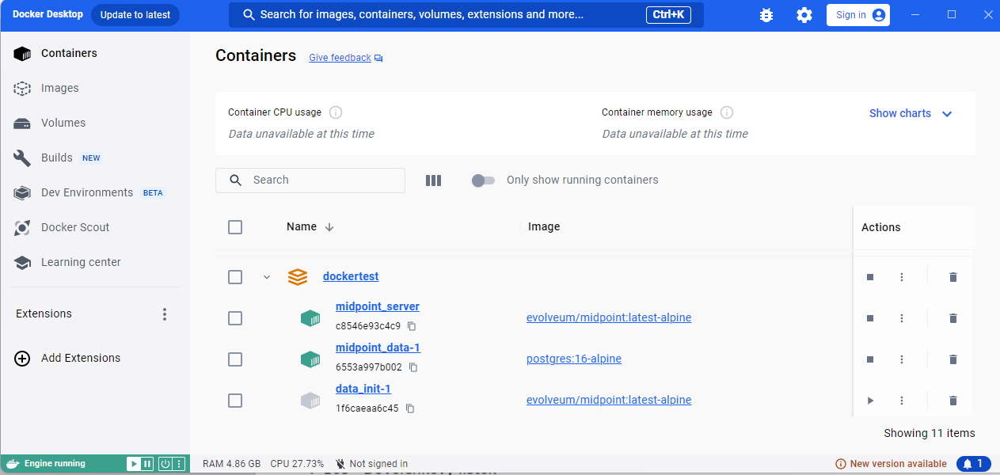
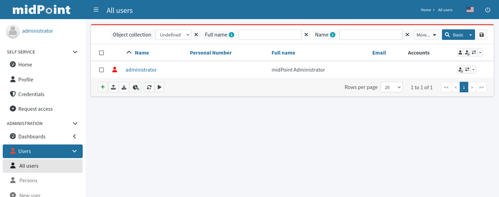

= Docker Compose
:page-nav-title: Docker Compose
:page-display-order: 60
:page-moved-from: /midpoint/quickstart/quickstart-docker-compose/
:page-moved-from: /midpoint/install/docker/
:page-toc: top
:toclevels: 4
:page-keywords:  [ 'container', 'docker' ]
:page-description: This page describes midPoint installation in Docker and includes Docker Compose samples.

This page describes midPoint installation in Docker and includes Docker Compose samples.

You can use the Docker environment provided by midPoint out-of-box, however, small syntax updates may be required.

For broader context, see :

* Common xref:../[containers] related information with options to customize the installation. +

* xref:../kubernetes.adoc[Kubernetes] related information with a sample configuration. +

* Container xref:../customization.adoc[customization] related information. +

== Preparing the Environment
To have a working midPoint environment, more than just one application is needed.
To address this complexity, we prepared a description file which can be easily processed - a Docker Compose file.
This file contains a definition for all parts and also provides the necessary settings.
You can "run" the file and thus create an isolated working environment.

=== Docker Engine
To install midPoint, you will need Docker Compose which requires a Docker environment.
The environment must include the *Docker Engine*.

[NOTE]
====
See Docker documentation related to installation based on your OS:

* link:https://docs.docker.com/engine/install/[Linux - Docker Engine] +
The Docker Engine can be installed directly.

* link:https://docs.docker.com/desktop/install/windows-install/[Windows - Docker Desktop] +
For Windows, the Docker Engine is only available as a part of the Docker Desktop application.
Any configuration of the Docker Desktop installation is suitable for the purposes of this guide.
Feel free to use the default settings during the installation process.
====

=== Docker Compose Definition
Download the link:https://raw.githubusercontent.com/Evolveum/midpoint-docker/master/docker-compose.yml[Docker Compose file from Github].
In your terminal, you can download it by running the following `curl` command:

[source,bash]
----
curl -O https://raw.githubusercontent.com/Evolveum/midpoint-docker/master/docker-compose.yml
----

It is recommended not to rename the downloaded `docker-compose.yml` file.
If you use a different name, you need to define it explicitly in all Docker Compose commands with the *-f* parameter. +

[NOTE]
====
All objects based on the Docker Compose file will contain the directory name as a prefix.
====

=== Database Password Initialization (Optional)
You can find a "static" password for the database in the Docker Compose definition file, `db.secret.pw.007`.
This configuration is less secure, but the focus is on deploying quickly in this case.

If you want to manage passwords more securely, refer to link:https://docs.docker.com/compose/how-tos/use-secrets/[Secrets in Compose].

[WARNING]
====
To use secrets in Docker Compose, you need to append the *_FILE* suffix to all environment variables that store passwords.

Namely, rename: +

* `POSTGRES_PASSWORD` to `POSTGRES_PASSWORD_FILE` +
* `MP_SET_midpoint_repository_jdbcPassword` to `MP_SET_midpoint_repository_jdbcPassword_FILE` (two occurrences) +

This is because the value of each variable will be the path to a file containing the secret instead of the secret itself as a plain string.
Any image used in the provided Docker Compose file can work with this suffix.
====

== Managing the Environment

The basic management commands are used to:

* *Start the environment* in the background:
+
[source,bash]
----
docker compose up -d
----
+
The web GUI becomes available once the environment starts and the initiation (loading initial objects into the empty repository, etc.) is completed.
Depending on your environment, this may take several minutes.

NOTE: If you encounter problems, you can check midPoint logs in the console using the Docker logging mechanism: `docker logs midpoint_server`

* *Stop the environment*:
+
[source,bash]
----
docker compose down
----
+
This command stops the container but keeps it defined.
The data stays available for the next run.

* *Stop and reset the environment* (clean up the data):
+
[source,bash]
----
docker compose down -v
----
+
[WARNING]
====
Using the *-v* parameter also removes the volumes.
Volumes are spaces where data is stored outside of containers, i.e. a persistent storage that holds data so that it can be re-used after removing or re-creating containers.

In other words, if you use the *-v* parameter, user data related to the container will also be removed, for example the DB (repository) content.
====

The following table shows the most common commands:

.A summary of the available Docker Compose commands.
[%autowidth]
|====
| Command | Result

| `docker compose up -d`
| Starts the environment based on the Docker Compose file content.

| `docker compose down`
| Stops the environment (the stored data is kept).

| `docker compose down -v`
| Stops the environment and cleans up the relevant data.

| `docker ps`
| Lists all currently running containers.

| `docker ps -a`
| Lists all containers currently used in the system (including stopped containers).

|====

[NOTE]
====
If you have installed Docker Desktop, you can also start/stop the environment in GUI.

The services defined in the Docker Compose file are grouped.
The name of the group is the name of the directory where the Docker Compose file is located.

After running the first `docker compose up` command, the environment is shown in the list of available environments.
You can start/stop/remove the environment using the buttons for the respective environment.

.Docker Desktop with the midPoint environment

====

== MidPoint User Interface

MidPoint has a web administration user interface.
This is the primary user interface for using and configuring midPoint.
By default, the user interface is accessible at port `8080`:

`http://localhost:8080/midpoint/`

=== Logging In

Log in to user interface as the `administrator` user:

* In *midPoint 4.8.1 and newer versions*, there is no default password for security reasons.
With the first run, an administrator user is initialized and a new password is generated.
This is then saved in a log file.
Alternatively, you can configure it before deploying the instance.
See xref:/midpoint/reference/security/authentication/administrator-initial-password/[] for details.
    ** If you configure a custom initial administrator password, changing the configuration value after you initialize the instance xref:/midpoint/reference/security/authentication/administrator-initial-password/#initial-password-used-only-once[does not change the password] for the administrator in the existing instance.
        You would need to reset the instance, e.g., using `docker compose down -v` and create it anew.

* In *midPoint 4.8 and lower versions*, the default credentials are as follows:

+
[%autowidth, cols="h,1"]
|====
| Username | `administrator`
| Password | `5ecr3t`
|====

=== Take a Look Around

The administrator is an all-powerful user. Therefore, all capabilities of midPoint are at your disposal.

* The *Self Service* part of the interface is used to manage the identity and privileges of the currently logged in user.

* The *Administration* part of the user interface is used to manage user identities, roles, organizational structure, and policies.
This part is used for routine administration of the system.
At this stage, this is perhaps the most interesting part of midPoint to explore.

* The *Configuration* part of the user interface is used to customize midPoint behavior, going deep into the midPoint internals.

== See also

* xref:/midpoint/quickstart[]
* xref:/faq/[MidPoint FAQs]
* xref:/midpoint/install/post-install-orientation[]