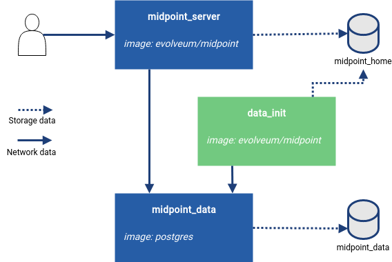

= MidPoint in a Container
:page-nav-title: Containers
:page-display-order: 20
:page-liquid:
:page-toc: top
:toclevels: 4
:page-keywords:  [ 'install', 'container', 'arm', 'arm64' ]
:page-moved-from: /midpoint/install/docker/alpine-based-docker-image/
:page-moved-from: /midpoint/install/docker/book-demo/
:page-moved-from: /midpoint/install/docker/dockerized-midpoint/
:page-moved-from: /midpoint/install/docker/
:page-moved-from: /midpoint/install/docker/native-demo/



== Quick Start

Containers are the easiest and the fastest way to start working with midPoint.

If this is your the fist time installing midPoint, see xref:../../quickstart[].

//TODO sync with quick start page...

== Benefits of midPoint in a Container

Using containerized midPoint has multiple benefits:

* Dependency under full control +
Containers are created with the required Java version.

* Cloud friendly +
Container can be run both locally (e.g. Docker, Podman), and in cloud (e.g. Kubernetes, AWS, Azure, Google Cloud).

* The starting state is guaranteed +
You can start the environment in a fully controlled way to support a range of scenarios.

* Pre-configured environment +
All elements required to initialize the repository are available. +
A basic configuration is available and the environment only needs a few configuration steps to run. +
The image can be xref:./customization.adoc[customized] to cover most use cases.

[WARNING]
====
The image is based on Open Container Initiative (OCI) standards.
The installation documentation is focused on using midPoint in Docker or vanilla Kubernetes. +
You can use any other OCI compatible environment.
While the installation instructions will still apply, you may need to customize your environment configuration.
====

== Deployment Schema

MidPoint requires a repository, i.e. a relation DB, for standard operation.
Also, a native repository structure (schema), which is available for postgreSQL, is required.
In a containerized environment, this is covered by an additional container with a PostgreSQL instance.

The schema has to be initialized in advance.
Once a correct schema version is ready, midPoint checks the initial object (content) and pushes it if necessary.

[NOTE]
====
A generic repository implementation, which also covers other than PostgreSQL databases, is available.
However, this repository schema is deprecated.
Its feature set is limited, and no new features are available for this repository schema.
If you are using this repository schema for historic reasons, we strongly recommend to migrate to xref:/midpoint/reference/repository/native-postgresql[native repository].

The availability of the deprecated generic repository schema may require an active subscription.

====

.Schema of a containerized environment (basic setup)

In a basic setup, 3 containers are needed.

* *A midPoint instance* (_midpoint_server_) +
Once the environment is ready, midPoint can be started.
+
Image : evolveum/midpoint +
Tag : <xref:/midpoint/release/{{ lastReleased.version }}[released midPoint version number]><base OS>,for example {{ lastReleased.version }}-alpine.

* *Initialization of the environment* (_data_init_) +
This container handles all requirements for the environment.
These need to be prepared before the midPoint instance starts.
+
The initialization image version has to match the midPoint container version to ensure the correct definition is used.

** Repository init (_Network data_) +
The process uses a ninja application to connect to the database as a client.
If needed, the repository structure (schema) is created. +

** Configuration init (_Storage data_) +
The process uses a ninja application to prepare the basic native repository configuration.
All additional information, such as the DB URI, is updated at a later point via environment variables in the container. +
+
[NOTE]
====
In a complex installation, the initialization phase can be skipped by design.
The environment would then be initialized separately as an explicit process during the build of the environment. +
The provided configuration assumes that the environment is prepared directly during the first run.
====

* *Repository* (_midpoint_data_) +
For the repository, you only need a running instance of a PostgreSQL server that can connect from the midPoint container.
Everything else is handled by the client side of the connection.
+
Image : postgres +
Tag : <PostgreSQL version number><base OS>, for example 16-alpine. See the xref:/midpoint/release/{{ lastReleased.version }}/#databases[release notes] for the recommended version of PostgreSQL.

For more information, refer to:

* xref:./customization.adoc[]
* xref:./docker[]
* xref:./kubernetes[]

== Build the Container

We build the images in our link:https://jenkins.evolveum.com/view/midPoint-docker/[Jenkins] infrastructure.
After some basic tests, in which we make sure, for example, that the environment can be started, we push the tested images to the public link:https://hub.docker.com/r/evolveum/midpoint[Docker hub] repository.
All the necessary resources for the Docker image build are publicly available, as well as our other resources, on link:https://github.com/Evolveum/midpoint-docker[GitHub].

=== Docker Image Name

The full Docker image name consists of the base image name and a tag.
The base image name is fixed (*evolveum/midpoint:*); while the tag differs depending on the midPoint version and the base operational system (OS) used for the image.

The following base operational systems are supported:

.Used base OSs for images and their tag suffixes
|===
| Base OS| Suffix for the tag| Description

| Alpine
| -alpine
| Planned to replace Ubuntu as the default.

| Rocky Linux
| -rockylinux
|

| Ubuntu
| -ubuntu
| Default. Omitting the suffix defaults to "-ubuntu".
|===

See examples of full image names:

[[image_name_examples]]
.Examples of tags
|====
| Version | Base OS | Full image name

| 4.8 release
| Ubuntu
| evolveum/midpoint:4.8

| 4.8 release
| Rocky Linux
| evolveum/midpoint:4.8-rockylinux

| 4.8-support (snapshot)*
| Alpine
| evolveum/midpoint:4.8-support-alpine

| latest dev build
| Alpine
| evolveum/midpoint:devel-alpine

| latest dev build
| Ubuntu
| evolveum/midpoint:devel-ubuntu +
evolveum/midpoint:devel

| last released version ({{ lastReleased.version }})
| Alpine
| evolveum/midpoint:latest-alpine +
evolveum/midpoint:{{ lastReleased.version }}-alpine

| last released version ({{ lastReleased.version }})
| Ubuntu
| evolveum/midpoint:latest +
evolveum/midpoint:latest-ubuntu +
evolveum/midpoint:{{ lastReleased.version }}

|====

[NOTE]
====
* _Support_ images are built from unreleased code.
They are used to aggregate bug fixes between releases.
If you are looking for a bug fix, i.e. the respective ticket is closed and has a code update, the fix will be included in the first subsequent support build.
The name of this tag can change in time so it is recommended to check the naming from time to time.
* Since version 4.8.3, images are published for the AMD64 and ARM64 platforms.
The images are published with a multi-platform manifest.
You only need to request a tag, and the appropriate platform is selected automatically.
====