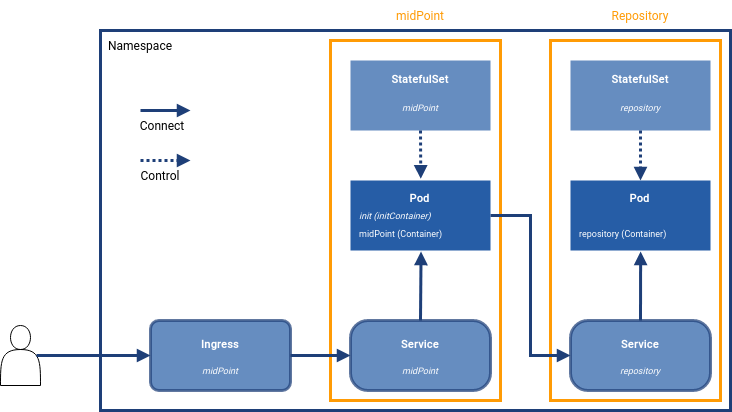
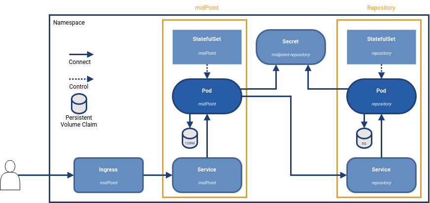
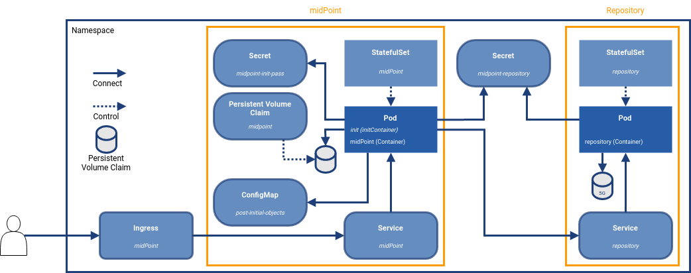

= Vanilla Kubernetes
:page-nav-title: Vanilla Kubernetes
:page-display-order: 30
:page-toc: top
:toclevels: 4
:page-keywords:  [ 'install', 'kubernetes' ]
:page-moved-from: /midpoint/install/kubernetes/about/
:page-moved-from: /midpoint/install/kubernetes/advanced-examples/
:page-moved-from: /midpoint/install/kubernetes/cluster/
:page-moved-from: /midpoint/install/kubernetes/
:page-moved-from: /midpoint/install/kubernetes/single-node/



This page describes how midPoint uses vanilla Kubernetes for a containerized installation.

== Deployment

This chapter introduces schemes of different deployment types and describes the used components.

The following deployments are supported:

* xref:#basicDepl[Basic deployment]
* xref:#simpleDepl[Simple deployment with PVC and Secret]
* xref:#advancedDepl[Advanced deployments]

[#basicDepl]
=== Basic Deployment

.Basic deployment in Kubernetes

To start the environment, you need several objects.
You can group them by type/purpose:

* *StatefulSet* +
Control objects which provide templates for Pods, including the scale, i.e. the amount of requested instances.

* *Service* +
The "meeting point", i.e. a transparent internal proxy for communication.
As Pods have dynamic IP addresses, the IPs are assigned after Pods are created.
The name of service is known in advance and so it can be used to establish a connection.
For example, midPoint contacts the repository using the service definition.

* *Ingress* +
The entry point for the user.
This is a reverse proxy, the first point of contact for communication on shared ports from outside (HTTP - TCP/80, HTTPS - TCP/443).
Once the definition matches, the communication is passed to the defined service.

* *Pod* +
Pods are not defined directly in this deployment, they are created according to the StatefulSet definition.
+
Technically, it is the place where the application is running. +
The other objects create a correctly configured Pod and make it reachable.

[#simpleDepl]
=== Simple Deployment with PVC and Secret

.Simple deployment with PVC and a secret in Kubernetes

This diagram extends the <<#basicDepl,basic deployment>> with two objects.

* *Persistent Volume Claim (PVC)* +
To keep data persistent over the container re-creation, you need an external storage space.
In this scenario, a PVC is created based on the template located in StatefulSet.
In case of scaling, each Pod will have its own PVC.

* *Secret* +
An object for keeping sensitive information for the use with Pods.
It is used when you want to share passwords.
For example, to access the DB you need to "share" the credentials between the DB server and the client connecting into it.

[#advancedDepl]
=== Advanced Deployment

.Advanced deployment

This diagram extends the <<#simpleDepl,simple deployment>> with the following objects:

* *Persistent Volume Claim (PVC)* +
To keep data persistent over the container re-creation, you need an external storage space.
In this scenario the PVC is created based on the PVC definition.
In case of scaling, all Pods will share the same PVC.

* *ConfigMap* +
An object that can keep the content used as an environment variable or mounted to the Pod's filesystem.

== Working with Deployments

=== Default Object Definition

A ready-to-use definition is located in the midPoint link:https://github.com/evolveum/midpoint-kubernetes[Github] repository.

For the following steps, you need to have the content available locally.
You can link:https://github.com/Evolveum/midpoint-kubernetes/archive/refs/heads/main.zip[download the ZIP file] and unzip it.

[NOTE]
====
The commands mentioned below are supposed to be run in the terminal / command line.

`kubectl` is used to communicate with the Kubernetes cluster.
You should have a working setting with which you can connect, authenticate and communicate with the Kubernetes cluster.

For testing purposes, you can request the list of nodes in the cluster with `kubectl get nodes`

If you encounter any issues with `kubectl`, refer to link:https://kubernetes.io/docs/home/[Kubernetes documentation].
====

[#ingressNote]
==== Pre-defined Ingress Definition
All objects except the *ingress* definition can be used as they are.

The ingress definition can be found in the `301_ingress.yaml` file.

Before you can deploy it, you need to configure the following:

* *ingressClassName* +
In the definition, the presence of *nginx* is expected.
In case you have an nginx ingress available in the Kubernetes environment, you can use the value pre-defined in the file.
Otherwise, you will need to update the value to correspond with your Kubernetes environment setting.

* *tls* +
The default certificate for HTTPS is used.
If you want to use a different certificate, it has to be explicitly set in the ingress definition.

[#ingressHost]
* *host* +
A *midpoint.example.com* host is set in the definition file.
This value should be resolvable so that the host's IP address can be retrieved.
There are several ways to do that:

  ** Change the value (FQDN) to something else that is under your control.

  ** Add the host as a new record to the */etc/hosts* file (`C:\Windows\System32\drivers\etc\hosts` on Windows).

  ** Add the host as a static record on your local DNS resolver.

[#accessInfo]
The pre-defined environment will be available with the following information:

.Access information
[%noheader%autowidth]
|====
|URL:| https://midpoint.example.com ^(1)^

|Username: | administrator

|Initial password: | Test5ecr3t ^(2)^

|====

At the Kubernetes site, the FQDN is set using the <<#ingressHost,ingress>> object.

The init password is generated by default.
* In the <<#basicDepl,basic>> and <<#simpleDepl,simple>> deployments, the password is set in the StatefulSet definition for midPoint to: +
`MP_SET_midpoint_administrator_initialPassword=Test5ecr3t`
* In <<#advancedDepl,advanced deployments>>, there is a dedicated secret object with the initial password (see <<#advancedDeplH>>).

[#basicDeplH]
=== Basic Deployment Handling

This is suitable for quick testing or demos.

<<#basicDepl,Basic deployment>> uses the `./deployment/basic` deployment path.

Objects in this deployment are prepared to use their own namespace, i.e. a logical group for the objects.
The provided files create and use a namespace called *midpoint-deployment*.

Once the environment is created, it takes several seconds to get it up and running.
The first run can take longer as the image has to be downloaded from the public registry (Docker hub).

For information on how to access the environment, see the predefined <<#accessInfo,login credentials>>.

[WARNING]
====
All data in this environment are put in a dynamic (non-persistent) store which means that if you remove a Pod, all related data are deleted.

It is not possible to partially restart the environment.
If you restart the DB, you lose your repository.
Similarly, if you restart midPoint, you lose the key to access the encrypted data in the repository.
====

Before applying the configuration files, make sure that you have configured <<#ingressNote,ingress>> for your environment.

==== Create an Environment

To apply a configuration and create a midPoint environment, run:

[source,bash]
----
kubectl apply -f ./deployment/basic
----

.output from the *apply* command
[%collapsible]
====
namespace/midpoint-deployment created +
service/midpoint-repository created +
service/midpoint created +
ingress.networking.k8s.io/midpoint created +
statefulset.apps/midpoint-repository created +
statefulset.apps/midpoint created
====

==== Delete an Environment

To delete the objects related to the midPoint environment, run:

[source,bash]
----
kubectl delete -f ./deployment/basic
----

.output from the *delete* command
[%collapsible]
====
statefulset.apps "midpoint-repository" deleted +
statefulset.apps "midpoint" deleted +
service "midpoint-repository" deleted +
service "midpoint" deleted +
ingress.networking.k8s.io "midpoint" deleted +
namespace "midpoint-deployment" deleted
====

[#simpleDeplH]
=== Simple Deployment with PVC and Secret Handling

This section extends the information in <<#basicDeplH>>.

<<#simpleDepl,Simple deployment>> uses the `./deployment/simple` deployment path.

Before applying the configuration files, make sure that you have configured <<#ingressNote,ingress>> for your environment.

No PVC is explicitly defined.
The definition is found in the StatefulSet in the *volumeClaimTemplates* section.
If you prefer to use a different volume size, you can change the definition in the relevant StatefulSet before applying the files.

.Volume sizing in the provided YAML definition
[%autowidth]
|====
| Pod name | Volume size

| midPoint
| 128 MB

| repository
| 5 GB
|====

The PVC is created based on the template value with the first run.
In case the PVC already exists, it is used directly (e.g. the pod is re-created).

[WARNING]
====
The *repository data* and *midPoint home data* are stored in Persistent Volume Claim.
They are persisted even if a Pod is removed as they are not removed together with the *StatefulSet* definition.

This may be undesirable in testing as data from previous runs may be present in the environment.

Note that dedicated objects are still part of the created namespace.
If you remove a namespace, all member objects are removed even if they are not directly addressed.
This also applies to PVC in the namespace.
====

==== Create an Environemnt

To apply the configuration and create the midPoint environment, run:

[source,bash]
----
kubectl apply -f ./deployment/common/001_namespace.yaml -f ./deployment/simple
----

.output from the *apply* command
[%collapsible]
====
namespace/midpoint-deployment created +
service/midpoint-repository created +
service/midpoint created +
ingress.networking.k8s.io/midpoint created +
secret/midpoint-repository created +
statefulset.apps/midpoint-repository created +
statefulset.apps/midpoint created
====

==== Delete an Environment

When removing objects from the Kubernetes environment, you can decide if custom data (repository data and midPoint home directory) should also be removed.
With the following command, you can remove the defined objects while keeping the namespace and PVC (custom data) for future use.

.Delete objects related to the midPoint environment (while keeping PVC)
[source,bash]
----
kubectl delete -f ./deployment/simple
----

.output from the *delete* command
[%collapsible]
====
statefulset.apps "midpoint" deleted +
secret "midpoint-repository" deleted +
statefulset.apps "midpoint-repository" deleted +
service "midpoint-repository" deleted +
service "midpoint" deleted +
ingress.networking.k8s.io "midpoint" deleted
====

If you want to completely remove all related data for the midPoint environment, you can delete the namespace.
All related objects are members of that namespace.
This also includes indirectly created PVCs (we only define a template in StatefulSet, not PVCs directly).

Once a namespace deletion is requested, all related objects are removed in cascade.

.Delete all objects related to the midPoint environment (including namespace and PVC)
[source,bash]
----
kubectl delete -f ./deployment/common/001_namespace.yaml
----

.output from the *delete* command
[%collapsible]
====
namespace "midpoint-deployment" deleted
====

For information on how to access the environment, the predefined <<#accessInfo,login credentials>>.

[#advancedDeplH]
=== Advanced Deployment Handling

This section extends the information in <<#simpleDeplH>>.

<<#advancedDepl,Advanced deployment>> uses the `./deployment/advanced` deployment path.

All prepared objects will be members of the same namespace, i.e. a logical group of objects, and so you need to create it before any other object.
The definition is available in the common directory.

The definition of the persistent Volume Claim (PVC) is also available in the common directory.

Before applying the configuration, make sure that you have configured <<#ingressNote,ingress>> for your environment.

==== Create an environment

. Create a namespace and PVC for the midPoint environment:
+
[source,bash]
----
kubectl apply -f ./deployment/common
----
+
.output from the *apply* command
[%collapsible]
====
namespace/midpoint-deployment created +
persistentvolumeclaim/midpoint created
====
+
There is no default administrator password.
You can set the init password by an environment variable.
The definition is prepared to use a *midPoint-init-pass* secret object with the *passwd* key.
The object should be created before the midPoint Pod is started.
To create the object, run the following command (you can change the password before executing the command):

. Create a secret object with the initial midPoint password:
+
[source,bash]
----
kubectl create -n midpoint-deployment secret generic midpoint-init-pass --from-literal=passwd=Test5ecr3t
----
+
.output from the *create* command
[%collapsible]
====
secret/midpoint-init-pass created
====

. Create configMap with the post-initial-objects (content from the directory):
+
[source,bash]
----
kubectl create configmap -n midpoint-deployment post-initial-objects --from-file=deployment/post-initial-objects/
----
+
.output from the *create* command
[%collapsible]
====
configmap/post-initial-objects created
====
+
[NOTE]
====
The size of the object is limited.
If the limit is reached, you can combine the objects.

.Using a single configMap:
[source,yaml]
----
spec:
  volumes:
    - name: midpoint-pio
      configMap:
        name: post-initial-objects
----

.Combining multiple objects:
[source,yaml]
----
spec:
  volumes:
    - name: midpoint-pio
      projected:
        sources:
          - configMap:
              name: post-initial-objects-1
          - configMap:
              name: post-initial-objects-2
----
====

. Apply the rest of the environment:
+
[source,bash]
----
kubectl apply -f ./deployment/advanced
----
+
.output from the *apply* command
[%collapsible]
====
secret/midpoint-repository created +
service/midpoint-repository created +
service/midpoint created +
ingress.networking.k8s.io/midpoint created +
statefulset.apps/midpoint-repository created +
statefulset.apps/midpoint created
====

==== Shut Down an environment

To shutdown the environment, you have the following options:

* *Scale the replicas down to 0* +
Scaling down keeps all the definitions in place.
The StatefulSet, as a control object, is instructed to create 0 replicas, i.e. shutdown all running Pods.
+
This enables you, for example, to selectively shutdown midPoint instances but keep the repository up for maintenance.
+
.Scale midPoint instances to 0 replicas
[source,bash]
----
kubectl scale -n midpoint-deployment --replicas=0 sts/midpoint
----
+
.Scale midPoint instances to 1 replica
[source,bash]
----
kubectl scale -n midpoint-deployment --replicas=1 sts/midpoint
----
+
.output from the *scale* command
[%collapsible]
====
statefulset.apps/midpoint scaled
====
+
[NOTE]
====
If there is more than one replica, you will need to configure midPoint for a cluster.
The provided configuration is midPoint cluster ready.
The relevant settings are related to :

* taskManager +
The task manager has to know that there can also be other active nodes.

* intra-cluster URL +
The node ID value source has to be set.

For details, refer to - xref:/midpoint/reference/deployment/clustering-ha/[].

*Cluster setup in production deployments requires an active subscription.*
====

* *Remove the object definition from Kubernetes*
+
In order to remove all objects except for the Persistent Volume Claims (PVC) and manually created objects (initial password /secret/ and post-initial-objects /configMap/), you can use the available definition to select the objects to be removed.
+
.Partially delete the midPoint environment
[source,bash]
----
kubectl delete -f ./deployment/advanced
----
+
.output from the *delete* command
[%collapsible]
====
secret "midpoint-repository" deleted +
service "midpoint-repository" deleted +
service "midpoint" deleted +
ingress.networking.k8s.io "midpoint" deleted +
statefulset.apps "midpoint-repository" deleted +
statefulset.apps "midpoint" deleted
====
+
To remove all objects, including user data (volumes, secret with init password and configMap with Post-initial-objects), the whole namespace can be removed.
Kubernetes will then remove all objects located in the namespace.
+
.Delete the namespace with the midPoint environment (cascade cleanup)
[source,bash]
----
kubectl delete -f ./deployment/common/001_namespace.yaml
----
+
.output from the *delete* command
[%collapsible]
====
namespace "midpoint-deployment" deleted
====

== Keystore

Keystore contains the key needed to access sensitive information in the repository.
If you "lose" the key on the midPoint site, the system will start but some operations may fail.
For example, it would not be possible to connect to the resource as credentials are not available, and users would not be able to log in.

To make the key persist over restarts, or to share it between multiple Pods, you need to store it outside the midPoint Pod.
You have the following options:

* *PVC*: Handling the content inside Pods can be:
** Defined by a template, and created when a Pod is deployed (see <<#simpleDeplH>>).
However, this only addresses persisting keys, and is not suitable for cluster deployments.
** Defined explicitly, and linked from a Pod definition (see <<#advancedDeplH>>).
This meets both the permanency and sharing requirements.
+
.configuration subset related to the PVC mount into the midPoint Pod as home directory
[%collapsible]
====
[source,yaml]
----
    volumes:
      - name: midpoint-home
        persistentVolumeClaim:
          claimName: midpoint-home
    containers:
      volumeMounts:
        - name: midpoint-home
          mountPath: /opt/midpoint/var/
----
====
+
.configuration subset related to the dedicated PVC with keystore mount into the midPoint Pod.
[%collapsible]
====
[source,yaml]
----
    volumes:
      - name: secret-vol
        persistentVolumeClaim:
          claimName: midpoint-keystore
    containers:
      env:
        - name: MP_SET_midpoint_keystore_keystorePath
          value: /opt/secret-volume/keystore.jceks
      volumeMounts:
        - name: secret-vol
          mountPath: /opt/secret-volume
----
====

* Secret +
Can be updated only "externally" using Kubernetes tools, i.e. no update from inside of the Pod is possible.
The Pod mounts it into the filesystem in the read-only mode.
This approach meets both the permanency and sharing between Pods requirements.
+
.create a *secret-volume* secret containing a *keystore.jceks* file
[source,bash]
----
kubectl create -n midpoint-deployment secret generic secret-volume --from-file=keystore.jceks
----
+
.sample of a secret with a keystore
[%collapsible]
====
[source,yaml]
----
apiVersion: v1
kind: Secret
metadata:
  name: secret-volume
  namespace: midpoint-deployment
data:
  keystore.jceks: <base64 encoded content>
----
====
+
.configuration subset related to the secret mount into the midPoint Pod
[%collapsible]
====
[source,yaml]
----
  volumes:
    - name: secret-vol
      secret:
        secretName: secret-volume
  containers:
    env:
      - name: MP_SET_midpoint_keystore_keystorePath
        value: /opt/secret-volume/keystore.jceks
    volumeMounts:
      - name: secret-vol
        mountPath: /opt/secret-volume
----
====

See also:

* xref:/midpoint/reference/security/crypto/migrating-encryption-keys/[]
* xref:/midpoint/reference/security/crypto/[]

=== Resource Connection Certificate

To establish secure connections to other systems, you need to store a trusted certificate in the trust store.
The keystore is also used as a trust store by default.

For details, refer to xref:/midpoint/reference/security/crypto/ssl-connections-client-side-/[].

== See Also

* xref:index.adoc[]
* xref:./docker/[]
* xref:/midpoint/install/post-install-orientation[]