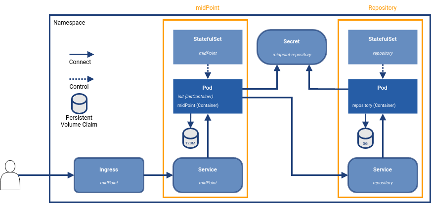

= Vanilla Kubernetes
:page-nav-title: Vanilla Kubernetes
:page-display-order: 30
:page-toc: float-right
:toclevels: 4
:page-keywords:  [ 'insatll', 'kubernetes' ]



This page is related to the midPoint in container context of documentation.
Here will be dedicated samples related to the vanilla kubernetes.

You may be interested in :

* common xref:../[container]  related information +
There is information contains possibilities of customization of the installation.

* xref:./docker/[docker] related information +
Sample configuration related to the docker environment.

[NOTE]
====
Page is under construction.
Please check the page soon for new content.
====

== Deployment

=== Base deployment

[#basedepl]
.Base deployment in kubernetes

To start the environment we need several objects.
We can group them by the type / purpose:

* StatefulSet +
Control objects which provide template for the pods including the scale - amount of requested instance.

* Service +
"Meeting point" for the use case - internal transparent proxy for communication.
As pods has dynamic IPs the IP addresses is assigned after pod creation.
The name of service is known in advance.
It can be used for the connection (e.g. midPoint contact the repository using service definition).

* Ingress +
Entry point for the user.
It is reverse proxy - first point of contact for the communication from outside on shared ports (http - TCP/80, https - TCP/443).
Once the definition match the communication is passed to the defined service.

* _Pod_ +
The pods is not defined directly in this deployment.
It is result of the statefulSet definition.
+
Technically it is the place where the application is running.
The other objects are about to create the pod with proper configuration and make the reachable

=== Simple deployment with PVC and secret
[#simpledepl]
.Simple deployment with PVC and secret in kubernetes

This diagram extend the Base one with two objects.

* Persistent Volume Claim (PVC) +
To keep data persistent over the container re-creation we need external storage space.

* Secret +
Object for keeping sensitive information for the use with the Pod(s).
It targets situation of shared password (e.g. to access the DB we need to "share" the credentials between the DB server and the client connecting into it).

== Working with deployment

=== Prepared object definition

We have prepared the definition for you.
It is located in our link:https://github.com/evolveum/midpoint-kubernetes[github] repository (link:https://github.com/Evolveum/midpoint-kubernetes/archive/refs/heads/main.zip[download ZIP]).

For the next steps you need to have the content available locally.
One of the option is to use the link pointing to the ZIP file and unzip it.

[NOTE]
====
The commands mentioned here suppose to be run in the terminal / command line.

`kubectl` is used to communicate with kubernetes cluster.
It is supposed you have working setting allowing you to connect, authenticate and communicate with the kubernetes cluster.

To test you can try to requset list of nodes in the cluster : `kubectl get nodes`.

In case you face any issue with kubectl please refer kubernetes documentation how to make it work.
====

=== Base deployment

For the <<basedepl,base deployment>> there is important the path `./deployment/base`.

[WARNING]
====
The base environment all data store in dynamic (non-persistent) store.
In case of pod removing all the related data is deleted.

Please note that it is not possible to partially restart the environment in this scenario.
In case you restart DB your repository is lost.
In case you restart midPoint the key to access encrypted data in repository is lost.

This configuration is good for quick testing, demo, etc.
====

[#ingressnote]
All the objects except *ingress* definition can be used as is.
In relation with the Ingress definition there should be addressed few topics *before applying the files*:

* *ingressClassName* +
In the definition there is expected presence of *nginx*.
In case you have nginx ingress available in the kubernetes environment you are ok with the value prepared in the file.
Once yuu don't have it available in kubernetes environment this option has to be updated to correspond with your kubernetes environment setting.

* tls +
There will be used default certificate for https.
In case you want to use different one it should be explicitly set in the ingress definition.

[#base-host]
* host +
There is set host *midpoint.example.com* in the definition file.
To have it working you should make this value resolvable - to be able to get IP address.
Here is some options how to reach it ( any of them should be sufficient ) :

** change the value (FQDN) to something else what is under your control

** set the record to */etc/hosts* file (C:\Windows\System32\drivers\etc\hosts in case of windows)

** set the static record on your local DNS resolver

.Apply the configuration to create the midpoint environment
[source,bash]
----
kubectl apply -f ./deployment/base
----

.output from the *apply* command
[%collapsible]
====
namespace/midpoint-deployment created +
service/midpoint-repository created +
service/midpoint created +
ingress.networking.k8s.io/midpoint created +
statefulset.apps/midpoint-repository created +
statefulset.apps/midpoint created
====

.Delete the objects related to the midpoint environment
[source,bash]
----
kubectl delete -f ./deployment/base
----

.output from the *delete* command
[%collapsible]
====
namespace "midpoint-deployment" deleted +
service "midpoint-repository" deleted +
service "midpoint" deleted +
ingress.networking.k8s.io "midpoint" deleted +
statefulset.apps "midpoint-repository" deleted +
statefulset.apps "midpoint" deleted
====

The objects are prepared to use own namespace - logical group of the objects.
In the provided files it is creating and using the namespace called *midpoint-deployment*.

Once the environment is created it takes several seconds to get it up and running.
First run can take longer as the image have to be downloaded from public registry - docker hub.

The environment will be available with following information:

[#accessinfo]
.Access information
[%noheader%autowidth]
|====
|URL:| https://midpoint.example.com ^(1)^

|Username: | administrator

|Initial password: | Test5ecr3t ^(2)^

|====

. on the kubernetes site the FQDN is set using <<base-host,ingress>> object

. The init password is generated by default. In the statefulset definition for midpoint it is forced to be this value. +
MP_SET_midpoint_administrator_initialPassword=Test5ecr3t

=== Simple deployment with PVC and secret

For the <<simpledepl,simple deployment with PVC and secret>> there is important the path `./deployment/simple`.

[WARNING]
====
The *repository data* and *midpoint home data* are stored on Persistent Volume Claim.
It is kept even in case the Pod is removed - it is not removed with the *statefulset* definition.

On the other side in case of test(s) there may be present data in the environment from the previous run(s).

Please note that even it is dedicated object(s) it is still part of namespace.
In case we are removing namespace all member objects are removed even it is not directly addressed.
This statement cover also PVC in the namespace.
====

The <<ingressnote,Ingress>> information and <<accessinfo,Access>> information is the same as in the case of base deployment.
Please read the notes before using the provided files to understand what will be the final parameters impacting the URL and password for accessing the newly created environemnt.

There is not explicitly defined any PVC.
The definition is "hidden" in the statefulset where is section *volumeClaimTemplates*.
If you prefer to use different size of volume you can change the definition in relevant statefulset before applying the files.

.Volume sizing in the provided yaml definitions
[%autowidth]
|====
| Pod's name | Volume size

| midPoint
| 128 MB

| repository
| 5 GB
|====

The PVC is created based on the template value with the first run.
In case the PVC already exists it is directly used (e.g. re-create the pod).

.Apply the configuration to create the midpoint environment
[source,bash]
----
kubectl apply -f ./deployment/common/001_namespace.yaml -f ./deployment/simple
----

.output from the *apply* command
[%collapsible]
====
namespace/midpoint-deployment created +
secret/midpoint-repository created +
service/midpoint-repository created +
service/midpoint created +
ingress.networking.k8s.io/midpoint created +
statefulset.apps/midpoint-repository created +
statefulset.apps/midpoint created
====

Once you want to remove the objects from the kubernetes environment you can decide if custom data (repository data and midPoint home directory) should be also removed.
With the following command you can remove the defined objects keeping namespace and PVC (custom data) for future use.

.Delete the objects related to the midpoint environment (keeping PVC)
[source,bash]
----
kubectl delete -f ./deployment/simple
----

.output from the *delete* command
[%collapsible]
====
secret "midpoint-repository" deleted +
service "midpoint-repository" deleted +
service "midpoint" deleted +
ingress.networking.k8s.io "midpoint" deleted +
statefulset.apps "midpoint-repository" deleted +
statefulset.apps "midpoint" deleted
====

If you want completely remove all related data to the midPoint environment it is possible to simply delete the namespace.
All the related objects are member of namespace.
This includes also indirectly created PVC (we define just template in statefulset and not directly the PVC).

Once request deleting the namespace all related objects are removed in cascade.

.Delete all the objects related to the midpoint environment (including namespace and PVC)
[source,bash]
----
kubectl delete -f ./deployment/common/001_namespace.yaml
----

.output from the *delete* command
[%collapsible]
====
namespace "midpoint-deployment" deleted
====

== TODO

* kubernetes object example
** ConfigMaps
*** composed definition

* Post initial Objects example

* Keystore
** options how to handle - PVC, secret
** certificate for the resource connection

* Cloud installation
** scaling
** session affinity