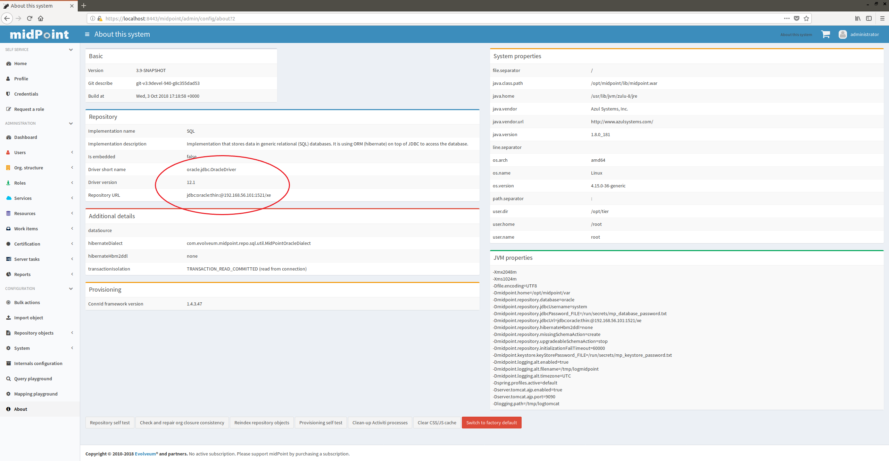

= External repository demo
:page-wiki-name: External repository demo
:page-wiki-id: 27820258
:page-wiki-metadata-create-user: lskublik
:page-wiki-metadata-create-date: 2019-02-25T09:42:14.386+01:00
:page-wiki-metadata-modify-user: lskublik
:page-wiki-metadata-modify-date: 2019-03-08T11:10:45.084+01:00
:page-upkeep-status: orange

This demo shows how to run midPoint container with externally provided repository.

The image can be found in the link:https://github.com/Evolveum/midpoint-docker[Evolveum/midpoint-docker] GitHub project.

We will assume that the repository is Oracle-based, hosted at *192.168.56.101*.
We have chosen Oracle mainly because it requires adding custom drivers to midPoint.

== Starting

=== Driver installation

First of all we have to copy Oracle driver to appropriate place.
Custom drivers reside in `lib` subdirectory of midPoint home directory.
The home directory is available as a Docker volume `extrepo_midpoint_home` (in this particular composition).
After downloading the Oracle driver you can copy it e.g. using the following commands:

[source,bash]
----
$ docker volume create extrepo_midpoint_home
$ sudo mkdir /var/lib/docker/volumes/extrepo_midpoint_home/_data/lib
$ sudo cp ~/Downloads/ojdbc7.jar /var/lib/docker/volumes/extrepo_midpoint_home/_data/lib
----

These commands assume the volume `extrepo_midpoint_home` does not exist yet.
If it exists, you can skip the first two commands.

=== Password setup

Password used to connect to the database is stored in `configs-and-secrets/midpoint/application/database_password.txt` file.
So, before starting midPoint, we have to make sure it's correct.

In our case the user name is `system` and the password is `oracle`, so let's execute this command:

[source,bash]
----
$ cd demo/extrepo
$ echo oracle > configs-and-secrets/midpoint/application/database_password.txt
----

=== Running midPoint

Finally, let us start midPoint.
We have to provide all the necessary information needed for repository connection:

[source,bash]
----
$ cd demo/extrepo
$ env REPO_DATABASE_TYPE=oracle REPO_HOST=192.168.56.101 REPO_USER=system docker-compose up
----

After successful start of midPoint you can login and check that the database is really an Oracle one.

== Containers

The `demo/extrepo` composition contains a single container:

[%autowidth]
|===
| Container name | Description

| `extrepo_midpoint_server_1`
| This is the standard container providing midPoint functionality.
It contains standalone Tomcat running midPoint application.

|===

== Communication

The containers publish the following TCP ports.
(_Port mapped to localhost_ denotes the mapping of container port to the host port where it can be reached from the outside.)

[%autowidth]
|===
| Container | Port number | Port mapped to localhost | Description

| `extrepo_midpoint_server_1`
| 8080
| 8080
| HTTP port to be used to connect to midPoint application

|===

== Docker volumes

The following volumes are created to persist data and other relevant files.

[%autowidth]
|===
| Volume name | Description | Used by container

| `extrepo_midpoint_home`
| The midPoint home directory.
Contains schema extensions, logs, custom libraries, custom ConnId connectors, and so on.
| `extrepo_midpoint_server_1`

|===

== Configuring the composition

The following configuration properties are supported.
Please refer to the link:https://spaces.at.internet2.edu/display/MID/Dockerized+midPoint[main documentation page] for their explanation.

[%autowidth]
|===
| Property | Default value

| `REPO_DATABASE_TYPE`
| `h2`

| `REPO_JDBC_URL`
| `default`

| `REPO_HOST`
|

| `REPO_PORT`
| `default`

| `REPO_DATABASE`
| `midpoint`

| `REPO_USER`
| `midpoint`

| `REPO_PASSWORD_FILE`
| `/run/secrets/mp_database_password.txt`

| ``REPO_MISSING_SCHEMA_ACTION``
| `create`

| `REPO_UPGRADEABLE_SCHEMA_ACTION`
| `stop`

| `REPO_SCHEMA_VERSION_IF_MISSING`
|

| `REPO_SCHEMA_VARIANT`
|

| `MP_MEM_MAX`
| `2048m`

| `MP_MEM_INIT`
| `1024m`

| `MP_JAVA_OPTS`
|

| `MP_KEYSTORE_PASSWORD_FILE`
| `/run/secrets/mp_keystore_password.txt`

| ``TIMEZONE``
| `UTC`

|===

You can tailor these to your needs.

The following Docker secrets are used:

[%autowidth]
|===
| Secret | Location

| `mp_database_password.txt`
| `configs-and-secrets/midpoint/application/database_password.txt`

| `mp_keystore_password.txt`
| `configs-and-secrets/midpoint/application/keystore_password.txt`

|===

You can modify or replace these files as needed.

== Outdated schema detection and upgrade

Here we will demonstrate outdated schema detection and upgrade functionality.

First let us delete any midPoint-specific data from our Oracle database.
Then we manually install there midPoint schema from version 3.8, e.g. by applying this script: link:https://github.com/Evolveum/midpoint/blob/v3.8/config/sql/_all/oracle-3.8-all.sql[https://github.com/Evolveum/midpoint/blob/v3.8/config/sql/_all/oracle-3.8-all.sql].

Then let us start the container as above:

[source,bash]
----
$ cd demo/extrepo
$ env REPO_DATABASE_TYPE=oracle REPO_HOST=192.168.56.101 REPO_USER=system docker-compose up
----

Unfortunately, midPoint refuses to start.
There's something like this on the console (not quite at the end, because there's a large exception with tons of stack trace afterwards):

[source]
----
midpoint_server_1  | 2018-10-03 17:59:23,732 [] [main] ERROR (com.evolveum.midpoint.repo.sql.schemacheck.SchemaChecker):
midpoint_server_1  |
midpoint_server_1  | *******************************************************************************
midpoint_server_1  | ***                                                                         ***
midpoint_server_1  | ***       Couldn't start midPoint because of a database schema issue.       ***
midpoint_server_1  | ***                                                                         ***
midpoint_server_1  | *******************************************************************************
midpoint_server_1  |
midpoint_server_1  | Database schema is not compatible with the executing code; however, an upgrade path is available.
midpoint_server_1  |
midpoint_server_1  | Current version cannot be determined. The metadata table (m_global_metadata) is missing or inaccessible. This indicates the version is below 3.9.
midpoint_server_1  | Required version is: 3.9
midpoint_server_1  |
midpoint_server_1  | For more information about the upgrade process please see https://wiki.evolveum.com/display/midPoint/Release+3.9
midpoint_server_1  |
midpoint_server_1  |
----

(The URL mentioned will be functional after 3.9 is released.)

We can now upgrade the database manually.

Or we can try the automatic upgrade process.
(Note: better *do not* do this on a production system!)

We need to do two things:

. Because before midPoint 3.9 there is no explicit information about the schema version in the repository, we have to tell midPoint we have 3.8. Otherwise it would not know.
This is done by setting `REPO_SCHEMA_VERSION_IF_MISSING` to `3.8`.

. We tell midPoint to automatically upgrade the schema.
This is done by setting `REPO_UPGRADEABLE_SCHEMA_ACTION` to `upgrade`.

[source,bash]
----
$ cd demo/extrepo
$ env REPO_DATABASE_TYPE=oracle REPO_HOST=192.168.56.101 REPO_USER=system REPO_SCHEMA_VERSION_IF_MISSING=3.8 REPO_UPGRADEABLE_SCHEMA_ACTION=upgrade docker-compose up
----

Then we see this in the console (among other startup messages):

[source]
----
midpoint_server_1  | 2018-10-03 18:10:28,933 [] [main] INFO (com.evolveum.midpoint.repo.sql.schemacheck.SchemaChecker): Attempting to upgrade database tables using file 'oracle-upgrade-3.8-3.9.sql'.
midpoint_server_1  | 2018-10-03 18:10:29,057 [] [main] INFO (com.evolveum.midpoint.repo.sql.schemacheck.SchemaChecker): Validating database tables after upgrading.
midpoint_server_1  | 2018-10-03 18:10:30,264 [] [main] INFO (com.evolveum.midpoint.repo.sql.schemacheck.SchemaChecker):
midpoint_server_1  |
midpoint_server_1  | ***********************************************************************
midpoint_server_1  | ***                                                                 ***
midpoint_server_1  | ***            Database schema upgrade was successful               ***
midpoint_server_1  | ***                                                                 ***
midpoint_server_1  | ***********************************************************************
midpoint_server_1  |
midpoint_server_1  | Schema was successfully upgraded from 3.8 to 3.9 using script 'oracle-upgrade-3.8-3.9.sql'.
midpoint_server_1  | Please verify everything works as expected.
midpoint_server_1  |
midpoint_server_1  |
----

and midPoint starts successfully.